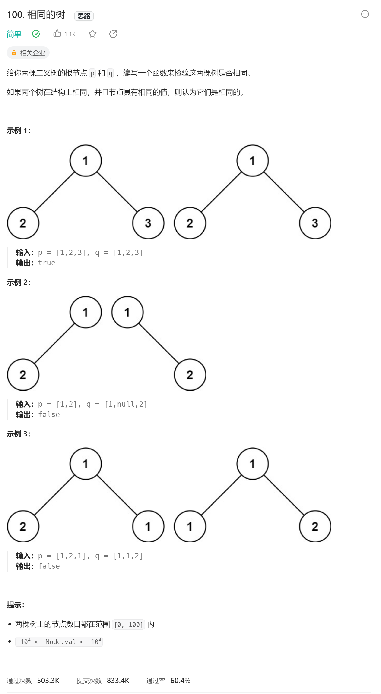

# 二叉树

## 1、104二叉树的最大深度


### 思路

- 找出终止条件：当前节点为空
- 找出返回值：节点为空时说明高度为0，所以返回0，节点不为空时分别求左右子树的高度的最大值，同时加1表示当前节点的高度，返回该数值
- 某层的执行过程：在返回值部分基本已经表述清楚
- 时间复杂度：O(n)

### 代码

```js
/**
 * Definition for a binary tree node.
 * function TreeNode(val, left, right) {
 *     this.val = (val===undefined ? 0 : val)
 *     this.left = (left===undefined ? null : left)
 *     this.right = (right===undefined ? null : right)
 * }
 */
/**
 * @param {TreeNode} root
 * @return {number}
 */
var maxDepth = function(root) {
        if(root === null) return 0;
         // 寻找左子树的最大深度
        const leftMax = maxDepth(root.left);
    	 // 寻找右子树的最大深度
        const rightMax = maxDepth(root.right);
         // 求左子树和右子树的最大深度 + 1  表示当前节点的高度
        return 1 + Math.max(leftMax,rightMax);
};
```

## 2、100相同的树



### 思路

- 终止条件与返回值：当两棵树的当前节点都为null时返回true当其中一个为null另一个不为null时返回false当两个都不为空但是值不相等时，返回false
- 执行过程：当满足终止条件时进行返回，不满住时分别判断左子树和右子树是否相同，其中要注意代码中的短路效应
- 时间复杂度：O(n)，n为树的节点个数

### 代码

```js
/**
 * Definition for a binary tree node.
 * function TreeNode(val, left, right) {
 *     this.val = (val===undefined ? 0 : val)
 *     this.left = (left===undefined ? null : left)
 *     this.right = (right===undefined ? null : right)
 * }
 */
/**
 * @param {TreeNode} p
 * @param {TreeNode} q
 * @return {boolean}
 */
var isSameTree = function(p, q) {
    // 判断一对节点是否相同
    if (p == null && q == null) {
        return true;
    }
    if (p == null || q == null) {
        return false;
    }
    if (p.val != q.val) {
        return false;
    }
    // 判断其他节点是否相同
    return isSameTree(p.left, q.left) && isSameTree(p.right, q.right);
};
```

