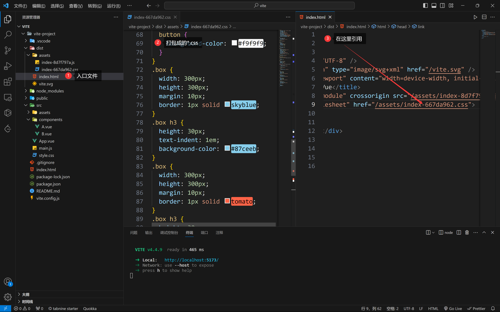
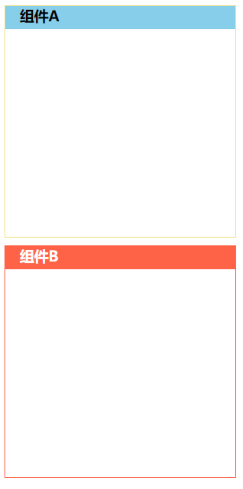

# Vue 单文件组件，父子组件间传值、通信，透传属性

在刚开始学习 Vue 时，我们就对 Vue 中的组件做了以下相关的了解

- 什么是组件，组件有什么用
- 什么是根组件，什么是子组件
- 如何注册全局组件与局部组件，以及组件的使用
- 什么是单文件组件及定义与使用
- 什么是单根组件，什么是多根组件

> 以上内容详细查阅博客图文教程：[Vue 组件基础 (opens new window)](https://www.arryblog.com/vip/vue/#五、vue-组件基础)部分

本章节开始我们会深入来学习 Vue 组件，本章节主要内容如下：

- 单文件组件 CSS 功能
- 组件间通信
- 父组件向子组件传值 - props
- 子组件向父组件传值 - emits
- 组件 v-model
- 透传属性（Atrributes）

## 一、单文件组件 CSS 功能

本小节我们来学习单文件组件 CSS 功能，内容涉及：

- CSS 的默认处理行为
- `scoped`属性
- `:deep()`伪类
- `:global()`伪类
- `CSS Modules`
- CSS 中的`v-bind()`函数
- CSS 预处理器

### 1、CSS 的默认处理行为

默认情况下`<style>`标签中的样式会作用于所有组件的元素。因为`vite`

- 在启动开发服务时，会所有的单文件组件中`<style>`标签中的样式添加到`index.html`入口文件的`<style>`标签中，所以相同的类名，写在后面的会覆盖前面的。
- 在生产环境下打包时，所有单文件组件`<style>`标签中的样式会被打包到一个`*.css`的文件中，所以相同的类名，写在后面的会覆盖前面的。

**代码示例**

`App.vue`根组件内容

```html
<script>
  import A from "./components/A.vue";
  import B from "./components/B.vue";
  export default {
    components: {
      A,
      B,
    },
  };
</script>
<template>
  <div class="main">
    <a></a>
    <b></b>
  </div>
</template>

<style>
  * {
    margin: 0px;
    padding: 0px;
  }
</style>
```

`/src/components/A.vue`组件内容

```html
<template>
  <div class="box">
    <h3>组件A</h3>
  </div>
</template>

<style>
  .box {
    width: 300px;
    height: 300px;
    margin: 10px;
    border: 1px solid skyblue;
  }

  .box h3 {
    height: 30px;
    text-indent: 1em;
    background-color: skyblue;
  }
</style>
```

`/src/components/B.vue`组件内容

```html
<template>
  <div class="box">
    <h3>组件B</h3>
  </div>
</template>

<style>
  .box {
    width: 300px;
    height: 300px;
    margin: 10px;
    border: 1px solid tomato;
  }

  .box h3 {
    height: 30px;
    text-indent: 1em;
    background-color: tomato;
    color: #fff;
  }
</style>
```

> 以上代码在开发环境下，最终渲染效果如下：


> 在生产环境下，最终所有样式打包到`*.css`文件中，然后在`index.html`文件中引用，如下图：



> 相同的样式名 ，后面的会覆盖前面，所以同样以后面的为主。

### 2、scoped 属性

当 `<style>` 标签带有 `scoped` attribute 的时候，它的 CSS 只会影响当前组件的元素。因为`vite`：

- 在构建项目时，不管生产还是开发环境，都会给当前组件的 html 元素添加`data-v-xxx`的自定义属性
- 同时组件中`<style>`标签中的选择器后会加上对应的`data-v-xxx`的属性选择。

> 以上处理后，就达到了两个组件中的 CSS 样式只能应用于当前组件中的元素，从实现了样式的隔离.

**代码示例**

> 在上面的案例的基础上，给 A 和 B 组件中的`<style>`标签添加`scoped`属性

`/src/components/A.vue`组件

```html
<template>
  <div class="box">
    <h3>组件A</h3>
  </div>
</template>

<!-- style标签上添加了 scoped属性 -->
<style scoped>
  .box {
    width: 300px;
    height: 300px;
    margin: 10px;
    border: 1px solid skyblue;
  }

  .box h3 {
    height: 30px;
    text-indent: 1em;
    background-color: skyblue;
  }
</style>
```

`/src/components/B.vue`组件

```html
<template>
  <div class="box">
    <h3>组件B</h3>
  </div>
</template>
<!-- style标签上添加了 scoped属性 -->
<style scoped>
  .box {
    width: 300px;
    height: 300px;
    margin: 10px;
    border: 1px solid tomato;
  }

  .box h3 {
    height: 30px;
    text-indent: 1em;
    background-color: tomato;
    color: #fff;
  }
</style>
```

> 最终开发环境下渲染后效果如下：


> 在生产环境下，最终所有样式打包到`*.css`文件中，然后在`index.html`文件中引用，如下图：


### 2.1、注意事项

使用 `scoped` 后，父组件的样式将不会渗透到子组件中。不过，**单根子组件的根节点**会同时被父组件的作用域样式和子组件的作用域样式影响。因为`vite`在构建时，会给**单根子组件的根节点元素**上加上父组件对应的`data-v-xxx`的属性。

> **注意**：只有当子组件是单根组件时，才会在根节点元素上添加父组件的`data-v-xx`属性。

**设计初衷**

这样设计是为了让父组件可以从布局的角度出发，调整其子组件根元素的样式。常用于调整应用的第三方子组件的样式。

**代码示例**

> 在上面案例的基础上

- 在`App.vue`文件中添加如下 CSS 样式

```html
<!--style标签上添加了 scoped -->
<style scoped>
  .box {
    border: 1px solid khaki;
  }

  .box h3 {
    background-color: khaki;
  }
</style>
```

- A 组件不做任何修改，在 B 组件中再添加 p 标签，将 B 组件变成多根组件，如下：

```html
<template>
  <div class="box">
    <h3>组件B</h3>
  </div>
  <p></p>
</template>
```

> 最终在生产环境下打包后效果如下：



注：

- B 组件的样式并没有发生任何的改变，因为 B 组件是多根组件，所以并不会受到父组件样式的影响。
- A 组件的`.box`元素的边框确实被修改成`App`组件中设置的样式，但 h3 标签的样式确没有生效。这是为什么呢？我们来看下打包后生成的`html`结构和`*.css`文件。

- 打包后生成的`html`结构如下：

```html
<div data-v-7a7a37b1="" class="main">
  <!--A start-->
  <div data-v-65097ce7 data-v-7a7a37b1 class="box">
    <h3 data-v-65097ce7="">组件A</h3>
  </div>
  <!--A end-->
  <!--B start -->
  <div data-v-f6858c4e class="box">
    <h3 data-v-f6858c4e>组件B</h3>
  </div>
  <p data-v-f6858c4e=""></p>
  <!--B end -->
</div>
```

- 打包后生产的`*.css`文件内容如下：

```css
/* A组件样式 */
.box[data-v-5c2cdbff] {
  width: 300px;
  height: 300px;
  margin: 10px;
  border: 1px solid skyblue;
}
.box h3[data-v-5c2cdbff] {
  height: 30px;
  text-indent: 1em;
  background-color: #87ceeb;
}
/* B组件样式 */
.box[data-v-deef0120] {
  width: 300px;
  height: 300px;
  margin: 10px;
  border: 1px solid tomato;
}
.box h3[data-v-deef0120] {
  height: 30px;
  text-indent: 1em;
  background-color: tomato;
  color: #fff;
}
/* App 组件样式 */
* {
  margin: 0;
  padding: 0;
}
.box[data-v-a805ad3c] {
  border: 1px solid khaki;
}
.box h3[data-v-a805ad3c] {
  background-color: khaki;
}
```

注：

通过观察`html`结构与`css`，我们发现`.box h3[data-v-a805ad3c]`选择器并没有生效，因为页面中 h3 标签并没有`data-v-a805ad3c`属性。

> 如果我们就是想在根组件`App`中调整 A 子组件中`h3`标签的样式，`App`根组件中控制 h3 标签的 CSS 样式应该是如下写法

```css
.box[data-v-a805ad3c] h3 {
  background-color: khaki;
}
```

> 如果想使 App 中的 CSS 样式编译成如下效果，就需要借助`:deep()`伪类

### 3、:deep() 伪类

处于`scoped`样式中的选择器，如果想做更“深度”的。比如：在父组件中调整子组件中根元素之外的其它元素的样式，可以借助`:deep()`这个伪类。

> 在上面案例的基础上，修改`APP.vue`文件中的 CSS 样式

- 修改前 CSS 样式

```css
.box h3 {
  background-color: khaki;
}
```

- 修改后 CSS 样式

```css
.box :deep(h3) {
  background-color: khaki;
}
```

- 上面修改后的 CSS 代码最终会被编译成

```css
.box[data-v-7a7a37b1] h3 {
  background-color: khaki;
}
```

> 这样就可以在`App`组件中调整`A`组件中`h3`标签的样式。最终渲染后效果如下：


### 4、:global() 伪类

如果想让某个样式规则应用于全局

> 有以下两种方式：

- 写在不带`scoped`属性的`<style>`标签中的样式全局可用。注意：`<style>`标签与`<style scoped>`标签可以在一个组件中共存

```html
<style>
  /* 写在这里的样式，全局可用 */
</style>
<style scoped>
  /* 写在这里的样式，如果没有使用:global()，只能当前组件内可用 */
</style>
```

- 使用`:global`伪类，在`scoped`中被`:global()`选中的选择器，最终编译后原样输出，不会加上`data-v-xx`属性选择

```html
<style scoped>
  /* scoped 中写在 :global()中的 css 选择器全局可用*/
  :global(.box) {
    width: 200px;
    height: 200px;
    border: 1px solid khaki;
    margin: 10px;
  }

  :global(.box h3) {
    height: 30px;
    background-color: khaki;
  }
</style>
```

> 以上代码最终编译后代码如下：

```html
<style>
  .box {
    width: 200px;
    height: 200px;
    border: 1px solid khaki;
    margin: 10px;
  }

  .box h3 {
    height: 30px;
    background-color: khaki;
  }
</style>
```

**代码示例**

`APP.vue`文件内容如下

```html
<script>
  import A from "./components/A.vue";
  import B from "./components/B.vue";
  export default {
    components: {
      A,
      B,
    },
  };
</script>
<template>
  <div class="main">
    <a></a>
    <b></b>
  </div>
</template>

<!--写在 style标签中的样式，全局可用-->
<style>
  * {
    margin: 0px;
    padding: 0px;
  }

  p {
    height: 30px;
    background-color: skyblue;
    margin: 10px;
  }
</style>

<style scoped>
  /* scoped 中写在 :global()中的 css 选择器全局可用*/
  :global(.box) {
    width: 200px;
    height: 200px;
    border: 1px solid khaki;
    margin: 10px;
  }

  :global(.box h3) {
    height: 30px;
    background-color: khaki;
  }
</style>
```

`A.vue`和`B.vue`中内容如下

```html
<!-- A.vue 文件中内容-->
<template>
  <div class="box">
    <h3>组件A</h3>
  </div>
</template>

<!-- B.vue 文件中内容-->
<template>
  <div class="box">
    <h3>组件B</h3>
  </div>
  <p></p>
</template>
```

> 最终渲染后效果如下：


### 5、CSS Modules

一个 `<style module>` 标签会被编译为 `CSS Modules` 并且将生成的 CSS class 作为 `$style` 对象暴露给组件。

**代码示例**

```html
<template>
  <div :class="$style.main">
    <div>$style对象值</div>
    div
    <div :class="$style.box">
      <h3>App组件</h3>
    </div>
  </div>
</template>
<style module>
  * {
    margin: 0px;
    padding: 0px;
  }

  .main {
    margin: 20px;
  }

  .box {
    width: 200px;
    height: 200px;
    border: 1px solid skyblue;
    margin: 20px;
  }

  .box h3 {
    height: 30px;
    background-color: skyblue;
    color: #fff;
  }
</style>
```

> 以上代码，最终渲染后效果如下：


### 5.1、自定义注入名称

你可以通过给 `module` attribute 一个值来自定义注入 class 对象的属性名：

```html
<template>
  <!--注意使用时，不要加$符-->
  <div :class="root.main">
    <h3>$style对象值:{{ root }}</h3>
    <div :class="root.box"></div>
  </div>
</template>
<!--root为注入名-->
<style module="root">
  * {
    margin: 0px;
    padding: 0px;
  }

  .main {
    margin: 20px;
  }

  .main h3 {
    font-weight: 400;
    line-height: 40px;
    border-bottom: 1px solid skyblue;
  }

  .box {
    width: 100px;
    height: 100px;
    background-color: skyblue;
    margin: 20px;
  }
</style>
```

> 最终渲染后效果与前面的`$style`效果一模一样。

### 6、CSS 中的 v-bind()

单文件组件的 `<style>` 标签中支持使用 `v-bind` CSS 函数将 CSS 的值链接到动态的组件状态。

> `v-bind()`常用于接受父组件传递给子组件的 CSS 属性的值

**代码示例**

```html
<script>
  export default {
    data() {
      return {
        color: "red",
      };
    },
  };
</script>

<template>
  <div class="box">Hello Vue!!</div>
</template>
<style scoped>
  .box {
    color: v-bind(color);
  }
</style>
```

> 以上代码最终渲染后效果如下：


注：

`v-bind()`函数中的变量最终被转换成哈希化的 CSS 自定义属性，然后在内联样式中通过 CSS`var()`函数使用自定义属性的值

当前组件中通过`v-bind()`形式绑定的 CSS，最终最会转换成哈希化的 CSS 自定义属性添加到当前组件的**根元素上**，同时会在在源值变更的时候响应式地更新

```html
<script>
  export default {
    data() {
      return {
        color: "red",
      };
    },
  };
</script>

<template>
  <div class="box">
    <p>Hello Vue!!</p>
    <h3>h3</h3>
  </div>
</template>
<style scoped>
  .box {
    color: green;
  }

  h3 {
    color: v-bind(color);
  }
</style>
```

> 以上代码最终渲染后效果如下：


### 7、CSS 预处理器

在`<style>`标签上可以使用`lang`这个属性来声明 CSS 的预处理器语言。

> 比如：`<style lange='scss'>` ，表示可以使用 sass 来编写 CSS。

```html
<template>
  <div class="box">
    <p>Hello Vue!!</p>
  </div>
</template>
<style scoped lang="scss">
  .box {
    width: 100px;
    height: 100px;
    border: 1px solid skyblue;

    p {
      color: red;
    }
  }
</style>
```

要使`sass`最终能被成功编译成 CSS，还需要执行以下命令安装`Sass`的预处理器依赖

```shell
npm i sass -D # 安装sass 依赖包
```

最终上面`<style>`标签中的 Sass 编译成如下 CSS 样式

```css
.box[data-v-7a7a37b1] {
  width: 100px;
  height: 100px;
  border: 1px solid skyblue;
}

.box p[data-v-7a7a37b1] {
  color: red;
}
```

### 8、总结

本小节重点掌握如下单文件组 CSS 功能

### 8.1、scoped 属性

- 当 `<style>` 标签带有 `scoped` attribute 的时候，它的 CSS 只会影响当前组件的元素。因为 html 标签被编译后会被加上`data-v-xx`属性，对应的 CSS 选择器会加上`[data-v-xx]`属性选择。
- 单根子组件的根元素会被加上父组件的`data-v-xx`属性，这样涉及的目的是为了让父组件可以调整子组件的根元素样式

编译前

```html
<template>
  <div class="box"></div>
</template>
<style scoped>
  .box {
  }
</style>
```

编译后

```html
<div data-v-7a7a37b1="" class="box">scoped</div>

<style>
  .box[data-v-7a7a37b1] {
    color: red;
  }
</style>
```

### 8.2、:deep() 伪类

在`<style scoped>`标签中使用`:deep()`伪类可以帮助我们在父组件中选择子组件中根元素以外的元素，这样我们就可以在父组件中调整子组件的样式

编译前

```html
<style scoped>
  .box :deep(h3) {
    background-color: skyblue;
  }
</style>
```

编译后

```html
<style>
  .box[data-v-7a7a37b1] h3 {
    background-color: skyblue;
  }
</style>
```

### 8.3、:global() 伪类

在`<style scoped>`标签中使用`:global()`伪类可以让某一个样式规则应用于全局。

要让某个样式规则应用于全局还可以直接把该样式规则写在`<style>`标签中。

编译前

```html
<style scoped>
  :global(.box h3) {
    background-color: skyblue;
  }
  /* 注意，不要这样写*/
  .box :global(p) {
    color: red;
  }
</style>
```

编译后

```html
<style>
  .box h3 {
    background-color: skyblue;
  }
  p {
    color: red;
  }
</style>
```

### 8.4、v-bind() 函数

`v-bind()`函数可以将 CSS 的值链接到动态的组件状态。

编译前

```html
<script>
  export default {
    data() {
      return {
        color: "red",
      };
    },
  };
</script>

<template>
  <div class="box">Hello Vue3</div>
</template>

<style scoped>
  .box {
    color: v-bind(color);
  }
</style>
```

编译后

```html
<style>
  .box[data-v-7a7a37b1] {
    color: var(--7a7a37b1-color);
  }
</style>
<body>
  <div data-v-7a7a37b1 class="box" style="--7a7a37b1-color: red;">
    Hello Vue3
  </div>
</body>
```

### 8.5、CSS Modules

一个 `<style module>` 标签会被编译为 `CSS Modules` 并且将生成的 CSS class 作为 `$style` 对象暴露给组件。

编译前

```html
<template>
  <div :class="$style.box">Hello Vue3</div>
</template>

<style module>
  .box {
    color: red;
  }
</style>
```

编译后

```html
<style>
  ._box_1tlvs_2 {
    color: red;
  }
</style>
<body>
  <div class="_box_1tlvs_2">Hello Vue3</div>
</body>
```

### 8.6、CSS 预处理器

- 在`<style>`标签上可以使用`lang`这个属性来声明 CSS 的预处理器语言，如：`<style lang="scss">` ，表示可以采用 Sass 语法编写 CSS。
- 要使代码最终编译成`CSS`，需要安装对应的预处理器依赖。执行`npm i sass -D`安装 sass 依赖

编译前

```html
<style lang="scss">
  .box {
    width: 100px;
    height: 100px;
    border: 1px solid skyblue;

    p {
      color: red;
    }
  }
</style>
```

编译后

```html
<style>
  .box {
    width: 100px;
    height: 100px;
    border: 1px solid skyblue;
  }
  .box p {
    color: red;
  }
</style>
```

## 二、组件间通信

**组件间通信**是指各个组件间之间可以相互传递数据，实现数据的共享。

> 比如：

父组件可以给子组件传数据，子组件也可以给父组件传数据，各个兄弟组件之间也可以互相传递数据。

**组件间为什么需要相互通信 ？**

> 我们来看下面这副图


注：

上图展示了在父组件`App`中调用同一个子组件`List`两次，但是要求这两个子组件最终展示数据都不一样。这时候，子组件 List 要展现的数据就不能写死，需要父组件传递过来，父组件传递的数据决定了子组件最终显示的数据。

> 在往后的课程中，我们将会学习以下几种组件间通信的方式：

- 父子组件之间的通信
- 兄弟组件之间的通信
- 祖孙与后代组件之间的通信
- 非关系组件之间的通信

## 三、父组件向子组件传值 - props

本小节重点学习父组件如何通过`props`向子组件传递数据，内容主要有：

- props 选项
- Prop 名字格式
- 静态 VS 动态 Prop
- props 对象写法
- Prop 校验
- Boolean 类型 Prop 简写形式
- 使用一个对象绑定多个 Prop
- props 选项被处理的时机
- 单向数据流
- 总结

### 1、props 选项

父组件向子组件传递数据，可以通过自定义 Prop（属性）来传递。

- 在使用子组件的时候，在子组件标签上添加自定义属性（Prop），把需要传递的数据做为属性的值就可以，如下：

```html
<!--List子组件  title与 info 属性用来实现在父组件中传递数据给到子组件-->
<List title="新闻标题" info="新闻内容" />
```

- 子组件需要通过`prpos`选项来接受父组件传递过来的 Prop（属性）。然后就可以在模板标签中通过插值语法使用接受的属性，也可以通过组件实例直接访问。

```html
<!--List组件-->
<script>
  export default {
    // 通过props选项接受父组件通过Prop传递的数据
    props: ["title", "info"],
    created() {
      console.log(this.title); // 新闻标题
      console.log(this.info); // 新闻内容
    },
  };
</script>
<template>
  <!--对于接受过来的数据，可以直接在模板中使用-->
  <h3>{{ title }}</h3>
  <div>{{ info }}</div>
</template>
```

**代码演示**

`App.vue` 根组件

```html
<script>
  // 导入组件
  import List from "./components/List.vue";
  export default {
    // 注册组件
    components: {
      List,
    },
  };
</script>

<template>
  <!-- 使用组件，title与info属性值为父组件向子组件传入的数据-->
  <List title="新闻标题" info="新闻内容" />
  <List title="最新动态" info="动态内容"></List>
</template>
```

`List.vue` 子组件

```html
<script>
  export default {
    // 通过props选项接受父组件通过Prop传递的数据
    props: ["title", "info"],
    beforeCreate() {
      console.log("title", this.title);
      console.log("info", this.info);
    },
  };
</script>
<template>
  <!--对于接受过来的数据，可以直接在模板中使用-->
  <h3>{{ title }}</h3>
  <div>{{ info }}</div>
</template>
```

> 代码最终渲染后结果


### 2、Prop 名字格式

**定义属性：** 如果在传递数据时，属性的名字很长，由两个以上单词组成，建议在`HTML`标签上使用`kebab-case`形式来定义属性名。

> 主要目标是为了与 HTML 原生的属性对齐。如下：

```html
<List data-title="新闻标题" data-info="新闻内容" />
```

接受属性：

在子组件的`props`选项来接受属性时，推荐使用`camelCase`形式，因为他是一个合法的 JS 标识符，而`kebab-case`形式并不是合法的 JS 标识符，在插值语法中没有办法使用。

```html
<!--data-title为不合法标识符，Vue没办法解析-->
<div>{{ data-title }}</div>
<!--正确写法-->
<div>{{ dataTitle }}</div>
```

**代码演示**

`App.vue`根组件

```html
<script>
  // 导入组件
  import List from "./components/List.vue";
  export default {
    // 注册组件
    components: {
      List,
    },
  };
</script>

<template>
  <!-- 使用组件，title与info属性值为父组件向子组件传入的数据-->
  <List data-title="新闻标题" data-info="新闻内容" />
  <List data-title="最新动态" data-info="动态内容"></List>
</template>
```

`List.vue` 根组件

```html
<script>
  export default {
    data() {
      return {};
    },
    // 以下两种props写法都可以，但在模板中使用时需要采用 dataTitle与dataInfo写法
    // props: ["data-title", "data-info"],
    props: ["dataTitle", "dataInfo"],
  };
</script>
<template>
  <h3>{{ dataTitle }}</h3>
  <div>{{ dataInfo }}</div>

  <!--以下为错误写法-->
  <!--
    <h3>{{ data-title }}</h3>
    <div>{{ data-info }}</div>
	-->
</template>
```

### 3、静态 VS 动态 Prop

组件在进行 prop 传值时，属性的值可以是一个静态值，也可以是一个动态值。

- 以下写法的属性为静态属性，**其属性值在被接受时，类型永远是字符串**

```html
<List title="新闻标题" info="{a:1,b:2}" num="10" />
```

- 使用`v-bind`或缩写`:`绑定的属性为动态属性，**他可以传递任意类型的值**，值在被接受时，可以区分不同类型。

```html
<List :title="news.title" :info="{a:1,b:2}" :num="10" />
```

**代码演示**

`App.vue`根组件

```html
<script>
  import List from "./components/List.vue";
  export default {
    data() {
      return {
        news: {
          title: "动态值",
        },
        bool: true,
      };
    },
    components: {
      List,
    },
  };
</script>

<template>
  <List title="静态值" info="{a:1,b:2}" num="10" bool="bool" />
  <List :title="news.title" :info="{ a: 1, b: 2 }" :num="10" :bool="bool" />
</template>
```

`List.vue`子组件

```html
<script>
  export default {
    data() {
      return {};
    },
    props: ["title", "info", "num", "bool"],
  };
</script>

<template>
  <h3>{{ title }}</h3>
  <div>{{ info }}----{{ info.a }} -- {{ info.b }}--{{ typeof info }}</div>
  <div>num传递过来的值是{{ num }} 类型为 {{ typeof num }}</div>
  <div>bool传过来的值 {{ bool }} 类型为{{ typeof bool }}</div>
</template>
```


### 4、props 对象写法

props 选项的值可以是一个字符串类型的数组，也可以是一个对象。

- 如果 props 接受的属性值不需要做类型的校验，可以采用前面讲到的数组写法
- 如果 props 对于传过来的属性值有严格的类型要求，我们可以采用对象的形式来声明 props

> 如：

```js
export default {
  props: {
    title: String, // title值必需为子符串类型
    age: Number, // num值必需为数字类型
    bool: Boolean, // bool 值必需为数字类型
    address: [Object, String], // info值可以是字符串类型，也可以是对象类型
  },
};
```

> 如果传递的值类型不符合要求，控制台会抛出警告

**代码演示**

`App.vue`根组件

```html
<script>
  import Person from "./components/Person.vue";
  export default {
    data() {
      return {
        userName: "清心",
        age: 12,
        address: {
          province: "湖南",
          city: "长沙",
        },
      };
    },
    components: {
      Person,
    },
  };
</script>

<template>
  <!-- user-name的值是字符，age的值是number，address的值是一个对象-->
  <Person :user-name="userName" :age="age" :address="address" />
  <!-- 以下age传的是字符串，不符合要求-->
  <Person :user-name="userName" age="30" address="陕西西安" />
</template>
```

`Person.vue`子组件

```html
<script>
  export default {
    props: {
      userName: String,
      age: Number,
      bool: Boolean,
      address: [Object, String],
    },
  };
</script>

<template>
  <div>用户姓名：{{ userName }}</div>
  <div>用户年龄：{{ age }} 岁</div>
  <div>
    用户地址： {{ typeof address === "string" ? address : address.province +
    address.city }}
  </div>
  <div>---------------------------------</div>
</template>
```

> 以上代码，最终渲染效果如下：


### 4.1、属性支持的检测类型

属性支持的检测类型可以是以下这些原生的构造函数：

- String
- Number
- Boolean
- Array
- Object
- Date
- Function
- Symbol

也可以是自定义的类或构造函数，Vue 将会通过 `instanceof` 来检查类型是否匹配。

> 例如下面这个类：

```js
class Person {
  constructor(name, age) {
    this.name = name;
    this.age = age;
  }
}
```

你可以将其作为一个 Prop 的类型

```html
<script>
  export default {
    props: {
      userInfo: Person,
    },
  };
</script>
```

**代码演示**

`Person.js` 中定义 Person 类

```js
export class Person {
  constructor(name, age) {
    this.name = name;
    this.age = age;
  }
}
```

`App.vue` 根组件

```html
<script>
  // 导入People组件
  import People from "./components/People.vue";
  // 导入 Person类
  import { Person } from "./common/Person.js";
  export default {
    data() {
      return {
        // userInfo 数据类型为 Person类的实例
        userInfo: new Person("艾编程", 33),
      };
    },
    components: {
      People,
    },
  };
</script>

<template>
  <People :user-info="userInfo" />
</template>
```

`People.vue` 子组件

```html
<script>
  import { Person } from "../common/Person.js";
  export default {
    props: {
      userInfo: Person,
    },
  };
</script>

<template>
  <div>{{ userInfo.name }} -- {{ userInfo.age }}</div>
</template>
```

> 最终渲染后，结果如下：

![image-20230511150543923](data:image/png;base64,iVBORw0KGgoAAAANSUhEUgAAAJwAAAAmCAIAAAC+i2UJAAAI40lEQVR4nO2bb2jb+BnHvx154UJeKNCBAi2cwIM65CAOG8Rh9yIKKURlL6LgQR066NQ7yDk7uDjpizrLi0zpgSt3sMV3kNkddDiFBruwYgUarLwoSIUOu9DDCuSICwnY0IEFV7CgB9oLO06sKLGcNu3V8+dV8vwe6feTn9/zR8/PPmMYBtq0Fr/40Ato8+5pG7UFaRu1BWkbtQVpG7UFaRu1BWkbtQWxb9SiOD08fCmSNcuzkUvDw9NiscHl+ZUvpyJred1ycFcK+3oG5xXr0TZN0mFfVduVpHX60Oeua+uSRHANLn6eFL6LFDpZbpSyGD3XpedV5X4gwsqBvuNuo2uaVlRzai6rKOITSbrAFx74Cn8fnnl0/PSs8NjvbrDE00Ivqlm1UAaAs92ful3nHG+veTxNGPUt0KUHQhYewUc7ACAv3k6q9RqlCy48VWZuTmGozuqusQDjBDZjl4eu10cD0jXUw33iKOnQNUlaJ11DPd1WT1N4IanFw3vxfVBcm+G+Cos/1Akp71Ji2e8mTqhpB2uj6rtZeatUL9NyGoB8ZkMq18nVPAAtJ29Iptm7fjXoPu8AgN1k5JsiORnjql5YzN6YmbOceC0ys1Yn4D8LME7gYj89GqBdVHdvd+6v44ud8e2kr2Z8BQAG5+4lfOcP37G48vvuiVXLyU6d/H/C4muXb9Z/echFoqhuJMK3k/nVqf4dPaME3CfStIVhRWGFfftHYlcKlbtlQm7AI2Rrt5f5A6NHovAAeMW8tLgX8MYPXiwvAGDjO9aPEvcC4OUGk50K20q68KZepC4xAAD/v0sn07SDdaFEjsVKZnLRMQDBlFmeCgIYi+YOXRAbIwFgd4W/kSVneX8fsKsknxb/f6ohaoAmTaHw4oR/EgAiz9WTadrhiJzqIAhzktbPdgA420UQ9WG26yyAjsPy6lXKspAEG/+KdkBX/ukfnwevCAA0VZY2jk0Xm3m7DwEAWk6RpHNWcq2Z25w6RFf3O9c8hG2fLsl3BSGU2jbLt1MhQbgrW8eIrOABPHcyhmEYO3EWICdTJUPmbS+vEn6PTge8XA2/DW7zQcKvFZV0YCeo2tc0Y6v61Xel2HoXdy3gsRikmNkAo0uLvkXXTT/bW+d82Y24AmC6/8x0RcBEpxkCCgB2ORfzHrsVs7Hxb0SiAwAcFCOEBgEgL818J6LPF/T1dwGAiwSKAMBGX8TGLQqlQuKPPdcf2nnK94G2sSSsAgM8N9KgqLWvaUFju5fTQRIAE906elNVPKm+fjEMw9hKCSEhmkyn7wZcgHtBLhuG3ULJiu27jMVEP5ZKpVL5qOUfN3jqlHcyaSmdltLpZDRwxUUC5FAglX8rzYbY8FQHzS0wi1+Ic3fE8W8Zi22jK7FQEnDz0yxpGnIygVkG0KUbEyrpT016Dmbq/KNwcrPR7BfZwO9qLy9FZU00jWubUqbQ+CGA7v4hV/N7/m3RnvDDvuTef7QvxM99zlquw75mY+zZPiMMACADjy22fOaOB9VkaU35Ge+pc82qp9rIhcDCgWy4Fa1U+RjxcaMMr5QNWwm1wodJqyUlKoQEISQIsxw9UNmdFBuyKEHsazbEbqFUfhJ0AyD9qVf1A1nBA4D0JaxfE43qhhiN7ldYO3G2ZtRqIJX5upqoYoBC3Ftn1EzIjT6/3wuM+HwDAOmLW0SnE72Y7sQtKrEDU1ttnaPejI+j9CLqIwHAcytzfEqwr3kYu21Cx2/nIgvS4HyEmx6U7+11c14ri5MzCkjfHZ61KFIA6Mpf/DNPXcHH412aViyquYKj5wIAdHc22djUpcSdLL0gDK5HIsRlfvkyPBMTV3qo9aCns7k7WdBJMSFh0CS8uJ9MyD5BCJmGCar5eYleLnZPlS6FlZsxaXLJKpk1rWlBExvgR5kfAABPtd7Zjl8lAZBXE0fWPBYewMt7raKmPHV7mQGY6NZ+R6nwwEf/KbFtasR80BaSLcrpAACQ/LN3p1lPMw39Tk/wfjznmViZH6QR5/Jz1/9VxACf/PZQfVTjvIcLCYzTTRHoovopAnAQ+qMJgKUqnl1tGqt5AFlJKkNTtb0O84G+wX/F8LxITqbGnahVSqQ3nvYCRXHmD+GDB4KFFwBigUvS2QNC9lba/+smnvX06XbY/ezta1ZpUv0TX+xhvjg2J81PKAAGgulHx0c/ipkNmETKpgRwVaOuL46vL1YHvhyO7elM0Xt/fgZAF29xkaJH+IIh0Ojc9meP/kSMAwDtvvjONM00GzwKEs/UHNPJRV80U529KZdKmaURYDJVMpoIv6UkR86myzXh4RfiAwv8uYTfZ0uBlUypPjvslz+VLluzmvZowlP1XSkyfX1mNQ+Q9NdT7udL4Y3Y9U9TK5/PBec5+rxF4aNtSnJWVXfz6no2l5eUvfNC9lp/U4mfGArKI9QJj4w/FD9pYV9/eNpFjzKMqxsoqGtiakMtAtS1RPxr90k0bWLH8iU1JVxxVf3TyQpSwTAM400hHWL3+gKk6wofl3Km7bZ9r1onUQM0NytEk+nopKvWnGr2lcaoCT8KT30l739oe5C9TGAlZw5u9jXtcZyn6i+z4qNYbDkhfl8EAJLmbgb5yb1Dog6Snk1sX5Ui84v8PyT1/tzE/TmA8ngZepSm3e5+J0WN8pl8zHWeqKb6lyvjrEpOCuNOO/utjJ8aaGhPY7EnplOYUmYLgBy/HZZN2nXNqdPnnCewkgvc07XXeullRiP6KcLi8Ks5TXscYdTvI5dHpmpfHyF7fVM3pzivx3zmB4Ck/cu0/5Yq3o9E/hYRf8grqxFlNbIIJrqV4pwu9/5xWDG5EEiiUu+YcBAjdHUtnRQ9kInfDsuv5MhDkL857tn0V6q4fuircL+k6RFdXRfN55AO2lyzvQc6HAThIProd6nZkCM8uCz/2U32Mv5QXM430dAo5zOJu0G/10NX32XrRxWePdAfORB+69mK0gCcHtp7uKPdMPy2Mc4YH9tPGXVN060O8dvU+PiM2qYh7W/otyBto7YgbaO2IG2jtiBto7Yg/wPaEBFJ6Xmy0wAAAABJRU5ErkJggg==)

如果`userInfo`的内容如下

```json
userInfo:{
    name:"艾编程",
    age:33
}
```

> 最终渲染后效果如下图，可以正常显示效果，但是控制台会抛出警告


### 5、Prop 校验

如果我们需要对传过来的值做更严格的校验，可以将 props 选项对象的属性值写成一个带有校验选项的对象。

> 如下：

```html
<script>
  export default {
    props: {
      myProps: {
        // 数据类型
        type: Number,

        // 属性是否为必传，true表示必传
        required: true,

        // 表示未传该属性时，属性的默认值，如果没有配置default选项
        // 对于没有传的非bool类型属性，默认值为undefind，bool类型属性为false
        // required与default 不能同时出现，因为必传，就决定了不会启用默认值
        default: 17,
        /* default可以是一个函数，函数返回值属性默认值
                default(rawProps){
                	return 28
            		}
            	*/

        // 数据校验函数，如果返回值为false，表示校验失败，控制台会抛出警告
        validator(value) {
          // ....
          return true;
        },
      },
    },
  };
</script>
```

**代码演示**

`App.vue` 根组件

```html
<script>
  import Person from "./components/Person.vue";
  export default {
    data() {
      return {
        username: "清心",
        age: 12,
        tel: 13687382323,
      };
    },
    components: {
      Person,
    },
  };
</script>

<template>
  <!--
        username用户名没传，启用默认值，
        tel电话号码不符合要求，会抛出警告
        age年龄为必填，没有填，也会抛出警告
	-->
  <Person :tel="12345678912" />
  <Person :age="age" :username="username" :tel="tel" />
</template>
```

`Person.vue` 子组件

```html
<script>
  export default {
    props: {
      username: {
        type: String, // 数据类型
        default: "艾编程粉丝", // 默认值
      },
      age: {
        type: Number, // 数据类型
        required: true, // 属性必传
      },
      tel: {
        type: Number,
        required: true, // 属性必传
        // 数据校验函数，如果不是11位电话数字，则抛出错误
        validator(value) {
          return /^1[3-9]\d{9}$/.test(value);
        },
      },
    },
  };
</script>

<template>
  <div>用户姓名：{{ username }}</div>
  <div>用户年龄：{{ age }} 岁</div>
  <div>电话号码：{{ tel }}</div>
  <div>---------------------------------</div>
</template>
```

> 以上代码，最终渲染效果如下：


### 6、Boolean 类型 Prop 简写形式

当父组件向子组件通过 Prop 传值时，传递的属性值为 Boolean 类型时，可以支持以下简写形式

```html
<!--完整写法-->
<Person :bool="true" />
<Person :bool="false" />

<!--以下为简写形式-->
<Person bool />
<!-- 等同于传入 :bool="true" -->
<Person />
<!-- 等同于传入 :bool="false" -->
```

注意：

在子组件的`props`选项中要指定该属性值的类型为 Boolean 类型。

> 如下：

```js
export default {
  props: {
    bool: Boolean, // 或 [Boolean, String]  Boolean一定要出现在第一位，以下简写形式才支持
  },
};
```

**代码演示**

`App.vue`根组件

```html
<script>
  import Person from "./components/Person.vue";
  export default {
    components: {
      Person,
    },
  };
</script>

<template>
  <Person :bool="true" />
  <Person bool />
  <Person />
</template>
```

`Person.vue` 子组件

```html
<script>
  export default {
    props: {
      bool: Boolean, // 或[Boolean, String]  Boolean一定要出现在第一个
    },
  };
</script>

<template>
  <div>bool的值{{ bool }}</div>
</template>
```

> 以上代码，最终编译结果如下：


### 7、使用一个对象绑定多个 Prop

如果你想要将一个对象的所有属性都当作 props 传入，你可以使用没有参数的 `v-bind`。

> 如下：

```html
<script>
  import Person from "./components/Person.vue";
  export default {
    data() {
      return {
        userInfo: {
          username: "清心",
          age: 33,
          tel: 13523456543,
        },
      };
    },
    components: {
      Person,
    },
  };
</script>

<template>
  <Person v-bind="userInfo" />
  <!--以上方式等价于-->
  <Person
    :username="userInfo.username"
    :age="userInfo.age"
    :tel="userInfo.tel"
  />
</template>
```

### 8、Props 选项被处理的时机

Props 选项是在生命周期函数`beforeCreate`之前被解析，且 prop 的校验是在组件实例被创建**之前**处理的。

- 所以在`data`、`computed`、`method`选项中可以访问到`Props`选项中的属性。
- 但`Props`选项中没有办法访问到``data`、`computed`、`method`等选项中的属性。

**代码演示**：

```
App.vue
<script>
  import Person from "./components/Person.vue";
  export default {
    data() {
      return {
        userInfo: {
          username: "清心",
          age: 35,
          tel: 13678453321,
        },
      };
    },
    components: {
      Person,
    },
  };
</script>

<template>
  <!--一次性绑定多个属性-->
  <Person v-bind="userInfo" />
</template>
```

`Person.vue`根组件

```html
<script>
  export default {
    data() {
      return {
        dataName: "艾编程",
        dataAge: 33,
        _username: this.username, // 可以访问到
        _age: this.age, // 可以访问到
        _tel: this.tel, // 可以访问到
      };
    },
    props: {
      username: {
        type: String,
      },
      age: {
        type: Number,
        default: 16,
      },
      tel: {
        type: Number,
        validator(value) {
          // 这里面访问不到组件实例，因为此时组件实例还没有创建
          console.log("this指向", this); // undefined
          return /^1[3-9]\d{9}$/.test(value);
        },
      },
    },
    beforeCreate() {
      // 无法访问到data中属性
      console.log("无法访问到data中属性", this.dataName, this.dataAge);
      // 可以访问到props中属性
      console.log("可以访问到props属性", this.username, this.age, this.tel);
    },
  };
</script>

<template>
  <div>用户名：{{ _username }}</div>
  <div>年龄：{{ _age }}</div>
  <div>电话：{{ _tel }}</div>
</template>
```


### 9、更新 prop 的值

如果需要更新 prop 的值，推荐在父组件中更新，每次父组件中的数据更新后，所有子组件中对应的 props 都会被更新到最新值。

```html
<script>
  import Count from "./components/Count.vue";
  export default {
    data() {
      return {
        num: 10,
      };
    },
    components: {
      Count,
    },
  };
</script>
<template>
  <!--父组件中更新num，子组件中会同步更新-->
  <button @click="num++">更新num值</button>
  <Count :num="num" />
</template>
<!--Count 子组件-->
<script>
  export default {
    props: ["num"],
  };
</script>
<template>
  <div>Count的值:{{ num }}</div>
</template>
```

> 以上案例最终渲染效果如下：


### 10、单向数据流

所有的 props 都遵循着**单向绑定**原则，子组件中可以使用父组件传过来的数据，但这些数据是**只读**的，在子组件中不能去修改这些数据。这避免了子组件意外修改父组件的状态的情况，不然应用的数据流将很容易变得混乱而难以理解。

如果在子组件中更改了 prop 的值，会在控制台抛出警告，这就意味着我们不应该这样做。

```js
export default {
  props: ["money"],
  created() {
    // ❌ 警告！prop 是只读的！  子组件中不能修改父组件传过来的prop
    this.money = 1000;
  },
};
```

注：

但在某些情况下，我们确实需要在子组件中更改 props 中属性的值，比如以下两个场景：

- **场景一：** prop 用来传入初始值，而子组件想在之后将其作为一个局部数据属性
- **场景二：** 需要对传入的 prop 值做进一步的转换

> 那应该如何操作呢 ？

### 10.1、更改基本数据类型的 prop 值

**针对场景一：** prop 用来传入初始值，而子组件想在之后将其作为一个局部数据属性。

如果属性的值是基本数据类型，在这种情况下，最好是新定义一个局部数据属性，从 props 上获取初始值即可。

**代码演示**

```
App.vue
<script>
  import Person from "./components/Person.vue";
  export default {
    data() {
      return {
        money: 1000,
      };
    },
    components: {
      Person,
    },
  };
</script>

<template>
  <Person :money="money" />
</template>
```

m `Person.vue`

```html
<script>
  export default {
    props: ["money"],
    data() {
      return {
        // 只是将money作为初始值
        // 然后将其赋值给到一个新的属性，这样后期更新就和money无关了
        newMoney: this.money,
      };
    },
  };
</script>

<template>
  <!--子组件中，绑定newMoney属性-->
  <div>当前账户初始金额：{{ newMoney }}</div>
  <button @click="newMoney = newMoney - 200">消费200</button>
</template>
```

> 代码渲染后效果如下：


针对场景二：

需要对传入的 prop 值做进一步的转换

> 如果属性的值是基本数据类型，在这种情况中，最好是基于该 prop 值定义一个计算属性

```html
<script>
  export default {
    props: ["money"],
    data() {
      return {
        // 只是将money作为初始值
        // 然后将其赋值给到一个新的属性，这样后期更新就和money无关了
        newMoney: this.money,
      };
    },
    computed: {
      myMoney() {
        return "￥" + this.newMoney + "元";
      },
    },
  };
</script>

<template>
  <!--子组件中，绑定newMoney属性-->
  <div>当前账户初始金额：{{ myMoney }}</div>
  <button @click="newMoney = newMoney - 200">消费200</button>
</template>
```

> 代码渲染后效果如下：


### 10.2、更改对象 / 数组类型的 prop 值

如果 prop 的值是数组或对象，我们虽然不能直接修改属性的值（重新给属性赋值），但我们依然可以更改数组和对象内部的值。

因为对象和数组是引用数据类型，所以修改对象的值，是可以修改父组件中的的数据。

```
App.vue
<script>
  import Person from "./components/Person.vue";
  export default {
    data() {
      return {
        userInfo: {
          userName: "清心",
          age: 33,
        },
        list: [1, 2, 3],
      };
    },
    components: {
      Person,
    },
  };
</script>

<template>
  <Person :user-info="userInfo" :list="list" />
</template>
Person.vue
<script>
  export default {
    props: ["userInfo", "list"],
    methods: {
      update() {
        this.userInfo.age = 55;
        this.list.push("A");
      },
    },
  };
</script>

<template>
  <div>{{ userInfo.age }} -- {{ list }}</div>
  <button @click="update">更新数据</button>
</template>
```

> 以上代码渲染后效果如下：


注：

但官方非常不推荐我们这样做，因为这种更改的主要缺陷是它允许了子组件以某种不明显的方式影响父组件的状态，可能会使数据流在将来变得更难以理解。

假设父组件中的某个数据传递给了 10 个子组件，然后每个子组件内部都有一套修改该数据的方法，那最后数据的管理将会变得非常的混乱。如何所有修改数据的方法都交组父组件来管理，那对数据的管理将会更清淅。

> 所以，针对 prop 的值是对象或数组，而我们又想在子组件中更改这些数据时，官方给我们提供了一种最佳的实现方式：**子组件抛出一个事件来通知父组件做出改变**。这也是我们下小节需要学习的内容。

### 11、总结

本小节我们主要学习了以下内容：

**props 的两种写法**

- 数组写法：如果 Prop 的值没有严格的类型要求，可以采用数组写法，比较简洁
- 对象写法：
  - 如果 Prop 的值有严格的类型要求，则需要采用对象写法，如果类型不符何要求，会在控制台抛出警告。
  - 属性类型检测，支持`String`、`Number`、`Boolean`、`Array`、`Object`、`Date`、`Function`、`Symbol`原生的 JS 类型，也支持处自定义的类或构造函数。

```js
// 函数写法
props:["title","info"]

// 对象写法
props:{
    title:String,
    info:Array
}
```

**Prop 名字格式**

属性名由多个单词组成，标签中推荐使用`kebab-case`写法，在 props 选项与模板中推荐使用`camelCase`写法，Vue 内部会自动实现转换

```html
<List data-title="新闻" />

<script>
  export default {
    props: ["dataTitle"],
  };
</script>
<template>
  <div>{{dataTitle}}</div>
</template>
```

**静态 Prop 与动态 Prop**

- 静态属性的值，在接受收时永远都是字符串类型。
- 动态属性的值，可以是任意的类型，在接受会也会做类型区分。

```html
<!--静态Prop  num后面的10在被接受后类型为：String-->
<List num="10" />
<!--动态Prop  num后面的10在被接受后类型为：Number-->
<List :num="10" />
```

**Prop 校验**

如果我们需要对接受的 Prop 做更严格的校验时，我们可以将 Prop 的的值配置为一个带有校验选项的对象

```html
<script>
  export default {
    props: {
      myProps: {
        typeof: Number, // 数据类型
        required: true, // 属性是否为必传，true表示必传
        default: 17, // 默认值
        // 数据校验函数，如果返回值为false，表示校验失败，控制台会抛出警告
        validator(value) {
          // ....
          return true;
        },
      },
    },
  };
</script>
```

**Prop 的两种特殊情况**

- Boolean 类型的 Prop 支持以下简写形式

```html
<!--完整写法-->
<Person :bool="true" />
<!--简写形式-->
<!-- 等同于传入 :bool="true" -->
<Person bool />
<!-- 等同于传入 :bool="false" -->
<Person />
```

注意在子组件的 props 选项中声明必属性时，必需要指明类型为 Boolean，否则不支持简写

```js
export default {
  props: {
    bool: Boolean,
  },
};
```

- 可以使用一个对象绑定多个 Prop

```html
<script>
  export default {
    data() {
      return {
        obj: {
          a: 1,
          b: 2,
          c: 3,
        },
      };
    },
  };
</script>
<template>
  <Person v-bind="obj" />
  <!--以上方式等价于-->
  <Person :a="obj.a" :b="obj.b" :c="obj.c" />
</template>
```

props 选项被处理时机

Props 选项是在生命周期函数`beforeCreate`之前被解析，且 prop 的校验是在组件实例被创建**之前**处理的，所以

- 在校验方法`validator`中，没有办法访问到组件实例，`validator`方法中 this 为`undefined`
- 在`data`、`computed`、`method`选项中可以访问到`Props`选项中的属性。
- 但`Props`选项中没有办法访问到``data`、`computed`、`method`等选项中的属性

**单向数据流**

> Prop 数据只能从父组件流向子组件，在子组件中 Prop 是只读的，在子组件中不能更改 Prop 的值。

**修改 prop 的值**

- 如果我们想要修改`prop`的值，推荐在父组件中来修改。
- 不过在有些情况下，我们确实需要在子组件中更改 Prop 的值，比如以下两个场景：

**场景一：** prop 用来传入初始值，而子组件想在之后将其作为一个局部数据属性。

> 如果属性的值是基本数据类型，最好是新定义一个局部数据属性，从 props 上获取初始值即可。

**针对场景二：** 需要对传入的 prop 值做进一步的转换。

> 如果属性的值是基本数据类型，最好是基于该 prop 值定义一个计算属性

- 如果 prop 的值是数组或对象，需要在子组件中更改他们的值，则推荐使用下一小节讲到的:**子组件抛出一个事件来通知父组件做出改变**

## 四、子组件向父组件传值 - emits

在上一小节中我们学习了在父组件中通过`props`向子组件传递数据，但在子组件中不能修改父组件中传过来的数据。但某些情况下我们确实需要通过子组件去操作父组件中的数据，或传一些数据给到父组件。所以本小节要讲到的自定义事件，就可以帮助我们实现这个目标。

本小节，我们会从以下几个方面来展开讲解

- 监听与触发自定义事件
- emits 选项
- 自定义事件名格式
- 自定义事件参数
- 自定义事件校验
- 自定义事件注意事项

### 1、**监听与触发自定义事件**

自定义事件也可以称为组件事件，因为自定义事件主要是绑定在组件身上，用来解决子组件向父组件传递数据或修改父组件中数据。

> 所以这里要与原生 JS 事件做区分，原生 JS 事件主要是绑定在原生的 HTML 元素身上。

**监听事件**

在父组件中可以通过`v-on`（缩写为@)来监听事件：

```html
<script>
  methods: {
      // 下面的update-event事件触发后，就会调用update更新数据
      update() { /* ... */}
  }
</script>
<!-- 
    update-event为事件名,类似于原生JS中click，mouseover等事件名
    update为事件处理函数，即事件触发后调用的函数
-->
<MyComponent @update-event="update" />
```

**触发事件**

在子组件的模板表达式中，可以直接使用`$emit()`方法触发自定义事件

```html
<!--MyComponent 子组件-->
<!--updateEvent是触发的事件名，事件名在这里要采用驼峰命名-->
<button @click="$emit(updateEvent)">更新数据</button>
```

`$emit()` 方法在组件实例上以 `this.$emit()` 的方式触发自定义事件

```js
// MyComponent 子组件
export default {
    methods: {
        updateData() {
            <!--updateEvent是触发的事件名，事件名在这里要采用驼峰命名-->
            this.$emit('updateEvent')
        }
    }
}
```

**代码演示**

`App.vue` 根组件

```html
<script>
  import List from "./components/List.vue";
  export default {
    data() {
      return {
        num: 1,
        arr: [1, 2, 3],
      };
    },
    components: {
      List,
    },
    methods: {
      // 下面的update-event事件触发后，就会调用update更新数据
      update() {
        this.num++;
        this.arr.push("A");
      },
    },
  };
</script>
<template>
  <!--监听update-event自定义事件，update为事件处理回调函数-->
  <List :num="num" :arr="arr" @update-event="update" />
</template>
```

`List.vue` 子组件

```html
<script>
  export default {
    // 接受传过来的Prop
    props: ["arr", "num"],
    methods: {
      updateDate() {
        this.$emit("updateEvent");
      },
    },
  };
</script>
<template>
  <div>
    <!--button绑定了click事件，点击按扭后，通过$emit方法触发了updateEvent自定义事件，事件触发后，就会调用事件绑定的update方法，更新数据-->
    <button @click="$emit('updateEvent')">更新数据1</button>
    <!--点击按扭，会调用updateDate方法，在此方法中通过this.$emit方法，触发了updateEvent自定义事件，事件触发后，就会调用事件绑定的update方法，更新数据-->
    <button @click="updateDate">更新数据2</button>

    <div>num的值是：{{ num }}</div>
    <ul>
      <li v-for="item in arr">{{ item }}</li>
    </ul>
  </div>
</template>
```

> 以上代码最终渲染效果如下


总结：自定义事件监听与触发

- 在父组件中通过`v-on`（缩写为@）监听自定义事件，同时添加事件处理回调函数
- 在子组件模板中通过`$emit`方法触发自定义事件；
- 在子组件实例上通过`this.$emit()`方式触发自定义事件

### 2、emits 选项

`emits`选项用来显示声明子组件需要触发的事件，**他支持数组与对象两种写法**。

> 以下是数组写法

```js
export default {
  emits: ["updateEvent", "delEvent"],
};
```

在单根组件中，不用`emits`选项来声明子组件要触发的事件，好像对我们执行代码没有什么影响，控制台也不报警告。

```html
<template>
  <!--单个元素为根-->
  <div>
    <button @click="$emit('updateEvent')">更新数据1</button>
    <button @click="updateDate">更新数据2</button>
    <div>num的值是：{{ num }}</div>
    <ul>
      <li v-for="item in arr">{{ item }}</li>
    </ul>
  </div>
</template>
```

在多根组件中不用`emits`选项来声明子组件要触发的事件，控制台就会抛出如下警告

```html
<template>
  <!--多个元素为根 -->
  <button @click="$emit('updateEvent')">更新数据1</button>
  <button @click="updateDate">更新数据2</button>
  <div>num的值是：{{ num }}</div>
  <ul>
    <li v-for="item in arr">{{ item }}</li>
  </ul>
</template>
```


温馨提示：

不管子组件是单根组件还是多根组件，我们都推荐使用`emits`选项来完整声明所有要触发的自定义事件。这样有两个好处：

- 通过`emits`选项，一眼就能知道当前组件中需要触发那些自定义事件
- 可以让 Vue 更好的将**事件**与**透传属性**作出区分

> 关于透传属性，我们在下小节讲会讲到

### 3、自定义事件名格式

与 prop 名一样，事件的名字也提供了自动的格式转换。在父组件中监听自定义事件时，推荐采用`kebab-case`形式为自定义事件命名。

在组子件中触发自定义事件时，推荐采用`camelCase` 形式书写自定义事件名。

```html
<!-- 父组件中监听事件，事件名以kebab-case形式命令 -->
<List @update-event="update" />

<!-- 在子组件中触发事件时，采用camelCase形式书写自定义事件名 -->
<button @click="$emit('updateEvent')">更新数据1</button>
```

### 4、自定义事件参数

有时候我们需要在触发自定义事件时传一些数据给到父组件，则可以将需要传递的数据作为`$emit()`方法的第二个及之后的参数传入。

```html
<!--$emit的第一个参数为自定义事件名，之后的每个参数为需要传放的数据-->
<button @click="$emit('updateEvent',5,6,7)">更新数据1</button>
```

在父组件中监听事件，传递过来的数据可以通过事件处理回调函数的参数接受到。事件处理函数可以采用以下两种写法

- 事件处理回调函数，写成一个箭头函数

```html
<List @update-event="(a,b,c)=>sum=a+b+c" />
```

- 事件处理函数为组件的方法，定义在`methods`选项中

```html
<List @update-event="update" /> methods: { update(a, b, c) { // a b
c对应传过来的数据 5 6 7 console.log(a, b, c); } // 或通过arguments来接收 /*
update() { Array.from(arguments).forEach((item) => { this.arr.push(item) }) } */
}
```

**代码演示**

`App.vue`根组件

```html
<script>
  import List from "./components/List.vue";
  export default {
    data() {
      return {
        list: [1, 2, 3, 4],
      };
    },
    components: {
      List,
    },
    methods: {
      del(index) {
        this.list.splice(index, 1); // 从index下标删除1个元素
      },
    },
  };
</script>
<template>
  <List
    :list="list"
    @add-event="(...arg) => list.push(...arg)"
    @del-event="del"
  />
</template>
```

`List.vue`子组件

```html
<script>
  export default {
    props: ["list"],
    emits: ["addEvent", "delEvent"],
  };
</script>

<template>
  <!--addEvent事件，用于向数组末尾添加元素-->
  <button @click="$emit('addEvent', 5, 6, 7)">添加多条数据</button>
  <!--delEvent事件，根据指定下标删除数组list中元素-->
  <button @click="$emit('delEvent', 1)">删除下标为1的元素</button>
  <ul>
    <li v-for="item in list">{{ item }}</li>
  </ul>
</template>
```

> 以上代码，最终渲染结果如下：


### 5、自定义事件校验

- 如果我们想要对触发的自定义事件的**参数**进行验证，可以将`emits`选项写成一个对象。
- 对象中每个事件被赋值为一个函数，函数可接受的参数为`this.$emit`触发事件时传入的参数（除第一个参数之外的所有参数）

```js
export default {
  emits: {
    // 事件没有校验
    updateEvent: null,

    // 校验delEvent事件
    // ...params 剩余参数，用来接受传过来的所有参数
    delEvent(...params) {
      // 通过返回值为 `true` 还是为 `false` 来判断事件是否合法
      // 如果返回值为fasle，则事件不合法，控制台会抛出警告
      // 如果返回值为true，则事件合法
      return true; // 或false
    },
  },
};
```

**代码演示**

`App.vue` 根组件

```html
<script>
  import List from "./components/List.vue";
  export default {
    data() {
      return {
        list: [1, 2, 3, 4],
      };
    },
    components: {
      List,
    },
    methods: {
      del(index) {
        console.log("delEvent事件触发了！！");
        this.list.splice(index, 1); // 从index下标删除1个元素
      },
    },
  };
</script>
<template>
  <List
    :list="list"
    @add-event="(...arg) => list.push(...arg)"
    @del-event="del"
  />
</template>
```

`List.vue` 子组件

```html
<script>
  export default {
    props: ["list"],
    emits: {
      // 不校验
      addEvent: null,
      // 校验delEvent事件是否合法，主要判断参数是否合法
      delEvent(index) {
        if (typeof index === "number") {
          console.log("事件合法的");
          return true;
        } else {
          console.warn("事件不合法的");
          return false;
        }
      },
    },
  };
</script>

<template>
  <button @click="$emit('addEvent', 5, 6, 7)">添加多条数据</button>
  <button @click="$emit('delEvent', '1')">删除下标为1的元素</button>
  <ul>
    <li v-for="item in list">{{ item }}</li>
  </ul>
</template>
```

> 以上代码渲染后结果如下：


注：

因为`@click="$emit('delEvent', '1')"`代码中，传入的参数 1 是一个字符串，而真正希望传入的是一个数字。

> 所以在`delEvent(index)`函数中校验不成功，所以每次执行时，都会在控制台抛出警告，但事件最终还是触发了。

### 6、自定义事件注意事项

以下是我们在使用自定义事件时，需要注意的相关事项：

- 自定义事件只能用来实现**子组件向父组件传递数据或修改父组件中数据**，不能实现兄弟组件间通信。因为事件需要在父组件中被监听，然后在子组件中触发。
- 自定义事件本身也支持`.once`修饰符，添加了`.once`修饰符后，自定义事件只能被触发一次。
- 在组件上监听 JS 原生的事件，可以直接透传到**单根组件的根元素上**，但**多根组件就没办法接收**。
- 在`$emit`选项中不要声明一个 JS 原生的事件名（例如：`click`），如果`click`出现在`$emit`选项中，则监听器只会监听组件触发的 `click` 事件而不会再响应原生的 `click` 事件。

**代码演示**

`App.vue`根组件

```html
<script>
  import List from "./components/List.vue";
  export default {
    data() {
      return {
        num: 0,
      };
    },
    components: {
      List,
    },
  };
</script>
<template>
  <List :num="num" @add.once="num++" @click="num = num + 10" />
</template>
```

`List.vue` 子组件

```html
<script>
  export default {
    props: ["num"],
    emits: ["add"],
  };
</script>

<template>
  <div class="box">
    <div>num的值{{ num }}</div>
    <button @click.stop="$emit('add')">num+1</button>
  </div>
</template>

<style>
  .box {
    width: 100px;
    height: 100px;
    background-color: skyblue;
    user-select: none;
  }
</style>
```

> 以上代码中最终渲染效果如下：

![GIF2023-5-1123-13-28](data:image/gif;base64,R0lGODlhkwCVAFUAACH5BAAKAAAAIf8LTkVUU0NBUEUyLjADAQAAACwAAAAAkwCVAKWHzuv////v7+8AAAB2dnYAAEwAAHqHoXp6hkxpzusrhtVGAAAAabZXt+uHzrZXRQCb1e96zutpaQCHztUARZhGoevvu3wAUJvZ7+98AADv77qHt5ibUAArAABNnNnv79nZnE267++6egCAjZIAerqEv9e9vb0rhphpoXrv1Zt8u+9NAE1NAAAARUwrRQArhrZpzrZGodVNnLppaUyb1borabbZu3wAAAAAAAAAAAAAAAAAAAAAAAAAAAAAAAAAAAAG/8CAcEgsGo/IpHLJbDqf0Kh0Sq1ar9isdsvter/gsHhMLpvP6LR6zV4D3vC4fE6v2+/4vH7Pl1v7gIGCg4R7f4WIiYqLcYeMj5CRdo6SlZaLlJd2EgUNcpyedQcDFXETDwyaepmqcqOlcQ4LCncSBgmmqLUDvKmVrK0Ao7zEt8LEyLRvsgoIyM/EFBEAss/SksCtB51wCLensG+vcNuhcKe+cxID19XKkNmq5d23CNfkpHASvs7QxMqyjIljNw1elWOp1g3g9mZDh3vUFgh0pqDaAGXDLpJjCMAbjFmu8gFwyE9gLJAIc3Fk9GcUA4W8GDqEGBBXxwEnFiTLyAsjR/9vKAygeHcM1rqSNk8qo/hJ5KOWvNrp9DWzYMSJPd84a9Fh6QBj87QaA4Wv1DYX/Pz9e7MuHFunLA+OMjnqWlU4NbUSfHNqQDpZ3MJ2NHbqXrlTL3QNTooXZVs5ztxikus3zt27yyTaZKrP6anA0ASOE9ZpQw10YhlnVvY4TuunlNNFtPvQat6bRF9/9iTYW1JbuMKivqlWI+6mkhVBlS2LNk3NenN7fhD4p0mHtIQr9j2H2UDZp0zGpZKyMW26XzcbfxtuN2lz3OHMiLGY73bxqxt2uF470vKT1/RFVQfpRefadNXBh19q9qVV3DvrSAXXeFOUl9k9/RCTE1bStUf/HW/WqcYgAMPFpxQcDj0jG2zkuQSgVRlWBN1xnXmYID0iAiDBPSUu6N05D6z1y0HBhPTMgiQByQBPxU2oSjya9GaMRVFZNVyRfUCJ5ZaXaMnllwaRB+aYmnhJ5pmDmInmmnyoyeabd1hRwggE1GnnnXjmqeeefPbp5wglwAmHFSOYIMChiCaq6KKMNuroo5CaMIKgb1hBAKSYZqrppogSQCkAlnIq6qiiekppqKSmqiqjpgqK6qqwqtoqnK/GaiuiKawAwaOzvlnrrbFqkEEBuzraK5u/ApupCBdgoKgFMRXb6LFrJouoBQXQkAEvJBwqrAeIgkCssDJwwEuzIvBi/0AIijLr7LUDeICttKx+au2h0K4rALTgfhvuuNuqIEAKLMQrwAccNJuou4zOy6u9VVzaKLQCH8xBt/4eKi4EwnZrscICgLCusNAQm6jDxkJMhcQNm2wxxhmAqzHAMiMMssjsIsrwoihPq/IULPPsss0YZBwyzYcSrbG+OoP8rMs+nxqxoygTbfTGGSsdMtOH7vw0vYtSi+a9+w6dcNEx64z0x+/irGnP9Uq9MtVmKyyCvtCurbXbmcId9s9SBP110mdbfK4Nehe+dc6Y+q2o2GeSrezkh0JOpuSUK2v5mJhnfuvmYHbueaygfyn66KuWzuXpqKeq+paEGto65ZICHv/FnH7mrvvuvBMAqO1QfCq8IUQOb3wdbh7va/HKNw8q884fn3z0l0NPvfDTX2+69dq7yn33y4sJPvBPjI/99+ZHjn76nK/P/vbiv1+t+/JjmX39Q8aPf/v67w9/hf6rXv8CaD/6EdAS9zugcgyoQP8wsIEsAiAEi5TACabpgRZMRAUzCIgNcrBNGPzgBQcowghKoYRdCiEKs6TCFRKPhC5EhAdjSIcZ0tAPLbzhJHKowxrysIc4hCEQWSjEIb5QgkYcIRKTGAgbAtGJPYSiDqV4QyrS0IoxxKILtbhCLqLQiyUEowjF+EEyctCMGUSjBdU4QTZC0I0NhKMC5XhAOhJC0I4BxKP/9Li/Nvjxj4AMpCAHSchCGvKQiEykIhfJyEY68pGQjKQkJ0nJSlrykpjMpCY3yclOevKToAylKEdZhSAAACH5BAEeAAQALAQAJABGABoApOXl5U9PT5TM5QAASgD/AOWzdwBMlM/l5XcAAOXlspRMAOXlz0qVz8+VSgAAd7Ll5bJ1AGJuc3240AB1sqenp+XMlHez5c+zd0oASpTMskoAAEqVsgAAAAAAAAAAAAAAAAX/oBQFZGmeaKqubBuJFCDPdG3feK7v1Lj/wKBwRhoaj8Yicsm8KZtQ5jNKnVUwAt20Gk0gBtnclguEGA61AoEA1gZyhUEGsZ7IvIxZA+zdKNZnEGsODzVmaDNqDHFhOGOJBIQAigB4enx0FgAVGgR5CwpnNIc3jG5wBJoAoHaWMnsCXnaroYgNhF5rumyNk21ibzimtK0Iea+Yx6CiALeFM6Q2w47Bpb/LB67NyTLYr5LQzGm/1HDXtdqwrt7N4DLR4702jzLD2NoQ3LTMzkHTTtWknRMFQZIafez6Afk3L2C8brVoAbqAMGK7Zz8Y1qBHpiMRhx5DyuAokgvJklROFqKEonKllAgxXHbsIaKFzZs4cwZ4EQIAIfkEASgAAQAsWAANAAsADwCjh87rAP8Aac7rAAB6RgAAh862eoZMh87VAAAAV0UAAGl6AAAAAAAAAAAAAAAAAAAABDMwSADMEHKeJC+VRoAohAcElVSUAuWeq/kGcfvC7I3LLp3fPt6npgMQP67jhELMoIysTAQAIfkEAQoABAAsBAAkAEYAGgCk9fX1jY2Nn9r1AABPAP8A9b9/AFKf3vX1fwAA9fW+n1IA9fXeT5/e3p9PvvX1AAB/vn0Akp+kAH2+ysrKiMPb9dqff7/1TwAA3r9/TwBPT5++n9q+AAAAAAAAAAAAAAAABf8gFQVkaZ5oqq5sG4kTIM90bd94ru/TuP/AoHBGGhqPxiJyybwpm1DmM0qdVTIC3bQaTSAG2dyWC4QYDrUCgQDWBnKFwQaxlsi8jFkD7NUo1mcQaw8ONWZoM2oMcWE4Y4kEhACKAHh6fHQWABUXBHkLCmc0hzeMbnAEmgCgdpYyewJedquhiA2EXmu6bI2TbWJvOKa0rQh5r5jHoKIAt4UzpDbDjsGlv8sHrs3JMtivktDMab/UcNe12rCu3s3gMtHjvTaPMsPY2hDctMzOQdNO1aSdEwVBkhp97PoB+TcvYLxutWgBwoAwYrtnPxjWoEemIxGHHkPK4CiSC8mSVE4WooSicqWUCDFcduwhooXNmzhzBngRAgAh+QQBCgAEACwEACQARgAaAKTl5eVPT0+UzOUAAEoA/wDls3cATJTP5eV3AADl5bKUTADl5c9Klc/PlUoAAHey5eWydQBibnN9uNAAdbKnp6flzJR3s+XPs3dKAEqUzLJKAABKlbIAAAAAAAAAAAAAAAAF/6AUBWRpnmiqrmwbiRQgz3Rt33iu79S4/8CgcEYaGo/GInLJvCmbUOYzSp1VMALdtBpNIAbZ3JYLhBgOtQKBANYGcoVBBrGeyLyMWQPs3SjWZxBrDg81ZmgzagxxYThjiQSEAIoAeHp8dBYAFRoEeQsKZzSHN4xucASaAKB2ljJ7Al52q6GIDYRea7psjZNtYm84prStCHmvmMegogC3hTOkNsOOwaW/yweuzcky2K+S0Mxpv9Rw17XasK7ezeAy0eO9No8yw9jaENy0zM5B007VpJ0TBUGSGn3s+gH5Ny9gvG61aAG6gDBiu2c/GNagR6YjEYceQ8rgKJILyZJUThaihKJypZQIMVx27CGihc2bOHMGeBECACH5BAEKAAQALAQAJABGABoApPX19Y2NjZ/a9QAATwD/APW/fwBSn9719X8AAPX1vp9SAPX13k+f3t6fT7719QAAf759AJKfpAB9vsrKyojD2/Xan3+/9U8AAN6/f08AT0+fvp/avgAAAAAAAAAAAAAAAAX/IBUFZGmeaKqubBuJEyDPdG3feK7v07j/wKBwRhoaj8Yicsm8KZtQ5jNKnVUyAt20Gk0gBtnclguEGA61AoEA1gZyhcEGsZbIvIxZA+zVKNZnEGsPDjVmaDNqDHFhOGOJBIQAigB4enx0FgAVFwR5CwpnNIc3jG5wBJoAoHaWMnsCXnaroYgNhF5rumyNk21ibzimtK0Iea+Yx6CiALeFM6Q2w47Bpb/LB67NyTLYr5LQzGm/1HDXtdqwrt7N4DLR4702jzLD2NoQ3LTMzkHTTtWknRMFQZIafez6Afk3L2C8brVoAcKAMGK7Zz8Y1qBHpiMRhx5DyuAokgvJklROFqKEonKllAgxXHbsIaKFzZs4cwZ4EQIAIfkEARQABAAsBAAkAEYAGgCk5eXlT09PlMzlAABKAP8A5bN3AEyUz+XldwAA5eWylEwA5eXPSpXPz5VKAAB3suXlsnUAYm5zfbjQAHWyp6en5cyUd7Plz7N3SgBKlMyySgAASpWyAAAAAAAAAAAAAAAABf+gFAVkaZ5oqq5sG4kUIM90bd94ru/UuP/AoHBGGhqPxiJyybwpm1DmM0qdVTAC3bQaTSAG2dyWC4QYDrUCgQDWBnKFQQaxnsi8jFkD7N0o1mcQaw4PNWZoM2oMcWE4Y4kEhACKAHh6fHQWABUaBHkLCmc0hzeMbnAEmgCgdpYyewJedquhiA2EXmu6bI2TbWJvOKa0rQh5r5jHoKIAt4UzpDbDjsGlv8sHrs3JMtivktDMab/UcNe12rCu3s3gMtHjvTaPMsPY2hDctMzOQdNO1aSdEwVBkhp97PoB+TcvYLxutWgBuoAwYrtnPxjWoEemIxGHHkPK4CiSC8mSVE4WooSicqWUCDFcduwhooXNmzhzBngRAgAh+QQBCgAEACwEACQARgAaAKT19fWNjY2f2vUAAE8A/wD1v38AUp/e9fV/AAD19b6fUgD19d5Pn97en0++9fUAAH++fQCSn6QAfb7KysqIw9v12p9/v/VPAADev39PAE9Pn76f2r4AAAAAAAAAAAAAAAAF/yAVBWRpnmiqrmwbiRMgz3Rt33iu79O4/8CgcEYaGo/GInLJvCmbUOYzSp1VMgLdtBpNIAbZ3JYLhBgOtQKBANYGcoXBBrGWyLyMWQPs1SjWZxBrDw41ZmgzagxxYThjiQSEAIoAeHp8dBYAFRcEeQsKZzSHN4xucASaAKB2ljJ7Al52q6GIDYRea7psjZNtYm84prStCHmvmMegogC3hTOkNsOOwaW/yweuzcky2K+S0Mxpv9Rw17XasK7ezeAy0eO9No8yw9jaENy0zM5B007VpJ0TBUGSGn3s+gH5Ny9gvG61aAHCgDBiu2c/GNagR6YjEYceQ8rgKJILyZJUThaihKJypZQIMVx27CGihc2bOHMGeBECACH5BAEeAAQALAQAJABGABoApOXl5U9PT5TM5QAASgD/AOWzdwBMlM/l5XcAAOXlspRMAOXlz0qVz8+VSgAAd7Ll5bJ1AGJuc3240AB1sqenp+XMlHez5c+zd0oASpTMskoAAEqVsgAAAAAAAAAAAAAAAAX/oBQFZGmeaKqubBuJFCDPdG3feK7v1Lj/wKBwRhoaj8Yicsm8KZtQ5jNKnVUwAt20Gk0gBtnclguEGA61AoEA1gZyhUEGsZ7IvIxZA+zdKNZnEGsODzVmaDNqDHFhOGOJBIQAigB4enx0FgAVGgR5CwpnNIc3jG5wBJoAoHaWMnsCXnaroYgNhF5rumyNk21ibzimtK0Iea+Yx6CiALeFM6Q2w47Bpb/LB67NyTLYr5LQzGm/1HDXtdqwrt7N4DLR4702jzLD2NoQ3LTMzkHTTtWknRMFQZIafez6Afk3L2C8brVoAbqAMGK7Zz8Y1qBHpiMRhx5DyuAokgvJklROFqKEonKllAgxXHbsIaKFzZs4cwZ4EQIAIfkEASgABAAsBAAkAEYAGgCk7+/vdnZ2m9XvAABNAP8A77t8AFCb2e/vfAAA7++6m1AATZzZ7+/Z2ZxNAAB8uu/vunoAgI2SAHq6hL/Xvb2979WbfLvvTZy6TQBN2bt8m9W6TQAAAAAAAAAAAAAAAAAABf/gFAVkaZ5oqq5sG4kUIM90bd94ru/UuP/AoHBGGhqPxiJyybwpm1DmM0qdVTAC3bQaTSAG2dyWC4QYDrUCgQDWBnKFgQaxlsi8i1kD7L0o1mcQaw4PNWZoM2oLcWE4Y4kEhACKAHh6fHQWABUbBHkMCmc0hzeMbnAEmgCgdpYyewJedquhiA2EXmu6bI2TbWJvOKa0rQh5r5jHoKIAt4UzpDbDjsGlv8sHrs3JMtivktDMab/UcNe12rCu3s3gMtHjvTaPMsPY2hDctMzOQdNO1aSdEwVBkhp97PoB+TcvYLxutWgByoAwYrtnPxjWoEemIxGHHkPK4CiSC8mSVE4WooSicqWUCDFcduwhooXNmzhzBngRAgAh+QQBPAAAACxkAA0ABwAPAKMA/wAAAAArhtV6hkyHzrZGAACHoXoAAExGaUwAAAAAAAAAAAAAAAAAAAAAAAAAAAAEIBBIQIqQJmhRw0EBZwFDOJHmVF5qKq0n3LKvi9J3bK8RACH5BAEoAAAALFgADQALAA8ApAD/AAAAAIfO6wBptle364fOtoehekYAAAAATEah6ysAAIe3mFdFAAAAemlpAABFmIfO1WnO63rO62mhtiuG1XqGTAAAAAAAAAAAAAAAAAAAAAAAAAAAAAAAAAAAAAAAAAVGIAAUR2AOomiYotlEovMKAhlQ4kTvi/JIKQDPB0ztVqggjYQgBIW2xBNQCTSfEEZgQAtmm7ugAxwW9VA7QWplarcTbPc7BAAh+QQBRgAAACxYAA0ACwAPAKQA/wCHzusAAABXt+sAabZ6hkwAAEyHoXqHzrYrhtVGoetGAABpaQCHztWHt5gAAHorAABGAExpzutXRQAAAAAAAAAAAAAAAAAAAAAAAAAAAAAAAAAAAAAAAAAAAAAAAAAFSCAAHIIIJCZQpCIRiIUrksYgvilT42kz7SwAQ5DgFQRIgSJgTApqQeYRemO+SIQqU+SAZAFWExaAiNhmSAV5ESwyEWzRQ2INAQA7)

以上效果原因分析

- 因为 `@add.once="num++"`添加了`.once`修饰符，所以`add`事件只能被触发一次，即`num+1`按扭只有在第一次被点击事，`num`的值才会被 +1。
- 因为`@click`为 JS 原生事件，同时`List`组件为单根组件，所以`@click`事件直接透传到了`.box`元素身上，相当于`.box`元素监听了`click`事件，所以当我们在`.box`元素上点击时，会调用`click`事件，num 的值为 +10。
- 如果你在`<List>`组件的根元素`.box`后面再添加一个兄弟元素，你会发现`click`事件也不生效了。因为此时组件为多根组件，事件没有办法直接被透传。

**修改相关代码，测试效果**

如果你把在上面的`emits`选项修改为：`emits["add","click"]`，再点击`.box`元素时，你会发现点击无效，num 属性不会+10。

因为此时`"click"`事件被当成自定义事件处理，原生的`click`事件将不会再触发了。你可以通过`this.$emit('click')`来触发自定义的 click 事件。

### 7、总结

本小节我们主要学习了以下内容

**监听与触发自定义事件**

- 在父组件中可以通过`v-on`（缩写为@)来监听事件

```html
<List @event-add="add" />
```

- 在子组件的模板表达式中，可以直接使用`$emit()`方法触发自定义事件

```html
<div @click="$emit('eventAdd')"></div>
```

- 在子组件实例上通过`this.$emit()`方式触发自定义事件

```js
export default {
  emits: ["eventAdd"],
  created() {
    this.$emit("eventAdd");
  },
};
```

自定义事件名格式

- 在父组件中监听自定义事件时，自定义事件名要采用`kebab-case`写法，其目的是为了与原生的 HTML 标签属性名对齐。
- 在子组件的`emits`选项和触发事件时，事件名要采用`camelCase`写法，因为它是一个合法的 JS 标识符，在模板中可用，而`kebab-case`写法是不合法的，在模板中无法使用。

**自定义事件参数**

- 如果我们想在触发事件时，给父组件传递数据，我们可以把传递的数据做为`$emit()`方法的参数传入。如：`$emit("event-name",1,2,3)`（第一个参数为事件名，之后的每个参数为传递的数据）
- 在父组件触发的事件处理回调函数的参数中，可以接受到传过来的数据，如：`<MyComponent @event-name="(a,b,c)=>num=a+b=c"/>` ，代码中的 a,b,c 对应上面事件触发时传递的 1，2，3。

**`emits`选项与事件校验**

- **`emits`选项作用：** 用来显示声明子组件需要触发的事件，他支持数组与对象两种写法
- **`emits`的数组形式写法**：如果只是简单的声明需要触发的事件，则可以采用数组写法，比较简洁

```js
emits: ["eventAdd"];
```

**`emits`的对象形式写法：**

- 如果需要对触发事件的参数作校验，则需要采用对象写法。
- 对象中每个事件赋值为一个函数，函数返回值为`true`表示事件合法，返回值为`false`表示事件不合法，会在控制台抛出警告。

```js
emits:{
    // arg用来接受传过来的参数
    eventAdd(...arg){
        return true
    }
}
```

自定义事件注意事项

- 自定义事件主要用来实现子组件向父组件传递数据或通过子组件修改父组件中数据。
- 自定义事件也可以添加`.once`修饰符，表示事件只能触发一次
- 原生的 JS 事件，不要出现在`emits`选项中，如果出现在`emits`选项中，会被当成了自定义事件，需要通过`$emits()`方法来触发，同时原生 JS 事件不会被触发。
- 在组件上监听 JS 原生的事件，可以直接透传到**单根组件的根元素上**，但**多根组件就没办法接收**。

## 五、组件 v-model

`v-model`指令不仅可以用在输入元素上，用来实现双向数据绑定，也可以用在组件上实现双向绑定。

### 1、v-model 绑定输入元素

以下是`v-model`指令应用在输入元素上，实现双向数据绑定

```html
<input v-model="searchText" />
```

以上`v-model`指令背后的实现原理：

- 通过`v-bind`指令绑定将`searchText`变量的值绑定到输入框的 value 值
- 通过监听`@input`事件，在表单中输入内容时触发`input`事件，把表单 value 的值绑定到`searchText`变量

```html
<input :value="searchText" @input="searchText = $event.target.value" />
```

本质上`v-model`是一个语法糖，帮我们简化了以上代码的书写。

### 2、v-model 绑定组件

以下是`v-model`指令应用于一个自定义弹窗组件，用来实现双向绑定

```html
<Popup v-model="show" />
```

以上`v-model`指令背后的实现原理：

- 将变量`show`的值绑定到属性`modelValue`传递给到子组件`<Popup>`
- 父组件监听`update:modelValue`事件，事件接受一个参数，该参数用来修改变量`show`的值。

> 注意：默认情况下属性名`modelValue`和事件`update:modelValue`是固定写法，不能修改

```html
<Popup
  :modelValue="show"
  @update:modelValue="(newValue) => { show = newValue }"
/>
```

> 本质上`v-model`是一个语法糖，帮我们简化了以上代码的书写。

### 3、v-model 实战应用：点击弹窗

利用`v-model`指令实现如下弹窗效果，点击显示按扭时会弹出弹窗，点击弹窗关闭按扭时会关闭弹窗

![GIF2023-6-2414-03-00](data:image/gif;base64,R0lGODlhYgNFAVUAACH5BAAoAAAAIf8LTkVUU0NBUEUyLjADAQAAACwAAAAAYgNFAaT////v7+92dnYAAADvu3xNnNkAerqVlZXv1ZvZnE267+/v79nZ7++9vb3n5+dNUJvv77p8u+9NAACb1e+bUE26egB8AHybUHwAAHwAAE0AUJubUABNAHx8AAAAAAAAAAAF/yAgjmRpnmiqrmzrvnAsz3Rt33iu73zv/8CgcEgsGo/IpHLJbDqf0Kh0Sq1ar9isdsvter/gsHhMLpvPTcdBwG673/C4vH1woO/4vH7P7/v/WgcNAYSFhoeIiYqFDQeAj5CRkpOUlZZRAouam5sCl5+goaKjpKVjmZypqgGepq6vsLGys7QiqKu4iq21vL2+v8DBU7e5xYW7wsnKy8zNzgDEhggSA9XW1QWEBNfcGAq6z+Hi4+TlgNGFCA8MiAnZxoTI5vP09fb3SuiE09zW7/Dy8AkcSLCgwRL6Aqhjd8gdvHgHI0qcSJFZQn79BmRLkPFahgmJAlYcSbKkyUkX1/+1+2eIgIFUIk/KnEmzZpeEqhZQAOkygMNFMW0KHUq06BB9Cy5860kgGwQL3wI01fZSJ0hwRrNq3co1xkUOCpgWWLAhAqGnUXsqVBmyq9u3cLXibCr2Z4AKZqkWsnsoaNy/gAMTxKl3aiG1egkljdpXsOPHkOnpq9DRmgaGEDpUy9spsufPoIMRfqjJb+jTqFOjJG3MtOrXsGObGc26rezbuHODEVR7VSPdwIMLj6JmjvHjc+oMX868ufPn0KNLn069uvXr2LNr3869u/fv4MOLH0++vPnz6NOrX8++vfv38OPLn0+/vv37+PPr38+/v///AAYo4IAEFmjggQgmqOD/ggw26OCDEEYo4YQUVmjhhRhmqOGGHHbo4YcghijiiCSWaOKJKKao4oostujiizDGKOOMNNZo44045qjjjjz26OOPQAYp5JBEFmnkkUgmqeSSTDbp5JNQRinllFRWaeWVWGap5ZZcdunll2CGKeaYZJZp5plopqnmmmy26eabcMYp55x01mnnnXjmqeeefPbp55+ABirooIQWauihiCaq6KKMNuroo5BGKumklFZq6aWYZqrpppx26umnoIYq6qiklmrqqaimquqqrLbq6quwxirrrLTWauutuOaq66689urrr8AGK+ywxBZr7LHIJqvsssw26+yz0EYr7bTUVmvt/7XYZqvtttx26+234IYr7rjklmvuueimq+667Lbr7rvwxivvvPTWa++9+Oar77789uvvvwAHLPDABBds8MEIJ6zwwgw37PDDEEcs8cQUV2zxxRhnrPHGHHfs8ccghyzyyCSXbPLJKKes8sost+zyyzDHLPPMNNds880456zzzjz37PPPQAct9NBEF2300UgnrfTSTDft9NNQRy311FRXbfXVWGet9dZcd+3112CHLfbYZJdt9tlop6322my37fbbcMct99x012333XjnrffefPft99+ABy744IQXbvjhiCeu+OKMN+7445BHLvnklFdu+eWYZ6755px37vnnoIcu+mTopJdu+umop6766qy37vrrsMcu++y012777bjnrvvuvPfu++/ABy/88MQXb/zxyCev/PLMN+/889BHL/301Fdv/fXYZ6/99tx37/334Icv/vjkl2/++einr/767Lfv/vvwvxcCACH5BAEoAAIALAMAAwArABcApOXl5U9PTwD/AOHh4eWzd0qVzwB1suXMlHd3d8+VSrLl5eXlz8/l5aenp0pMlJTM5eXlsnez5UoAAHcAd5RMSpRMd7J1AAAASncAAAAAd0oAd5RMAABMlAAAAAAAAAAAAAXE4IAEZGmeaKqWiNgMcCzPdG3HzQgDfO//wKCQNyANj0ikMclsApbOqBD6O0gE2Cy2wCNovxlFsBgQHhwMYIIr9VF91m+W3ea9e+f0b13v3XlxcgJcCYJaFw9BfwB5anQ+BAZMi00LFImRAHxDfwsVYpkEXBATYgCiXZKWiVNlQQcaCqEFCxsRPKSmmYxorUOis5sAFrepPcI/lMaoPbvGPJ6mya4/FoZZHHoQGFjFStR9bcrhR+PkUwgN51E5Iivv8CstIQAh+QQBCgACACwDAAMAKwAXAKT19fWNjY0A/wD1v39Pn94Afb6np6f12p/en0++9fX19d7e9fXKyspPUp/r6+t/v/X19b5PAACf2vWfUk++fQB/AH+fUn8AAE9/AAAAAH9PAH+fUgAAUp8AAAAAAAAAAAAFvKBjBGRpnmiqlobIAHAsz3Rtx8x47zxP9sAg7Ccs3ojGpAw5O0QE0CiUABtIr5mEjSk7NBY0BFU5DNic1+iYzI15wTMxuXx+pgVUxF16kdTaMG9hazIDBUCAQgoTfoYAckdmNAoWWo4DVBAVWgCYVYeLfluSNAcaCZcEChsPMJqcjgCCf6Q0mKmQABStnzG5M4kxqYWHwsUAlJzAtTEUe1EccBAYULw+zHNCwdk729xbBi/fQTkiK+foKy0hACH5BAGMAAEALAAAAABiA0UBpX9/fwD/ANzc3HNzc9/f3zs7O83m/hmJ+o3F/fv7++fz/mex/EGd+06k+/L5/3ddPqKioiZObLTZ/dfX13d3dwA9XSeQ+vPz8zOW+8bGxkpKSrm5uXdqTWxOJl13d2x3d3d3bPf393S4/F5eXiYoTT5dd3d3XU1qdyYAAFur+6jS/T4APk0oJl09AJvM/U0oPtrs/sHf/iYAPgAoTT4AAAAAJgAAPoG+/E0oAAAAAAAAAAAAAAAAAAAAAAAAAAAAAAb/QIBwSCwaj8ikcslsOp/QqHRKrVqv2Kx2y+16v+CweEwum8/otHrNbrvf8Lh8Tq/b7/i8fs/v+/+AgYKDhIWGh20DGgWMjY6PkJGSjRoDiJeYmZqbnJ2en3oaI5YDpKYApainqayrqyMaoLKztLW2t7i5cQWqva2+rsDCrLy6xsfIycrLzIIFv9DB0cOmxc3X2Nna29zdAM/S4dTjltbe5+jp6uvscrzT8OLR5e319vf4+fpE76scKAECCgwYAdWDgQhteFiFyty+hxAjSpzI6ZkwDiQ+DKDQq0MEUuSCOaRIsqTJkyjTgAP2D6HAgqXkuRqZsqbNmzhz8kPFMiMw/48g4/lqqLOo0aNI8fU71dJlgI8dnA6scUIYzaRYs2rdWsuiv4ynKHgU9qCCzKtc06pdy5ZPP3IUKGxkBYLFiQFlBwCVhrat37+AA4tZSfeFBwB5HxQ0sWIhYphlAdStCu2b4MuYM2uW4tUXBxkeIisGgaMEKsYLKeQdgFHjzM2wY8vG/LaV4sQR9gJoUYJUZEtjofWdTby4cZuEGeJm9dtScxCGrR6fTr16Sa+mWkgVOEMjABM0AvY2JdK6+fPo2WFHxfFX3PbyeApPT7++/WXr48WVGW74/f8ABmhIbfEJBY9lAiao4IKAiCJTSL1QMwAsDFZo4YVxKDLJhhxOUv8JhiCGKOKIJJZo4okopqjiiiy26OKLMMYo44w01mjjjTjmqOOOPPbo449ABinkkEQWaeSRSCap5JJMNunkk1BGKeWUVFZp5ZVYZqnlllx26eWXYIYp5phklmnmmWimqeaabLbp5ptwxinnnHTWaeedeOap55589unnn4AGKuighBZq6KGIJqrooow26uijkEYq6aSUVmrppZhmqummnHbq6aegqgVBBhMIYOqpqKaq6qqsturqq7DGKuustNZq66245qrrrqxOkAEEoU4JgakXJJDAdsgmq+yyzDbr7LPQRivttNRWay20xl4gwATABuvkBgJccO245JZr7rnopqv/rrkhCLCBt0xuQMCx69Zr77345qtvugm4C2+Sw9K778AEF2zwwej22+2/RU4gMMIQRyzxxBBry3CRw1Ks8cYcd1wuAQtfDGQG4nps8skopxzQBRmILKTDKscs88wFJzCBy0EK8DDNPPfss7X94gykAD8XbfTRzAog9I9EI+3000grvXSPTUNt9dUySz31jlVj7fXXG2u9dY5dg2322QWLPfaNZaPt9tvrqr12jW3Dbffd1so994x14+3330nvjWPfgBdu+EB6Cw4j4Yc3/nfiirvIuOOUww155CxOXvnmZl+OuYqacy761Z5/jmLoo6cetekyoq766z6XznqJrsNu/3vWsy9+++5Oy567iLXzLjzHvv8OYvDDJy9x8cZfiLzy0BvMfPMVPh/99fpOT/2C1mPvfb3ab59g99+Xf2744gdIvvnsX4t++v+t3/780r4Pv33y069/s/bfT1/++wsgsvrnP/QAUIAIRAgBC2ieAybwgQtkYHUc+EAERlCC06FgBQN4QQwaR4Mb1F8HPUgcEIZwfiMkoWxMeEL2pVCFsGFhC8v3QhhqRoYz9F4NbYgZHObwejvkoWB8+EPoBVGIgCFiEZN3RCT6RYlLFF4TncgWKEZxd1OkolqseEXbZVGLXOFiF1/3RTBqRYxjTF0ZzYgVNKZRdGtkI1Lc+MbNxf9RjkahYx0pd0c86kSPe2xcH/2IE0AG0nCDJKRNDHlIwCVSkSlhZCP99khInkSSk7xbJS1ZEkxm0nKctI4nP+m2TYZyIqMk5dlMecqIpFKVYGNlKx/ySlh6TZaz1EctbUm6XH6QlwLEpS/vsUtgPk2Yw6xHMY25umSukJkidOYzoYlCacZmmdT8GTKtmQ5sZrNn2+TmObz5TZqFU5zdIGc5cYfOHq6Thu105zt1GM/LqHOeKDtnPbFxT3yaTJ/7bEY//dkxgAZ0GQMlaNgO+peEKpRiBmUoMhz60OVJtC0UrSjEInpRXWRUowfjaEdx8VGQpm2kWzQp70SK0lqUVKX/+2JpS2fxUpjmS6YzBUVNbXovnObUEzvlKfh+mpWgClVdPiXqJox6VHQlVamZYGpTzfVUqF5CqlMlV1WtegisZtV9XM3jVzm31bASwqtjpVZZzSoItKa1fmzNiVvfCq21xvUPc6Wrs+x61z7kVa+B62tN/gpYZfFVsHogbGEHiNhILrZwh23sHRT7WKdEVrJ1oGxlFYhZk2h2swK5bGfl8FnQBkC0o4VDaUGL2tS6YbWbba1r2QDbysp2tmqo7WNvi1s06HaxvO2tGX5b2OAKlwzEBaxxjyuG5Op1ucwFg3PpCt3oemG6b62udbmA3bRqd7ta6O5YvwteLIj3q+Qt/68VzpvV9KqXCuydqnvfK4X4NnW+9IWCfY+K3/w6Yb9C7a9/mQBgngp4wEoosE0PjGAkKBimDG6wER6s0ghLmAgUNqmFLyyEDIN0wxz2sEZBfGERV5TEEjbxQ1HcYBUrlMUIdjFBYTxgGfuTxv61MT5xnF8dz5PH9PXxO4H8XiGvk8jqNXI5kVxeJX+TyeB1cjahvF0pU5PK1rUyNLEcXS0zk8vM9bIxwXxcMQOTzMI1My/R3Fs125LNuHUzLOE8Wzmrks6utTMp8ZxaPX+Sz6P1cyYB3VlBT5LQmDV0IxEtWUUfktGNdXQgIY1YSe+R0oK1dB0x3VdNv5HTd/V0Gv9BHVdRj5HUbDV1F1FtVl65+tWwjrWsZ03rWtu6VhzeBgFMq8lca0PVVySAr7MB7CiyOqzFXuKxubprXoNy2NdIdhGFDW2BOvvZ1Ubotd+2bKs2e4MKwIAEnLKAcQ9EAQwwwAa7DVUxO6ABB4j3ARAQgAXI+wAWUHdAJJDvc6d7g9TOtjLcjAB6BwABCxDIAhI+EARgQAECQbe+IShwbQvQASlQNwIa4IB9cxwh7zZ3ACS+7oor49v7kwDHDZCCG9xb3h93CskryG6lqtne+DYAwgNgAAZAfOMqiPfDB2IAC4g8gQE3uTHMXHQESHznPf/5x6M+EAnMu+RKP4a74e3/9HQj4OXxnrrPG44BEWA967pA+fwMIIIFdN0AC+f52DfecaorXAQNgDjF0e5RBLpd4nGnOt3lDnEXOMAAGID70QWYdL7b4uZdjwG8wS52GDSA44FPQccTWHOi3jzeFnCB0Ql/8Klb4AAJR7y6321wCzo+F2qnn9sDsgCx/5zhVqd3uFuves6/nqQ721/v5c7vqwdABWYPN8MFwu+J6y8Bjf+9LGA2RtY7pfkBtJn0bUGybZ+NZduvBQRi732rgSz8tZhACMrvtRDcDP20CBj7raYw+NdCXsGfv8+g/y77318A66d/RdMv/ed/4icABFAs+SeAHZMtBMAtBpgLozIBugRQgRZ4gRiYgRq4gRzYgR74gSAYgiI4giRYgiZ4giiYgiq4gb4SMhH4gjAYgzI4gzRYgzZ4gziYgzq4gzzYgz74g0AYhEI4hERYhEZ4hEiYhEq4hEzYhE74hFAYhVI4hVRYhVZ4hViYhVq4hVzYhV74hWAYhmI4hmRYhmZ4hmiYhmq4hmzYhm74hnAYh3I4h3RYh3Z4h3iYh3q4h3zYh374h4AYiII4iIRYiIZ4iIiYiIq4iIzYiF0SBAAh+QQBjAABACwAAAAAYgNFAaT///8A/wDv7+92dnbvu3xNnNkAerqVlZXv1ZvZnE267+/v79nZ7+/n5+e9vb1NUJvv77p8u+9NAACb1e+bUE26egB8AHybUHwAAE0AAHxNAHybUAB8AAAAUJsAAAAAAAAF/yAgjmRpnmiqrmzrvnAsz3Rt33iu73zv/8CgcEgsGo/IpHLJbDqf0Kh0Sq1ar9isdsvter/gsHhMLpvPzcZhwG673/C4vH1ooO/4vH7P7/v/WgcOAoSFhoeIiYqFDgeAj5CRkpOUlZZRA4uam5sDl5+goaKjpKVjmZypqgKepq6vsLGys7QiqKu4iq21vL2+v8DBU7e5xYW7wsnKy8zNzgDEhggSAdXW1QWEBNfcGQq6z+Hi4+TlgNGFCA8MiAnZxoTI5vP09fb3SuiE09zW7/Dy8AkcSLCgwRL6BKhjd8gdvHgHI0qcSJFZQn79AmRLkPEahgmJAlYcSbKkyUkX1/+1+2eIgIFUIk/KnEmzZpeEqhZQAOlSgMNFMW0KHUq06BB9Cy5860kgGwQL3wQ01fZSJ0hwRrNq3co1xkUNCpgWWLAhAqGnUXsqVBmyq9u3cLXibCr2p4AKZqkWsnsoaNy/gAMTxKl3aiG1egkljdpXsOPHkOnpq9DRWgeGEDhUy9spsufPoIMRfqjJb+jTqFOjJG3MtOrXsGObGc26rezbuHODEVR7VSPdwIMLj6JmjvHjc+oMX868ufPn0KNLn069uvXr2LNr3869u/fv4MOLH0++vPnz6NOrX8++vfv38OPLn0+/vv37+PPr38+/v///AAYo4IAEFmjggQgmqOD/ggw26OCDEEYo4YQUVmjhhRhmqOGGHHbo4YcghijiiCSWaOKJKKao4oostujiizDGKOOMNNZo44045qjjjjz26OOPQAYp5JBEFmnkkUgmqeSSTDbpJBKVRSnllFRWaeWVWGap5ZZcdunll1k+GSCYZJZp5plopqnmmmeKuR+bcMYp55x01rmmm/jZqeeefPbp55140vfnoIQWaqihgcp36KKMNuqomYnC9+iklFZqqTWRvnfpppx2ymem7nkq6qikQgrqeqWmquqqVZ6qHquwxgqrq+nJauutntKKHq689vqoruf5KuywgwJrHrHIJkunseUp6+yzaDJLHrTUVsul/7TjWavttlNiKx634IaLqbfgiWvutuSWe+660Kb7HbvwKuuud/HWO+y83dmrL6/4crfvv7L2ux3ABK8qsHYFJ0zqwdkp7HCnDGP38MSWRnwdxRj/anF1GXe86MYceyxysSBPN/LJfZZsMsos16mydC3HLOfL0clsM6A0O3fzzm3mrDPPQH/p889BF63l0M0ZrTSWSDO39NNUNr0c1FRXJvVwVWfNzdXCae11AFwH97XWYQM3dtZl63Z21WnntjbVbeP2NtRx3zb303XLdvfSece2t9J9w/a30YG/NnjRhat2eNCJp7Y40I2j9jjPkZ82+c6Vh3b5zZmDtrnNnX/2uf/MoXs2esylR3Z6y6lDtjrLrT/2OsqxOzb7ybULdvvIuQe2u8i9A/a7x8H/NXzHxcd1fMbJw7U8xs2/9TzF0bs1/cTVd3X9w9lztb3D3W/1vcLhazV+wuVndX7B6Ru1PsHtF/U+wPETNf+/9Q91/775C7W/vv2zyf/sFcCaDLBeBaTJAeOVwJksEF4NlMkD2RXBk0xwXRU0yQXPlcGSbNBcHSTJB8UVwpGMMFwlrMgJwZVCiqyQWy2cyAvRFcOIzFBbNbThDauVw4PskIc9LMgPqRVEIQ7xWUUkyBGRmESBLNFZTXTiE5MVRXxMkYpVtMcVkZVFLW7xXl2kxxfBGEb/c4xRWGWcxxl9lUYzrpFfbSTHG+EYR3HMEVd1HMcdb5VHO+4xYH18xh8BGchmDDJWhXTGIWeVSGYsklWNdOQjVRXJZUySkpVMxiVTlUlNbnJhnQzGJ0EZyl+MclSlBMYpRZVKU64SYq3sxSthGctazJJTteTFLTeVS1vusmK9nMUvgRnMWAyzUsWUxTEplUxjLlNjzXTFM6EZzVJM01HVlOY1GZVNU2yTm90kxTc/Fs5RjPNQ5TTnOQuVTlGsk53tBMU7CRVPec7zT/X8xD3xmU9L7NNP/fTnPz8VUEoMlKAFlcRB95TQSSxUTw1V6ENdFlFITJSiFQXERZeVUY1u/3RmHf3DR0Ea0j6MNE4l9cNJ4ZRSk64UZy3Nw0thGtM7zFRNNdXDTdOUU5nutGc9RcNPgRpUMwzVVEU16lHJlNQzLJWpTS3DU8EU1aqGcapCs6oYsOolrW6Vq9fyKhjAGlaxeoGsWzLrF9B6NLV2ga1hcisX4Mo0uW6BcCLISF6vMQLG2VULpDMB2ARbjb6OCwB+/SsWMIfYwY5ra3sdbGMpp9jFgi6vhjXsYTcLucpegXMu6IhmGevZKoC2BJKVLAn4GlnSlnYKlxVsX2fb2tGe9rVSCOwLUstZyuI2t6hDQWppO1nVdva3UbgtcYeLWcK6FrlOUK4KVLta2wYXutNPkC5il1vd5hZXt9htAmgL613HMney1oVdeLNLWvKu1rG2TS/v1ster6VXvsSjb3TpGjX9ipe/3fLvfwEsWgHvl8CQNfCBEUxdBTOBwQ12cH3BKuEKW/jCGM6whjfM4Q57+MMgDrGIR0ziEpv4xChOsYpXzOIWu/jFMI6xjGdM4xrb+MY4zrGOd8zjHvv4x0AOspCHTOQiG/nISE6ykpfM5CY7+clQjrKUp0zlKlv5yljOspa3zOUue/nLYA6zmMdM5jKb+cxoTrOa18zmNru5FyEAADs=)

**实现步骤**

- 创建弹窗子组件`<Popup>`，并实现弹窗的布局

![image-20230624135802401](data:image/png;base64,iVBORw0KGgoAAAANSUhEUgAAA2cAAAFQCAIAAAC0yZEOAAAN8ElEQVR4nO3dT2ic553A8eedkbUDkipEBa6sg7seVbYMbsHtsESEbDYL7kKwUx+2oU1zWWjTDWEXUhMfsz2aLqGHEkK7u5eUHHYPXtstYXMI3eyujFFi2Bws29UkDUGjBBSEIymMVY/ePYzjyLbsH/ZqNPLM53Oaf9L8LiN//TzvO2/24osvJgAAuKtCuwcAAOABoBoBAIipRgAAYqoRAICYagQAIKYaAQCI9Wz46PLy8szMzJUrV7Z4mpTS4ODgxMREf3//1r81AAB3snE1zszMDA8PHzhwYIunSSnNz8/PzMxUKpWtf2sAAO5k4x3qK1eujIyMbPEoTSMjI21Z4wQA4C4c1wgAQEw1AgAQU40AAMQ2PhvmbpYunHz5zOU7PDl+5LmjE30ppVQ7e+LVt+78Wx55+vhDu+75vQEAaI97r8aU0r7Dzz2xv++2h1dmTr5x486uh44ff+j+5wIAYDu5r2q8eOYXF89s+Mz4kUP/r3EAANiWWrbWCABAB2nJWuPKzMlfnL7ToY9fvPbws0f3D9zP+wMAsMVastbYN3H0+MTNz9XOnvjD7uOTToABAHgg3fs37wzsP7pRMqaU+iaOXj+B+rqVC6dOXli66TUrMydPzqzc85sCANBW91qNKxdOna01b9bOnpiqNW98HoK1syc+fzalVHv30vihW/ag+yYO7b38xi0pCQDANnev1di3/7HBc+vT8AsrF069mp6+8S2MtbOvpj+buH1Rsm//Y3svvXnBeiMAwAPkvnaon07nbttlXpl549L4c18049T6grz1Nxwav/SGfWoAgAfHfV1RcNdDR29bRLzpoMba2Ts3Y/PFh/ZefnejBUsAALajezuHujZ14tX/uumRE9fvvnXi9OcP7Tv83BMPHb+ejF9cWPCRp4+v+7m+/U+4cgwAwAPj3qpx1+Tx45P39hMuLAgA0AHua4caAIAuoxoBAIhtXI2Dg4Pz8/NbPErT/Pz84OBgW94aAIA72fi4xomJiZmZmWq1usXTpJQGBwcnJibi1wEAsIU2rsb+/v5KpbLFowAAsG05rhEAgJhqBAAgphoBAIipRgAAYqoRAICYagQAIKYaAQCIqUYAAGKqEQCAmGoEACCmGgEAiKlGAABiqhEAgJhqBAAgphoBAIipRgAAYqoRAICYagQAIKYaAQCIqUYAAGKqEQCAmGoEACCmGgEAiKlGAABiqhEAgJhqBAAgphoBAIipRgAAYqoRAICYagQAIKYaAQCIqUYAAGKqEQCAmGoEACCmGgEAiKlGAABiqhEAgFhPuweAblEul8fGxoaGhnp7e9s9C3SU1dXVxcXF2dnZarXa7lmgk6lGaLlyuVypVEql0vDwcKlUKhaLWZa1eyjoEHmeNxqNer0+MjJSqVSmp6e1I7SIaoTWmpycLJfLo6OjpVKp3bNAB8qyrKenp7+/v7+/v16v79ixY+fOnVNTU+2eCzqQaoQWmpycHB8f3717t8VF2AKlUmnPnj3FYjGlJBxh06lGaJVyuVwulyUjbKUsy3bv3t1oND7++GNb1bC5nEMNrVKpVEZHRyUjbLEsy0ZHRyuVSrsHgU6jGqElyuVyqVRyLCO0RfPTVy6X2z0IdBTVCC0xNjY2PDzc7imgew0PD4+NjbV7CugoqhFaYmhoyEIjtFGpVBoaGmr3FNBRVCO0RG9vb/NETqAtisWib9SHzaUaoVWcBwNt5AMIm041AgAQU40AAMRUIwAAMdUIAEBMNQIAEFONAADEVCMAADHVCABATDUCABBTjQAAxFQjAAAx1QgAQEw1AgAQU40AAMRUIwAAMdUIAEBMNQIAEFONAADEVCMAADHVCABATDUCABBTjQAAxFQjAAAx1QgAQEw1AgAQU40AAMRUIwAAMdUIAEBMNQIAEFONAADEVCMAADHVCABATDUCABBTjQAAxFQjAAAx1QgAQEw1AgAQU40AAMRUIwAAMdUIAEBMNQIAEFONAADEVCMAADHVCABATDUCABBTjQAAxFQjAAAx1QgAQEw1AgAQU40AAMRUIwAAMdUIAEBMNQIAEFONAADEVCMAADHVCABATDUCABBTjQAAxFQjAAAx1QgAQEw1AgAQU40AAMRUIwAAMdUIAEBMNQIAEFONAADEVCMAADHVCABATDUCABBTjQAAxFQjAAAx1QgAQEw1AgAQU40AAMRUIwAAMdUIAEBMNQIAEFONAADEVCMAADHVCABATDUCABBTjQAAxFQjAAAx1QgAQEw1AgAQU40AAMRUIwAAMdUIAEBMNQIAEFONAADEVCMAADHVCABATDUCABBTjQAAxFQjAAAx1QgAQEw1AgAQU40AAMRUIwAAMdUIAEBMNQIAEFONAADEVCMAADHVCABATDUCABBTjQAAxFQjAAAx1QgAQEw1AgAQU40AAMRUIwAAMdUIAEBMNQIAEFONAADEVCMAADHVCABATDUCABBTjQAAxFQjAAAx1QgAQEw1AgAQU40AAMRUIwAAMdUIAEBMNQIAEFONAADEVCMAADHVCABATDUCABBTjQAAxFQjAAAx1QgAQEw1AgAQU40AAMRUIwAAMdUIAEBMNQIAEFONAADEVCMAADHVCABATDUCABBTjQAAxFQjAAAx1QgAQEw1AgAQU40AAMRUIwAAMdUIAEBMNQIAEFONAADEVCMAADHVCABATDUCABBTjQAAxFQjAAAx1QgAQEw1AgAQU40AAMRUIwAAsZ52DwAd67333mv3CACwaVQjtMqePXvaPQJ0Nf9zg81lhxoAgJhqBAAgphoBAIipRgAAYqoRAICYagQAIKYaAQCIqUagq320nFdeufbby2sbPvvj043bn/poOX/sX66dn89bPx3ANuJbvoGusLSafvBv16bnvki9Yw8Xn58s/MOba3Of5j/890ZKjZTSl/4kvfbdnoMjWfM1h/dlP3m9MTKQ3XgEoGupRqArDPSmU0/1pJRemlpLKT0/Wbhxu/bCjuZrfny6kVJaH4iPjxcuLaRnTjXO/KD4lX7hCHQ1O9RAF1laTedra4/+aZZSemlq7T/fX/vZXxWbT/328tr8Un7j7g0//FZh10B6p2Y/Guh21hqBLvLWH9aWrqavfTk7P5+fr619c1e29+d/XP+C5t3KaPbrv+4Z6E1p3SIlQJfzpxDoImcu5tNz+d6f/7F5/OLv3s+P7Cu8cqR4fj4/9nrjte8Wv9KfNdcg/2N27e9+00gpjX4pu2V7uraUakv5/FKeHOwIdBM71EC3OD+f/+79tWMPF88/27NrIAi+b48Vai/s+M3T11cc15tfyj+9mi4ttGpOgO3JWiPQFZZW00/fbHx69dbHT19cO33x+nfrHHz5WvNGZfRuTXlpIe0ayOaXHOkIdBdrjUBX+P0n+fhwdmTfTX/0Li/kR/ZdX1PcN5ydf7an9sKOYw/fekLMLS4v5H+xJ7u8kH+0LByBLqIaga5wcCT72beDHLy7f3pnbWk1nZ/P357Lv/f1wshA5sRqoKvYoQa61PLVNL+UT8/l4Q710tX0zKlrKaUnDxR+Ob32rdHs4Ej2o0rhpf9pPPLVwu0HPgJ0JGuNQHf5x/9uHHz5Wm0pv/xJfmkh/9V3inffoa4t5X/+z9dGBrJTT/X8/pP87bn8R5VCSulrX86WrqZfvb3xpQgBOo9qBLrLsYeLtRd2XPz7HW/P5XuHs0e+usGfwZGBrLmC2Dxd+tjDxVeOFD9azp851fj+NwrNi8cM9KYXHyu+9r9rLkgNdAk71NAqeZ5nme/z215eOXJ9HbF5eOIvv1Ncv7/8Ti3/yevXmpnYfGT5anrqG4XnJwsfLeeHf9345q6seSnCpoMj2U//svD9f722/tLVbBN5ruZhk6lGaInV1dVGo9HT4yO2TR0cyd7+2571d9/8m56U0uPjNy09Pnmg8OSBtLSanjnV+N7XC+uTsan5euG4DTUajdXV1XZPAR3FP2nQEouLi/V6vb+/v92DsAnuflHBx8cLt7Qm20G9Xl9cXGz3FNBR/KWDlpidnV1YcPEQaJuFhYXZ2dl2TwEdRTVCS1Sr1Xq9Xq/X2z0IdKPmp69arbZ7EOgoqhFaZXp6em5uziH5sMXyPJ+bm5uenm73INBpHNcIrVKtVnfu3FksFnfv3u1katgaeZ5/8MEH1WrVQiNsOtUILTQ1NZVSajQao6OjpVKp3eNAh6vX63Nzc9VqtfnRAzZX8dFHH233DNDJPvzww5WVlb6+vuXl5Z6enkKhkGWZpUfYLHmeNxqNzz77rFarLSwsnDt37t133233UNCZrDVCyzU3y8rl8tjY2NDQUG+v6xbDZlpdXV1cXJydnbUrDS2lGmGLONAKgAeac6gBAIipRgAAYqoRAICYagQAIKYaAQCIqUYAAGKqEQCAmGoEACCmGgEAiKlGAABiqhEAgJhqBAAgphoBAIipRgAAYqoRAICYagQAIKYaAQCIqUYAAGKqEQCAmGoEACCmGgEAiKlGAABiqhEAgJhqBAAgphoBAIipRgAAYqoRAICYagQAIKYaAQCIqUYAAGKqEQCAmGoEACCmGgEAiKlGAABiqhEAgJhqBAAgphoBAIipRgAAYqoRAICYagQAIKYaAQCIqUYAAGKqEQCAmGoEACCmGgEAiKlGAABiqhEAgJhqBAAgphoBAIipRgAAYqoRAICYagQAIKYaAQCIqUYAAGKqEQCAmGoEACCmGgEAiKlGAABiqhEAgJhqBAAgphoBAIipRgAAYqoRAICYagQAIKYaAQCI/R/tk88aXdGWWgAAAABJRU5ErkJggg==)

```html
<template>
  <div class="popup">
    <!--确认关闭按扭-->
    <div class="close">确认</div>
  </div>
  <!-- 黑色半透明遮罩层-->
  <div class="mask"></div>
</template>

<style>
  .mask {
    width: 100%;
    height: 100%;
    background-color: rgba(0, 0, 0, 0.5);
    position: fixed;
    top: 0;
    left: 0;
  }

  .popup {
    width: 300px;
    height: 200px;
    position: fixed;
    top: 50%;
    left: 50%;
    transform: translate(-50%, -50%);
    border: 1px solid #ddd;
    z-index: 2222;
    background-color: #fff;
    border-radius: 10px;
  }

  .popup .close {
    width: 100%;
    line-height: 30px;
    border-top: 1px solid #ddd;
    text-align: center;
    position: absolute;
    bottom: 0px;
    left: 0px;
    color: #1989fa;
  }
</style>
```

- 在根组件`<App>`中创建一个按扭，点击按扭时就会显示弹窗。
- 在`<App>`组件中定义一个布尔类型变量`show`用来控制弹窗的显示与隐藏，默认弹窗隐藏，则默认值为`false`
- 点击显示按扭，显示弹窗，则`show=true`

```html
<script>
  // 引入组件
  import Popup from "./components/Popup.vue";
  export default {
    data() {
      return {
        show: false, // 用来控制弹窗的显示与隐藏
      };
    },
    components: {
      Popup,
    },
  };
</script>

<template>
  <button @click="show = true">显示</button>
  <Popup />
</template>
```

- 弹窗的显示与隐藏，本质是控制`.popup`和`.mask`元素的显示与隐藏。所以父组件需要把`show`变量的值通过 props 方式传递给到子组件，并且还需要传递操作`show`变量值的方法。
- 这里我们把`show`变量做为`modelValue`属性的值传递给到子组件，同时监听操作`show`变量的方法`update:modelValue`

```html
<Popup
  :modelValue="show"
  @update:modelValue="(newValue) => { show = newValue }"
/>

<!--  或以下为简这与形式 v-model指令实现 -->
<Popup v-model="show" />
```

**在子组件`<Popup>`中需要做以下 4 步处理**

- 在`props`选项中接收父组件传过来的`modelValue`属性的值
- 在`emits`选项中接收父组件传过来的事件`update:modelValue`
- 将`modelValue`做为`v-show`指令的值，用来控制`.popup`元素与`.mask`元素的显示与隐藏
- 点击确认按扭时，在`click`事件中通过`$emit`方法来触发`update:modelValue`方法，实现关闭弹窗

```html
<script>
  export default {
    // 1：接受父组件传递的属性
    props: ["modelValue"],
    // 2：接受父组件传递的事件
    emits: ["update:modelValue"],
  };
</script>

<template>
  <!-- 3: v-show 控制元素显示与隐藏-->
  <div class="popup" v-show="modelValue">
    <!-- 4：
		点击确定按扭，触发update:modelValue事件将modelValue的值更新为false，关闭弹窗
	   -->
    <div class="close" @click="$emit('update:modelValue', false)">确认</div>
  </div>
  <!-- 3: v-show 控制元素显示与隐藏-->
  <div class="mask" v-show="modelValue"></div>
</template>
```

> 经过以上步骤后，最终渲染出想要的目标效果，如下：

![GIF2023-6-2414-03-00](data:image/gif;base64,R0lGODlhYgNFAVUAACH5BAAoAAAAIf8LTkVUU0NBUEUyLjADAQAAACwAAAAAYgNFAaT////v7+92dnYAAADvu3xNnNkAerqVlZXv1ZvZnE267+/v79nZ7++9vb3n5+dNUJvv77p8u+9NAACb1e+bUE26egB8AHybUHwAAHwAAE0AUJubUABNAHx8AAAAAAAAAAAF/yAgjmRpnmiqrmzrvnAsz3Rt33iu73zv/8CgcEgsGo/IpHLJbDqf0Kh0Sq1ar9isdsvter/gsHhMLpvPTcdBwG673/C4vH1woO/4vH7P7/v/WgcNAYSFhoeIiYqFDQeAj5CRkpOUlZZRAouam5sCl5+goaKjpKVjmZypqgGepq6vsLGys7QiqKu4iq21vL2+v8DBU7e5xYW7wsnKy8zNzgDEhggSA9XW1QWEBNfcGAq6z+Hi4+TlgNGFCA8MiAnZxoTI5vP09fb3SuiE09zW7/Dy8AkcSLCgwRL6Aqhjd8gdvHgHI0qcSJFZQn79BmRLkPFahgmJAlYcSbKkyUkX1/+1+2eIgIFUIk/KnEmzZpeEqhZQAOkygMNFMW0KHUq06BB9Cy5860kgGwQL3wI01fZSJ0hwRrNq3co1xkUOCpgWWLAhAqGnUXsqVBmyq9u3cLXibCr2Z4AKZqkWsnsoaNy/gAMTxKl3aiG1egkljdpXsOPHkOnpq9DRmgaGEDpUy9spsufPoIMRfqjJb+jTqFOjJG3MtOrXsGObGc26rezbuHODEVR7VSPdwIMLj6JmjvHjc+oMX868ufPn0KNLn069uvXr2LNr3869u/fv4MOLH0++vPnz6NOrX8++vfv38OPLn0+/vv37+PPr38+/v///AAYo4IAEFmjggQgmqOD/ggw26OCDEEYo4YQUVmjhhRhmqOGGHHbo4YcghijiiCSWaOKJKKao4oostujiizDGKOOMNNZo44045qjjjjz26OOPQAYp5JBEFmnkkUgmqeSSTDbp5JNQRinllFRWaeWVWGap5ZZcdunll2CGKeaYZJZp5plopqnmmmy26eabcMYp55x01mnnnXjmqeeefPbp55+ABirooIQWauihiCaq6KKMNuroo5BGKumklFZq6aWYZqrpppx26umnoIYq6qiklmrqqaimquqqrLbq6quwxirrrLTWauutuOaq66689urrr8AGK+ywxBZr7LHIJqvsssw26+yz0EYr7bTUVmvt/7XYZqvtttx26+234IYr7rjklmvuueimq+667Lbr7rvwxivvvPTWa++9+Oar77789uvvvwAHLPDABBds8MEIJ6zwwgw37PDDEEcs8cQUV2zxxRhnrPHGHHfs8ccghyzyyCSXbPLJKKes8sost+zyyzDHLPPMNNds880456zzzjz37PPPQAct9NBEF2300UgnrfTSTDft9NNQRy311FRXbfXVWGet9dZcd+3112CHLfbYZJdt9tlop6322my37fbbcMct99x012333XjnrffefPft99+ABy744IQXbvjhiCeu+OKMN+7445BHLvnklFdu+eWYZ6755px37vnnoIcu+mTopJdu+umop6766qy37vrrsMcu++y012777bjnrvvuvPfu++/ABy/88MQXb/zxyCev/PLMN+/889BHL/301Fdv/fXYZ6/99tx37/334Icv/vjkl2/++einr/767Lfv/vvwvxcCACH5BAEoAAIALAMAAwArABcApOXl5U9PTwD/AOHh4eWzd0qVzwB1suXMlHd3d8+VSrLl5eXlz8/l5aenp0pMlJTM5eXlsnez5UoAAHcAd5RMSpRMd7J1AAAASncAAAAAd0oAd5RMAABMlAAAAAAAAAAAAAXE4IAEZGmeaKqWiNgMcCzPdG3HzQgDfO//wKCQNyANj0ikMclsApbOqBD6O0gE2Cy2wCNovxlFsBgQHhwMYIIr9VF91m+W3ea9e+f0b13v3XlxcgJcCYJaFw9BfwB5anQ+BAZMi00LFImRAHxDfwsVYpkEXBATYgCiXZKWiVNlQQcaCqEFCxsRPKSmmYxorUOis5sAFrepPcI/lMaoPbvGPJ6mya4/FoZZHHoQGFjFStR9bcrhR+PkUwgN51E5Iivv8CstIQAh+QQBCgACACwDAAMAKwAXAKT19fWNjY0A/wD1v39Pn94Afb6np6f12p/en0++9fX19d7e9fXKyspPUp/r6+t/v/X19b5PAACf2vWfUk++fQB/AH+fUn8AAE9/AAAAAH9PAH+fUgAAUp8AAAAAAAAAAAAFvKBjBGRpnmiqlobIAHAsz3Rtx8x47zxP9sAg7Ccs3ojGpAw5O0QE0CiUABtIr5mEjSk7NBY0BFU5DNic1+iYzI15wTMxuXx+pgVUxF16kdTaMG9hazIDBUCAQgoTfoYAckdmNAoWWo4DVBAVWgCYVYeLfluSNAcaCZcEChsPMJqcjgCCf6Q0mKmQABStnzG5M4kxqYWHwsUAlJzAtTEUe1EccBAYULw+zHNCwdk729xbBi/fQTkiK+foKy0hACH5BAGMAAEALAAAAABiA0UBpX9/fwD/ANzc3HNzc9/f3zs7O83m/hmJ+o3F/fv7++fz/mex/EGd+06k+/L5/3ddPqKioiZObLTZ/dfX13d3dwA9XSeQ+vPz8zOW+8bGxkpKSrm5uXdqTWxOJl13d2x3d3d3bPf393S4/F5eXiYoTT5dd3d3XU1qdyYAAFur+6jS/T4APk0oJl09AJvM/U0oPtrs/sHf/iYAPgAoTT4AAAAAJgAAPoG+/E0oAAAAAAAAAAAAAAAAAAAAAAAAAAAAAAb/QIBwSCwaj8ikcslsOp/QqHRKrVqv2Kx2y+16v+CweEwum8/otHrNbrvf8Lh8Tq/b7/i8fs/v+/+AgYKDhIWGh20DGgWMjY6PkJGSjRoDiJeYmZqbnJ2en3oaI5YDpKYApainqayrqyMaoLKztLW2t7i5cQWqva2+rsDCrLy6xsfIycrLzIIFv9DB0cOmxc3X2Nna29zdAM/S4dTjltbe5+jp6uvscrzT8OLR5e319vf4+fpE76scKAECCgwYAdWDgQhteFiFyty+hxAjSpzI6ZkwDiQ+DKDQq0MEUuSCOaRIsqTJkyjTgAP2D6HAgqXkuRqZsqbNmzhz8kPFMiMw/48g4/lqqLOo0aNI8fU71dJlgI8dnA6scUIYzaRYs2rdWsuiv4ynKHgU9qCCzKtc06pdy5ZPP3IUKGxkBYLFiQFlBwCVhrat37+AA4tZSfeFBwB5HxQ0sWIhYphlAdStCu2b4MuYM2uW4tUXBxkeIisGgaMEKsYLKeQdgFHjzM2wY8vG/LaV4sQR9gJoUYJUZEtjofWdTby4cZuEGeJm9dtScxCGrR6fTr16Sa+mWkgVOEMjABM0AvY2JdK6+fPo2WFHxfFX3PbyeApPT7++/WXr48WVGW74/f8ABmhIbfEJBY9lAiao4IKAiCJTSL1QMwAsDFZo4YVxKDLJhhxOUv8JhiCGKOKIJJZo4okopqjiiiy26OKLMMYo44w01mjjjTjmqOOOPPbo449ABinkkEQWaeSRSCap5JJMNunkk1BGKeWUVFZp5ZVYZqnlllx26eWXYIYp5phklmnmmWimqeaabLbp5ptwxinnnHTWaeedeOap55589unnn4AGKuighBZq6KGIJqrooow26uijkEYq6aSUVmrppZhmqummnHbq6aegqgVBBhMIYOqpqKaq6qqsturqq7DGKuustNZq66245qrrrqxOkAEEoU4JgakXJJDAdsgmq+yyzDbr7LPQRivttNRWay20xl4gwATABuvkBgJccO245JZr7rnopqv/rrkhCLCBt0xuQMCx69Zr77345qtvugm4C2+Sw9K778AEF2zwwej22+2/RU4gMMIQRyzxxBBry3CRw1Ks8cYcd1wuAQtfDGQG4nps8skopxzQBRmILKTDKscs88wFJzCBy0EK8DDNPPfss7X94gykAD8XbfTRzAog9I9EI+3000grvXSPTUNt9dUySz31jlVj7fXXG2u9dY5dg2322QWLPfaNZaPt9tvrqr12jW3Dbffd1so994x14+3330nvjWPfgBdu+EB6Cw4j4Yc3/nfiirvIuOOUww155CxOXvnmZl+OuYqacy761Z5/jmLoo6cetekyoq766z6XznqJrsNu/3vWsy9+++5Oy567iLXzLjzHvv8OYvDDJy9x8cZfiLzy0BvMfPMVPh/99fpOT/2C1mPvfb3ab59g99+Xf2744gdIvvnsX4t++v+t3/780r4Pv33y069/s/bfT1/++wsgsvrnP/QAUIAIRAgBC2ieAybwgQtkYHUc+EAERlCC06FgBQN4QQwaR4Mb1F8HPUgcEIZwfiMkoWxMeEL2pVCFsGFhC8v3QhhqRoYz9F4NbYgZHObwejvkoWB8+EPoBVGIgCFiEZN3RCT6RYlLFF4TncgWKEZxd1OkolqseEXbZVGLXOFiF1/3RTBqRYxjTF0ZzYgVNKZRdGtkI1Lc+MbNxf9RjkahYx0pd0c86kSPe2xcH/2IE0AG0nCDJKRNDHlIwCVSkSlhZCP99khInkSSk7xbJS1ZEkxm0nKctI4nP+m2TYZyIqMk5dlMecqIpFKVYGNlKx/ySlh6TZaz1EctbUm6XH6QlwLEpS/vsUtgPk2Yw6xHMY25umSukJkidOYzoYlCacZmmdT8GTKtmQ5sZrNn2+TmObz5TZqFU5zdIGc5cYfOHq6Thu105zt1GM/LqHOeKDtnPbFxT3yaTJ/7bEY//dkxgAZ0GQMlaNgO+peEKpRiBmUoMhz60OVJtC0UrSjEInpRXWRUowfjaEdx8VGQpm2kWzQp70SK0lqUVKX/+2JpS2fxUpjmS6YzBUVNbXovnObUEzvlKfh+mpWgClVdPiXqJox6VHQlVamZYGpTzfVUqF5CqlMlV1WtegisZtV9XM3jVzm31bASwqtjpVZZzSoItKa1fmzNiVvfCq21xvUPc6Wrs+x61z7kVa+B62tN/gpYZfFVsHogbGEHiNhILrZwh23sHRT7WKdEVrJ1oGxlFYhZk2h2swK5bGfl8FnQBkC0o4VDaUGL2tS6YbWbba1r2QDbysp2tmqo7WNvi1s06HaxvO2tGX5b2OAKlwzEBaxxjyuG5Op1ucwFg3PpCt3oemG6b62udbmA3bRqd7ta6O5YvwteLIj3q+Qt/68VzpvV9KqXCuydqnvfK4X4NnW+9IWCfY+K3/w6Yb9C7a9/mQBgngp4wEoosE0PjGAkKBimDG6wER6s0ghLmAgUNqmFLyyEDIN0wxz2sEZBfGERV5TEEjbxQ1HcYBUrlMUIdjFBYTxgGfuTxv61MT5xnF8dz5PH9PXxO4H8XiGvk8jqNXI5kVxeJX+TyeB1cjahvF0pU5PK1rUyNLEcXS0zk8vM9bIxwXxcMQOTzMI1My/R3Fs125LNuHUzLOE8Wzmrks6utTMp8ZxaPX+Sz6P1cyYB3VlBT5LQmDV0IxEtWUUfktGNdXQgIY1YSe+R0oK1dB0x3VdNv5HTd/V0Gv9BHVdRj5HUbDV1F1FtVl65+tWwjrWsZ03rWtu6VhzeBgFMq8lca0PVVySAr7MB7CiyOqzFXuKxubprXoNy2NdIdhGFDW2BOvvZ1Ubotd+2bKs2e4MKwIAEnLKAcQ9EAQwwwAa7DVUxO6ABB4j3ARAQgAXI+wAWUHdAJJDvc6d7g9TOtjLcjAB6BwABCxDIAhI+EARgQAECQbe+IShwbQvQASlQNwIa4IB9cxwh7zZ3ACS+7oor49v7kwDHDZCCG9xb3h93CskryG6lqtne+DYAwgNgAAZAfOMqiPfDB2IAC4g8gQE3uTHMXHQESHznPf/5x6M+EAnMu+RKP4a74e3/9HQj4OXxnrrPG44BEWA967pA+fwMIIIFdN0AC+f52DfecaorXAQNgDjF0e5RBLpd4nGnOt3lDnEXOMAAGID70QWYdL7b4uZdjwG8wS52GDSA44FPQccTWHOi3jzeFnCB0Ql/8Klb4AAJR7y6321wCzo+F2qnn9sDsgCx/5zhVqd3uFuves6/nqQ721/v5c7vqwdABWYPN8MFwu+J6y8Bjf+9LGA2RtY7pfkBtJn0bUGybZ+NZduvBQRi732rgSz8tZhACMrvtRDcDP20CBj7raYw+NdCXsGfv8+g/y77318A66d/RdMv/ed/4icABFAs+SeAHZMtBMAtBpgLozIBugRQgRZ4gRiYgRq4gRzYgR74gSAYgiI4giRYgiZ4giiYgiq4gb4SMhH4gjAYgzI4gzRYgzZ4gziYgzq4gzzYgz74g0AYhEI4hERYhEZ4hEiYhEq4hEzYhE74hFAYhVI4hVRYhVZ4hViYhVq4hVzYhV74hWAYhmI4hmRYhmZ4hmiYhmq4hmzYhm74hnAYh3I4h3RYh3Z4h3iYh3q4h3zYh374h4AYiII4iIRYiIZ4iIiYiIq4iIzYiF0SBAAh+QQBjAABACwAAAAAYgNFAaT///8A/wDv7+92dnbvu3xNnNkAerqVlZXv1ZvZnE267+/v79nZ7+/n5+e9vb1NUJvv77p8u+9NAACb1e+bUE26egB8AHybUHwAAE0AAHxNAHybUAB8AAAAUJsAAAAAAAAF/yAgjmRpnmiqrmzrvnAsz3Rt33iu73zv/8CgcEgsGo/IpHLJbDqf0Kh0Sq1ar9isdsvter/gsHhMLpvPzcZhwG673/C4vH1ooO/4vH7P7/v/WgcOAoSFhoeIiYqFDgeAj5CRkpOUlZZRA4uam5sDl5+goaKjpKVjmZypqgKepq6vsLGys7QiqKu4iq21vL2+v8DBU7e5xYW7wsnKy8zNzgDEhggSAdXW1QWEBNfcGQq6z+Hi4+TlgNGFCA8MiAnZxoTI5vP09fb3SuiE09zW7/Dy8AkcSLCgwRL6BKhjd8gdvHgHI0qcSJFZQn79AmRLkPEahgmJAlYcSbKkyUkX1/+1+2eIgIFUIk/KnEmzZpeEqhZQAOlSgMNFMW0KHUq06BB9Cy5860kgGwQL3wQ01fZSJ0hwRrNq3co1xkUNCpgWWLAhAqGnUXsqVBmyq9u3cLXibCr2p4AKZqkWsnsoaNy/gAMTxKl3aiG1egkljdpXsOPHkOnpq9DRWgeGEDhUy9spsufPoIMRfqjJb+jTqFOjJG3MtOrXsGObGc26rezbuHODEVR7VSPdwIMLj6JmjvHjc+oMX868ufPn0KNLn069uvXr2LNr3869u/fv4MOLH0++vPnz6NOrX8++vfv38OPLn0+/vv37+PPr38+/v///AAYo4IAEFmjggQgmqOD/ggw26OCDEEYo4YQUVmjhhRhmqOGGHHbo4YcghijiiCSWaOKJKKao4oostujiizDGKOOMNNZo44045qjjjjz26OOPQAYp5JBEFmnkkUgmqeSSTDbpJBKVRSnllFRWaeWVWGap5ZZcdunll1k+GSCYZJZp5plopqnmmmeKuR+bcMYp55x01rmmm/jZqeeefPbp55140vfnoIQWaqihgcp36KKMNuqomYnC9+iklFZqqTWRvnfpppx2ymem7nkq6qikQgrqeqWmquqqVZ6qHquwxgqrq+nJauutntKKHq689vqoruf5KuywgwJrHrHIJkunseUp6+yzaDJLHrTUVsul/7TjWavttlNiKx634IaLqbfgiWvutuSWe+660Kb7HbvwKuuud/HWO+y83dmrL6/4crfvv7L2ux3ABK8qsHYFJ0zqwdkp7HCnDGP38MSWRnwdxRj/anF1GXe86MYceyxysSBPN/LJfZZsMsos16mydC3HLOfL0clsM6A0O3fzzm3mrDPPQH/p889BF63l0M0ZrTSWSDO39NNUNr0c1FRXJvVwVWfNzdXCae11AFwH97XWYQM3dtZl63Z21WnntjbVbeP2NtRx3zb303XLdvfSece2t9J9w/a30YG/NnjRhat2eNCJp7Y40I2j9jjPkZ82+c6Vh3b5zZmDtrnNnX/2uf/MoXs2esylR3Z6y6lDtjrLrT/2OsqxOzb7ybULdvvIuQe2u8i9A/a7x8H/NXzHxcd1fMbJw7U8xs2/9TzF0bs1/cTVd3X9w9lztb3D3W/1vcLhazV+wuVndX7B6Ru1PsHtF/U+wPETNf+/9Q91/775C7W/vv2zyf/sFcCaDLBeBaTJAeOVwJksEF4NlMkD2RXBk0xwXRU0yQXPlcGSbNBcHSTJB8UVwpGMMFwlrMgJwZVCiqyQWy2cyAvRFcOIzFBbNbThDauVw4PskIc9LMgPqRVEIQ7xWUUkyBGRmESBLNFZTXTiE5MVRXxMkYpVtMcVkZVFLW7xXl2kxxfBGEb/c4xRWGWcxxl9lUYzrpFfbSTHG+EYR3HMEVd1HMcdb5VHO+4xYH18xh8BGchmDDJWhXTGIWeVSGYsklWNdOQjVRXJZUySkpVMxiVTlUlNbnJhnQzGJ0EZyl+MclSlBMYpRZVKU64SYq3sxSthGctazJJTteTFLTeVS1vusmK9nMUvgRnMWAyzUsWUxTEplUxjLlNjzXTFM6EZzVJM01HVlOY1GZVNU2yTm90kxTc/Fs5RjPNQ5TTnOQuVTlGsk53tBMU7CRVPec7zT/X8xD3xmU9L7NNP/fTnPz8VUEoMlKAFlcRB95TQSSxUTw1V6ENdFlFITJSiFQXERZeVUY1u/3RmHf3DR0Ea0j6MNE4l9cNJ4ZRSk64UZy3Nw0thGtM7zFRNNdXDTdOUU5nutGc9RcNPgRpUMwzVVEU16lHJlNQzLJWpTS3DU8EU1aqGcapCs6oYsOolrW6Vq9fyKhjAGlaxeoGsWzLrF9B6NLV2ga1hcisX4Mo0uW6BcCLISF6vMQLG2VULpDMB2ARbjb6OCwB+/SsWMIfYwY5ra3sdbGMpp9jFgi6vhjXsYTcLucpegXMu6IhmGevZKoC2BJKVLAn4GlnSlnYKlxVsX2fb2tGe9rVSCOwLUstZyuI2t6hDQWppO1nVdva3UbgtcYeLWcK6FrlOUK4KVLta2wYXutNPkC5il1vd5hZXt9htAmgL613HMney1oVdeLNLWvKu1rG2TS/v1ster6VXvsSjb3TpGjX9ipe/3fLvfwEsWgHvl8CQNfCBEUxdBTOBwQ12cH3BKuEKW/jCGM6whjfM4Q57+MMgDrGIR0ziEpv4xChOsYpXzOIWu/jFMI6xjGdM4xrb+MY4zrGOd8zjHvv4x0AOspCHTOQiG/nISE6ykpfM5CY7+clQjrKUp0zlKlv5yljOspa3zOUue/nLYA6zmMdM5jKb+cxoTrOa18zmNru5FyEAADs=)

**最终完整版代码**

`App.vue`文件内容

```html
<script>
  import Popup from "./components/Popup.vue";
  export default {
    data() {
      return {
        show: false,
      };
    },
    components: {
      Popup,
    },
  };
</script>
<template>
  <button @click="show = true">显示</button>
  <!-- <Popup :modelValue="show" @update:modelValue="(newValue) => { show = newValue }" /> -->
  <Popup v-model="show" />
</template>
```

`Popup.vue` 文件内容

```html
<script>
  export default {
    // 1：接受父组件传递的属性
    props: ["modelValue"],
    // 2：接受父组件传递的事件
    emits: ["update:modelValue"],
  };
</script>

<template>
  <!-- 3: v-show 控制元素显示与隐藏-->
  <div class="popup" v-show="modelValue">
    <!-- 4：
点击确定按扭，触发update:modelValue事件将modelValue的值更新为false，关闭弹窗
-->
    <div class="close" @click="$emit('update:modelValue', false)">确认</div>
  </div>
  <!-- 3: v-show 控制元素显示与隐藏-->
  <div class="mask" v-show="modelValue"></div>
</template>
<style>
  .mask {
    width: 100%;
    height: 100%;
    background-color: rgba(0, 0, 0, 0.5);
    position: fixed;
    top: 0;
    left: 0;
  }

  .popup {
    width: 300px;
    height: 200px;
    position: fixed;
    top: 50%;
    left: 50%;
    transform: translate(-50%, -50%);
    border: 1px solid #ddd;
    z-index: 2222;
    background-color: #fff;
    border-radius: 10px;
  }

  .popup .close {
    width: 100%;
    line-height: 30px;
    border-top: 1px solid #ddd;
    text-align: center;
    position: absolute;
    bottom: 0px;
    left: 0px;
    color: #1989fa;
  }
</style>
```

### 4、组件 v-model 参数

默认情况下，`v-model`底层在组件上绑定的是`modelValue`属性，并且监听`update:modelValue`事件。

我们可以通过给`v-model`指定一个参数来更改绑定的属性名和事件名。

```html
<Popup v-model:bool="show" />
```

上面`v-model`底层绑定的是`bool`属性，监听的是`update:bool`事件，如下代码

```html
<Popup :bool="show" @update:bool="(newValue) => { show = newValue }" />
```

**代码示例**

在上面弹窗案例的基础上，为`v-model`指定`bool`参数，实现效果不变，对应代码修改如下：

`App.vue`中其它代码不变，模板代码修改如下

```html
<template>
  <button @click="show = true">显示</button>
  <Popup :bool="show" @update:bool="(newValue) => { show = newValue }" />
  <Popup v-model:bool="show" />
</template>
```

`Popup.vue`文件中

- 所有`modelValue`修改成 bool
- 所有`update:modelValue`修改成`update:bool`

```html
<script>
  export default {
    // 接受传递的属性与事件
    props: ["bool"],
    emits: ["update:bool"],
  };
</script>

<template>
  <div class="popup" v-show="bool">
    <div class="close" @click="$emit('update:bool', false)">确认</div>
  </div>
  <div class="mask" v-show="bool"></div>
</template>
```

### 5、多个 v-model 绑定

通过给`v-model`指定一个参数可以更改绑定的属性名和事件名，所以我们可以同时为一个组件绑定多个`v-model`

```html
<Popup v-model:bool="show" v-model:title="title" />
```

以上代码等价于以下写法

```html
<Popup
  :bool="show"
  @update:bool="(newValue) => { show = newValue }"
  :title="title"
  @update:title="(newValue) => { title = newValue }"
/>
```

**代码示例**

我们在之前弹窗的基础之上做了相关优化，在弹出的框中可以输入内容，将输入的内容显示到父组件中。


完整版代码如下：

`App.vue`文件内容

```html
<script>
  import Popup from "./components/Popup.vue";
  export default {
    data() {
      return {
        show: false, //
        title: "",
      };
    },
    components: {
      Popup,
    },
  };
</script>
<template>
  <button @click="show = true">显示</button>
  <div>弹窗输入内容：{{ title }}</div>
  <!-- 
	<Popup 
        :bool="show" 
        @update:bool="(newValue) => { show = newValue }" 
        :title="title"
        @update:title="(newValue) => { title = newValue }" 
	/> 
	-->

  <Popup v-model:bool="show" v-model:title="title" />
</template>
```

`Popup.vue`文件内容

```html
<script>
  export default {
    // 接受传递的属性与事件
    props: ["bool", "title"],
    emits: ["update:bool", "update:title"],
  };
</script>

<template>
  <div class="popup" v-show="bool">
    <textarea
      :value="title"
      @input="$emit('update:title', $event.target.value)"
    ></textarea>
    <div class="close" @click="$emit('update:bool', false)">确认</div>
  </div>
  <div class="mask" v-show="bool"></div>
</template>
<style>
  /* 多行文本输入框 */
  textarea {
    display: block;
    height: 50%;
    width: 80%;
    margin: 30px auto;
    border: 1px solid #ddd;
  }

  .mask {
    width: 100%;
    height: 100%;
    background-color: rgba(0, 0, 0, 0.5);
    position: fixed;
    top: 0;
    left: 0;
  }

  .popup {
    width: 300px;
    height: 200px;
    position: fixed;
    top: 50%;
    left: 50%;
    transform: translate(-50%, -50%);
    border: 1px solid #ddd;
    z-index: 2222;
    background-color: #fff;
    border-radius: 10px;
  }

  .popup .close {
    width: 100%;
    line-height: 30px;
    border-top: 1px solid #ddd;
    text-align: center;
    position: absolute;
    bottom: 0px;
    left: 0px;
    color: #1989fa;
    cursor: pointer;
  }
</style>
```

### 6、v-model 修饰符

`v-model`指令绑定表单输入元素时可以使用一些内置的修饰符，如：`.trim`、`.number`、`.lazy`。

> 在自定义组件上的`v-model`不支持以上修饰符，但允许我们自定义修饰符。

**只有修饰符**

```html
<MyComponent v-model.capitalize="msg" />
```

- 上面组件`v-model`上添加的修饰符，在子组件的`props`选项中通过`modelModifiers`来接受
- `modelModifiers`属性的值是一个`{capitalize:true}`对象

```js
// MyComponent 组件
export default {
  props: {
    // v-model指令的修饰符
    modelModifiers: {
      //  默认值为一个空对象
      default: () => ({}),
    },
  },
  created() {
    console.log(this.modelModifiers); //  { capitalize: true }
  },
};
```

**同时具有修饰符和参数**

```html
<MyComponent v-model:text.capitalize="msg" />
```

- 上面组件`v-modle`上同时添加了参数与修饰符，在子组件中可以通过`textModifiers`属性在组件内访问到
- `textModifiers`属性的值是一个`{capitalize:true}`对象

```js
// MyComponent 组件
export default {
  props: {
    text: String,
    // v-model:text 指令的修饰符
    textModifiers: {
      default: () => ({}),
    },
  },
  created() {
    console.log(this.textModifiers);
  },
};
```

### 6.1、实战应用：输入内容首字母大写

如果`<MyComponent>`组件上的`v-modle`添加`capitalize`修饰符，则返回的内容首字母大小，否则正常输出

```html
<MyComponent v-model.capitalize="msg" />
```


**代码示例**

`App.vue`组件内容

```html
<script>
  import MyComponent from "./components/MyComponent.vue";
  export default {
    data() {
      return {
        msg: "",
        text: "",
      };
    },
    components: {
      MyComponent,
    },
  };
</script>

<template>
  <div>输入框内容：{{ msg }}</div>
  <MyComponent v-model.capitalize="msg" />
</template>
```

`MyComponent.vue`组件内容

```html
<script>
  export default {
    props: {
      modelValue: String,
      modelModifiers: {
        default: () => ({}),
      },
    },
    emits: ["update:modelValue"],
    methods: {
      onInput(e) {
        let value = e.target.value;
        if (this.modelModifiers.capitalize) {
          value = value.charAt(0).toUpperCase() + value.slice(1);
        }
        this.$emit("update:modelValue", value);
      },
    },
  };
</script>
<template>
  <input type="text" :value="modelValue" @input="onInput" />
</template>
```

### 7、总结

本小节需要重点掌握的以下相关内容

**组件`v-model`**

- `v-model`指令绑定组件，用于实现组件的双向绑定

```html
<Popup v-model="show" />
```

- `v-model`指令本质是以下写法的语法糖，帮我们简化了代码的书写

```html
<Popup
  :modelValue="show"
  @update:modelValue="(newValue) => { show = newValue }"
/>
```

**组件`v-model`参数**

- 可以通过给组件上的`v-model`指定一个参数来更改绑定的属性名和事件名

```html
<Popup v-model:bool="show" />
<!-- 以上代码相当于如下写法 -->
<Popup :bool="show" @update:bool="(newValue) => { show = newValue }" />
```

**组件`v-model`修饰符**

- 组件`v-model`不支持`.trim`、`.number`、`.lazy`这些修饰符，但允许我们自定义修饰符。

```html
<MyComponent v-model.capitalize="msg" />
```

> 以上`v-model`修饰符最终在子组件中以`modelModifiers`属性访问。`modelModifiers`属性的值是`{capitalize:true}`对象

- 如果`v-model`指令同时包含参数与修饰，如下：

```html
<MyComponent v-model:text.capitalize="msg" />
```

> 以上`v-model`修饰符最终在子组件中以`textModifiers`属性访问

## 六、透传属性（Attributes）

深入浅出透传属性是什么，单根组件透传属性的继承、注意事项，禁用透传属性自动继承，$attr 属性、注意事项，多根组件透传属性的继承，深层组件继承等。

### 1、透传属性定义

当我们给一个组件传递的`Prop`或`v-on`事件监听器，没有出现在该组件的`props`或`emits`选项中，那这些`Prop`和`v-on`事件监听被称为透传属性（Attributes）。

- 在`App.vue`根组件中调用`<List />`子组件，并传递了两个`Prop`和两个`v-on`事件监听器

```html
<List :a="1" :b="2" @click="fn" @add-event="add" />
```

- 在子组件`<List />`中通过`props`与`emits`选项来显示声明接受的属性与需要触发的事件

```js
export default {
  props: ["a"],
  emits: ["addEvent"],
};
```

注：

上面代码中的`b`属性和`@click`事件监听器就可称为透传属性（Attributes）。

> 因为：

- 传递给子组件`<List>`的 Prop 有`a`，`b`两个，传递的`v-on`事件监听器有`click`,`add-event`两个。
- 但在子组件的`props`选项中只声明了`a`，在`emits`选项中只声明了`addEvent`，没有声明的`b`属性和`click`事件就可以称为透传属性（Attributes）。

### 2、单根组件透传属性的继承

当组件是一个**单根组件**时，透传的属性（Attributes）会被自动被添加到组件的根元素上。相当于根元素自动继承组件的属性。

> **温馨提示：** 透传属性常用来传递`class`，`style`和`id`这样的属性。

因为很多时候，我们希望把传递给组件的`class`、`style`和`id`能直接应用到组件的根元素上，在某此特殊的需求下，我们可以利用这个特性修改子组件最终呈现的样式。

**代码演示**

`App.vue` 根组件

```html
<script>
  import List from "./src/components/List.vue";
  export default {
    data() {
      return {
        isActive: true,
        color: "red",
      };
    },
    components: {
      List,
    },
  };
</script>

<template>
  <List :class="{ active: isActive }" :style="{ color: color }" id="box" />
</template>

<style>
  #box {
    width: 100px;
    height: 100px;
  }

  .active {
    background-color: skyblue;
  }
</style>
```

`List.vue` 子组件

```html
<script>
  export default {};
</script>
<template>
  <div>List组件，是一个单根组件</div>
</template>
```

> 以上代码最终被渲染的结果如下


### 3、透传属性继承的注意事项

如果组件是一个单根组件，透传属性的自动继承有以下两个需要注意的点：

- 对 `class` 和 `style` 的合并
- `v-on` 监听器继承

**对 `class` 和 `style` 的合并**

- 如果组件的根元素上的属性与透传属性同时，则会以透传属性为主，覆盖根元素自身的属性
- 但如果组件的根元素上已有属性为`class`或`style`，它会和透传属性`class`或`style`的值进行合并。

```html
<!--父组件中调用子组件List-->
<List :class="{ active: true }" :style="{ color: color }" title="透传属性" />
<!--以下为List子组件根元素,在List组件的props选项中没有声明 class  style  title-->
<div class="list" style="{font-size:'30px'}" title="组件自身属性">
  List组件，是一个单根组件
</div>
```

> 以上代码最终渲染效果如下

```html
<div class="list active" style="color: red;" title="透传属性">
  List组件，是一个单根组件
</div>
```

**`v-on` 监听器继承**

- 如果组件的根元素自身通过`v-on`绑定了一个与透传的`v-on`同名的事件监听器，则最终两个事件监听器都会被触发。

```html
<!--父组件中调用子组件List-->
<List @click="fn" />
<!--以下为List子组件根元素,在List组件的emits选项中没有声明 click-->
<div @click="add">List组件，是一个单根组件</div>
```

> 以上代码，在点击`div`元素时，两个事件监听都会触发，即`fn`与`add`两个方法都会被调用

**代码演示**

`App.vue` 根组件

```html
<script>
  import List from "./src/components/List.vue";
  export default {
    components: {
      List,
    },
    methods: {
      fn() {
        console.log("父组件中的fn方法");
      },
    },
  };
</script>

<template>
  <List @click="fn" />
</template>
```

`List.vue` 子组件

```html
<script>
  export default {
    methods: {
      add() {
        console.log("List子组件中的add方法");
      },
    },
  };
</script>

<template>
  <div @click="add">List组件，是一个单根组件</div>
</template>
```

> 以上代码最终渲染效果如下，点击 div 元素，`fn`与`add`方法都被调用了。


### 4、禁用透传属性自动继承

在某些场景下我们并不希望透传属性自动继承到单根组件的根元素上，而是想把透传的属性按需要添加到根节点以外的其他元素上，这时我们就需要禁用透传属性的自动继承行为。

> 你只需要在子组件中添加以下`inheritAttrs: false`配置，这样透传属性就不会自动继承到根元素上。

```html
<script>
  export default {
    inheritAttrs: false, // 禁用透传属性的自动继承
  };
</script>
<template>
  <div>List组件，是一个单根组件</div>
</template>
```

> 那我们如何访问到透传进来的所有属性呢 ？这就需要用到`$attr`属性，接下来我们就来学习下`$attr`属性。

### 5、$attr 属性

如果我们想在一个组件中访问到所有透传的属性，可以通过以下两种方式来实现

- 在子组件的模板表达式中，你可以直接使用`$attrs`对象访问到所有透传的属性。

```html
<!--通过 $attrs.class 和 $attrs.style 访问透传属性class与style-->
<div :class="$attrs.class" :style="$attrs.style"></div>
```

- 在 JS 中你可以通过子组件实例的`this.$attrs`方法来访问所有透传的属性。

```js
export default {
  beforeCreate() {
    console.log("class", this.$attrs.class); // 访问透传属性 class
    console.log("style", this.$attrs.style); // 访问透传属性 style
  },
};
```

温馨提示：

不管子组件中是否添加`inheritAttrs: false`选项，`$attrs`属性都可以访问到所有的透传属性

**代码演示**

`App.vue`根组件

```html
<script>
  import List from "./components/List.vue";
  export default {
    components: {
      List,
    },
  };
</script>

<template>
  <List :class="['active']" :style="{ color: 'red' }" />
</template>

<style>
  .active {
    width: 300px;
    height: 40px;
    line-height: 40px;
    background-color: skyblue;
  }
</style>
```

`List.vue`子组件

```html
<script>
  export default {
    // 禁用透传属性自动继承到根元素，此选项加与不加，都不影响$attrs的值
    inheritAttrs: false,
    // 生命周期函数
    beforeCreate() {
      console.log("$attrs属性值", this.$attrs);
      console.log("class透传属性值", this.$attrs.class);
      console.log("style透传属性值", this.$attrs.style);
    },
  };
</script>
<template>
  <div>
    <div>$attrs属性的值：{{ $attrs }}</div>
    <div :class="$attrs.class" :style="$attrs.style">访问所透传属性</div>
    <!--以下写法，为以上写法的简写形式-->
    <!-- <div v-bind="$attrs">访问所透传属性</div> -->
  </div>
</template>
```


### 5.1、$attrs 属性的注意事项

- 与`props`有所不同，透传属性在 JS 中保留了它们原始的大小写，所以在父组件中通过`kebab-case`方式命名的属性，需要通过`$attrs["kebab-case"]`形式来访问。
- 所有`v-on`绑定的事件监听器，在`$attrs`对象下被暴露为一个**函数**。如果父组件中添加`@add-event='add'`事件监听听，在`$attrs`对象上要通过`$attrs.onAdd`形式来访问。

**代码演示**

`App.vue`根组件

```html
<script>
  import List from "./components/List.vue";
  export default {
    data() {
      return {
        n: 0,
      };
    },
    components: {
      List,
    },
  };
</script>
<template>
  <div>n的值：{{ n }}</div>
  <List data-title="新闻标题" @click="n++" />
</template>
```

`List.vue` 子组件

```html
<script>
  export default {
    inheritAttrs: false,
    beforeCreate() {
      console.log(this.$attrs);
    },
  };
</script>
<template>
  <div>
    <button @click="$attrs.onClick">n++</button>
    <div>$attrs---{{ $attrs }}</div>
    <div>正确访问方式： {{ $attrs['data-title'] }}</div>
    <div>错误访问方式： {{ $attrs['dataTitle'] }}</div>
  </div>
</template>
```

> 以上代码最终渲染效果如下：


### 6、多根组件透传属性的继承

和单根组件有所不同，多根组件的透传属性不会自动继承到组件的根元素上，所以我们需要显示绑定`$attrs`。

如果`$attrs`没有显示绑定，会在控制台将会抛出警告，因为根元素有多个，Vue 不知道要将透传属性放到那个元素上。

```html
<List data-title="新闻标题" :data-num="1" />
```

如果`<List>`组件中的模板内容如下，则会在控制台抛出错误，因为没有显示绑定`$attrs`

```html
<template>
  <h3>.....</h3>
  <div>.....</div>
</template>
```

如果`<List>`组件中的模板内容如下，则不会在控制台抛出错误提示，因为显示绑定了`$attrs`

```html
<template>
  <h3>.....</h3>
  <div v-bind="$attrs">.....</div>
  <!--以上写法为以下写法的简写-->
  <!-- 
    <div :title="$attrs['data-title']" :num="$attrs['data-num']">
    .....
    </div> 
	-->
</template>
```

### 7、深层组件继承

有些情况下一个组件会在根节点上渲染另一个组件，如下：

```html
<!--以为下为List组件，在List组件中，只是渲染另一个组件 <Item/>-->
<template>
  <List />
</template>
```

> 此时，`<List>`组件接收的透传属性会直接继承传给`<Item/>`组件

**代码演示**

`App.vue`根组件

```html
<script>
  import List from "./components/List.vue";
  export default {
    data() {
      return {
        n: 0,
      };
    },
    components: {
      List,
    },
  };
</script>
<template>
  n的值： {{ n }}
  <List class="box" :num="n" @click="n++" />
</template>
```

`List.vue`子组件

```html
<script>
  import Item from "./Item.vue";
  export default {
    props: ["num"],
    components: {
      Item,
    },
  };
</script>

<template>
  <!--能传递的透传属性有 class 与 click ，因为num在props中声明了-->
  <Item />
</template>
```

`Item.vue` 子组件

```html
<script>
  export default {};
</script>
<template>
  <div>Item组件</div>
</template>
```

> 以上代码最终渲染效果如下，点击文字`Item组件`会触发 click 事件，更新 n 的值


### 8、总结

**透传属性定义**

- 当我们给一个组件传递的`Prop`或`v-on`事件监听器，没有出现在该组件的`props`或`emits`选项中，那这些`Prop`和`v-on`事件监听被称为透传属性（Attributes）。
- 透传属性常用来传递`class`，`style`和`id`这样的属性。

**透传属性的继承**

- 单组组件

在单根组件中，透传属性会自动传递给到组件的根元素。透传属性与根元素属性同名时，以透传属性为主，但以下两种情况除外：

- 如果透传属性中包含`class`或`style`属性，则会与根元素上的`class`或`style`属性合并

- 如果透传属性中`v-on`绑定的事件监听器与根元素自身的事件监听器同名，则两者都会被触发

- 多根组件

  在多根组件中，透传属性不会自动传递到组件的根元素，因为根节点较多，Vue 不知道把透传属性传给谁。所以我们需要在模板中显示绑定`$attrs`，如果不绑定，控制台会抛出错误。

**$attrs 属性**

**访问透传属性的两种方工作**

- 我们可以在子组件模板中，通过`$attrs`访问到所有的透传属性
- 我们可以在 JS 中，通过组件实例`this.$attrs`属性访问到所有的透传属性

**`$attrs`属性的注意事项**

- 在父组件中传递的属性名为`kebab-case`形式时，则需要通过`$attrs["kebab-case"]`形式来访问，这一点与 props 不同
- `v-on`绑定的事件监听器，如`@click`，在`$attrs`对象下暴露为一个函数，同时需要通过`$attrs.onClick`形式来访问

**禁用透传属性的自动继承**

- 在单组组件中，如果不想让透传属性自动传递到组件的根元素，可在组件选项中设置`inheritAttrs: false`。

**深层组件继承**

如果单组组件的根元素为另一个组件，那该组件的透传属性会自动透传给到根元素组件。
