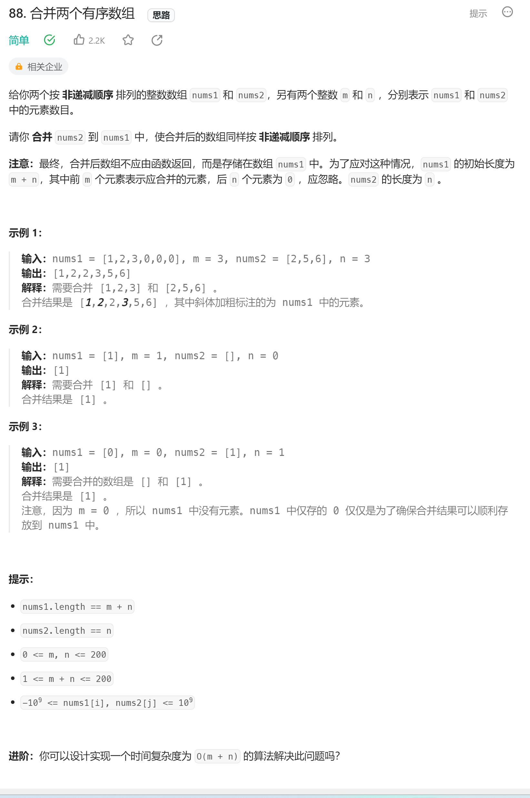

# 数组/字符串

## 1. 88. 合并两个有序数组



### 思路 1

- 最简单的方法就是将数组 nums2 放进数组 nums1 的尾部，然后直接对整个数组进行排序

### 代码

```javascript
/**
 * @param {number[]} nums1
 * @param {number} m
 * @param {number[]} nums2
 * @param {number} n
 * @return {void} Do not return anything, modify nums1 in-place instead.
 */
var merge = function (nums1, m, nums2, n) {
  // 将nums2放到nums1的尾部，使用数组的splice函数
  // Array.splice()的语法 splice(start, deleteCount, item1, item2, itemN)
  nums1.splice(m, nums1.length - m, ...nums2)
  nums1.sort((a, b) => a - b)
}
```

### 思路 2

- 使用双指针，将两个数组看作队列，每次从两个数组头部取出比较小的数字放到结果中
- 我们为两个数组分别设置一个指针 p1 与 p2 来作为队列的头部指针

### 代码

```javascript
/**
 * @param {number[]} nums1
 * @param {number} m
 * @param {number[]} nums2
 * @param {number} n
 * @return {void} Do not return anything, modify nums1 in-place instead.
 */
var merge = function (nums1, m, nums2, n) {
  let p1 = 0,
    p2 = 0
  // 初始化一个新的数组，填充为0
  const sorted = new Array(m + n).fill(0)
  var cur
  while (p1 < m || p2 < n) {
    if (p1 === m) {
      cur = nums2[p2++]
    } else if (p2 === n) {
      cur = nums1[p1++]
    } else if (nums1[p1] < nums2[p2]) {
      cur = nums1[p1++]
    } else {
      cur = nums2[p2++]
    }
    sorted[p1 + p2 - 1] = cur
  }
  for (let i = 0; i != m + n; ++i) {
    nums1[i] = sorted[i]
  }
}
```

### 思路 3

- 我们在思路 2 中之所以要使用临时变量，是因为如果直接合并到数组 nums1 中，nums1 中的元素可能会在取出之前被覆盖。那么如何直接避免覆盖 nums1 中的元素呢？，观察可知，nums1 的后半部分是空的，可以直接覆盖而不会影响结果。因此可以指针设置为从后向前遍历，每次取两者中的较大者放进 nums1 的后面

### 代码

```javascript
/**
 * @param {number[]} nums1
 * @param {number} m
 * @param {number[]} nums2
 * @param {number} n
 * @return {void} Do not return anything, modify nums1 in-place instead.
 */
var merge = function (nums1, m, nums2, n) {
  var p = m + n - 1
  while (n > 0) {
    if (m > 0 && nums1[m - 1] > nums2[n - 1]) {
      nums1[p--] = nums1[m - 1]
      m--
    } else {
      nums1[p--] = nums2[n - 1]
      n--
    }
  }
}
```

## 2. [27. 移除元素](https://leetcode.cn/problems/remove-element/)


### 思路 1

- 使用双指针中的快慢指针
- 如果 `fast` 遇到需要去除的元素，则直接跳过，否则就告诉 `slow` 指针，并让 `slow` 前进一步。

### 代码

```JavaScript
/**
 * @param {number[]} nums
 * @param {number} val
 * @return {number}
 */
var removeElement = function(nums, val) {
    let fast = 0, slow = 0;
    while (fast < nums.length) {
        if (nums[fast] !== val) {
            nums[slow] = nums[fast];
            slow++;
        }
        fast++;
    }
    return slow;
};
```

### 思路 2

- 使用数组的 indexOf 函数和 spilce 函数
- 先使用 indexOf 找出数组中 val 项，然后利用 spilces 函数将 val 项删除

### 代码

```JavaScript
/**
 * @param {number[]} nums
 * @param {number} val
 * @return {number}
 */
var removeElement = function(nums, val) {
    while(nums.indexOf(val) !== -1){
        nums.splice(nums.indexOf(val),1);
    }
};
```

## 3.26. 删除有序数组中的重复项


### 思路

- 有序序列去重的通用解法就是我们双指针技巧中的快慢指针技巧。
- 我们让慢指针 `slow` 走在后面，快指针 `fast` 走在前面探路，找到一个不重复的元素就告诉 `slow` 并让 `slow` 前进一步。这样当 `fast` 指针遍历完整个数组 `nums` 后，**`nums[0..slow]` 就是不重复元素**。

### 代码

```JavaScript
/**
 * @param {number[]} nums
 * @return {number}
 */
var removeDuplicates = function(nums) {
   if(nums.lengh === 0){
       return 0;
   }
   let fast = 0,slow = 0;
   while(fast < nums.length){
       if(nums[fast] !== nums[slow]){
           slow++
           nums[slow] = nums[fast]
       }
       fast++
   }
   return slow+1;
};
```
