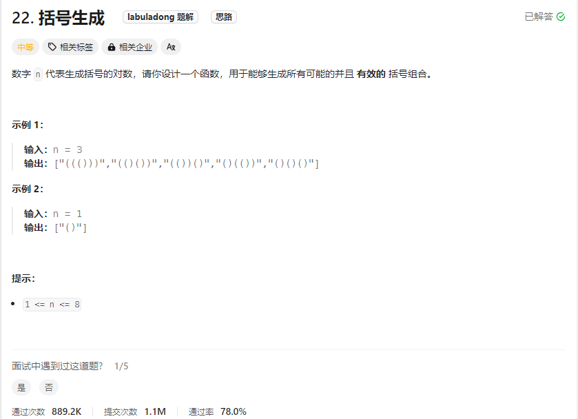
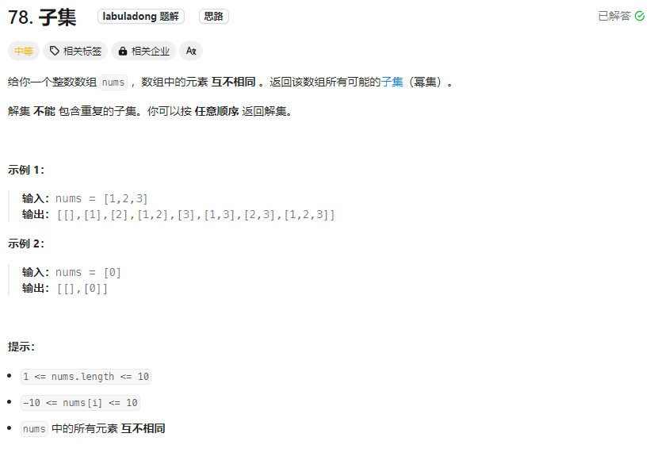
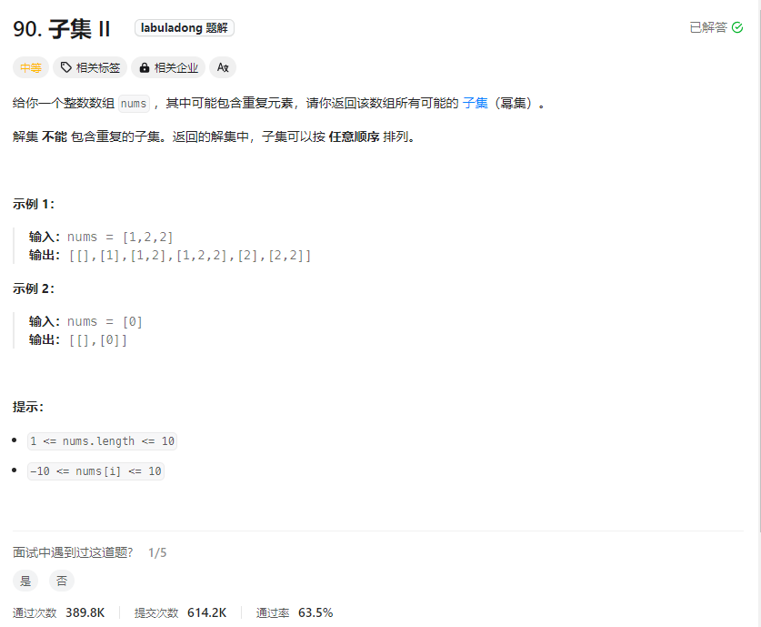
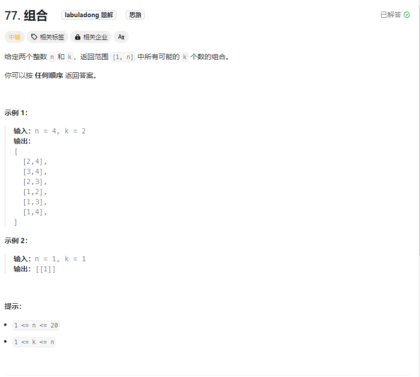
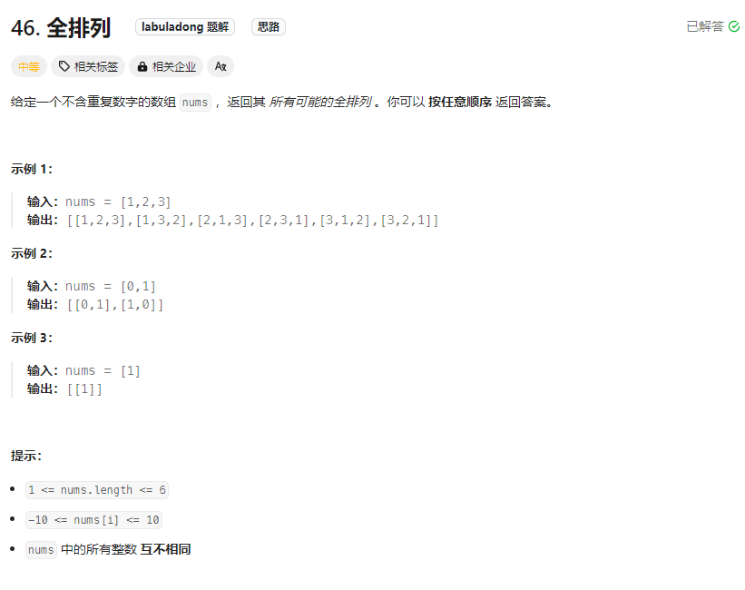
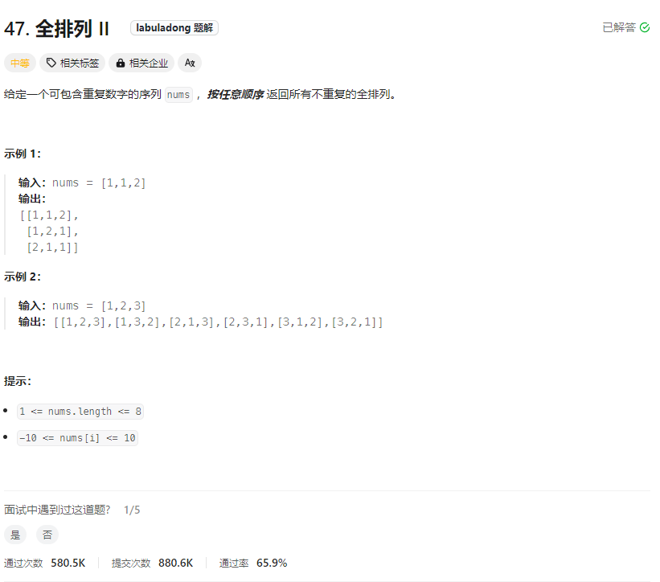
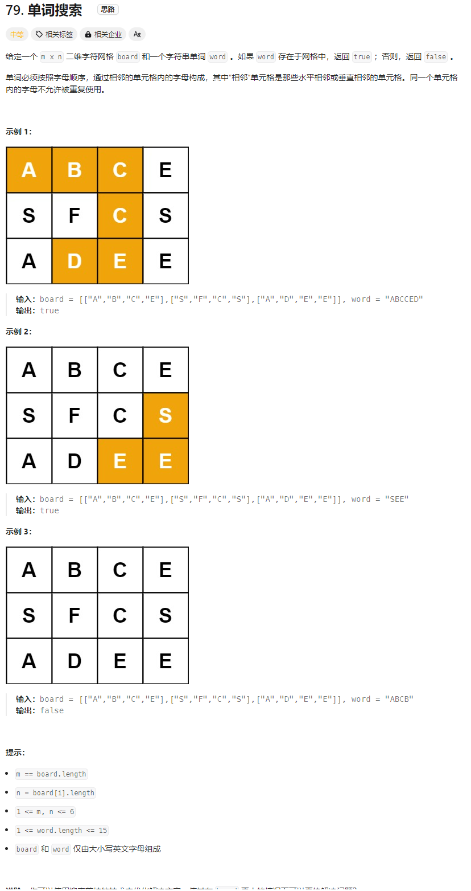
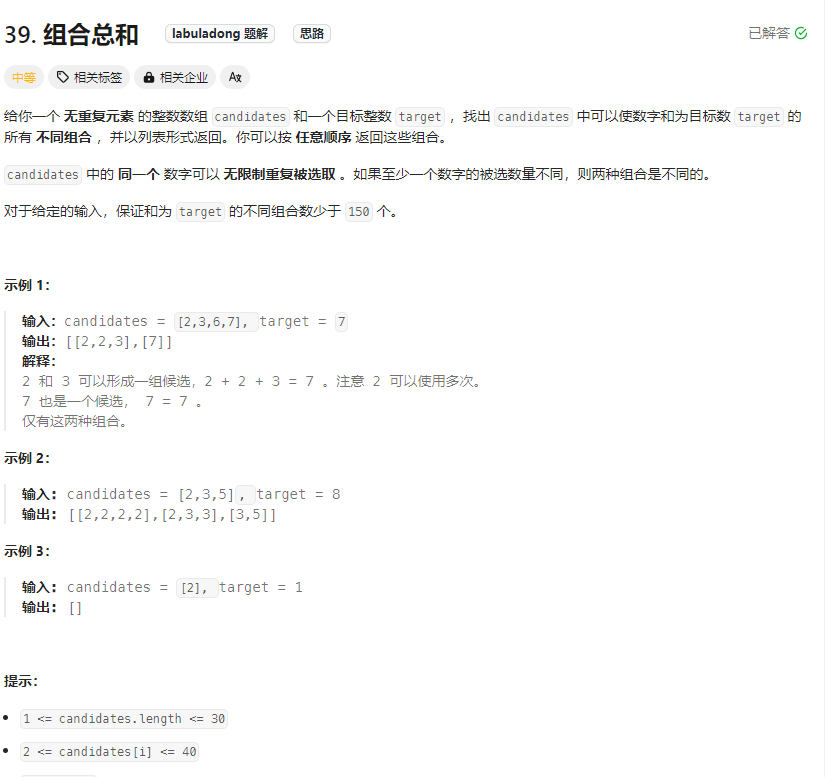

# 回溯算法

## 22.括号生成



```js
/**
 * @param {number} n
 * @return {string[]}
 */
var generateParenthesis = function (n) {
  if (n === 0) return [];
  // 记录所有合法的括号组合
  let res = [];
  // 回溯过程中的路径
  let track = "";
  // 可以用的左括号和右括号数量初始化为n
  const backtrack = (left, right) => {
    // 如果左括号剩下的多说明不合法
    if (left > right) return;
    // 数量小于0肯定不合法
    if (left < 0 || right < 0) return;
    // 当前括号都恰好用完时，得到一个合法的括号组合
    if (left === 0 && right === 0) {
      res.push(track);
      return;
    }

    // 尝试放一个左括号
    track += "(";
    backtrack(left - 1, right);
    // 撤销选择
    track = track.slice(0, -1);
    // 尝试放一个右括号
    track += ")";
    backtrack(left, right - 1);
    // 撤销选择
    track = track.slice(0, -1);
  };
  backtrack(n, n);
  return res;
};
```

## 78.子集



```js
/**
 * @param {number[]} nums
 * @return {number[][]}
 */
var subsets = function(nums) {
    if(nums.length == 0) return []
    let res = []
    let track = []
    // 利用start来控制不走重复的路径
    const backtrack = (start)=>{
        res.push([...track])
        for(let i = start;i < nums.length;i++){
            track.push(nums[i])
            backtrack(i + 1)
            track.pop()
        }
    }
    backtrack(0)
    return res
};
```

## 90.子集Ⅱ



```js
/**
 * @param {number[]} nums
 * @return {number[][]}
 */
var subsetsWithDup = function(nums) {
    if(nums.length == 0) return []
    // 首先对数组进行排序让重复元素在一起
    nums.sort((a,b)=>a-b)
    let res = []
    let track = []
    const backtrack = (start) => {
        res.push([...track])
        for(let i = start;i < nums.length;i++){
            if(i > start && nums[i] === nums[i-1]) continue
            track.push(nums[i])
            backtrack(i+1)
            track.pop()
        }
    }
    backtrack(0)
    return res
};
```

## 77.组合



```js
/**
 * @param {number} n
 * @param {number} k
 * @return {number[][]}
 */
var combine = function(n, k) {
    let res = [];
    if (k <= 0 || n <= 0) return res;
    let track = [];
    const backtrack = (start) => {
        if(track.length === k){
            res.push([...track])
        }
        for(let i = start;i <= n;i++){
            track.push(i)
            backtrack(i+1)
            track.pop()
        }
    }
    backtrack(1)
    return res;
}
```

## 46.全排列



```js
/**
 * @param {number[]} nums
 * @return {number[][]}
 */
var permute = function (nums) {
    if (nums.length === 0) return []
    let res = []
    let track = []
    let used = new Array(nums.length).fill(false)
    const backtrack = () => {
        if (track.length == nums.length) {
            res.push([...track])
            return
        }
        for (let i = 0; i < nums.length; i++) {
            if (used[i]) continue
            used[i] = true
            track.push(nums[i])
            backtrack(i + 1)
            track.pop()
            used[i] = false
        }
    }
    backtrack()
    return res
};

```

## 47.全排列Ⅱ



```js
/**
 * @param {number[]} nums
 * @return {number[][]}
 */
var permuteUnique = function(nums) { 
    if(nums.length == 0) return []
    nums.sort((a,b)=>a-b)
    let res = []
    let track = []
    let used = new Array(nums.length).fill(false)
    const backtack = () => {
        if(track.length == nums.length){
            res.push([...track])
            return
        }  
        for(let i = 0;i < nums.length;i++){
            if(used[i]) continue
            if(i > 0 && nums[i] === nums[i-1] && !used[i-1]) continue
            used[i] = true
            track.push(nums[i])
            backtack(i + 1)
            track.pop()
            used[i] = false
        }
    }
    backtack()
    return res
};
```

## 79.单词搜索



```js
/**
 * @param {character[][]} board
 * @param {string} word
 * @return {boolean}
 */
var exist = function (board, word) {
  let flag = false;
  let m = board.length;
  let n = board[0].length;
  for (let i = 0; i < m; i++) {
    for (let j = 0; j < n; j++) {
      if (board[i][j] == word[0]) {
        dfs(board, word, i, j, 0);
      }
    }
  }
  function dfs(board, word, i, j, k) {
    if (i < 0 || i >= m || j < 0 || j >= n || board[i][j] != word[k]) {
      return;
    }
    if (k == word.length - 1) {
      flag = true;
      return;
    }
    if (flag) return;
    // 对象数组进行标记，防止走回头路
    let temp = board[i][j];
    board[i][j] = "";
    // 向四面八方搜索
    dfs(board, word, i + 1, j, k + 1);
    dfs(board, word, i - 1, j, k + 1);
    dfs(board, word, i, j + 1, k + 1);
    dfs(board, word, i, j - 1, k + 1);
    board[i][j] = temp;
    return;
  }
  return flag;
};
```

## 39.组合总和



```js
/**
 * @param {number[]} candidates
 * @param {number} target
 * @return {number[][]}
 */
var combinationSum = function(candidates, target) {
    let res = []
    let track = []
    let sum = 0
    const backtrack = (start) => {
        if(sum == target){
            res.push([...track])
            return
        }
        if(sum > target) return
        for(let i = start;i < candidates.length;i++){
            track.push(candidates[i])
            sum += candidates[i]
            backtrack(i,target,sum)
            sum -= candidates[i]
            track.pop()
        }
    }
    backtrack(0)
    return res
};
```

