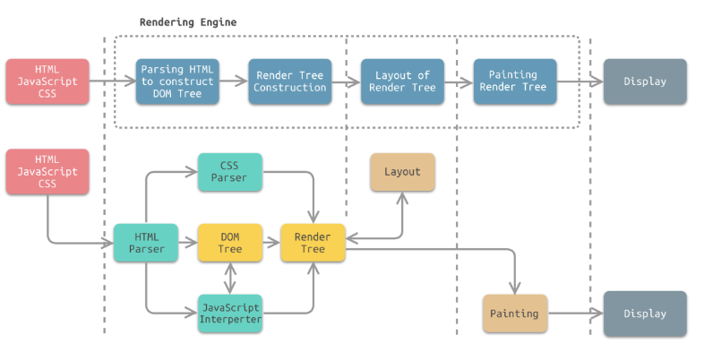

# 每日面试题

## @7 月 11 日

### 一、说一下 CSS 的盒模型？

> 在 HTML 页面中的所有元素都可以看成是一个盒模型

**盒子的组成：**内容`content`、内边距`padding`、边框`border`、外边距`margin`

**盒模型的类型：**

- 标准盒模型 （`content-box`）
  - `margin + border + padding + content`
- IE 盒模型（怪异盒模型）（`border-box`）
  - `margin + content`（`border + padding`）

**控制盒模型的样式：**`box-sizing:content-box`（默认值） 、`border-box`（IE 盒模型）

### 二、CSS 选择器的优先级？

**CSS 的特性：**继承性、层叠性、优先级

**优先级：**写 CSS 样式的时候，会给同一个元素添加多个样式，此时谁的权重高就显示谁的样式

标签、类/伪类/属性、全局选择器、id、行内样式、!important

!important > 行内样式 > id > 类/伪类/属性、标签、全局选择器

### 三、隐藏元素的方法有哪些？

- `display:none`

  - 元素在页面上消失，不占据空间

- `opacity:0`

  - 设置了元素的透明度为 0，元素不可见，占据位置空间

- `visibility:hidden`

  - 让元素消失，占据位置空间，一种不可见的状态

- `position:absolute`

  - 通过定位将元素移除可视区外，它不会影响布局

- `clip-path`

  - 创建一个只有元素的部分区域可以显示的剪切区域。区域内的部分显示，区域外的隐藏

    用法`clip-pach：polygon(0px 0px,0px 0px,0px 0px,0px 0px);`

### 四、px 和 rem 的区别是什么？

- px 是像素，显示器上给我们呈现画面的像素，每个像素的大小的一样的，绝对单位长度
- rem，相对单位，相对于 html 根节点的`font-size`的值，直接给 html 节点的`font-size:62.5%`；
  - `1rem = 10px; (16px * 62.5% = 10px)`

### 五、重排和重绘有什么区别？

- **重排（回流）：**布局引擎会根据所有的样式计算出盒模型在页面上的位置和大小
- **重绘：**计算好盒模型的位置、大小和其他一些属性之后，浏览器就会根据每个盒模型的特性进行绘制

> 浏览器的渲染机制
>
> 
>
> - **HTML 解释器**：解析 HTM 文档，主要作用是将 HTML 文档转换成 DOM 树
> - **CSS 解释器：**将 DOM 中各个元素对象进行计算，获取样式信息，用于渲染树的构建
> - **JavaScript 解释器：**使用 JavaScript 可以修改也买你的内容，css 规则等。JavaScript 解释器能够解释 JavaScript 代码，并通过 DOM 接口和 CSSOM 接口来修改页面内容、样式规则、从而改变渲染结果
> - **页面布局：**DOM 创建之后，渲染引擎将其中的元素对象与样式规则进行结合，可以得到渲染树。布局规则是正对渲染树，计算其各个元素的大小、位置等布局信息。
> - **页面绘制：**使用图形库将计算后的渲染树绘制成可视化的图像结果

对 DOM 的大小、位置进行修改后，浏览器需要重新计算元素的这些**几何属性**，就叫**重排**

对 DOM 的样式进行修改，比如 color 和 background-color，浏览器不需要重新计算几何属性的时候，直接绘制了该**元素的新样式**，那么这里就只触发了**重绘**

## @7 月 12 日

### 一、让一个元素水平垂直居中的方式有哪些？

- **定位 + margin**

  - 父元素固定宽高、相对定位，子元素固定宽高、绝对定位、上下左右设置为 0，`margin:auto`，就可以实现子元素相对于父元素水平垂直居中

- **定位 + transform**

  - 父元素相对定位，子元素绝对定位，先将元素的左上角定位到页面的中心，就是 top 和 left 设置为 50%，再通过 translate 调整元素自身的中心点，设置`transform:translate(-50%,-50%)`

- **flex 布局**

  - 设置父元素为弹性盒子：`display:flex;`然后设置父元素和盒子内部子元素水平垂直居中，`justify-content:center;align-items:center`

  - ```css
    .father {
      display: flex;
      justify-content: center;
      align-items: center;
      background-color: pink;
    }
    .son {
      background-color: green;
    }
    ```

- **grid 布局**

  - 设置父元素为网格布局：`display:grid;`设置`justify-content:center;align-items:center;`

  - ```css
    .father {
      display: grid;
      justify-content: center;
      align-items: center;
      background-color: pink;
    }
    .son {
      background-color: green;
    }
    ```

- **table 布局**

  - 设置父元素为表格元素，`display:table-cell;`，设置其内部元素水平垂直居中：`text-align:center;vertical-align:middle;`设置子元素为行内块：`display:inline-block;`

  - ```css
    .father {
      width: 400px;
      height: 300px;
      display: table-cell;
      text-align: center;
      vertical-align: middle;
      background-color: red;
    }
    .son {
      display: inline-block;
      background-color: pink;
    }
    ```

### 二、CSS 的哪些属性哪些可以继承？哪些不可以继承？

可以继承

- 字体系列属性：`font、font-family、font-weight、font-size、fontstyle`
- 文本系列属性
  - 内联元素：`color`、`line-height`、`word-spacing`（设置单词之间的间距）、`letter-spacing`（设置文本字符间距）、`text-transform`（用于设置文本的大小写：uppercase 所有字符强制转为大写；lowercase 转小写；capitalize 首字符强制转为大写）
  - 块级元素：`text-indent`、`text-aline`
  - 元素可见性：`visibility`
  - 表格布局属性：`caption-side`（标题位置）、`border-collapse`（设置边框分离还是合并）、`border-spacing`（变宽分离状态下设置边框间距）、`empty-cells`（定义如何渲染无可视内容的单元格边框和背景）、`table-layout`（定义用于布局单元格行和列的算法）
  - 列表布局属性：`list-tyle`

不可以继承

- display：规定元素应该生成的框的类型
- 文本类型：`vertical-align`、`text-decoration`（用于设置文本的修饰线外观包括上/下划线，贯穿线、删除线、闪烁）
- 盒子模型的属性：`width`、`height`、`margin`、`border`、`padding`
- 背景属性：`background`、`background-color`、`background-image`
- 定位属性：`float`、`clear`、`position`、`top`、`right`、`bottom`、`left`、`min-width`、`min-height`、`max-width`、`max-height`、`overflow`、`clip`

### 三、有没有用过预处理器？

SCSS LESS

预处理器可以让 css 代码更简洁、易懂、具备更强的可移植性和维护性

### 四、JS 由哪三部分组成？

- **ECMAScript：**JS 的核心内容，描述了语言的基础语法，比如 var，for，数据类型（数组、字符串）
- **文档对象模型（DOM）:**DOM 把整个 HTML 页面规划为元素构成的文档
- **浏览器对象模型（BOM）:**对浏览器窗口进行访问和操作

### 五、JS 有哪些内置对象？

String、Boolean、Number、Array、Object、Function、Math、Date、RegExp...

- **Math**
  - abs()
  - sqrt()
  - max()
  - min()
  - ...
- **Data**
  - new Data()
  - getYear()
  - ...
- **Array**
- **String**
  - concat()
  - length()
  - slice()
  - split()
  - ...

## @7 月 13 日

### 一、操作数组的方法有哪些？

push() pop() sort() splice() unshift() shift() reverse() concat() join() filter() ervery() some() reduce() isArray() findIndex()

哪些方法会改变原数组？

push() pop() unshift() shift() sort() reverse() splice()

### 二、JS 有哪些数据类型，如何判断这些数据类型？

**1、最新的 ECAMScript 标准定义了 8 中数据类型（7 种基本数据类型，1 种引用数据类型）**

| 分类             | 数据类型                                                                                                                                   |
| :--------------- | :----------------------------------------------------------------------------------------------------------------------------------------- |
| 7 种基本数据类型 | string（字符串）、number（数字）、boolean（布尔）、undefined（未定义）、null（空）、Symbol（符号）、BigInt（数值类型，表示任意精度的整数） |
| 1 种引用数据类型 | Object 对象：Array（数组）、Function（函数）、Date（时间）等                                                                               |

**2、JS 检测数据类型的四种方式**

- typeof
- instanceof
- constructor
- Object.prototype.toString.call()

**① 数据类型检测方法一：typeof**

> **语法**
>
> ```js
> typeof 表达式
> 或
> typeof 变量
> ```
>
> **例子**
>
> ```js
> typeof 1 //'number'
> typeof '' //'string'
> typeof true //'boolean'
> typeof undefined // 'undefined'
> typeof null //'object'
> typeof [1, 2, 3] //'object'
> typeof {} //'object'
> typeof function () {} //'function'
> typeof Symbol() //'symbol'
> ```
>
> - typeof 的返回值类型为字符串类型
> - typeof 判断基本数据类型时，除了 null 的输出结果为'object' 其它类型都能正确判断
> - typeof 判断引用数据类型时，除了判断函数会输出'function' 其它都输出'object'
>
> **注意点：**
>
> null 的数据类型是 object （null 是对一个空对象的引用，是一个占位符）
>
> - typeof 并不能区分引用数据类型（Array 数组、Date 时间）等
> - 所以我们可以使用 instanceof 来判断引用数据类型

**② 数据类型检测方法二：instanceof**

> **语法：**
>
> ```js
> obj1 instanceof obj2 // 判断obj1是否为obj2的实例
> ```
>
> - instanceof 用来判断两个对象是否属于实例关系，通过这种关系来判断对象是否属于某一类型。（但不能判断对象具体属于哪种类型）。
>
> - instanceof 可以准确判断引用数据类型，**它的原理是**：检测构造函数的 prototype 属性是否在某个实例对象的原型链上。
>
> - instanceof 返回值为布尔值
>
> - ```js
>   <script>
>     class People {
>       constructor(name, age) {
>         this.name = name;
>         this.age = age;
>       }
>       eat() {
>         console.log(`${this.name}正在吃饭`);
>       }
>     }
>     //Student类继承People类
>     class Student extends People {
>       constructor(name, age, id) {
>         super(name, age);
>         this.id = id;
>       }
>       study() {
>         console.log(`${this.name}正在学习`);
>       }
>     }
>     const s = new Student("小明", 15, "0001");
>     console.log(s.__proto__ === Student.prototype);//true
>     console.log(Student.prototype.__proto__ === People.prototype); //true
>     console.log(People.prototype.__proto__ === Object.prototype); //true
>     console.log(Object.prototype.__proto__); //null
>     console.log(s instanceof Student); //只要在原型链上，都为true
>     console.log(s instanceof People); //只要在原型链上，都为true
>     console.log(s instanceof Object); //只要在原型链上，都为true
>   </script>
>   ```
>
>   

**③ 数据类型检测方法三：constructor（构造函数)**

> **语法：**
>
> ```js
> ''.constructor === String // true
> var num = 1
> num.constructor === Number // true
> true.constructor === Boolean // true
> ;[].constructor === Array // true
> var obj = {}
> obj.constructor === Object // true
> ```
>
> 当一个函数 F 被定义时，JS 引擎会为 F 添加 prototype 原型，然后在 prototype 上添加了一个 constructor 属性，并让其指向 F 的引用
>
> ```html
> <script>
>   function F() {}
>   const f = new F() // 实例
>   console.log(F.prototype.constructor) // function F(){}
>   console.log(F.prototype.constructor === F) // 构造器指向F
>   console.log(f.constructor === F)
> </script>
> ```
>
> 当执行 const f = new F() 时，F 被当成了构造函数，f 是 F 的实例对象，此时 F 原型上的 constructor 传递到了 f 上，因此`f.__proto__.constructor===F`简写成`f.constructor === F`
>
> 从上面的整个过程来看，构造函数 F 就是新对象 f（实例）的类型。所以如果某个实例的 constructor 指向某个构造函数，那这个构造函数就是这个实例的类型。
>
> **注意**：
>
> > - constructor 是不稳定的，因为开发者可以重写 prototype,重写后，原有的 constructor 引用会丢失，需要我们重新指定 constructor 的引用
> > - 在没有重新指定时，constructor 会默认为 Object
>
> **为什么重写 prototype 后，constructor 的默认值会为 Object 呢？**
>
> ```html
> <script>
>   function F() {}
>   F.prototype = {}
>   console.log(F.prototype.constructor)
>   // 结果为 Object() { [native code] }
> </script>
> ```
>
> 当 F.prototype={ }时，{ }是 new Object 的字面量（Object 的实例），所以 Object 原型上的 constructor 会被传递给{ }，Object 的 constructor 指向的就是 Object 本身。

**④ 、数据类型检测方法四：Object.prototype.toString.call()**

> `toString()`是 Object 的原型方法，调用该方法，默认返回当前对象的 `[object type]`。其中 type 就是对象的类型。
>
> - `Object`对象，直接调用`toString()` 就能返回 [object Object]
> - 其他对象，则需要通过 call / apply 来调用才能返回正确的类型信息
>
> ```js
> Object.prototype.toString.call('') // [object String]
> Object.prototype.toString.call(1) // [object Number]
> Object.prototype.toString.call(true) // [object Boolean]
> Object.prototype.toString.call(Symbol()) // [object Symbol]
> Object.prototype.toString.call(undefined) // [object Undefined]
> Object.prototype.toString.call(new Function()) // [object Function]
> Object.prototype.toString.call(new Date()) // [object Date]
> Object.prototype.toString.call([]) // [object Array]
> Object.prototype.toString.call({}) // [object Object]
> Object.prototype.toString.call(document) // [object HTMLDocument]
> Object.prototype.toString.call(window) // [object Window]
> ```

### 三、null 和 undefined 的区别 ？

> - **undefined（未定义）**：当一个变量被定义（声明）但并没有赋值时，他的初始值就是 undefined。
>
> - null（空）：表示对一个空对象的引用。
>
>   - 当一个变量定好之后，未来是用来保存对象的引用时，我们可以给他赋初始值为 null。
>
>   - 当一个对象使用完，需要对其进行释放内存时，可以将其值设置 null （js 会自动垃圾回收）
>
> **相同点**：
>
> - undefined 和 null 都是基本数据类型，保存栈中。
> - undefined 和 null 转换为 boolean 布尔值都为 false
>
> **不同点**:
>
> 两者转换为数字类型时，其值不一样
>
> ```js
> Number(undefined) //NaN
> Number(null) //0
> ```
>
> **特殊点**:
>
> ```js
> undefined == null //true
> ```

### 四、基本数据类型和引用数据类型的区别？

| 比较           | 基本数据类型                                                   | 引用数据类型                                                             |
| :------------- | :------------------------------------------------------------- | :----------------------------------------------------------------------- |
| 数据存放位置   | 基本数据类型存放在**栈**中，数据大小确定，内存空间大小可以分配 | 引用数据类型存放在**堆**中，每个空间大小不一样，要根据情况进行特定的配置 |
| 变量存储内容   | 变量中存储的是**值本身**                                       | 变量存储的是**地址**                                                     |
| 变量用来赋值时 | 把变量的**值**复制一份去赋值                                   | 把变量的**内存地址**复制一份去赋值                                       |
| 存储内容大小   | 存储**值较小**                                                 | 存储**值较大**                                                           |

> **栈和堆的的介绍**
>
> 当我们创建数据时就会占用内存，在内存中主要开辟两类空间：**堆内存** 和 **栈内存**
>
> | 比较     | 栈（线程）                                   | 堆（进程，线程共享）                 |
> | :------- | :------------------------------------------- | :----------------------------------- |
> | 大小固定 | 创建时，确定大小（值大小固定），故可能会溢出 | 大小不固定，可随时增加               |
> | 存储类型 | 存储基本数据类型及引用类型数据的堆地址       | 存储引用类型数据                     |
> | 如何访问 | 按值访问                                     | 按引用（堆内存地址）访问             |
> | 特点     | 空间小，运行效率高                           | 空间大，运行效率相对较低             |
> | 存放规则 | 按顺序存放，先进后出                         | 无序存储，可根据引用（地址）直接获取 |
>
> **实例**:
>
> 基本类型和引用类型赋值的区别
>
> ```html
> <script>
>   var a = 10
>   var b = a //10
>   a = 20
>   console.log(a, b) //20 10
> </script>
> ```
>
> - a 变量是基本数据类型,他在赋值是把 a 的值复制一份给到 b
> - 所以 b = 10 ，最后我们修改 a 的值，并不会响影到 b
>
> 
>
> ```html
> <script>
>   var obj = {
>     name: '清心',
>     age: 34,
>   }
>   var obj2 = obj //是把obj中地址赋值给obj2,两者指向的是同一个堆内存中地址
>   obj.name = '小丽' //操作是堆内存中的数据
>   console.log(obj === obj2) //true
>   console.log(obj.name, obj2.name) //小丽 小丽
> </script>
> ```
>
> > 栈内存中存着变量 obj 对堆内存中的地址，而堆内存中存着对应地址的数据内容
>
> 
>
> 当 obj2=obj 时，其实是把 obj 中保存的地址赋值给了 obj2,所以本质上 obj===obj2 比较时,比较的是地址，地址始终没有变，所以两者是全等的。
>
> 我们在操 obj.name = '小丽' 时，操作的是堆内存中的数据，所以 obj.name 和 obj2.name 的值是一样的。

### 五、typeof(NaN)返回结果？

> - NaN 不是数字的数字类型，所以 `typeof(NaN)` 返回结果就是 number
> - NaN === NaN 结果为 false，他自己和他自己都不相等
> - 如何判断一个变量的值是 NaN ?
>
> ```js
> var a = '我' - '你'
> isNaN(a) && typeof a === 'number'
> ```

## @7 月 14 日

### 一、以下两种方式的区别？及 typeof 得到的结果（字节）

> ```js
> const str1 = 'abc'
> const str2 = new String('abc')
> ```
>
> **str1 是基本数据类型**
>
> - 存储在在栈内存中，用 typeof 检测的结果为 string。
> - 当我们把 str1 赋值给别一个变量时，是把 str1 中的值复制一份来赋值。
>
> **str2 是引用数据类型**
>
> - 存储在堆内存中，不过变量 str2 中存的是指向堆内存中的地址，用 typeof 检测 str2 结果为 Object。
> - 当我们把 str2 赋值给另一个变量时，是把 str2 中存入的地址复制一分给到了变量。

### 二、typeof 能判断那些类型 ？

> typeof 能判断的类型有：string、number、boolean、undefined、symbol、function
>
> - typeof 判断基本数据类型时，除了 null 的输出结果为'object' 其它类型都能正确判断
> - typeof 判断引用数据类型时，除了判断函数会输出'function' 其它都输出'object'

### 三、typeof(null) 为什么返回的是'object' ?

> - `typeof(null) = object` 是 JS 在诞生设计之初留下的历史遗留 BUG 问题
> - 在 JS 中进行数据底层存储的时候是用二进制存储的，这是一定的，而且它的前三位是代表存储的数据类型，而 000 是代表 object 类型也就是引用类型的数据。
> - 而 null 正好全是 0，所以它巧妙的符合 object 类型的存储格式，所以在 typeof 检测的时候，它才会输出 object。

### 四、== 和 === 的区别 ？

== 在比较类型不同的变量时，如果两侧的数据类型不同，则会按以下规则进行相应的隐式类型类型转换

- 对象 --> 字符串 --> 数值
- 布尔值 --> 数值

> 转换后，再比较两边的值是否相等，值相等返回 true，不等返回 false;

=== 在比较时，会比较值和类型两个。只要两边值的类型不相等就返回 false

```js
var x = 2
var y = '2'
;(x == y)(
  // 返回 true，因为 x 和 y 的值相同
  x === y,
)
// 返回 false，因为 x 的类型是“数字”，y 的类型是“字符串”
```

**不过要注意以下几个特殊情况的比较**

```js
NaN === NaN; // false NaN和任何数据都不相等，包括自身
[] == []; // false 比较的是地址
{} == {}; // false 比较的是地址
undefined == null; // true; 特殊情况，记下
```

> 对象转字符串，得到的是'[object Object]'

**考题 1：以下输出结果**

```js
console.log([] == false) // true
```

> - [] 转换成字符串是'' ，然后'' 转换成数值是 0
> - false 转换成数值是 0 所以最后比较的值是 0==0 ，结果为 true

**考题 2：以下输出结果**

```js
if ([]) {
  alert('能弹出吗？') // 可以弹出弹窗
}
```

> - if 语句中的表达式或值都会被转成 boolean
> - [] 转成布尔值是 true，所以可以弹出。

### 五、什么是变量提升 ？（腾讯、网易、小米）

变量提升：是指使用 var 关键字声明的变量会自动提升到当前作用域的最前面。不过只会提升声明，不会提升其初始化。

```html
<script>
  console.log(a) // undefined
  var a = 10
  function fn() {
    console.log(b) // undefined
    var b = 1
  }
  fn()
</script>
```

**变量只有被声明后，才能使用**

- 我们在 var a=10; 之前 console.log(a); 之所以不会报错，就是因为变 a 的声明被提前到了当前作用域的最顶部
- 不过只提升了声明，并没会提升初始化，所以打印结果为 undefined; （变量声明初始化，其默认值是 undefined）

上面代码可以看成如下：

```html
<script>
  var a
  console.log(a) // undefined
  a = 10
  function fn() {
    var b
    console.log(b) // undefined
    b = 1
  }
  fn()
</script>
```

**补充**：

- 函数声明也会被提升，函数和变量相比，会被优先提升。
- 这意味着函数会被提升到更靠前的位置，如果出现了重名的变量和函数，声明提升时会以函数为主。

```html
<script>
  console.log(num) // function num(){console.log('函数');}  函数被优先提升
  var num = 1
  console.log(num) // 1 在从上往下执行时num变量赋值为 1
  function num() {
    console.log('函数')
  }
  console.log(num()) // 报错，因为变量num被重新赋值为1，不会再有函数了
</script>
```

## @7 月 15 日

### 一、const、let、var 区别（叠纸、字节、阿里）

const、let、var 三者的区别，我们可以从以下 5 个点来展开对比

- **变量提升和暂时性死区**： var 存在变量提升，let 和 const 不存在变量提升，所以 let 和 const 会存在暂时性死区
- **块级作用域**： var 不存在块级作用域，let 和 const 存在块级作用域
- **重复声明**： var 允许重复声明变量，let 和 const 在同一作用域下不允许重复声明变量
- **修改变量**： var 和 let 声明的变量可以修改，const 是不可以的。
- **使用**：const 用来声明常量，引用类型值。其它情况推荐用 let ，避免用 var

**① 变量提升**

> - var 声明的变量存在变量提升，即变量可以在声明之前被调用。
> - let 和 const 不存在变量提升，即它们所声明的变量一定要在声明后使用，否则会报错
>
> ```html
> <script>
>   console.log(a) // undefined
>   var a = 1
> </script>
> <script>
>   console.log(b) // Cannot access 'b' before initialization
>   let b = 2
>   console.log(c) // Cannot access 'c' before initialization
>   const c = 3
> </script>
> ```

**② 块级作用域**

> var 不存在块级作用域，let 和 const 存在块级作用域
>
> ```js
> {
>   var a = 1
> }
> console.log(a) // 1
> {
>   let b = 2
> }
> console.log(b) // Uncaught ReferenceError: b is not defined
> {
>   const c = 3
> }
> console.log(c) // Uncaught ReferenceError: c is not defined
> ```

**③ 重复声明**

> var 允许重复声明变量，let 和 const 在同一作用域下不允许重复声明变量
>
> ```html
> <script>
>   var a = 1
>   var a = 2
> </script>
> <script>
>   let b = 1
>   let b = 2 // Uncaught SyntaxError: Identifier 'b' has already been declared
> </script>
> <script>
>   const c = 1
>   const c = 2 // Uncaught SyntaxError: Identifier 'c' has already been declared
> </script>
> ```

**④ 修改变量**

> - var 和 let 声明的变量，可以修改
> - const 声明的是一个只读的常量。一旦声明，常量的值就不能改变
>
> ```html
> <script>
>   var a = 1
>   a = 2
>   let b = 2
>   b = 3
>   console.log(a, b) // 2 3
> </script>
> <script>
>   const c = 3
>   c = 3
>   console.log(c) // ncaught TypeError: Assignment to constant variable.
> </script>
> ```

**⑤ 使用**

> - 能用 const 的情况尽量使用 const，比如声明的变量是用来保存 对象、数组等引用类型时，用 const
> - 其他情况下大多数使用 let，比如 for 循环，避免使用 var
>
> > 提示：var 在全局作用域中声明的变量，相当于 window 对象的属性。

### 二、const 定义的值一定是不能改变的吗？

> - const 实际上保证的，并不是变量的值不得改动，而是变量指向的那个**栈内存**地址所保存的数据不得改动。
> - 对于简单类型的数据（数值、字符串、布尔值）值就保存在变量指向的那个栈内存地址，因此等同于常量。
> - 引用类型的数据（主要是对象和数组）变量指向的栈内存地址，保存的只是一个指向实际数据的指针
> - const 只能保证这个指针是固定的（即总是指向另一个固定的地址），至于它指向的数据结构是不是可变的，就完全不能控制了。
>
> 所以如果是 const 声明的是一个引用类型的变量，其引用类型的结构是可以发生改变的。

### 三、const 声明了数组，还能 push 元素吗，为什么 ？

> 可以
>
> - 因为 const 声明的变量保存的只是**栈内存**中的地址，只是一个指向实际数据的指针。指针指向堆内存中保存的数据。
> - const 只能保证栈内存中的地址不变，但是堆内存中的数据如何改变是没有办法控制的。
> - push 方法相当于是改变了堆内存中的数据结构。

### 四、闭包里面的变量为什么不会被垃圾回收（快手、滴滴、58 篇、字节、小米、腾讯、网易）

**① 首先我们来了解下什么是垃圾回收 ？**

> 在 js 中所谓的垃圾就是指不会再被使用的值，就会被当成垃圾回收掉。
>
> - javaScript 会自动回收不再使用的变量，释放其所占的内存，开发人员不需要手动的做垃圾回收的处理。
>
> - 垃圾回收机制只会回收局部变量，全局变量不会被回收，因为全局变量随时有可能被使用。（全局变量在浏览器关闭之后会回收）所以当我们定义了一个全局对象时，在使用完毕之后，最好给它重新复值为 null，以便释放其所占用的内存。
>
> - 目前浏览器基本使用**标记清除**和**引用计数**两种垃圾回收策略
>
>   - 标记清理
>     - 当函数被调用，变量进入上下文时，会被加上存在上下文标记，是不会被清理的。
>     - 当函数执行完成后，就会去掉存在上下文中的标记，随后垃圾回收程序会做一次内存清理，销毁这些变量。
>
>   ```js
>   function fn() {
>     var a = 1 // 函数调用时 被标记 进入上下文
>   }
>   test() // 函数执行完毕，a的标记去掉，被回收
>   ```
>
>   - 引用计数
>     - 引用计数就是追踪**值**被引用的次数。声明变量并给它赋一个引用类型值时，这个值的引用数 为 1。
>     - 如果同一个值又被赋给另一个变量，那引用数+1 。如果保存该值引用的变量被其它值覆 盖了，则引用数减 1。
>     - 当引用计数为 0 时，表示这个值不再用到，垃圾收集器就会回收他所占 用的内存。
>
> ```html
> <script>
>   var a = [1, 2, 3] // [1,2,3]的引用计数为1
>   var b = a // 变量b也引用了这个数组，所以[1,2,3]的引用数为2
>   var a = null // [1,2,3]的引用被切断，引用数-1，所以[1,2,3]的引用数为1
>   // 如果只是到这里，那[1,2,3]不所占的内存不会被回收
>   var b = null // [1,2,3] 的引用被切断，引用数-1，所 [1,2,3]的引用数为0
>   // 到这里，垃圾收集器在下一次清理内存时，就会把[1,2,3]所占的内存清理掉
> </script>
> ```
>
> > 引用计数有一个很大的坑，就是循环引用时，会造成内存永远无法释放。

**② 为什么闭包中的变量不会被垃圾回收 ？**

> 这里我们要明确一个点，如果闭包函数的引用计数为 0 时，函数就会释放，它引用的变量也会被释放。
>
> - 只有当闭包函数的引用计数不为 0 时，说明闭包函数随时有可能被调用，他被调用后，就会引用他在定义时所处的环境的变量。
> - 闭包中的变量就得一直需要在内存中，则就不会被垃圾回收掉。

### 五、说说 JS 作用域及作用域链（字节、小米、腾讯、商汤）

要回答这个问题 ，我们可以从以下几个方面来展开讲解：

- 什么是作用域 ？
- js 中作用域的分类 ？
- 每种作用域的特点 ？（作用或创建 ，销毁，变量和函数访问权限）
- 什么是作用域链 ？
- 什么是作用域链查找 ？

**① 什么是作用域 ？**

> **简单点理解：**
>
> - 作用域是一套规则，规定了代码的作用范围。
> - 这套规则用来管理引擎如何在当前作用域以及嵌套的子作用域中根据标识符名称进行变量查找。
> - 简单来说，作用域规定了如何查找变量。比如函数外部是不能访问函数里面的变量（**闭包除外**），函数里面是可以访问函数外面的变量。
>
> ```html
> <script>
>   var b = 2
>   function fn() {
>     var a = 1
>     console.log(b)
>   }
>   fn() // 2
>   console.log(a) // a is not defined  不能访问函数作用域中的变量a
> </script>
> ```
>
> **全面理解**：
>
> - 作用域就是代码的执行环境。执行环境定义了变量或函数有没有权访问其他数据。
> - 每个执行环境都有一个与之关联的**变量对象**，环境中定义的所有变量和函数都保存在这个对象中。
> - 虽然我们编写的代码无法访问这个对象，但解析器在处理数据时会在后台使用它。
>
> 比如特殊的**全局执行环境中的变量对象 window 对象**，因此所有全局变量和函数都作为 window 对象的属性和方法创建的。
> 在 **Node** 环境中，**全局执行环境是 global 对象**
>
> ```html
> <script>
>   var a = 1
>   function sum(a, b) {
>     return a + b
>   }
>   var n = window.sum(2, 3) // sum 相当于window对象上的方法
>   console.log(window.n) // 5  n相当于window对象的属性
>   console.log(window.a) // 1  a相当于window对象的属性
> </script>
> ```
>
> > - 每个函数都有自己的执行环境。当执行流进入一个函数时，函数的环境就会被推入一个环境栈中。
> > - 而在函数执行之后，栈将被环境弹出，把控制权返回给之前的执行环境。
> > - ECMAScript 程序中的执行流正是由这个方便的机制控制着。

**② JS 中作用域的分类**

> JS 中有 3 种类型的作用域：
>
> - 全局作用域
> - 局部作用域（函数作用域）
> - 块级作用域
>
> **全局作用域**
>
> 编写在 script 标签中的 js 代码（或单独 js 文件），都是在全局作用域中。
>
> - 全局作用域 在页面打开时创建，在页面关闭时销毁。我们可以把全局作用中不再使用的引用类型变量重新赋值为 null
> - 这样垃圾回收器就会把切断的引用类型数据当成垃圾回收掉，释放其在内存中占用的空间。
>
> ```js
> let arr = [1, 2, 3] // 堆内存开辟空间，用来保存[1,2,3]
> arr = null // 垃圾回收器会把[1,2,3]回收掉，释放其在堆内存中占用的空间
> ```
>
> - 全局作用域中有一个全局对象 window,代表一个浏览器窗口，由浏览器创建，可以直接使用
> - 在代码的任何地方，都可以访问全局作用域中的变量
>
> **局部作用域（函数作用域）：**
>
> 写在函数内部的代码，就是在局部作用域中
>
> - 每调用一次函数就会创建一个新的私有函数作用域，形参和当前私有函数作用域中声明的变量都是私有变量，保存在内部的一个变量对象中。
> - 函数被调用时创建函数作用域，函数执行完毕后，函数作用域被销毁，保存在其中的变量和函数定义了随之被销毁（**闭包除外，只有当闭包函数的引用次数为 0 时，闭包函数和闭包中的变量被销毁**）
> - 函数里能访问函数外变量，但函数外部是不能访问函数里面的变量，**闭包除外，闭包函数会记住它在定义时所处的环境**
>
> ```html
> <script>
>   function fn(a, b) {
>     var c = 10
>     console.log((a + b) * c)
>   }
>   fn(1, 2) //函数调用创建函数作用域，代码执行用，作用域和变量a,b,c销毁
>   fn(2, 3) //函数调用创建函数作用域，代码执行用，作用域和变量a,b,c销毁
> </script>
> ```
>
> **特殊的闭包**：
>
> ```html
> <script>
>   function checkWeight(weight) {
>     return function (_weight) {
>       weight > _weight ? alert('过胖') : alert('ok达标')
>     }
>   }
>   var P1 = checkWeight(100) // 调用完毕，作用域和变量weight不会被销毁
>   P1(110) // 调用完毕，作用域和变量_weight会被销毁
> </script>
> ```
>
> > - 如果我们在最后加上`P1 = null`，则垃圾回收器会在下一次清理内存时销毁掉 checkWeight 调用形成的作用域和作用域中的变量 weight。
>
> **块级作用域**：
>
> 使用 let 或 const 关键字声明的变量，会形成块级作用域。
>
> - 在 {}、if 、for 里用 let 来声明变量，会形成块级作用域。{} 之外是不能访问 {} 里面的内容。
> - 块级作用域中定义的变量，在 if 或 for 等语句执行完后，变量就会被销，不占用内存
>
> ```js
> {
>   let a = 1;
> }
> console.log(a); // 会报错，{}里是块级作用域，外面是访问不到里面的变量的
> <script>
>   for (let i = 0; i < 3; i++) {
>     console.log(i); // 0 1 2
>   }
>   console.log(i); // i is not defined
> </script>
> ```
>
> > **注意点：**
> >
> > 对象的 { } 不会形成块级作用域

**③ 作用域链：**

> 当代码在一个环境中执行时，会创建**变量对象**的一个作用域链（作用域形成的链条）
>
> - 作用域链的前端，始终都是当前执行的代码所在环境的变量对象
> - 作用域链中的下一个对象来自于外部环境，再下一个变量对象则来自下下一个外部环境，一直到全局执行环境
> - 全局执行环境的变量对象始终都是作用域链上的最后一个对象
>
> **作用域链查找：**
>
> 内部环境可以通过作用域链访问所有外部环境，但外部环境不能访问内部环境的任何变量和函数。
>
> - 在内部函数中，需要访问一个变量的时候，首先会访问函数本身的变量对象，是否有这个变量，如果没有，那么会继续沿作用域链往上查找
>
> - 如果在某个变量对象中找到则使用该变量对象中的变量值，如果没有找到，则会一直找到全局作用域。如果最后还找不到，就会报错。
>
> - ```html
>   <script>
>     var a = 1
>     var c = 4
>     function fn1() {
>       var a = 2
>       var b = 3
>       function fn2() {
>         var b = 2
>         console.log(a) // 2  自身没有，沿着作用域链向上找
>         console.log(b) //2  自身有，就用自身的
>         console.log(c) //4  自身没有，沿着作用域链向上找，直到全局作用域中找到c=4
>       }
>       fn2()
>     }
>     fn1()
>   </script>
>   ```

## @7 月 16 日

### 一、怎么理解 JS 静态作用域和动态作用域（小米）

- **静态作用域**：又称词法作用域，是指作用域在词法阶段就被确定了（**函数定义的位置就决定了函数的作用域**）不会改变，javascript 采用的是词法作用域。
- **动态作用域**：函数的作用域在函数调用时才决定的。

```html
<script>
  var a = 1
  function fn() {
    console.log(a)
  }
  function test() {
    var a = 2
    fn()
  }
  test() // 1
</script>
```

> 最终输出的结果为 1

说明 fn 中打印的是全局下的 a ，这也印证了 JavaScript 使用了静态作用域。

**静态作用域执行过程**

当执行 fn 函数时，先从内部的`AO`对象查找是否有`a`变量，如果没有，沿着作用域链往上查找(由于`JavaScript`是词法作用域)，上层为全局`GO`，所以结果打印`1`

### 二、如何理解原型和原型链 ？（腾讯、货拉拉、字节、招银、阿里、小米）

- JavaScript 是一门基于原型的语言，在软件设计模式中，有一种模式叫做**原型模式**
- JavaScript 正是利用这种模式而被创建出来。

**关于原型和原型链，我们需要了解以下几个方面的内容：**

| 问题                        | 相关知识点                                                                    |
| :-------------------------- | :---------------------------------------------------------------------------- |
| 什么是原型和原型特点        | 构造函数、对象实例、prototype、`__proto__`、constructor                       |
| 什么是原型链                | 绘制实例对象原型链、数组原型链、原型链的终点                                  |
| 原型链查找                  | 原型链查找、属性遮蔽                                                          |
| 重写原型带来的问题          | 切断现有实例与新原型之间的联系、 会导致原型对象的 constructor 属性指向 Object |
| Object.create() 方法        | 手写 create 方法、用 create 方法实现继承                                      |
| instanceof 操作符           | 用法和实现原理                                                                |
| in 和 hasOwnProperty 操作符 | in 与 hasOwnProperty 的对比、如何判断一个属性是原型上属性                     |
| for ...in                   | for...in 的用法、可枚举对象的哪些属性？                                       |

**扩展知识点：**

| 方法                  | 说明                                                                                                                                                                                    |
| :-------------------- | :-------------------------------------------------------------------------------------------------------------------------------------------------------------------------------------- |
| Object.keys()         | Object.keys()方法可以将一个对象作为参数，然后把这个对象`[key，value]`对中的 key 值以数组的形式遍历出来。                                                                                |
| Object.values()       | Object.values()方法可以将一个对象作为参数，然后把这个对象`[key，value]`对中的 value 值以数组的形式遍历出来。                                                                            |
| Object.entries()      | Object.entries()方法可以将对象作为参数，返回一个给定对象自身可枚举属性的键值对数组，其排列与使用 `for...in`循环遍历该对象时返回的顺序一致（区别在于 for-in 循环还会枚举原型链中的属性） |
| getOwnPropertyNames() | 方法返回一个由指定对象的所有**自身属性的属性名**（包括不可枚举属性但不包括 Symbol 值作为名称的属性）组成的数组。                                                                        |

**① 原型和原型特点**

- 我们创建的每一个函数都有一个**prototype（原型）属性，被称为显示原型**，这个属性是一个指针，指向一个对象（原型对象）。
- 这个对象的好处是，在它上面定义的属性和方法可以由特定类型的所有实例共享。
- 原型对象默认拥有一个 constructor 属性，指向它的构造函数

**代码解析**

```html
<script>
  /*Person 构造函数*/
  function Person(name, age) {
    this.name = name
    this.age = age
  }
  /*构造函数的原型上添加方法*/
  Person.prototype.sayHello = function () {
    console.log(`大家好，我是${this.name}今年${this.age}岁了`)
  }
  /*构造函数的原型上添加方法*/
  Person.prototype.study = function () {
    console.log(`我${this.name}要学习了`)
  }
  let p1 = new Person('小明', 23) // p1为 构造函数Person new出来的实例对象
  /*实例对象上的属性会屏蔽（遮蔽）原型上同名的属性*/
  p1.study = function () {
    console.log(`我${this.name}正在学习web前端开发课程`)
  }
</script>
```

**原型结构图：**


- 原型对象默认拥有一个 constructor 属性，指向它的构造函数

```js
console.log(Person.prototype.constructor === Person) // true
```

- 每个`对象实例`都有一个隐藏的属性`__proto__`，被称为`隐式原型`,指向它的构造函数的原型

```js
console.log(p1.__proto__ === Person.prototype) // true
```

- 对象实例可以共享原型上面的所有属性和方法

```js
p1.sayHello() // 大家好，我是小明今年23岁了
```

- 实例自身的属性会`屏蔽(遮蔽)`原型上同名的属性，实例上没有的属性就会去原型上去找

```js
p1.study() // 我小明正在学习web前端开发课程
```

**② 原型链**

- JavaScript 中所有的对象都是由它的原型对象继承而来。
- 而原型对象自身也是一个对象，它也有自己的原型对象，这样层层上溯，就形成了一个类似链表的结构，这就是原型链

**以下代码的原型链结构图：**

```html
<script>
  /*Person 构造函数*/
  function Person(name, age) {
    this.name = name
    this.age = age
  }
  /*构造函数的原型上添加方法*/
  Person.prototype.sayHello = function () {
    console.log(`大家好，我是${this.name}今年${this.age}岁了`)
  }
  /*构造函数的原型上添加方法*/
  Person.prototype.study = function () {
    console.log(`我${this.name}要学习了`)
  }
  let p1 = new Person('小明', 23) // p1为 构造函数Person new出来的实例对象
  /*实例对象上的属性会屏蔽（遮蔽）原型上同名的属性*/
  p1.study = function () {
    console.log(`我${this.name}正在学习web前端开发课程`)
  }
  console.log(p1.__proto__ === Person.prototype) //true
  console.log(Person.prototype.constructor === Person) //true
  console.log(Person.prototype.__proto__ === Object.prototype) //true
  console.log(Object.prototype.constructor === Object) //true
  console.log(Object.prototype.__proto__) //null
</script>
```

**原型链结构图：**


> - 所有原型链的终点都是 Object.prototype
> - `Objec.prototype` 指向的原型对象同样拥有原型`Object.prototype.__proto__，不过它的原型是 null` ，而 `null` 则没有原型

**③ 原型链查找**

- 当访问一个对象的某个属性时，会先在这个对象本身属性上查找，如果这个对象本身没有这个属性时，它就会去他的`__proto__隐式原型`上去找（即它的构造函数的 prototype）。
- 如果还找不到,就去原型的原型（`即构造函数的prototype的__proto__`）上去找，....一直找到最顶层（`Object.prototype`）为止。
- 如果还没有找到，则返回 undefined。

```html
<script>
  Object.prototype.sayHello = function () {
    console.log(`大家好，我是${this.name}`)
  }
  class People {
    constructor(name, age) {
      this.name = name
      this.age = age
    }
    eat() {
      console.log(`${this.name}正在吃饭`)
    }
  }
  //Student类继承People类
  class Student extends People {
    constructor(name, age, id) {
      super(name, age)
      this.id = id
    }
    eat() {
      console.log(`${this.name}正在吃肉肉`)
    }
    study() {
      console.log(`${this.name}正在学习`)
    }
  }
  const s1 = new Student('小明', 15, '0001')
  s1.run = function () {
    console.log(`${this.name}每天都要跑步`)
  }
  s1.run() //小明每天都要跑步  自身找到，以自身为主
  s1.study() //小明正在学习  自身没有，沿原型链查找，在Student.prototype中找到
  s1.eat() //小明正在吃肉肉  自身没有，沿原型链查找，在Student.prototype中找到，就不再向上找了。
  s1.sayHello() //大家好，我是小明   自身没有，沿原型链查找，在Object.prototype中找到
</script>
```

**④ 重写原型带来的问题**

- 在已经创建了实例的情况下重写原型，会切断现有实例与新原型之间的联系
- 如果要重写原型，一定要在重写原型后，再创建实例。

```html
<script>
  function Person(name) {
    this.name = name
  }
  let p1 = new Person('小明')
  Person.prototype.eat = function () {
    console.log(`${this.name}在吃饭`)
  }
  // 重写原型
  Person.prototype = {
    name: '小明',
    sayHello() {
      console.log(`大家好，我是${this.name}`)
    },
  }
  p1.eat() // 小明在吃饭
  p1.sayHello() // p1.sayHello is not a function
</script>
```

> - 在这个例子中，Person 的实例在重写原型对象之前创建的，在调用 p1.eat()时会输入正确的信息。
> - 但是在调用 p1.sayHello 时候，会报错。是因为 p1 指向的原型还是最初的原型，而这个最初的原型上并没有 sayHello 这个方法，而且 eat 这个方法。

- 重写原型对象，会导致原型对象的 `constructor` 属性指向 `Object` ，导致原型链关系混乱，所以我们应该在重写原型对象的时候指定 `constructor`( 指定后`instanceof` 仍然会返回正确的值)

```js
function Person() {}
Person.prototype = {} //重写原型,{}是一个对象实例，对象实例的原型指向的是Object.prototype,而Object.prototype中的constructor指向的是Object
console.log(Person.prototype.constructor === Object) //true
```

重写原型对象时，单独指定 constructor

```html
<script>
  function Person() {}
  //重写原型,在prototype中需要重新指定constructor的值
  Person.prototype = {
    constructor: Person,
  }
  console.log(Person.prototype.constructor === Person) //true
</script>
```

**⑤ Object.create**

```
Object.create()`方法创建一个新对象，使用现有的对象来提供新创建的对象的__proto__
```

**语法：**

```html
Object.create(proto[,propertiesObject])
```

- proto 新创建对象的原型对象
- propertiesObject 可选。需要传入一个对象，将为新创建的对象添加指定的属性值和对应的属性描述符。

**手写 create 方法**

```html
<script>
  Object.create = function (o) {
    function Fn() {}
    Fn.prototype = o
    return new Fn()
  }
</script>
```

**用 Object.create 实现类式继承**

```js
// Shape - 父类(superclass)
function Shape() {
  this.x = 0
  this.y = 0
}

// 父类的方法
Shape.prototype.move = function (x, y) {
  this.x += x
  this.y += y
  console.info('Shape moved.')
}

// Rectangle - 子类(subclass)
function Rectangle() {
  Shape.call(this) // call super constructor.
}

// 子类续承父类
Rectangle.prototype = Object.create(Shape.prototype)
Rectangle.prototype.constructor = Rectangle

var rect = new Rectangle()

console.log(rect instanceof Rectangle) // true
console.log(rect instanceof Shape) // true
rect.move(1, 1) // Outputs, 'Shape moved.'
```

**⑥ instanceof 操作符**

- instanceof 用来判断两个对象是否属于实例关系，通过这种关系来判断对象是否属于某一类型。（但不能判断对象具体属于哪种类型）
- instanceof 可以准确判断引用数据类型，它的原理是**检测构造函数的 prototype 属性** 是否在某个 **实例对象的原型链上**

```html
<script>
  function Person() {}
  let p1 = new Person()
  console.log(p1 instanceof Person) //true
  console.log(p1 instanceof Object) //true
</script>
<script>
  let arr = [1, 2, 3]
  console.log(arr instanceof Array)
  let date = new Date()
  console.log(date instanceof Date)
</script>
```

**⑦ in 操作符**

用来判断该属性是否在实例或原型上，不管该属性是在实例上还是原型上，只要能找到就返回 true

```html
<script>
  function Person() {}
  Person.prototype.name = '张三'
  let p1 = new Person()
  p1.age = 23
  console.log('name' in p1) //true 在原型Person.prototype
  console.log('age' in p1) // true 来自实例
  console.log('toString' in p1) //在原型Object的.prototype上
</script>
```

**⑧ hasOwnProperty**

- 用来判断某个属性是否是实例自身的属性，如果是返回 true，不是则返回 false
- hasOwnProperty 是 JavaScript 中唯一一个处理属性但是不查找原型链的函数

```js
对象实例.hasOwnProperty(属性名)
;<script>
  function Person() {}
  Person.prototype.name = "张三"; let p1 = new Person(); p1.age = 23; console.log(p1.hasOwnProperty("name"));
  //false 在原型上 console.log(p1.hasOwnProperty("age")); // true 来自实例 console.log(p1.hasOwnProperty("toString"));
  //false 在原型上
</script>
```

**案例：如何判断某个属性是否是原型上的属性**

- 只要属性在原型或实例身上，in 操作符就会返回 true。而 hasOwnProperty()只有属性存在于实例上时才返回 true。
- 因此，只要 in 操作符返回 true，同是 hasOwnProperty 返回 false，就说明该 属性就是一个原型属性。

```js
function hasPrototypeProperty(obj, name) {
  return name in obj && !obj.hasOwnProPerty(name)
}
// hasOwnProperty 是 Object 原型上的方法
console.log(Object.prototype.hasOwnProperty('hasOwnProperty')) // true
```

**⑨ for...in**

以任意顺序遍历一个对象的可枚举属性（**除 Symbol 类型的属性**）

```js
for (let key in object) {
  // key 是一个变量，每次循环时会将object的一个属性的键值给变量key,直到对象中所有属性都遍历完
  // 要执行的代码
}
```

以下对象中的 Symbol 创建的属性不会被枚举出来

```html
<script>
  var s = Symbol('不可遍历属性')
  let obj = {
    name: '张三',
    age: 23,
    [s]: 2,
  }
  for (let key in obj) {
    console.log(key) // name age
  }
</script>
```

**一般情况下**，for in 循环只会遍历我们自定义的属性，原型上默认的属性不会遍历出来。
例如：`Object.prototype.toString()`、`Object.prototype.hasOwnProperty()`是不会被遍历出来的。

**但在实际应用中**，如果是在原型中新增属性或者方法，for…in 会将原型中新增的属性和方法遍历出来。

```html
<script>
  Object.prototype.score = 100
  function Person(name, age) {
    this.name = name
    this.age = age
  }
  Person.prototype.sayHello = function () {
    console.log(`大家好`)
  }
  const p1 = new Person('小明', 23) //自身属性只有name  age
  for (let key in p1) {
    console.log(key) //  name age sayHello score
  }
</script>
```

如果不想过滤原型中的属性，可以用 hasOwnProperty 来做判断。

**⑩ Object.keys() 、Object.values()、Object.entries()**

以上三个方法，都只会枚举**对象自身可枚举的属性，不会枚举原型上**的。同时也**不会枚举 Sysmbol 类型**属性。

- Object.keys()方法可以将一个对象作为参数，然后把这个对象[key，value]对中的 key 值以数组的形式遍历出来。

```js
Object.keys(obj)
```

- Object.values()方法可以将一个对象作为参数，然后把这个对象[key，value]对中的 value 值以数组的形式遍历出来。

```js
Object.values(obj)
```

- Object.entries()方法可以将对象作为参数，返回一个给定对象自身可枚举属性的键值对数组，其排列与使用 `for...in`循环遍历该对象时返回的顺序一致（区别在于 for-in 循环还会枚举原型链中的属性）

```js
Object.entries(obj)
```

```html
<script>
  Object.prototype.score = 100
  let s = Symbol('不可枚举')
  const obj = {
    name: '张三',
    age: '23',
    [s]: '不可枚举',
  }
  var arrkeys = Object.keys(obj)
  var arrvalues = Object.values(obj)
  var arrentries = Object.entries(obj)
  console.log(arrkeys) // ['name', 'age']
  console.log(arrvalues) // ['张三', '23']
  console.log(arrentries) // [['name','张三'],['age',23]]
</script>
```

**⑪、getOwnPropertyNames( )**

方法返回一个由指定对象的所有**自身属性的属性名**（包括不可枚举属性但不包括 Symbol 值作为名称的属性）组成的数组。

```html
<script>
  Object.prototype.name = '数组'
  let arr = [1, 2, 3]
  let arr2 = Object.getOwnPropertyNames(arr)
  console.log(arr2) //['0','1','2','length']
  console.log(Object.keys(arr)) //['0','1','2']

  for (let key in arr) {
    console.log(key) // 0 ,1,2,name
  }
</script>
```

### 总结：可枚举对象中属性的范围

| 可枚举方法                 | 自身可枚举属性 | 自身不可枚举 | Sysmbol 类型 | 原型上属性                                    |
| :------------------------- | :------------- | :----------- | :----------- | :-------------------------------------------- |
| for...in                   | ✔              | ✘            | ✘            | ✔（自定义原型属性可枚举，默认原型上的不可以） |
| Object.keys                | ✔              | ✘            | ✘            | ✘                                             |
| Object.values              | ✔              | ✘            | ✘            | ✘                                             |
| Object.entries             | ✔              | ✘            | ✘            | ✘                                             |
| Object.getOwnPropertyNames | ✔              | ✔            | ✘            | ✘                                             |

### 三、原型链的终点是什么？（货拉拉）

原型链的终点是 null ，因为 `Object.prototype.__proto__` 指向 null

### 四、说说 [] 的原型链 ？（腾讯）

- `[].__proto__` 指向 Array.prototype
- `Array.prototype.__proto__` 指向 `Object.prototype`
- `Object.protytype.__proto__` 的最终指向为 null

```js
let arr = [1, 2, 3]
console.log(arr.__proto__ === Array.prototype) // true  所有数组都是由Array构造出来
console.log(Array.prototype.__proto__ === Object.prototype) // true  Array构造函数的是由 Object构造出来的。
console.log(Object.prototype.__proto__) // null Objec.prototype 指向的原型对象同样拥有原型，不过它的原型是 null ，而 null 则没有原型
```

**[] 的原型链结构图**


### 五、什么是继承 ？

- 继承描述了两个类之间的 “ is a kind of ” 关系
  - 比如：学生“是一种”人。所以，人类和学生类之间就构成继承关系
- People 是 "父类" （或 "超类"、”基类“）Student 是 ”子类“ (或 ”派生类“)
- 子类丰富了父类，让类描述得更具体、更细化


> - 在 UML 图示中使用**白色的空心箭头**来表示类和类之间的**继承关系**
> - 箭头的方向是由 子类指向父类
> - 这样的表达方式就是继承

## @11 月 25 日

### 1. Js 有哪些数据类型？

javascript 共有八种数据类型

基本数据类型：`Undefined`、`Null`、`String`、`Number`、`BigInt`、`Boolean`、`Symbol`

引用数据类型：`Object`

其中 Symbol 和 BigInt 是 ES6 中新增的数据类型：

- Symbol 代表创建后独一无二其不可变的数据类型，它主要是为了解决可能出现的全局变量冲突的问题
- BigInt 是一种数字类型的数据，它可以表示任意精度格式的整数，使用 BigInt 可以安全地储存和操作大整数，即使这个数已经超出 Number 能够表示的安全整数范围。

### 2. Vue 的基本原理？

当一个 Vue 实例创建时，Vue 会遍历 data 中的属性，用`Object.defineProperty`(Vue3.0 使用`proxy`)将它们转为`getter`/`setter，`并且在内部追踪相关依赖，在属性被访问和修改时通知变化。每个组件实例都用相应的`watcher`程序实例，它会在组件渲染的过程中把属性记录为依赖，之后当依赖项`setter`被调用时，会通知`watcher`重新计算，从而致使它管理的组件得以更新


### 3. GET 和 POST 的请求的区别？

POST 和 GET 是 HTTP 请求的两种方法，其区别如下：

- **应用场景：**（GET 请求是一个幂等请求）一般 GET 请求用于对服务器资源不会产生影响的场景，比如说请求一个网页的资源。（而 POST 请求不是一个幂等请求）一般同于对服务器资源会产生影响的场景，比如注册用户这一类的操作。（幂等请求是指一个请求方法执行多次和仅执行一次的效果完全相同）
- **是否缓存：**因为两者应用场景不同，浏览器一般会对 GET 请求缓存，但很少对 POST 请求缓存
- **传参方式不同：**GET 请求通过字符串传参，PSOT 请求通过请求体传参
- **安全性：**GET 请求可以将请求的参数放入 URL 中向服务器发送，这样的作法相对于 POST 请求来说是不太安全的，因为请求的 URL 会被保留在历史记录中。
- **请求长度：**浏览器由于对 URL 长度的限制，所以会影响 GET 请求发送数据的长度。这个限制是浏览器规定的，并不是 RFC 规定的
- **参数类型：**GET 参数只允许 ASCALL 字符，POST 的参数传递支持更多的数据类型（如文件、图片）

### 4. Node 是什么？

Node.js 是一个基于 Chrome V8 引擎的 JavaScript 运行环境，这个环境就好比是服务器上的浏览器（虽然不是很恰当），但正是因为又了它才使 js 变成了一门后台语言

### 5. CSS 选择器的优先级？

| 选择器         | 格式          | 优先级权重 |
| -------------- | ------------- | ---------- |
| id 选择器      | #id           | 100        |
| 类选择器       | #classname    | 10         |
| 属性选择器     | a[ref='eee']  | 10         |
| 伪类选择器     | li:last-child | 10         |
| 标签选择器     | div           | 1          |
| 伪元素选择器   | li:after      | 1          |
| 相邻兄弟选择器 | h1+p          | 0          |
| 子选择器       | ul>li         | 0          |
| 后代选择器     | li a          | 0          |
| 通配符选择器   | \*            | 0          |

对于选择器的优先级：

- 标签选择器、伪元素选择器：1
- 类选择器、伪类选择器、属性选择器：10
- id 选择器：100
- 内联样式：1000

注意事项：

- !important 声明的样式优先级最高
- 如果优先级相同，则出现在后面的样式生效
- 继承得到的样式的优先级最低
- 通配符选择器（\*）、 子选择器（>）和相邻同胞选择器（+）并不在这四个等级中，所以他们的权值都为 0；
- 样式表的来源不同时，优先级顺序为：内联样式 > 内部样式 > 外部样式 > 浏览器用户自定义样式 > 浏览器默认样式。

## @11 月 30 日

### 1. POST 和 PUT 请求的区别？

PUT 请求是向服务器端发送数据，从而修改数据内容，但是不会增加数据的种类等，也就是说无论进行多少次 PUT 操作，其结果并没有不同。（可以理解为**更新数据**）

POST 请求是向服务器端发送数据，改请求会改变数据的种类等资源，它会创建新的内容。（可以理解为**创建数据**）

#### 为什么 POST 请求会发送两次请求？

- 第一次请求为`options`预检请求，状态码为：204
  - 作用：
    - 作用 1：询问服务器是否支持修改的请求头，如果服务器支持，则会在第二次中发送真正的请求
    - 作用 2：检测服务器是否为同源请求，是否支持跨域
- 第二次为真正的`post`请求

### 2. Node 解决了哪些问题？

Node 在处理高并发，I/O 密集场景有明显的性能优势

- 高并发，是指在同一时间并发访问服务器
- I/O 密集指的是文件操作、网络操作、数据库，相对的有 CPU 密集，CPU 密集指的是逻辑处理运算、压缩、解压、加密、解密

> Web 主要场景就是接受客户端的请求读取静态资源和渲染界面，所以 Node 非常适合 Web 应用的开发

### 3.说说你对堆区和栈区的理解？

**在操作系统中，内存被分为栈区和堆区**

- 栈区内存由编译器自动分配施放，存放函数的参数值，局部变量的值等。其操作方式类似于数据结构中的栈。
- 堆区内存一般由开发者分配释放，若开发者不释放，程序结束时可能由垃圾回收机制回收。

**在数据结构中**

- 在数据结构中，栈中数据的存取方式为先进后出
- 堆是一个优先队列，是按优先级来进行排序的，优先级可以按照大小来规定

**数据的存储方式**

- 原始数据类型直接存储在栈（stack）中的简单数据段，占据空间小、大小固定，属于被频繁使用数据，所以放入栈中存储
- 引用数据类型存储在堆（heap）中的对象，占据空间大、大小不固定。如果存储在栈中，将会影响程序运行的性能；引用数据类型在栈中存储了指针，该指针向堆中该实体的起始地址。当解释器寻找引用值时，会首先检索其在栈中的地址，取得地址后从堆中获得实体。

### 4. Vue 的优点？

- **轻量级框架：**只关注视图层，是一个构建数据的视图集合，大小只有几十 kb
- **简单易学：**国人开发，中文文档，不存在语言障碍，易于理解和学习
- **双向数据绑定：**保留了 angalar 的特点，在数据操作方面更为简单
- **组件化：**保留了 react 的有点，实现了 html 的封装和重用，在构建单页面应用方面有着独特的优势
- **视图，数据，结构分离：**使数据的更改更为简单，不需要进行逻辑代码的修改，只需要操作数据就能完成相关操作；
- **虚拟 DOM：**dom 操作是非常消耗性能的，不再使用原生的 dom 操作节点， 极大解放 dom 操作，但具体操作还是 dom 不过换了另一种方式；
- **运行速度更快：**相比较于 react 而言，同样是操作虚拟 dom，就性能而言，vue 存在很大的优势

### 5. 说说面向对象的特征与特点？

- 封装性
- 继承性
- 多态性

面向对象编程具有灵活、代码可复用、容易维护和开发的特点、更适合多人合作的大型软件项目
