# Vite 下一代的前端工具链，从入门到项目最佳实践

Vite（法语意为 "快速的"，发音 `/vit/`，发音同 "veet"）是一种新型前端构建工具，能够显著提升前端开发体验，其最大的特点就是快 ！

我将从以下几个方面来展开 Vite 的讲解：

- 构建工具和打包工具的区别
- Vite 简介
- Vite 的基本使用
- 搭建第一个 Vite 项目
- Vite 的依赖预构建
- Vite 开发服务器启动快的原因
- Vite 脚手架创建 Vite 项目
- Vite 中使用插件
- Vite 中 CSS 与 JSON 的处理
- Vite 的常规配置
- Vite 总结

> 详细查阅，Vite 官方文档：https://cn.vitejs.dev/

## 一、构建工具和打包工具的区别

> 在 Vite 之前，我学习过 webpack，我说 webpack 是静态模块打包器。而我这里提到的 Vite 称为前端构建工具。那构建工具和打包工具有什么区别呢？
>
> 要了解什么是构建工具，就得了解构建工具在我项目中具体做了什么工作

### 1、前端构建工具负责的工作

> 前端构建工具，在我打包项目时，通常会帮我做一下工作

| 前端构建工作常负责的工作 | 说明                                                                                                           |
| ------------------------ | -------------------------------------------------------------------------------------------------------------- |
| 代码转换                 | 比如讲 SCSS 编译成 CSS，将 TypeScript 编译成 JS 等。将浏览器不能识别的文件或代码转换成浏览器能识别的文件或代码 |
| 兼容性处理               | 利用 babel 将 ES6 转换成 ES5 或 ES3 等                                                                         |
| 文件优化                 | 对代码和图进行压缩，比如压缩 JS、CSS、HTML 代码                                                                |
| 代码分割                 | 提取多个页面的公共代码，提取首屏不需要执行部分的代码让其异步加载                                               |
| 自动刷新                 | 自动监听本地源代码的编化，自动重新构建，刷新浏览器。比如 HMR(热更新)                                           |
| ……                       | ……                                                                                                             |

> 以上构建工具做的工作，通常是在打包一个项目的过程中需要去做的事情。
>
> 也就是说，在对项目打包时，会先利用构建工具进行构建，然后再根据他们的依赖关系，最终打包成一个或多个 JS 文件。

### 2、构建工具终极目标

> 将我在开发环境写的代码，转换成生产环境的代码。（项目生产上线需要考虑的那些因素，在构建工具都会帮我实现）

### 3、构建工具与打包工具有什么区别

> - 构建工具，更注重的是前端的自动化流程。开发好的代码，通过自动化流程转换成生产环境代码。
> - 打包工具，更注重打包这一过程，主要包括依赖管理和版本管理

### 4、为什么 Webpack 称打包工具，而 Vite 称构建工具

> - Webpack 在打包过程中，会调用构建工具完成构建工作，但是 Webpack 更注重打包这一过程。他的构建工作，主要依赖第三方插件来完成，所以我需要通过配置插件来实现相关的构建工作。
> - Vite 更侧重与项目的构建，前端自动化流程。在用 Vite 发构建项目时，也会参与打包工作，但是他更注重构建工作，大部分千代拿项目在打包上线过程中需要完成的构建工作，Vite 都帮我内置好了，不需要我再下载差价和配置来完成。

## 二、Vite 简介

> - 深入浅出 Vite 的诞生
>
> - 为什么选 Vite
> - Vite 的优势
> - Vite 的两大组成部分等

### 1、Vite 的诞生

> Vite 是尤雨溪随 Vue3 正式版(2020 年 9 月 18 日)一并发布的一种新型的前端构建工具。
>
> 起初，大家会认为 Vite 是为 Vue3 服务的这么一款工具。但其实他不是这样一款工具，在 Vite 发布之后，很快，他就经历了一次迭代，发布了 2.0 版本。
>
> 至从 2.0 版本发布后，他就是一个完全独立于前端框架的这样一个构建工具，不再只服务于 Vue 了。

### 2、为什么选 Vite

> 随着前端的发展，我开始构建越来越大型的应用时，需要处理的 JavaScript 代码量也呈指数级增长。包含数千个模块的大型项目相当普通。
>
> 基于 JavaScripe 开发的工具就会开始遇到性能瓶颈：通常需要很长时间（甚至是几分钟！）才能启动开发服务器，及时使用模块热替换（HMR）,文件修改厚的效果也需要几秒钟才能再浏览器中反映出来。如此循环往复，迟钝的反馈会极大地影响开发者的开发效率和幸福感。
>
> 以下是常见的打包构建工具，都是采用 JS 编写的
>
> - Webpack
> - roolup
> - parcel
> - gulp
>
> 这些工具，大型项目中都存在缓慢的服务启动和缓慢的更新问题。而 Vite 就解决了上面这个问题，他在启动应用时的速度可以说是相当的快

### 3、Vite 的优势

> Vite 相比其他的打包工具，具有以下优势
>
> - 上手非常简单
> - 开发效率高
> - 社区成本低（兼容 rollup 插件）
> - 没有复杂晦涩的配置
> - Vite 有自身的插件系统

### 4、Vite 的两大组成部分

> Vite 针对开发环境和生产环境下的打包构建模式完全不一样，他主要有以下两个部分组成：
>
> - 一个开发服务，服务于开发环境，基于原生 ES 模块 esbuild 依赖项构建，同时提供了丰富的内建功能，如极快的模块热替换（HMR）
> - 一套构建指令，服务于生产环境，基于 rollup 完成打包，并且是预配置的，可输出用于生产环境的高度优化过的静态资源。
>
> Vite 这样做的主要目的是为了在开发环境构建项目时能获得极快的体验。

## 三、搭建第一个 Vite 项目

> 在使用 Vite 前，需要先安装 Node，同时了解 npm 的用法。
>
> Vite 需要的 Node.js 版本为`14.18+`然而，有些模板需要依赖更高的 Node 版本才能运行，当你的包管理器发出警告时，请注意升级你的 Node 版本

### 1、项目初始化

> 创建名为`vite-demo`的文件夹作为当前项目的根目录

在当前目录下，执行以下命令初始化`package.json`文件。

```shell
npm init -y
```

### 2、安装 Vite

执行以下命令，安装 Vite

```shell
npm i vite -D
```

### 3、创建项目

根据以下目录结构，创建项目

```shell
vite-demo
├─ index.html    // 项目打包入口文件
├─ main.js
├─ basic.js
├─ package-lock.json
└─ package.json
```

- `vite-demo/index.html`文件

```html
<head>
  <!--ES模块化方式引入main.js-->
  <script type="module" src="./main.js"></script>
</head>
```

> Vite 默认以当前项目根目录下的`index.html`文件作为打包的入口文件，并且他是基于原生 ES 模块提供服务。所以在`index.html`文件中要通过 ES 模块方式加载 JS 文件

- `vite-demo/main.js`文件

```js
// 导入 basic.js文件中变量
import { username, age } from './basic.js'

const sex = '男'
const hobbies = ['唱歌', '跑步', '音乐']
console.log(`${username}性别${sex},今年${age}岁了，他喜欢${hobbies.join(',')}`)
```

- `vite-demo/basic.js`文件

```js
export const username = '寻鱼'
export const age = 20
```

### 4、启动开发服务

在当前项目根目录下执行以下命令，启动开发服务

```shell
npx vite // 相当于开发环境下打包，不过Vite并不会对源码打包处理
```

命令执行后，并没有当前根目录下新建`dist`目录，而是正在命令终端显示以下代码

```shell
  ➜  Local:   http://localhost:5173/
  ➜  Network: use --host to expose
  ➜  press h to sho
```

> 在浏览器中访问上面`Local`字段对应的`http://localhost:5173/`地址，然后在当前地址下打开浏览器的`Console`控制面板。
>
> 看到如下输出结果，说明服务启动成功。


然后，我切换到`Network`面板，如下图：

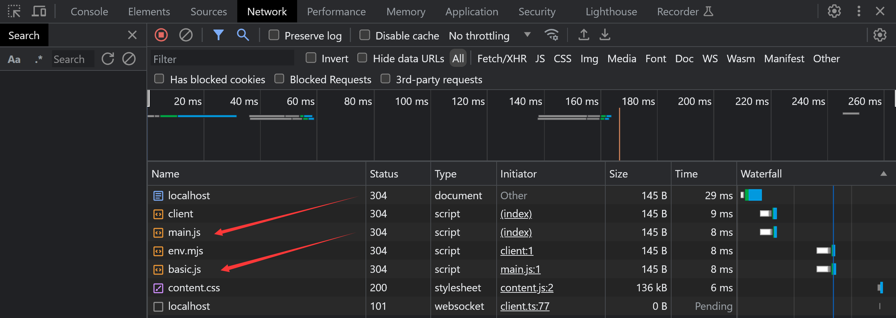

> 通过上图，可以看到`main.js`和`basic.js`是通过浏览器直接发请求获取的，并没有做相关的打包工作。

### 5、总结：Vite 开发环境下打包特点

- 开发环境下，Vite 并**没有对`源码`执行打包工作**，而是直接启动一个服务器加载当前根目录下的`index.html`文件（默认情况下，`index.html`文件为打包的入口文件）
- 然后利用浏览器支持 ES 模块化加载这一特点，直接加载`index.html`里面的 JS 文件，然后顺着依赖加载其它的 JS 文件。

### 6、生产环境下打包

执行以下命令，来完成生成环境下打包工作

```shell
npx vite build
```

命令执行后，会在当前目录下生成`dist`文件夹，`dist`目录结构如下：

```js
dist
├─ assets   // 打包后的资源放在assets目录下
│  └─ index-8e5222de.js   // main.js打包后生成的js文件
└─ index.html // 项目入口文件
```

> 可以看到，打包后，`main.js`及相关的依赖全部被打包生成了一个 JS 文件。

查看打包后的`index.html`文件，内容如下：

```html
<script type="module" crossorigin src="/assets/index-8e5222de.js"></script>
```

> 可以看到，打包后依然采用的是 ES 模块化来加载打包后生成的 JS 文件。

### 7、预览打包后项目

如果我直接在 VSCode 中打开`dist`目录下的`index.html`页面，在浏览器控制台会抛出以下错误

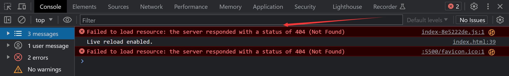

因为，打包后生成的`dist`目录，项目默认以 dist 目录作为项目的根目录，而我直接在 VSCode 打开`dist`目录下的`index.html`文件，是以`vite-demo`作为项目的根目录。

> 所以，我可以在`dist`目录下打开 VSCode，然后再用 VSCode 打开`index.html`文件，项目就可以正常跑起来。

不过 Vite 给我内置了以下命令，我执行以下命令，就相当以`dist`目录为项目根目录开启一个服务。

```shell
npx vite preview   # 预览打包后的项目
```

命令执行后，显示以下代码

```shell
➜  Local:   http://localhost:4173/
➜  Network: use --host to expose
```

在浏览器中打开 Local 字段后面对应的`http://localhost:4173/`地址，然后在浏览器的 Console 面板，可以看到以下输出结果。

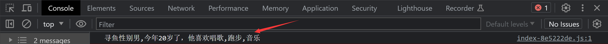

### 8、注意事项

如果入口文件`index.html`中有加载了多个 JS，则打包后也只会生成一个 JS 文件

```html
<!-- index.html -->
<script type="module" src="./main.js"></script>
<script type="module" src="index.js"></script>
<script type="module" src="a.js"></script>
```

生产环境下打包后，生成的`dist`目录结构和`index.html`文件如下

```js
dist
├─ assets
│  └─ index-453aba04.js
└─ index.html
<!--index.html-->
<script type="module" crossorigin src="/assets/index-453aba04.js"></script>
```

### 9、总结：Vite 开发环境下打包特点

- 在生产环境下，我可以执行`npx vite build`命令来完打包工作，执行`npx vite preview`命令来启动打包后的项目。
- 生产环境下也是以`index.html`作为入口文件来执行打包，会把入口文件中加载的 JS 及相关依赖打包成一个 JS 文件，然后在`index.html`文件中，采用 ES 模块化方式来加载打包后生成的 JS 文件。
- 如果`index.html`中通过模块化的方式加载了多个 JS，则最终都会打包到一个 JS 文件中

### 10、配置`scripts`命令脚本

我可以把 Vite 的以下三个常用命令

```shell
npx vite  # 启动开发服务
npx vite build # 执行生产环境打包
npx vite preview #预览生产环境打包后的项目
```

在`package.json`文件的`"scripts"`字段中配置，具体配置如下：

```json
"scripts": {
    "dev":"vite",
    "build":"vite build",
    "preview":"vite preview"
}
```

配置好后，我就可以通过执行以下命令，来完成 Vite 对应的工作。

```shell
npm run dev    # 启动开发服务
npm run build   # 执行生产环境打包
npm run preview  #预览生产环境打包后的项目
```

### 11、总结

本小节重点掌握以下内容：

- Vite 项目创建流程如下
- 开发环境与生产环境下打包特点

**Vite 项目创建流程如下**

- `npm init -y`初始化`package.json`文件，记录当前项目的相关信息
- 执行`npm i vite -D` 安装 Vite 到开发依赖(`-D`)
- 在当前项目根目录下创建`index.html`文件，作为项目打包的入口文件
- 执行以下命令启动开发服务或生产环境打包

```shell
npx vite  # 启动开发服务
npx vite build # 执行生产环境打包
npx vite preview #预览生产环境打包后的项目
```

- 也可以在`package.json`文件的`"scripts"`字段中添加如下配置

```json
"scripts": {
    "dev":"vite",
    "build":"vite build",
    "preview":"vite preview"
}
```

- 然后执行如下 npm 命令启动开发服务或生产环境打包

```shell
npm run dev    # 启动开发服务
npm run build   # 执行生产环境打包
npm run preview  # 预览生产环境打包后的项目
```

开发环境与生产环境下打包特点：

**①、开发环境**

- Vite 并**没有对`源码`执行打包工作**，而是直接启动一个服务器加载当前根目录下的`index.html`文件（默认情况下，`index.html`文件为打包的入口文件）
- 然后利用浏览器支持 ES 模块化加载这一特点，直接加载`index.html`里面的 JS 文件，然后顺着依赖加载其它的 JS 文件

**②、生产环境**

- 在生产环境下，我可以执行`npx vite build`命令来完打包工作，执行`npx vite preview`命令来启动打包后的项目。
- 生产环境下也是以`index.html`作为入口文件来执行打包，会把入口文件中加载的 JS 及相关依赖打包成一个 JS 文件，然后在`index.html`文件中，采用 ES 模块化方式来加载打包后生成的 JS 文件。
- 如果`index.html`中通过模块化的方式加载了多个 JS，则最终都会打包到一个 JS 文件中

## 四、Vite 的依赖预构建

当你在开发环境下首次启动 `vite` 时，Vite 在本地加载你的站点之前**预构建了项目依赖**，本质就是做了以下两件事：

- 针对依赖使用`esbuild`打包处理
- 针对打包后的依赖文件做缓存

> 详细查阅，[Vue 官方文档 - 依赖预构建(opens new window)](https://cn.vitejs.dev/guide/dep-pre-bundling.html#dependency-pre-bundling)

**你现在可能有以下 4 个疑问：**

- 何为依赖 ？
- 为什么依赖需要打包 ？
- 为什么采用`esbuild`来打包，而不是别的工具呢 ？
- 如何对依赖做缓存 ？

> 针对这 4 个问题，以下将给出明确答案

### 1、区分依赖与源码

Vite 通过在一开始将应用中的模块区分为 **依赖** 和 **源码** 两类，改进了开发服务器启动时间。

- **依赖模块：** 大多为在开发时不会变动的纯 JavaScript，这里通常指引用的第三方模块。
- **源码模块：** 通常指由我自己写的那部分代码，如自已写 CSS 样式、Vue 组件、JS 代码。

在开发环境下，Vite 并**不会**对**源码做打包工作**，但对于依赖（第三方模块）会做相关的打包工作。

> 通过前面学习，我知道源码不打包主要是为了更快的开发服务启动，那依赖为什么又要做打包处理呢 ？

### 2、依赖打包原因

依赖做打包处理主要有两个目的：

- 代码兼容性
- 更好的性能

### 2.1、代码兼容性

在开发阶段中，Vite 的开发服务器将所有代码视为原生 ES 模块，但以下两种情况，必须处理

- 针对开发中用到的第三方模块（依赖），采用如下 import 语法导入模块时，浏览器是不能识别的，如下：

```js
import axios from 'axios' // ES 模块   浏览器可不知道要到node_modules目录下去找axios
```

- 第三方模块所使用的模块系统不一定是 ES 模块的规范，可能是**CommonJS**或 **UMD** 等，Vite 必须先将以 CommonJS 或 UMD 形式提供的依赖项转换为 ES 模块。

```js
// node.js 导出模块
module.exports = {
  a: 1,
  b: 2,
}

// 导入模块
const obj = require('./b.js')
console.log(obj.a)
console.log(obj.b)
```

### 2.2、更好的性能

- 为了提高后续页面的加载性能，Vite 将那些具有许多内部模块的 ESM 依赖项转换为单个模块。
- 有些包将它们的 ES 模块构建为许多单独的文件，彼此导入。例如，`lodash-es` 有超过 300 个内置模块！当我执行 `import { debounce } from 'lodash-es'` 时，浏览器同时发出 300 多个 HTTP 请求！即使服务器能够轻松处理它们，但大量请求会导致浏览器端的网络拥塞，使页面加载变得明显缓慢。
- 通过将 `lodash-es` 预构建成单个模块，现在我只需要一个 HTTP 请求！

> `lodash-es`是使用 ES6 的模块语法编写的一个高性能的 JavaScript 实用工具库。

### 3、依赖打包：代码演示

- ①、创建项目目录结构

```markdown
vite-demo
├─ index.html
├─ index.js
└─ main.js
```

`vite-demo/index.html`文件内容如下：

```html
<script type="module" src="./main.js"></script>
```

`vite-demo/main.js`和`vite-demo/index.js`文件内容如下：

```js
// main.js内容
import { assign } from 'lodash-es'
import { username } from './index.js'

console.log(username)
console.log(assign({ a: 1 }, { b: 2 }, { c: 3 }))

// index.js内容
export const username = '寻鱼'
```

- ②、安装`lodash-es`包

```shell
npm i lodash-es  # 下载lodash-es包
```

查看`node_modules\lodash-es\lodash.js`文件，发现其内部通过`import`的方式引入了几百个其它模块

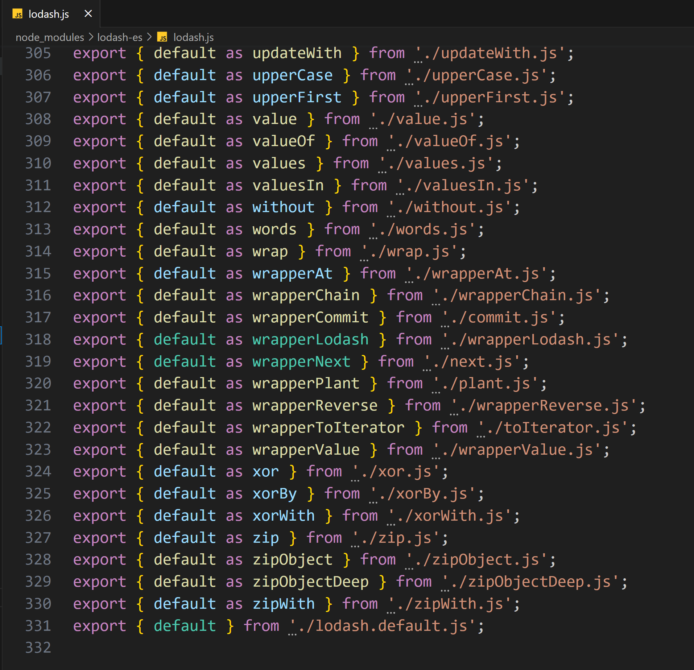

使用以下语句加载`lodash-es`时，本质加引入的就是`lodash.js`文件

```js
import { assign } from 'lodash-es'
```

如果不对`lodash.js`文件打包处理，那浏览器在加载时需要一次性发送几百个请求来获取。但实际上，最后`lodash.js`文件被打包成了一个文件。

- ③、执行以下命令，启动`Vite`开发服务

```shell
npx vite  # 启动Vite开发服务
```

接下来，在浏览器中打开服务地址，打开浏览器的 Console 面板，可以看到正确的输出了以下内容

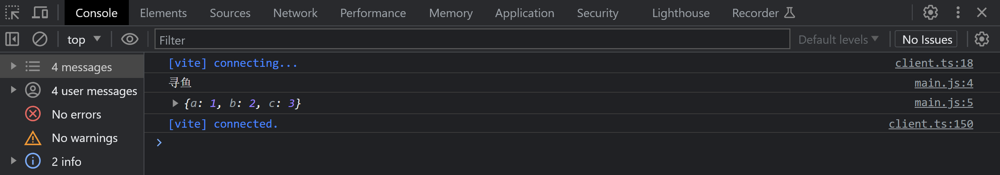

然后去找到 Network 面板下，看到如下内容


### 4、为什么采用 esbuild 依赖预构建

`esbuild` 使用 Go 编写，并且比以 JavaScript 编写的打包器（如：WebPack 和 Rollup）预构建依赖快 10-100 倍。所以 Vite 采用`esbuild`打包速度会非常快。

以下[是 esbuild 官方 (opens new window)](https://esbuild.github.io/)提供的一个关于几种不同打包工具的打包速度对比。


### 5、文件缓存与浏览器缓存

Vite 对打包后的依赖文件做了：**文件缓存**和**浏览器缓存**

### 5.1、文件缓存

- Vite 将预构建的依赖项缓存到 `node_modules/.vite` 中。也就是把依赖打包后生成的 JS 文件，保存在当前项目的`node_modules/.vite`目录下缓存起来。
- 在后续启动开发服务时，如果`node_modules/.vite`下能找到对应的缓存文件，则直接使用，不会再进行依赖预构建。
- 针对上面“依赖打包原因”中提到的案例，我发现打包后，在`node_modules/.vite`下多了`lodash-es.js`和`lodash-es.js.map`两个 JS 文件，本质就是将依赖打包后文件缓存下来

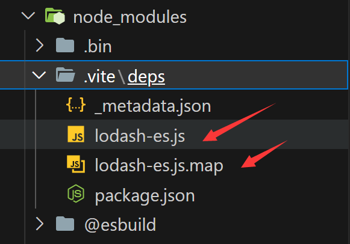

### 5.2、浏览器缓存

- 对于已预构建的依赖请求使用 HTTP 头 `max-age=31536000, immutable` 进行强缓存，以提高开发期间页面重新加载的性能。
- 一旦被缓存，这些请求将永远不会再次访问开发服务器，而是直接从缓存中读取。
- 针对上面“依赖打包原因”中提到的案例，我在浏览器的`Network`面板中可以看到，浏览器对`lodash.js`文件做了强缓存处理。


## 五、Vite 开发服务器启动快的原因

Vite 在开发环境下之所以能快速的启动服务，除了前面讲到的以下几个原因外

- Vite 以原生 ESM 方式提供源码（源码不打包），让浏览器接管了打包程序的部分工作
- 使用`esbuild` 预构建依赖和加快构建速度
- 对预构建的依赖做文件缓存与浏览器缓存

**还有以下 2 个重要的原因：**

- 启动应用时按需提供代码
- 内置了一套原生 ESM 的模块热替换（HMR）

### 1、启动应用时按需提供代码

为什么传统的打包工具在应用启动**很慢**，而 Vite 却可以做到**极快**的启动应用。

这就需要我了解传统工具在开发环境下的服务启动流程和 Vite 在开发环境下的服务启动流程。

### 1.1、传统工具打包的整个流程图

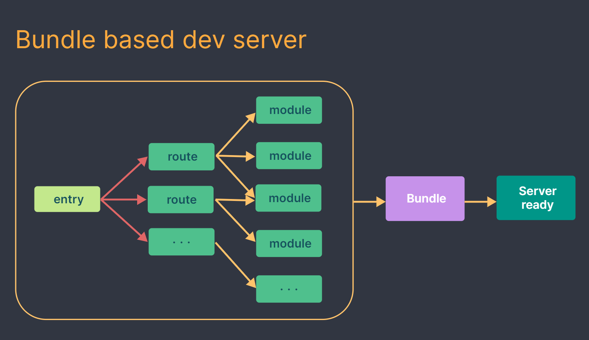

注：

这幅图清淅的描述了 Webpack 的整个打包过程，他是根据`entry`打包的入口点构建一个 **依赖图**，然后将你项目中所需的每一个模块打包成一个或多个模块，最后再启动服器。

如果项目比较大，打包所需要的时间就会很长，这就是为什么传统打包工具在启动服务时会非常慢的原因。

> 同时，因为项目都是基于打包器启动，重建整个包的效率很低，每次更新相当于做了一次打包工作。

### 1.2、Vite 构建项目时的，构建流程图

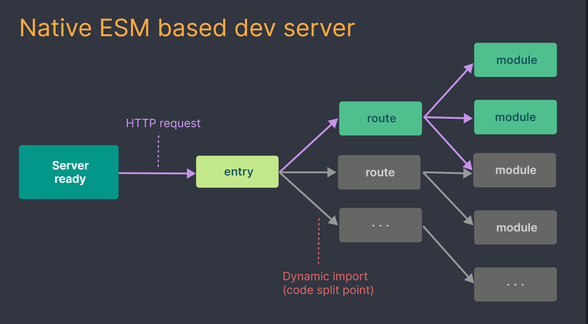

注：

Vite 在开发环境下构建项目时，先`esbuild`依赖预构建，然后启动服务器，加载`index.html`项目入口文件，根据访问的路由**按需加载对应的模块**，那些不在当前路由内的模块，并不会去加载。

### 2、模块热替换

Vite 提供了一套原生 ESM 的 HMR API。具有 HMR 功能的框架可以利用该 API 提供即时、准确的更新，而无需重新加载页面或清除应用程序状态。

当我使用 Vite 脚手架创建应用程序时，所选模板已经为你预先配置了这些

```shell
npm create vite@latest
```

### 3、总结：Vite 开发服务启动过程

在开发环境下采用 Vite 构建项目时

- 首先，Vite 在本地加载你的站点之前预构建了项目依赖（采用打包速度极快的`esbuild`完成依赖预构建）
- 其次，将依赖预构建的生成的模块保存在`node_modules\vite`目录下**缓存**起来
- 接着，开启一个开发服务器，用来加载当前项目，并且针对依赖预构建生成的模块做浏览器强缓存。

> 服务是基于原生 ES 模块，所以在开发环境下 Vite 并不会对**开发的源代码**进行打包工作，这部分工作交给了浏览器来处理。

- 在访问页面时，只根据访问的路由按需加载对应的模块，那些不在当前路由内的模块，并不会去加载。

通过以上优化，Vite 解决了传统打包工具存在缓慢的服务启和缓慢的更新问题两个问题

## 六、Vite 脚手架创建 Vite 项目

Vite 为了方便我创建 Vite 项目，给我提供了更快捷的方式，可以通过 Vite 脚手架创建 Vite 项目。

### 1、创建 Vite 项目

执行以下命令，就可以创建一个简单版的 Vite 项目

```shell
npm create vite@latest
```

执行命令后，会出现以下代码


这里，我以演示 JS 为主，选择第一个`Vanilla`进入后，再选择 JS 就可以了。（大家，也可以根据自己的需要来选择）

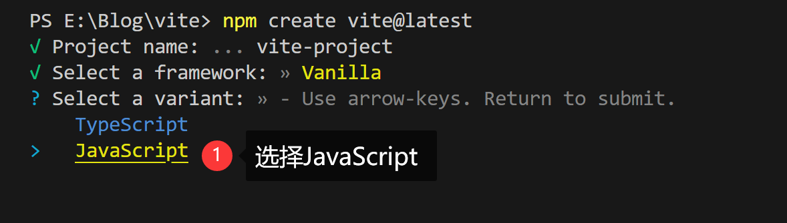

回车后，会出现以代码


注：

按顺序执行以上三个命令，就可以启动开发服务，因为：

- 新建的`vite-project`文件夹为项目的根目录，需要执行`cd vite-project`进入根目录下
- 其次，并没有安装项目相关的依赖包，需要在根目录下执行`npm install`安装`package.json`中提供的开发和生产依赖包。
- 最后，执行`npm run dev`启动开发服务。

查看下当前项目目录下的`package.json`文件，内容如下：

```json
 "scripts": {
    "dev": "vite",
    "build": "vite build",
    "preview": "vite preview"
  },
  "devDependencies": {
    "vite": "^4.3.0"
  }
```

> 所以，我可以通过`npm run dev`来启动开发服务

### 2、目录结构分析

以下是通过`npm create vite@latest`命令创建后，生成的目录结构。

```js
vite-project   //  项目目录（项目名称）
└─ ├─ counter.js
   ├─ index.html  // 项目打包的入口文件
   ├─ javascript.svg
   ├─ .gitignore  // git在提交时，忽略的文件
   ├─ main.js  // index.html文件用到的main.js文件
   ├─ package-lock.json
   ├─ package.json
   ├─ public  // 不会被起其它文件引用的资源放在这个目录
   │  └─ vite.svg  // 浏览网页时，出现在地址栏上方的小图奈
   └─ style.css
```

### 3、public 目录

如果你有下列这些资源，应当放在 public 目录下

- 不会被源码引用（例如 `robots.txt`）

  - > robots.txt 是一种位于网站根目录下的文本文件，其作用是告诉 Web 爬虫（如 Googlebot）哪些页面可以被爬取，哪些页面不能被爬取。这个文件可以包含特定搜索引擎的爬虫指令（如网站地图位置、爬虫访问频率等），也可以告诉爬虫哪些页面不能被访问，以保护网站的内容和隐私。

- 必须保持原有文件名（没有经过 hash，比如浏览器右上角显示公司 logo 的小图标）

- ... 或者你压根不想引入该资源，只是想得到其 URL

public 目录下的资源，在开发时能直接通过`/`根跟径访问，并且打包时会被完整复制到目标目录的根目录下（如：dist 目录）

> **注意：**`public` 中的资源不应该被 JavaScript 文件引用

### 4、代码演示

在上面目录结构的基础上，做以下调整

- 复制 2 张图片`a.jpg`和`b.jpg`到`vite-projec/public`目录下
- 加上 public 目录下原本的`vite.svg`图片，此时 public 目录下有三张图片。

- 修改`index.html`文件内容如下

```html
<!--index.html-->
<script type="module" src="/main.js"></script>
<!--加载图片，以/根路径访问a.jpg，就是在访问public文件中图片-->

```

- 修改`main.js`文件内容下

```js
// 导入图片  imgurl为转换后的图片地址
// 以 / 根路径访问b.jpg，就是在访问public文件中图片
import imgurl from '/b.jpg'
// 创建img实例
const img = new Image()
img.src = imgurl
// 将创建好的图片添加到页面
document.body.appendChild(img)
```

注：

实际开发`public`中的资源不应该被 JavaScript 文件引用，以上只是为了给大家演示，实际开发不建议这样使用。

### 4.1、启动开发服务

我执行`npm run dev`命令后，在浏览器中成功访问到了这两张图片。

图片访问地址：`http://localhost:5173/a.jpg` 和 `http://localhost:5173/b.jpg`

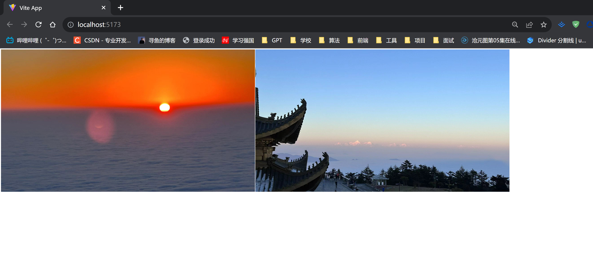

### 4.2、生产环境打包

- 执行`npm run build`命令后，`a.jpg`和`b.jpg`、`vite.svg`被原封不动的复制到了生成的`dist`根目录下。
- 不管里面的图片是否有被外界引用，都会直接复制到打包后的根目下，

> 如下：

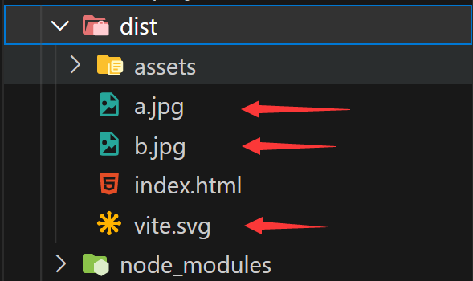

> 执行`npm run preview`时，可以在浏览器中成功访问到这两张图片

### 5、Vite 脚手架作用

**脚手架：** 帮我把开发项目时需要做的一些常规项给做了，而提高我的开发效率。如：

- 创建一个简单的项目示例
- 配置项目启动脚本命令
- 配置项目需要用到的开发与生产依赖包
- .....

### 6、总结

本小节重点掌握以下内容

- 如何利用 Vite 脚手架创建 Vite 项目
- 项目中的 public 目录的作用和注意事项
- 脚手架的作用

## 七、Vite 中使用插件

本小节我来学习在 Vite 中如何使用插件，利用插件处理 JS 兼容性问题和识别`.vue`结尾的文件。

### 1、JS 兼容型处理

Vite 在生产环境下打包时，默认是不会处理 JS 的兼容型问题，需要借助 Vite 的`@vitejs/plugin-legacy`插件来实现。

### 1.1、创建项目

- 执行`npm create vite@latest`命令，初始化一个 JS 项目
- 把创建好的项目中其它无关文件删除，最终项目目录结构如下

```text
vite-project
├─ index.html
├─ main.js
├─ package-lock.json
├─ package.json
└─ public
```

- `vite-project/index.html`文件内容如下：

```html
<script type="module" src="/main.js"></script>
```

- `vite-project/main.js`文件内容如下：

```js
// Firefox >= 34版本开始支持
console.log(Object.assign({ a: 1 }, { b: 2 }, { c: 3 }))
const a = 1

// Firefox >= 22版本开始支持
const fn = (a, b) => {
  console.log(`a+b的结果=${a + b}`)
}
fn(4, 5)
// Firefox >= 29 版本开始支持
new Promise((resolve, rejcet) => {
  resolve('成功')
}).then((data) => {
  console.log(data)
})
```

- 执行`npm run build` 开始打包，`main.js`被打包后生成的对应文件如下：

```js
;(function () {
  const o = document.createElement('link').relList
  if (o && o.supports && o.supports('modulepreload')) return
  for (const e of document.querySelectorAll('link[rel="modulepreload"]')) n(e)
  new MutationObserver((e) => {
    for (const t of e)
      if (t.type === 'childList')
        for (const s of t.addedNodes) s.tagName === 'LINK' && s.rel === 'modulepreload' && n(s)
  }).observe(document, { childList: !0, subtree: !0 })
  function c(e) {
    const t = {}
    return (
      e.integrity && (t.integrity = e.integrity),
      e.referrerPolicy && (t.referrerPolicy = e.referrerPolicy),
      e.crossOrigin === 'use-credentials'
        ? (t.credentials = 'include')
        : e.crossOrigin === 'anonymous'
        ? (t.credentials = 'omit')
        : (t.credentials = 'same-origin'),
      t
    )
  }
  function n(e) {
    if (e.ep) return
    e.ep = !0
    const t = c(e)
    fetch(e.href, t)
  }
})()
console.log(Object.assign({ a: 1 }, { b: 2 }, { c: 3 }))
const i = (r, o) => {
  console.log(`a+b的结果=${r + o}`)
}
i(4, 5)
new Promise((r, o) => {
  r('成功')
}).then((r) => {
  console.log(r)
})
```

注：

观察打包后的文件，发现并没有对**箭头函数**、**Promise**、**Object.assign**进行对应的兼容转换。

所以，转换后的代码在低版一的浏览器就会抛出错误，需要借助`@vitejs/plugin-legacy`插件来实现 JS 兼容问题。

### 1.2、安装插件

TIP

执行以下命名，安装`@vitejs/plugin-legacy`插件 ，[点击查看插件详细教程(opens new window)](https://github.com/vitejs/vite/tree/main/packages/plugin-legacy)

```shell
npm i -D @vitejs/plugin-legacy
npm i -D terser  #必须安装Terser，因为 @vitejs/plugin-legacy插件使用Terser进行压缩JS代码
```

插件安装成功后，我需要在 Vite 的配置文件中来配置插件，这样才能在打包时找到对应的插件做相关工作

### 1.3、配置插件

- 在根目录下，新建`vite.config.js`文件，此文件为 Vite 的配置文件。
- 配置文件采用 ES 模块语法，对外导出一个对象。

```js
// vite.config.js
export default {}
```

- 通过`import`语法导入插件，并在配置文件导出对象的`plugins`选项中配置插件。

```js
import legacy from '@vitejs/plugin-legacy'
export default {
  // 插件配置选项，plugins的值是一个数组，其中的第一项代表一个插件
  plugins: [
    // 配置legacy插件
    legacy({
      // 指定转码后的代码需要兼容那些版本的浏览器,
      // 与webpack中`@babel/preset-env`预设中设置了`targets`参数的含义一样
      targets: 'Firefox > 23',
    }),
  ],
}
```

> 兼容浏览器版配置，[查阅浏览器配置(opens new window)](https://github.com/browserslist/browserslist#queries)

### 1.3、生产打包

- 执行`npm run build`完成生产环境下的打包，最后在生成的`dist/assets`目录下生成了三个 JS 文件，如下图

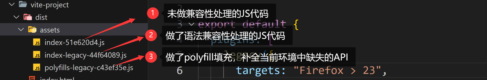

- 查看打包后生成的`index.html`文件，

  发现新增了一些脚本，这些脚本根据浏览器的支持程度来动态的引入正常版本文件还是带有 legacy 字样的遗留版本文件。

  当项目运行在一些版本较低的浏览器时，插件添加的脚本会自动加载 legacy 版本的文件。

- 执行`npm run preview`来查看打包后的项目。

### 1.4、Chorme 浏览器访问项目

TIP

当我在最新的`Chorme`浏览器中访问项目时，控制台正确输出如下结果，并且当前项目只会加载打包生成的`index-51e620d4.js`文件。


### 1.5、firefox 32 版浏览器访问项目

当我在`firefox 32`版的浏览器中访问项目时，控制台正确输出，但网络请求加载了 3 个 JS 件

### 2、配置文件智能提示功能

可以使用 `defineConfig` 工具函数来为配置添中智能提示功能，具体写法如下

```js
import { defineConfig } from 'vite'

export default defineConfig({
  // ...
})
```

刚才的`@vitejs/plugin-legacy`插件也可以写成如下配置，在书写过程中，会有相关提示

```js
import legacy from '@vitejs/plugin-legacy'
import { defineConfig } from 'vite'
export default defineConfig({
  plugins: [
    legacy({
      targets: 'Firefox > 23',
    }),
  ],
})
```

> 关于其它相关配置，也可以让配置有智能提示，[查阅 Vite 官方- 配置智能提示(opens new window)](https://cn.vitejs.dev/config/#config-intellisense)

### 3、支持.Vue 结尾的文件

Vue 的单文件组件都是写在以`.vue`结尾的文件，但是 Vite 默认是不支持`.vue`的文件的。

需要通过第三方的`@vitejs/plugin-vue`插件实现。

### 3.1、创建项目

按以下步骤，创建项目，最终创建好项目目录结构

```text
# 项目目录结构
vite-vue
├─ App.vue
├─ index.html
├─ main.js
├─ package-lock.json
├─ package.json
└─ vite.config.js
```

- 执行`npm init -y` 初始`package.json`文件
- 执行`npm i vite -D` 安装 vite
- 新建 vite 的配置文件`vite.config.js`
- 新建`vite-vue/index.html` 项目入口文件

```html
<div id="app"></div>
<script type="module" src="./main.js"></script>
```

- 新建`vite-vue/main.js` 创建 vue 实例

```js
// 导入vue中的createApp方法，记得要安装vue包，不过后面安装@vitejs/plugin-vue 插件时，会自动下载最新的vue包，所以不需要单独安装
import { createApp } from 'vue'
// 导入App.vue组件
import App from './App.vue'
// 创建应用实例，并挂载到#app容器内
createApp(App).mount('#app')
```

- 新建`vite-vue/App.vue` 创建根组件

```vue
<script>
export default {
  data() {
    return {
      message: 'Hello Vue 组件', // 响应式数据
    }
  },
}
</script>

<template>
  <!--插值语法，绑定数据-->
  <div class="box">{{ message }}</div>
</template>

<style>
.box {
  background-color: skyblue;
  font-size: 30px;
}
</style>
```

### 3.2、安装插件 @vitejs/plugin-vue

Vite 在构建项目时，本身是无法识别`.vue`的文件，所以执行`npx vite`来启动项目时，会出现如错误


> 所以，我需要安装`@vitejs/plugin-vue`插件识别处理 `.vue` 文件

- 首先：执行以下命令，安装`@vitejs/plugin-vue`插件包

```shell
npm i -D @vitejs/plugin-vue
```

- 然后：在`vite.config.js`配置文件中，配置对应的插件，如下

```js
// 导入包
import vue from '@vitejs/plugin-vue'

import { defineConfig } from 'vite'
export default defineConfig({
  // 配置vue插件。
  plugins: [vue()],
})
```

- 最后：执行`npx vite` 或`npm run dev` 命令就可以成功启动项目
- 浏览器中打开项目地址，最终显示如下效果

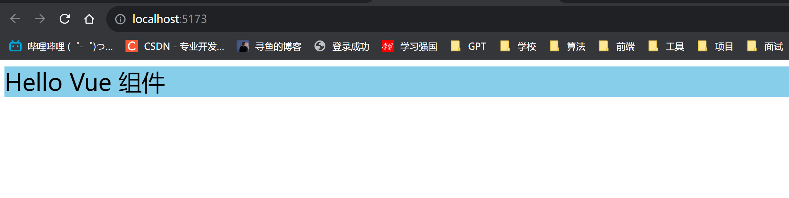

- 执行`npm run build`也可以正常完成生产环境下打包。

### 4、Vite 脚手架初始 Vue 项目

如果我需要开发 Vue 项目，我可以直接通过执行`npm create vite@latest`命令，在命令执行过程，我选择支持的框架为 Vue。

> 如下：


然后，再选择对应的`javascript或TypeScript`

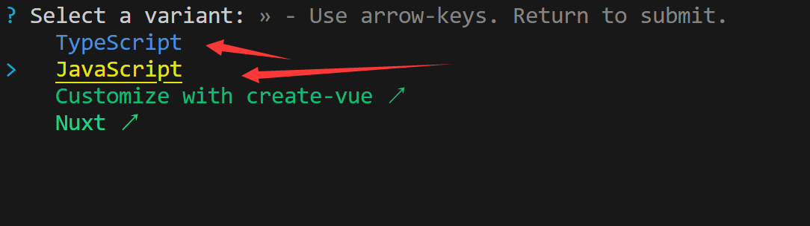

最后，根据以下提示，进入项目根目录，下载开发与生产依赖，启动开发服务

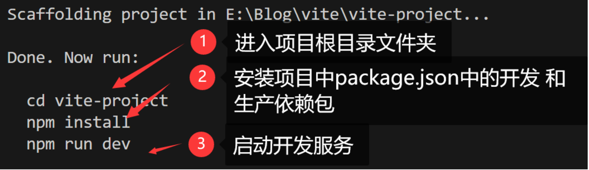

按以上步骤操作后，最终搭建一个简单的 Vue 项目，项目结构如下：


总结

Vite 脚手架创建 vue 项目时，脚手架帮我做了以下几件事

- 初始化一个简单的 vue 项目
- 在`package.json`中配置启动 vue 项目用到的脚本命令
- 在`package.json`中配置了项目需要用到的开发和生产依赖包（如：vite、vue、@vitejs/plugin-vue），我只需要执行`npm i`就可以一键安装
- 在`vite.config.js`中配置好使用的`@vitejs/plugin-vue`插件

### 5、总结

本小节重点掌握以下内容

- JS 兼容型处理
- `.vue`结尾文件处理
- vite 脚手架创建 vue 项目

## 八、Vite 静态资源处理

Vite 作为一个开箱即用的前端构建工具，默认支持 JS、CSS、Sass、Less、JSON、图片、HTML 等静态资源的处理。

但有些情况下还是需要做额外的配置，我挑了一些比较常用的功能来做讲解：

- CSS 的默认处理行为
- CSS 模块化处理
- CSS 预处理器
- CSS 兼容性处理
- 限定大小的图片转为 Base64 编码
- JSON 的导入
- JSON 支持具名导入

### 1、CSS 的默认处理行为

css 文件中通过`@import` 导入的其它 CSS，能自动识别，被打包到当前 CSS 中。

**开发环境下**

- JS 文件中以`import`导入的`.css`文件内容最终处理后，会插入到`index.html`文件的`<style>`标签中，同时自带 HMR 支持。
- 对于`<link>`标签引入的 CSS 不做处理。

**生产环境下**

- 通过`<link>`标签引入的 CSS 和`import`导入的 CSS 打包到一个 CSS 文件中，输出在项目的`dist/assets`目录下。

### 1.1、创建项目

项目目录结构如下

```text
vite
├─ basic.css
├─ index.css
├─ index.html
├─ link.css
├─ main.js
├─ package-lock.json
├─ package.json
```

- `vite/index.html`文件内容

```html
<!--
    link标签引入的CSS
    	开发环境下不做处理
    	生产环境下与JS中通过import导入的css最终打包到一个CSS文件中
-->
<link rel="stylesheet" href="./link.css" />

<div class="box">box</div>

<script type="module" src="./main.js"></script>
```

- `main.js`内容

```js
/**
 * import 导入的CSS
 * 开发环境下打包到index.html文件的<style>标签中，并带有HRM模块热更新
 * 生产环境下与 其它CSS打包到一个CSS文件中
 */
import './index.css'
```

- `basic.css` 、`index.css`、`link.css` 内容如下

```css
/* index.css */
@import url('./basic.css');

.box {
  width: 100px;
  height: 100px;
  background-color: blue;
}

/* baisc.css */
.box {
  border: 10px solid yellow;
}

/* link.css */
.box {
  font-size: 30px;
}
```

### 1.2、启动开发服务

> 执行`npx vite`启动开发服务，在浏览器查看 Elements 选项，如下：

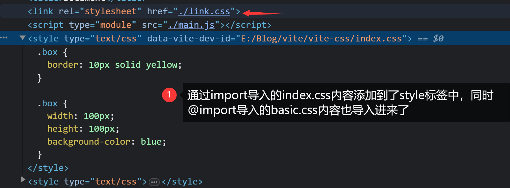

注：

观察上图，我可以看到

- `<link>`标签引入的 CSS 并没有做处理
- JS 文件中以`import`导入的`.css`文件及内部通过`@import`导入的 CSS 都被打包到一起，最终插入到`index.html`文件的`<style>`标签中。
- 打包后的 CSS，以持 HMR 模块热更新。如果修改任意一个 css 文件中样多，当保存时，页面也会动态更新，这就是启用了 HRM 功能。

### 1.3、生产打包

执行以下命令，对项目生产环境打包

```shell
npx vite build
```

打包后，在`dist/assets`目录只生成了一个 css 文件，内容如下

```css
.box {
  font-size: 30px;
}
.box {
  border: 10px solid yellow;
}
.box {
  width: 100px;
  height: 100px;
  background-color: #00f;
}
```

> 可以看到，三个 css 文件中的内容，都打包到一个 css 文件了。

### 2、CSS 模块化处理

- Vite 允许我对 CSS 进行模块化处理，也就对 CSS 类名和选择器的作用域进行限定的一种方式。
- Vite 会把任何以`.module.css`为的缀名的 CSS 文件看成一个模块，并采用 CSS module 的方式来处理。

### 2.1、创建项目

项目目录结构如下

```text
vite
├─ index.html
├─ basic.js
├─ basic.module.css
├─ index.js
├─ index.module.css
├─ package-lock.json
└─ package.json
```

- `vite/index.module.css`和`vite/basic.module.css`文件内容如下：

```css
/* vite/index.module.css */
.box {
  width: 100px;
  height: 100px;
  background-color: red;
}
.item {
  font-size: 20px;
}

/* vite/basic.module.css */
.box {
  width: 100px;
  height: 100px;
  background-color: blue;
}
.wrap {
  font-size: 30px;
}
```

- `vite/index.js`文件内容如下：

```js
// 模块化加载 css
import indexModule from './index.module.css'
// indexModule 为一个 JS 对象如：{box: '_box_m554n_1'}
console.log(indexModule)
// 创建 div元素
const div = document.createElement('div')
// 为div添加className,相当于div.className="_box_m554n_1"
div.className = indexModule.box
// 将div插入到页面
document.body.appendChild(div)
```

- `vite/basic.js` 文件内容如下：

```js
// 模块化加载 css
import basicModule from './basic.module.css'
//basicModule 一个JS对象如：{box: '_box_vp3a0_1'}
console.log(basicModule)
// 创建 div元素
const div = document.createElement('div')
// 相当于div.className="_box_vp3a0_1"
div.className = basicModule.box
// 创建 div元素
document.body.appendChild(div)
```

`vite/index.html`文件内容如下：

```html
<div class="box">box</div>
<script type="module" src="./index.js"></script>
<script type="module" src="./basic.js"></script>
```

### 2.2、启动开发服务

TIP

执行`npx vite`启动开发服务，在浏览器中打开。

> 最终显示如下效果

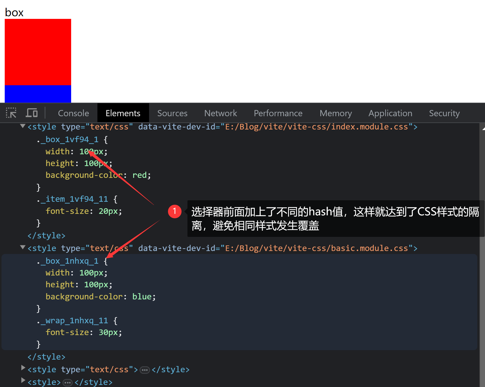

注：

观察以上截图，我可以看到，最终`index.module.css`和`basic.module.css`文件中的 CSS 选择器上都加上了一串 hash 值，用来表示当前选择器的唯一性，这样就避免了相同的样式发生覆盖

**生产环境下打包**，最终所有 CSS 样式会打包成一个 CSS 文件，内容如下

```css
._box_1vf94_1 {
  width: 100px;
  height: 100px;
  background-color: red;
}
._item_1vf94_11 {
  font-size: 20px;
}
._box_1nhxq_1 {
  width: 100px;
  height: 100px;
  background-color: #00f;
}
._wrap_1nhxq_11 {
  font-size: 30px;
}
```

温馨提示

Vue 的单文件组件中，只需要在`<style>`标签上写上`scoped`，Vite 就会自动把 Syle 标签中的样式当成模块处理。

```vue
<script></script>
<template></template>
<style scoped>
.box {
}
</style>
```

### 3、CSS 预处理器

Vite 默认是支持`.scss`、`.sass`、`.less`、`.stylus`结尾的文件，但必需要安装相应的预处理器依赖。

- `.scss` 和 `.sass` 对应的预处理器依赖包为 sass
- `.less` 对应的的预处理器依赖包为 less 包
- `.stylus` 对应的的预处理器依赖包为 stylus 包

项目目录结构如下：

```text
vite
├─ index.html
├─ index.scss
├─ package-lock.json
└─ package.json
```

- `vite/index.html`文件内容

```html
<link rel="stylesheet" href="./index.scss" />
<div class="box">
  <p>box h3</p>
</div>
```

- `vite/index.scss`文件内容

```css
.box {
  p {
    background-color: skyblue;
    font-size: 30px;
  }
}
```

- 执行以下命令，安装预处理器依赖的 sass 包

```shell
npm i sass -D
```

执行`npx vite`命令，在浏览器查看对的效果，并观察控 NetWork 面板，如下


`npx vite build`命令后，在`dist/assets`目录下生成了对应的 css 文件，内容如下：

```css
.box p {
  background-color: #87ceeb;
  font-size: 30px;
}
```

### 4、CSS 兼容性处理

如果我想要 CSS 能兼容不同的浏览器，那我就需要为相关的 CSS 属性添加兼容性前缀。我自己去书写每个 CSS 前缀太麻烦了，所以我可以利用 PostCSS 来帮我处理。

- Vite 内置了 PostCSS，我只需要安装相关的 PostCSS 插件，并做好相关的 PostCSS 配置就可以了。
- [autoprefixer 插件 (opens new window)](https://github.com/postcss/autoprefixer)，是专门用来处理 CSS 兼容性的插件。我只需要安装这个插件，并配置好就可以。

**代码演示**

在上面项目的基础上，修改`vite/index.scss`文件内容如下

```scss
.box {
  display: flex;
  width: 100px;
  height: 100px;
  background-color: red;

  p {
    background-color: skyblue;
    font-size: 30px;
  }
}
```

执行以下命令，安装`autoprefixer`插件

```shell
npm i autoprefixer@10.4.14 --save-dev
```

在`vite.config.js`文件的`css.postcss`选项中来配置这个插件

```js
// 导入插件
import autoprefixer from 'autoprefixer'

export default {
  css: {
    postcss: {
      // 配置postcss插件
      plugins: [
        autoprefixer({
          // 指定兼容 99.5%的浏览器。
          browsers: ['cover 99.5%'],
        }),
      ],
    },
  },
}
```

> 执行`npx vite`启动开发服务，在浏览器中看到如下效果，最终 css 中的 display 属性值被加上了浏览器兼容型前缀


> 执行`npx vite build`，在`dist/assets`目录输出了对应的 css 文件内容下，css 代码添加了浏览器兼容性前缀处理。

```css
.box {
  display: -webkit-box;
  display: -webkit-flex;
  display: -moz-box;
  display: -ms-flexbox;
  display: flex;
  width: 100px;
  height: 100px;
  background-color: red;
}
```

> 为了与 JS 保持相同的浏览器兼容处理，最好把对浏览器支持的 browsers 配置，从 postcss 的插件配置中去掉，改写在`package.json`的`browserslist`字段中配置，如下：

```json
{
  "devDependencies": {},
  "browserslist": ["cover 99.5%"]
}
```

### 5、图片转为 base64 编码

如果想要在生产环境下打包时，针对一定大小的图片转成 Base64 编码，只需要在`vite.config.js`中添加如下配置即可

```js
import { defineConfig } from 'vite'

export default defineConfig({
  build: {
    // 10kb以下，转Base64
    assetsInlineLimit: 1024 * 10,
  },
})
```

**代码演示**

- `index.html`文件内容

```html
<!--以下图片为15kb大小-->

<!-- 以下图片大小为9kb-->

```

- 配置文件内容同上，然后执行`npx vite build`打包，在`dist/assets`目录下只生成了`app-8cce9ece.jpg`这一个图片。
- 查看打包后生成的`index.html`文件，发现`logo.png`被转成了`Base64`编码。
- 浏览器中查看效果如下：


### 6、JSON 文件处理

JSON 可以被直接导入 —— 同样支持具名导入

- 新建`index.js` 文件内容如下

```js
// 导入整个JSON，最终json为JSON对象
import json from './data.json'
console.log(json)

//  对一个根字段使用具名导入 —— 有效帮助 treeshaking！
import { data } from './data.json'
console.log(data)
```

- 新建`data.json`文件，内容如下

```json
{
  "code": "0000",
  "data": [
    {
      "category_id": 1001,
      "title": "人气 TOP"
    },
    {
      "category_id": 1002,
      "title": "爆款套餐"
    },
    {
      "category_id": 1003,
      "title": "咖啡"
    },
    {
      "category_id": 1004,
      "title": "奶茶"
    },
    {
      "category_id": 1005,
      "title": "甜品小点"
    }
  ],
  "message": "成功"
}
```

- 新建 `index.html`内容如下

```html
<script type="module" src="./index.js"></script>
```

- 执行`npx vite`启动应用，在浏览器中打开服务，`Console`面板输出入下内容

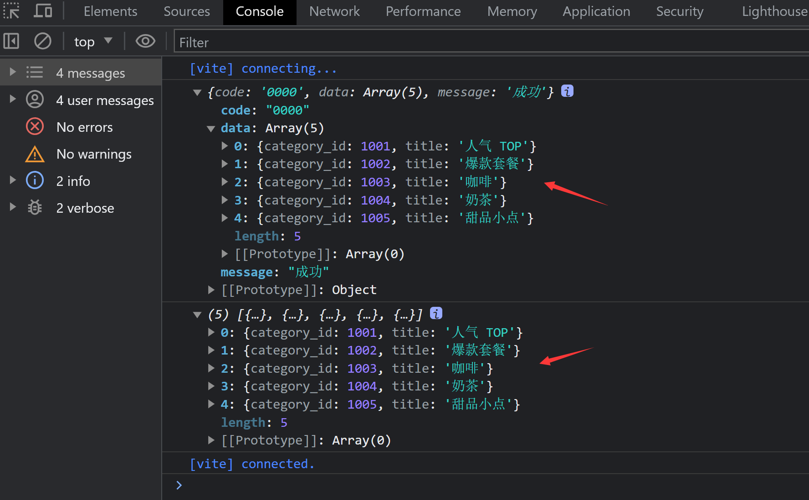

## 九、Vite 常规配置

在 Vite 的常规配置中，我会讲到以下几个方面的配置

- Vite 开发服务器配置
- Vite 代理服务配置
- Vite 中如何配置别名路径
- Vite 中如何配置多入口，进行多页面开发
- Vite 中如何配置打包后资源分类存放到对应文件夹

### 1、Vite 开发服务器配置

当我执行`npx vite`或`npx run vite`命令时，会启动一个开发服务。Vite 提供了相关的配置允许更改服务的主机，端口等。

通过修改`vite.config.js`文件导出对象的`server`选项中来配置。

> 具体如下：

```js
import { defineConfig } from 'vite'

export default defineConfig({
  server: {
    port: 8880, // 自定义端口，默认为5173
    open: true, // 服务启动后，自动在浏览器中打开，默认是不打开的
    hmr: true, // 为开发服务启用热更新，默认是不启用热更新的
  },
})
```

> 更多配置：[查阅 Vite 官方文档 - 开发服务选项配置(opens new window)](https://cn.vitejs.dev/config/server-options.html)

**代码演示**

- 新建`index.html`文件，内容如下

```html
<script type="module" src="./index.js"></script>
```

- 新建`index.js`文件，内容如下：

```js
console.log('Hello Vite')
```

- 在根目下，新建`vite.config.js`文件，内容同上。

注：

最后，我执行`npx vite`来启动服务，会自动在浏览器打开`"http://127.0.0.1:8880"`地址访问服务。

接下来，我把`index.js`中的内容改为`console.log("Hello HMR")`同时保存，发现浏览器控台输出内容自动更新为`“Hello HMR"`（本质是启用了热更新）

### 2、Vite 代理服务配置

当我在项目中利用`Ajax`向服务端发请求时，会遇到跨域的限制。

为了能让请求成功，我通常会在请求和真实服务之间架设一个代理服务。代理服务再向真实服务器发请求拿到数据并返回给到客户端。


> Vite 允许我为开发服务配置自定义代理规则，我只需要在`server.proxy`选项下进行相关配置就可。

**server.proxy 配置**

```js
import { defineConfig } from 'vite'

export default defineConfig({
    server:{
        proxy:{
            // /api是字符串 http://localhost:5173/api 的简写法
            // 以下表示，当我向 http://localhost:5173/api地址及下级路径发请求时，帮我转发到`http://127.0.0.1:8990/api`地址及对应的下级路径发请求
            // hhttp://localhost:5173/api --> http://127.0.0.1:8990/api
            // http://localhost:5173/api/menu --> http://127.0.0.1:8990/api/menu
            "/api":"http://127.0.0.1:8990/api
            //
        }
    }

})
```

### 2.1、代码演示 -（项目结构）

我利用`node`来搭建两个请求数据的服务

- `http://127.0.0.1:8990/api/menu` 获取菜单数据
- `http://127.0.0.1:8990/api/course` 获取课程数据

然后在 Vite 项目中，利用`axios`向上面两个地址发送请求来获取数据。

因为受到跨域限制，所以我需要设置开发服务的代理服务，利用代理服务帮帮我拿到数据并转发给我。

**整体项目目录结构如下**

```js
vite
├─ data   // JSON数据，node服务会读取JSON文件中内容，然后返回给客户端
│  ├─ blog.json
│  └─ menu.json
├─ index.html  // Vite 项目的入口文件
├─ index.js  // 文件中会利用axios向服务端发请求获取数据
├─ node-api.js  // 搭建node服务，返回JSON数据
├─ package-lock.json
├─ package.json
└─ vite.config.js  // 配置文件
```

### 2.2、代码演示 - 搭建 node 服务

- `node-api.js`文件内容如下 ：

```js
const http = require('http') // 加载http模块,用来创建http服务
const fs = require('fs') // 加载fs模块，用来操作文件

// 创建http服务，req请求对象   res响应对象
http
  .createServer((req, res) => {
    // 获取请求地址主机端口后地址
    const url = req.url
    // 设置响应头，响应的数据类型
    res.writeHead(200, {
      'Content-Type': 'application/json',
    })

    // 请求地址拦截
    if (url === '/api/menu') {
      // 读取JSON文件中数据，并响应到客户端
      const data = fs.readFileSync('./data/menu.json', 'utf-8')
      res.end(data)
    } else if (url === '/api/blog') {
      const data = fs.readFileSync('./data/blog.json', 'utf-8')
      res.end(data)
    } else {
      res.end('Hello Node')
    }
  })
  .listen('8990') // 设置端口号

// 服务器正常启动，打印下面这句话作为提示
console.log('Server running at http://127.0.0.1:8990')
```

- data 文件夹中`blog.json`和`menu.json`文件，内容如下

```json
{
    "code": "0000",
    "data": [
      {
        "blogName": "vite下一代的前端工具链",
        "imageUrl": "https://img-blog.csdnimg.cn/8441a1c7b63b4e60abebafecea16e16a.png",
        "desc": "CSS 的默认处理行为CSS 模块化处理CSS 预处理器CSS 兼容性处理限定大小的图片转为 Base64 编码JSON 的导入JSON 支持具名导入"
      },
      {
        "blogName": "Vite静态资源处理",
        "imageUrl": "https://img-blog.csdnimg.cn/8441a1c7b63b4e60abebafecea16e16a.png",
        "desc": "Vite（法语意为 “快速的”，发音 /vit/，发音同 “veet”）是一种新型前端构建工具，能够显著提升前端开发体验，其最大的特点就是快 ！"
      }
    ],
    "message": "成功"
  }
{
  "code": "0000",
  "data": [
    {
      "category_id": 1001,
      "title": "人气 TOP"
    },
    {
      "category_id": 1002,
      "title": "爆款套餐"
    },
    {
      "category_id": 1003,
      "title": "咖啡"
    },
    {
      "category_id": 1004,
      "title": "奶茶"
    },
    {
      "category_id": 1005,
      "title": "甜品小点"
    }
  ],
  "message": "成功"
}
```

注：

以上文件创建好后，只需要 Vite 目录执行`node node-api.js`就可以启动`node`服务。

访问`http://127.0.0.1:8990/api/menu `和`http://127.0.0.1:8990/api/blog` 地址，可以查看到返回的 JSON 字符串。

> 如下：


### 2.3、代码演示 - 搭建 Vite 项目

- `index.html`文件内容如下

```html
<script type="module" src="./index.js"></script>
```

- `index.js`文件内容如下

```js
import axios from 'axios'
// 向 http://localhost:5173/api/menu 发请求,因为设置了代理，代理转发向http://127.0.0.1:8990/api/menu 发请求
axios.get('/api/menu').then((res) => {
  console.log(res.data.data)
})

// 向 http://localhost:5173/api/course 发请求 因为设置了代理，代理转发向http://127.0.0.1:8990/api/course 发请求
axios.get('/api/course').then((res) => {
  console.log(res.data)
})
```

- `vite.config.js`配置文件内如下

```js
import { defineConfig } from 'vite'

export default defineConfig({
  server: {
    proxy: {
      '/api': 'http://127.0.0.1:8990',
    },
  },
})
```

注：

最后执行`npx vite`启动开发服务，访问`http://localhost:5173/`地址，可以看到控制台正常打印了请求到的内容。

如果我把配置文件中内容去掉，就会出现报错。

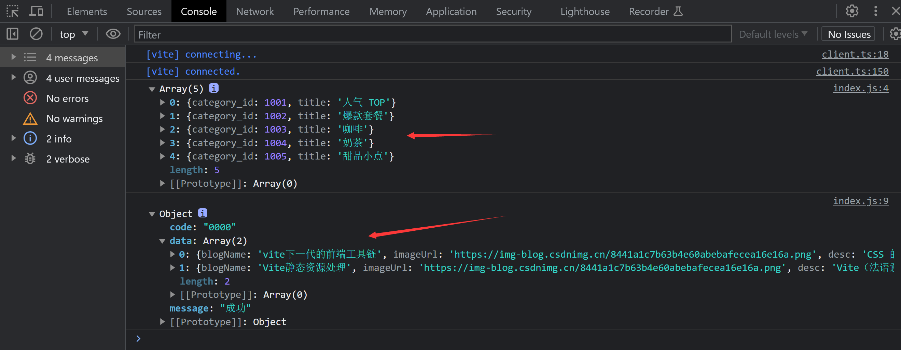

### 3、Vite 中如何配置别名路径

- 当我在访问静态资源时，如果书写的路径非常长，那每次书写时就会非常麻烦。
- 如果能把相同部分的路径用别名代替，那我在书写路径时只需要书写别名+不同的路径部分就好了。

> 我可以在`vite`的配置文件中， 为文件系统路径配置别名，如下：

```js
import { defineConfig } from 'vite'
export default defineConfig({
    resolve:{
        alias:{
            /*
            	@js 为 路径 /src/assets/js 的别名
            	导入JS：  import { username }  from "/src/assets/js/basic.js"
            	可简写成： import { username } from "@js/basic.js"
            */
          "@js":"/src/assets/js",
    }

})
```

注意事项

- 当使用文件系统路径的别名时，请始终使用绝对路径，相对路径的别名值会原封不动地被使用，因此无法被正常解析。
- 在`index.html`项目入口文件中不要使用别名加载文件，因为启动开发服务并不会对源码

### 3.2、代码演示：为路径配置别名

- 新建项目目录结构如下：

```text
vite
├─ index.html
├─ package-lock.json
├─ package.json
├─ src
│  └─ assets
│     ├─ css
│     │  └─ index.css
│     ├─ images
│     │  └─ a.jpg
│     └─ js
│        ├─ basic.js
│        └─ index.js
└─ vite.config.js
```

- `index.html`文件内容如下：

```html
<script type="module" src="/src/assets/js/index.js"></script>
```

> 在`index.html`文件加载的 JS 和 CSS，不要使用别名，因为在开发服务下，并不会去解析别名，所以会出现找不到资源的 404 错误。

- `css/index.css`内容如下:

```css
body {
  background-color: skyblue;
}
```

- `js/index.js`与`js/basic.js`内容如下:

```js
// js/index.js
import '@css/index.css'
import url from '@images/a.jpg'
import { username } from '@js/basic.js'

document.body.innerHTML = ` ---- ${username}`

// js/basic.js
export const username = '艾编程'
```

- `vite.config.js`文件内容如下

```js
import { defineConfig } from 'vite'
export default defineConfig({
    resolve:{
        alias:{
          "@images":"/src/assets/images",
          "@js":"/src/assets/js",
          "@css":"/src/assets/css",
        }
    }

})


// 或下面写法
import { defineConfig } from 'vite'
import { resolve } from 'path';
export default defineConfig({
    resolve:{
        alias:{
          "@images":resolve(__dirname,"src/assets/images"),
          "@js":resolve(__dirname,"src/assets/js"),
          "@css":resolve(__dirname,"src/assets/css"),
        }
    }

})
```

> 最后，执行`npx vite`，在浏览器中可以访问到如下效果，说明配置生效了。


### 4、vite 中如何配置多入口，进行多页面开发

- Vite 在开发环境下默认是多入口开发的
- 在生产环境下，如果想要多入口开发，需要额外的配置。
- Vite 在生产环境下是利用`rollup`来实现打包，所以我需要对`rollup`的打包入口进行配置。

生产环境下多入口打包配置如下

```js
import { defineConfig } from 'vite'
import { resolve } from 'path'
export default defineConfig({
  // 生产环境下打包配置在build选项中配置
  build: {
    // rollup 相关配置在rollupOptions选项中配置
    rollupOptions: {
      // 打包入口，以下是多入口
      input: {
        index: resolve(__dirname, 'index.html'),
        app: resolve(__dirname, 'app.html'),
      },
    },
  },
})
```

**代码演示**

- 新建项目录如下

```text
vite
├─ app.html
├─ index.html
├─ package-lock.json
├─ package.json
├─ src
│  └─ assets
│     ├─ css
│     │  ├─ app.css
│     │  └─ index.css
│     ├─ images
│     │  ├─ app.jpg
│     │  └─ index.jpg
│     └─ js
│        ├─ app.js
│        └─ index.js
└─ vite.config.js
```

- `app.html`和`index.html`内容如下

```html
<!--app.html内容-->
<script type="module" src="/src/assets/js/app.js"></script>

<!--index.html内容-->
<script type="module" src="/src/assets/js/index.js"></script>
```

- `app.js`和`index.js`内容如下

```js
// app.js 内容
import '/src/assets/css/app.css'
import url from '/src/assets/images/app.jpg'
document.body.innerHTML = ``

// index.js
import '/src/assets/css/index.css'
import url from '/src/assets/images/index.jpg'
document.body.innerHTML = ``
```

- `app.css`和 `index.css`内容如下

```css
/* app.css */
body {
  background-color: skyblue;
}

/* index.css */
body {
  background-color: red;
}
```

- `vite.config.js`文件中配置同上

> 执行`npx vite build`打包，然后执行`npx vite preview`预览打包的项目，按我预期显示以下内容


接下来，我看下生成的`dist`目录下的文件，其结构如下。

```js
dist
├─ app.html
├─ assets
│  ├─ app-632f0828.js
│  ├─ app-8cce9ece.jpg
│  ├─ app-d0983e99.css
│  ├─ index-244a1ddb.jpg
│  ├─ index-28a21df5.css
│  ├─ index-f029a56b.js
│  └─ modulepreload-polyfill-3cfb730f.js  // 自动注入的 模块预加载 polyfill
└─ index.html
```

注：

观察上面，发现所有资源文件全部打包后放在了`dist/assets`目录下，如果我想按文件类型，将 JS、CSS、Images 分别放到 JS、CSS、Images 文件夹，还需要我做额外配置。

`modulepreload`模块预加载：可以预加载原生模块，保证某些文件可以不必等到执行时才加载

### 5、Vite 打包后资源分类存到对应文件夹

针对上面项目，如果我想按文件类型，将 JS、CSS、Images 分别放到 JS、CSS、Images 文件夹。

> 可以做如下配置

```js
import { defineConfig } from 'vite'
import { resolve } from 'path'

export default defineConfig({
  build: {
    rollupOptions: {
      // 打包输出路径,默认是dist/assets,以下相当于dist/static
      assetsDir: 'static',
      // 打包入口，以下是多入口
      input: {
        index: resolve(__dirname, 'index.html'),
        app: resolve(__dirname, 'app.html'),
      },
      // 出口设置
      output: {
        // 入口文件中JS输出地址
        entryFileNames: 'static/js/[name]-[hash].js',
        // 对代码分割中产生的 chunk 自定义命名
        chunkFileNames: 'static/chunk/[name]-[hash].js',
        // 资源出口路径(如：图片、css等)
        assetFileNames: function (assetInfo) {
          const name = assetInfo.name
          if (/.css$/.test(name)) {
            return 'static/css/[name]-[hash].[ext]'
          } else if (/.[jpe?g|png|gif]$/.test(name)) {
            return 'static/images/[name]-[hash].[ext]'
          } else {
            return 'static/[ext]/[name]-[hash].[ext]'
          }
        },
      },
    },
  },
})
```

执行`npx vite build`打包后，生成的`dist`目录结构如下

```js
dist
├─ app.html
├─ index.html
└─ static
   ├─ css
   │  ├─ app-d0983e99.css
   │  └─ index-28a21df5.css
   ├─ images
   │  ├─ app-8cce9ece.jpg
   │  └─ index-244a1ddb.jpg
   ├─ js
   │  ├─ app-0e78e232.js
   │  └─ index-8695444c.js
   └─ chunk
      └─ modulepreload-polyfill-3cfb730f.js
```

> 关于 rollup 更多配置，大家可以参考 [rollup 官网的配置选项(opens new window)](https://cn.rollupjs.org/configuration-options/)

## 十、Vite 总结

通过前面的学习，我们对 Vite 有了初步的认识。Vite 本质是一个构建工具的高阶封装，他的内部其实使用的是其它的打包工具。最核心的就是`esbuild`和`Rollup`打包工具。

- 在开发环境下，由 esbuild 执行依赖预构建工作
- 在生产环境下，由 Rollup 完成打包工作

你可能有一个疑问，esbuild 的打包速度是 rollup 的 10-100 倍，为什么生产环境下不使用 esbuild 来构建呢 ？这个官方文档给出了说明。参考地址：[https://cn.vitejs.dev/guide/why.html(opens new window)](https://cn.vitejs.dev/guide/why.html)

> 以下内容是大家在本章节重点需要掌握的

### 1、如何搭建 Vite 项目

首先我需要知道，Vite 默认是以根目录下的`index.html`作为打包的入口文件。

所以在创建 Vite 项目时，一定要在根目录下新建`index.html`文件。然后还要了解以下 Vite 相关的命令

```shell
npm init -y   # 初始化项目的package.json文件
npm i vite -D  # 安装vite
npx vite  # 启动开发服务
npx vite build # 生产环境打包
npx vite preview  #预览打包后的生产环境项目
```

我也可以在`package.json`中，配置`scripts`命令脚本，如下：

```json
"scripts": {
    "dev":"vite",
    "build":"vite build",
    "preview":"vite preview"
}
```

然后就可以采用以下命令完成对应工作

```shell
npm run dev    # 启动开发服务
npm run build   # 执行生产环境打包
npm run preview  #预览生产环境打包后的项目
```

### 2、依赖预构建

Vite 将应用中的模块区分为 **依赖** 和 **源码** 两类，改进了开发服务器启动时间

- **依赖模块：** 简单理解为在代码中引用的第三方模块。
- **源码模块：** 简单理解为，我自己写的那部分代码。

Vite 在开发环境下并不会对**源码模块**进行打包处理，只会对依赖模块打包，并采用打包极快的 esbuild 完成打包工作。

然后将打包后生成的 JS 文件，保存在当前项目的`node_modules/.vite`目录下缓存起来，同时对该文件做浏览器强缓存，以提高开发期间页面重新加载的性能。

### 3、Vite 开发服务启动极快的原因

Vite 之所以能快速的启动服务，主要是做了以下几方面优化

- Vite 以原生 ESM 方式提供源码（源码不打包），让浏览器接管了打包程序的部分工作
- 使用 esbuild 预构建依赖和加快构建速度
- 对预构建的依赖做文件缓存与浏览器缓存
- 启动应用时按需提供代码
- 内置了一套原生 ESM 的模块热替换（HMR）

.....

### 4、如何快速创建 Vite 项目

通过执行以下命令，就可以快速创建一个 Vite 项目

```shell
npm create vite@latest
```

### 5、Vite 中使用插件

目前主要掌握以下两种插件的作用与配置

- `vitejs/plugin-legacy` 插件，用来处理 JS 兼容性
- `@vitejs/plugin-vue`用来解析.vue 结尾的文件

通过这两个插件，我知道在 Vite 中使用插件，分三步

- 下载插件包
- 在配置中通过 import 导入包
- 在配置文件导出对象的`plugins`选项中配置插件

```js
import legacy from '@vitejs/plugin-legacy'

export default {
  // 插件配置选项，plugins的值是一个数组，其中的第一项代表一个插件
  plugins: [
    // 配置legacy插件
    legacy({
      // 指定转码后的代码需要兼容那些版本的浏览器,
      // 与webpack中`@babel/preset-env`预设中设置了`targets`参数的含义一样
      targets: 'Firefox > 23',
    }),
  ],
}
```

### 6、Vite 中对静态资源处理

Vite 作为一个开箱即用的前端构建工具，默认支持 JS、CSS、Sass、Less、JSON、图片、HTML 等静态资源的处理。

针对 CSS 文件的处理，有时还需要我做相关配置，所以我重点讲解了 CSS 的以下几个主意点

- Vite 中对 CSS 的默认处理行为
- Vite 支持 CSS 模块化处理
- Vite 支持 CSS 预处理器
- Vite 中如何处理 CSS 兼容性

针对 JSON 可以被直接导入 —— 同样支持具名导入：

```js
// 导入整个对象
import json from './data.json'

//  对一个根字段使用具名导入 —— 有效帮助 treeshaking！
import { data } from './data.json'
```

### 7、Vite 的常规配置

在我讲解的 Vite 常规配置内容中，我需要重点掌握以下两项配置

- Vite 的代理服务配置
- Vite 中如何配置别名路径

其它几项配置，大家只需要做个了解就可以了
