# Vue Router 路由，前后端路由原理 与 具体实现

Vue Router 是 Vue.js 的官方路由。在学习 Vue Router 之前，我们需要先学习一些与路由相关的的前置知识。如下：

- 路由的概念
- 后端路由原理与实现
- 前端路由原理与实现
- Vue 中如何实现前端路由

> 等以上内容学习并掌握后，我们就会正学习 Vue Router 相关的内容。如下：

- Vue Router 的基本用法
- Vue Router 路由传参
- 路由别名
- 命名视图
- Vue Router 编程式导航
- 路由元信息
- 过渡与滚动行为
- 路由懒加载与动态路由
- 路由组件缓存
- 动态路由匹配

## 一、路由的概念

路由本质是请求 ULR 地址与响应内容之间的一种对应关系（映射关系）。

> 以下为后端路由原理示意图：


注：

浏览器通过 URL 向后端服务器发送请求获取数据，后端会找到与此请求相匹配的 URL，然后响应对应的数据内容给到浏览器端。

> 请求 URL 之所以能返回对应内容，是因为后端路由设置好了，什么 URL 请求响应什么内容

**路由分类**：后端路由和前端路由

## 二、后端路由原理解析和实现

本小节涉及后端路由概念、MPA 多页面应用、后端路由实现多页面应用

### 1、后端路由概念

- 后端路由主要由**服务端进行实现**，用来实现资源映射分发。
- 根据不同的 URL 请求，返回不同的内容。
- **后端路由本质**：是请求 URL 与服务器资源之间的对应关系（映射）

> 后端路由常用来实现 **MPA 多页面应用**

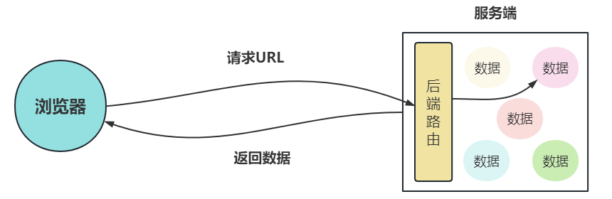

### 2、MPA 多页面应用

MPA（Mule-page application，多页应用）是指有多个独立页面的应用，每个页面都是由后端服务返回的一个**独立的渲染好的 html 网页**。

在多页面应用中，从一个页面跳转到另一个页面，相当于向服务器发送了一次请求，服务器会返回一个新的 HTML 网页给到前端，然后浏览器会将返回的 HTML 页面渲染呈现给用户。

**多页面应用的优缺点**

缺点：

- 每次页面切换，都需要整页刷新
- 前后端不分离，每次请求后端需要把数据渲染成 HTML 文档返回。相当于数据渲染成 HTML 文档的工作要后端来实现。

优点：

- 更有利于 SEO 搜索引擎优化，因为服务端返回的内容是渲染好的 HTML 文档

### 3、后端路由实现多页面应用

下图所示的网站为一个多页面应用示例，整个应用由**网站首页，关于我们，404 页面**三个 HTML 页面组成。

当我们从网站首页跳转到关于我们页面时，相当于浏览器向服务端发送了一次请求，服务端返回了**渲染好的**`about.html`文档，然后浏览器将 HTML 文档渲染成了网页....

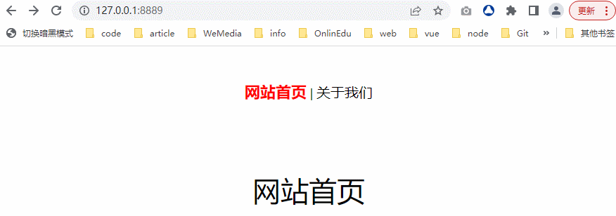

> 整个应用所涉及的路由及路由对应的页面、URL 地址，返回内容如下表：

| 路由   | 页面     | URL                                                           | 返回内容         |
| :----- | :------- | :------------------------------------------------------------ | :--------------- |
| 路由一 | 网站首页 | `http://127.0.0.1:8889/index.html` 或 `http://127.0.0.1:8889` | `index.html`文档 |
| 路由二 | 关于我们 | `http://127.0.0.1:8889/about.html`                            | `about.html`文档 |
| 路由三 | 404 页面 | `http://127.0.0.1:8889/404`                                   | `404.html`文档   |

| 路由   | URL                               | 返回内容        |
| :----- | :-------------------------------- | :-------------- |
| 路由四 | `http://127.0.0.1:8889/basic.css` | `basic.css`文件 |

> **代码演示**：本案例采用`nodejs`实现

- `server.js` 用于服务端创建多个后端路由

```js
const http = require('http')
const fs = require('fs')
http
  .createServer((request, response) => {
    // 设置响应头
    response.writeHead(200, {
      'Content-Type': 'text/html;charset:utf-8',
      'Access-Control-Allow-Origin': '*', // 允许跨域
    })
    let data = ''
    if (request.url === '/about.html') {
      // 读取html页面内容
      data = fs.readFileSync('./about.html', 'utf-8')
    } else if (request.url === '/' || request.url === '/index.html') {
      // 读取html页面内容
      data = fs.readFileSync('./index.html', 'utf-8')
    } else if (request.url === '/basic.css') {
      // 设置响应的内容类型
      response.writeHead(200, {
        'Content-Type': 'text/css;charset:utf-8',
      })
      // 读取css内容
      data = fs.readFileSync('./basic.css', 'utf-8')
    } else {
      data = fs.readFileSync('./404.html', 'utf-8')
    }
    // 响应体内容
    response.end(data)
  })
  .listen(8889)

console.log('Server running at http:127.0.0.1:8889')
```

- `index.html` 、`about.html`、`404.html`文件内容如下

```html
<!---index.html -->
<body>
  <div class="menu">
    <a href="/index.html" class="active">网站首页</a>
    |
    <a href="/about.html">关于我们</a>
  </div>

  <div class="main">网站首页</div>
</body>

<!---about.html -->
<body>
  <div class="menu">
    <a href="/index.html">网站首页</a>
    |
    <a href="/about.html" class="active">关于我们</a>
  </div>

  <div class="main">关于我们</div>
</body>

<!---404.html -->
<body>
  404页面,点击
  <a href="/" style="color:red">首页</a>
  返回网站首页
</body>
```

- `basic.css`文件内容如下

```css
.main {
  display: flex;
  justify-content: center;
  align-items: center;
  font-size: 40px;
}
.menu {
  margin: 50px auto 100px;
  text-align: center;
}
a {
  color: #000;
  font-size: 20px;
  text-decoration: none;
}
a.active {
  color: red;
  font-weight: bold;
  font-size: 22px;
}
```

## 三、前端路由原理和实现

本小节深入学习前端路由原理及实现，涉及内容有：

- 前端路由概念
- 前端 2 种路由模式
- hashchange 事件
- History API 与 popstate 事件
- 为什么需要前端路由

### 1、前端路由概念

前端路由描述的是 URL 与页面内容之间的映射关系。这种映射关系是指，当 URL 发生变化时，页面对应的内容会更新，但不会刷新整个页面，只会刷新需要更新内容的部分。

> 前端路由主要用来实现 **SPA 单页面应用**

### 2、前端 2 种路由模式

前端路由有以下两种模式，并且每种模式的路由表现形式和实现方式都不一样

**两种路由模式的表现形式**

| 路由模式 | 路由表现形式                                                                            |
| :------- | :-------------------------------------------------------------------------------------- |
| hash     | 地址的 URL 中带有#号，如：`http://www.xxx.com/#/about`，＃符号后面的 URL 部分为 hash 值 |
| history  | 地址的 URL 为正常模式，如：`http://www.xx.com/a/b/c`                                    |

**两种路由模式的实现方式**

| 路由模式 | 实现方式                                                  |
| :------- | :-------------------------------------------------------- |
| hash     | 主要是通过监听浏览器的`hashchange`事件来实现              |
| history  | 主要是通过监听浏览器的`popstate`事件与`History API`来实现 |

### 3、hashchange 事件

当请求的 URL 的片段标识符（跟在＃符号后面的 URL 部分，包括＃符号）发生改变时，就会触发`hashchange`事件。

> **hashchange 事件主要用来解决前端 hash 路由**，其实现原理如下：

- 在该事件中通过`location.hash`拿到当前 URL 地址#号后面的`hash`值。
- 根据 hash 值来判断发送请求的 url，再通过`Ajax`或`Fetch`向后端服务器发送请求获取数据，然后将数据渲染成 DOM，插入页面更新页面内容。
- 这种方式更新页面内容，并不会刷新整个页面，也不会产生新的页面，所以整个应用只有一个 HTML 页面。内容的更新只是在更新当前 HTML 页面内容。

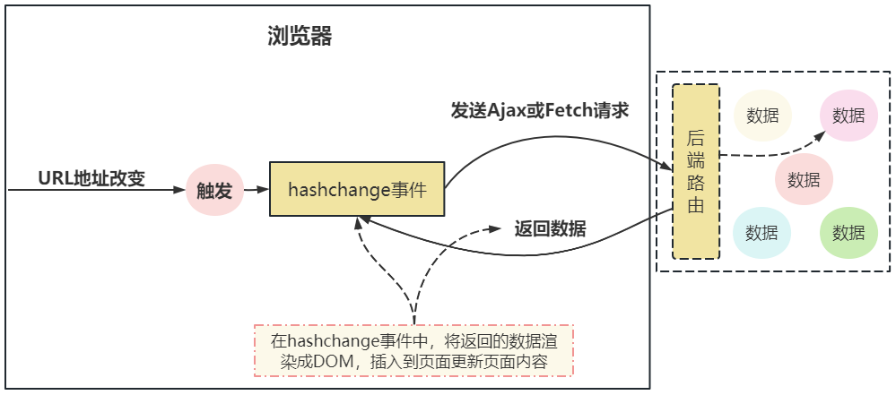

### 3.1、hashchange 事件基本用法

- `hashchange`事件为浏览器事件，通过以下方式来进行监听

```js
window.addEventListener(
  'hashchange',
  function () {
    // ....
  },
  false,
)
```

- 通过`location.hash`拿到 hash 值，地址#号后面的内容就是 hash 内容

```js
window.addEventListener('hashchange', function() {
    const hash = location.hash // 获取地址栏中的hash值
    }, false);
/
```

- 根据 hash 值决定最终要发送的 ajax 请求，获取对应内容，渲染成 DOM，插入到当前面。

```js
window.addEventListener(
  'hashchange',
  function () {
    const hash = location.hash // 获取地址栏中的hash值
    if (hash === '#/about') {
      // 发请求获了数据，然后将返回的数据渲染成DOM插入页面中，更新页面内容
      // .......
      console.log(hash) // #/about
    } else if (hash === '#/news') {
      // 发请求获了数据，然后将返回的数据渲染成DOM插入页面中，更新页面内容
      // .......
      console.log(hash) // #/news
    } else {
      // .....
    }
  },
  false,
)
```

### 3.2、SPA 单页面应用

SPA（Single-page application，单页应用）整个应用是只会加载**一个单独的 HTML 网页**（只会在第一次进到应用时，会向服务器发送请求，获取一个 HTML 网页）。后面需要显示不同的内容时，可以通过[Ajax (opens new window)](https://www.arryblog.com/vip/network/json-ajax-cross-domain-axios-fetch.html#一、json-数据)或[Fetch (opens new window)](https://www.arryblog.com/vip/network/json-ajax-cross-domain-axios-fetch.html#十、fetch)向服务端请求内容来更新主体内容

这使得用户在访问网站时无需加载新的页面，可以获得性能提升和动态的体验，但会相应地丧失诸如 SEO（搜索引擎优化）的优势，因为应用主页面只有一些简单的 HTML 框架和 JS 代码。

> **SPA 单页面应用优缺点：**

优点：

- 用户体验好，内容改变不需要重新加载整个页面，基于这一点，对服务器的压力较小
- 前后端分离，后端只需要返回对应的 JSON 数据，前端拿到数据后渲染成 DOM 插入页面

缺点：

- 不利于 SEO 搜索引擎优化
- 初次加载耗时多

### 3.3、hash 模式的 SPA 单页面应用

以下为一个单页面的 web 应用，当地址然中的 hash 值发生改变时，就会通过`Ajax`或`Fetch`向后台发请求，拿到数据后将其渲染成 DOM，然后插入到页面更新当前页内容。

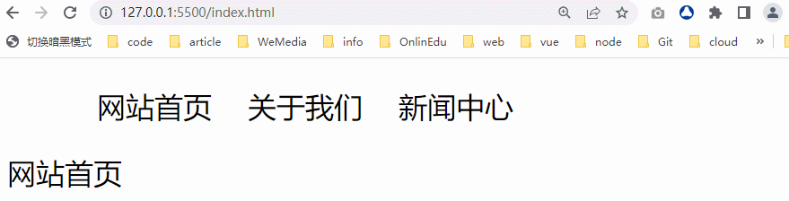

实现原理

- 监听`hashchange`事件，当地址栏中的 hash 值发生变化时，会触发 hashchange 事件
- 在`hashchange`事件中通过`location.hash`来获取更新后的 hash 值。
- 根据对应的 hash 来判断应该向那个地址发送请求获取数据。
- 将获取的数据渲染成 DOM 插入到页面中。

**简单版**

```html
<style>
  .router-link {
    display: flex;
    list-style: none;
  }
  .router-link li {
    padding: 0px 10px;
  }
  .router-link li a {
    text-decoration: none;
    color: #000;
  }
  .router-link li a:hover {
    color: red;
  }
</style>

<body>
  <!--路由导航-->
  <ul class="router-link">
    <li><a href="#/home">网站首页</a></li>
    <li><a href="#/about">关于我们</a></li>
    <li><a href="#/news">新闻中心</a></li>
  </ul>
  <!--路由内容出口-->
  <div class="router-view"></div>

  <script>
    // 路由出口容器
    const $routerView = document.querySelector('.router-view')

    // 一上来就调下 onHashChange方法，根据路由显示页面内容
    onHashChange()
    // 监听 hashchange事件
    window.addEventListener('hashchange', onHashChange, false)
    function onHashChange() {
      //  获取当前地址的 hash值
      const hash = location.hash
      if (hash === '#/home' || hash === '') {
        // .... 发请求，拿数据，然后渲染
        $routerView.innerHTML = '网站首页'
      } else if (hash === '#/about') {
        $routerView.innerHTML = '关于我们'
      } else if (hash === '#/news') {
        $routerView.innerHTML = '新闻中心'
      } else {
        $routerView.innerHTML = ''
      }
    }
  </script>
</body>
```

### 3.4、优化版：SPA 单页面应用

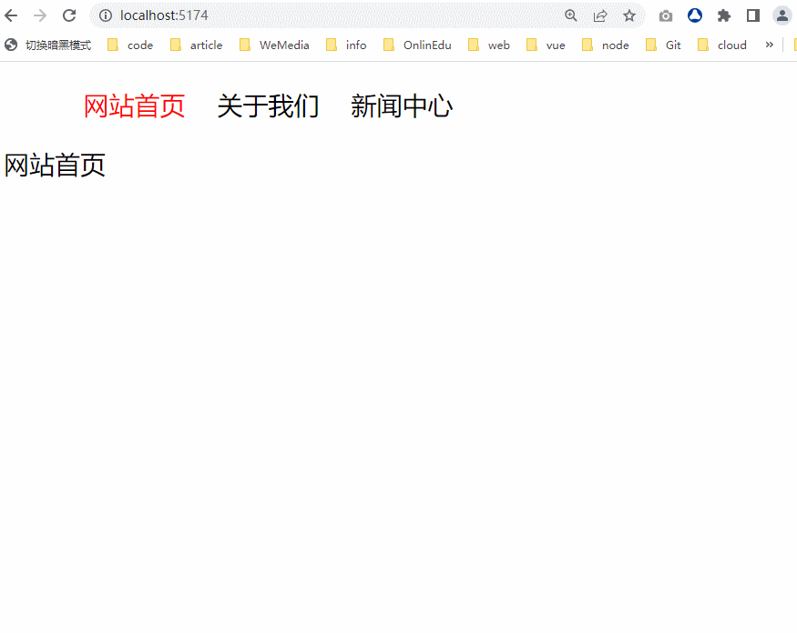

**第一步：创建 index.html 项目入口文件**

在该文件中利用 HTML + CSS 实现当前应用的导航和对应视图渲染出口架构

```html
<style>
  .router-link {
    display: flex;
    list-style: none;
  }
  .router-link li {
    padding: 0 10px;
  }
  .router-link li a {
    text-decoration: none;
    color: #000;
  }
  .router-link li a:hover {
    color: red;
  }
  .router-link li a.active {
    color: red;
  }
</style>

<body>
  <!-- 定义路由导航 -->
  <ul class="router-link">
    <li><a href="#/home">网站首页</a></li>
    <li><a href="#/about">关于我们</a></li>
    <li><a href="#/news">新闻中心</a></li>
  </ul>
  <!-- 路由视图（内容出口） -->
  <div class="router-view"></div>
</body>
```

**第二步：定义路由**

创建`router/routes.js`文件，在该文件中对外暴露一个数组，数组中的每一项为一个对象，该对象我们称为路由对象，记录了当前路由相关的信息。

```js
export const routes = [
  {
    name: '网站首页',
    path: '#/',
  },
  {
    name: '网站首页',
    path: '#/home',
  },
  {
    name: '关于我们',
    path: '#/about',
  },
  {
    name: '新闻中心',
    path: '#/news',
  },
  // 你有多少个路由，往后加就行
]
```

**第三步：定义每个路由渲染内容的方法**

每个路由对应的页面要显示的内容我们定义在一个单独的 JS 文件中 ，然后对外暴露一个方法，调用该方法就可以获取要显示的 HTML 字符串。

> 考虑到后期内容是通过 ajax 或 fetch 发请求获取，返回的内容会被 Promise 包装，则将方法定义成 async 函数，方便在内部接受请求回来的值，如：`await getData(url)`

- `pages/home.js` 文件 - 返回网站首页内容

```js
export async function home() {
  // await getDate(url)
  return '网站首页' // 返回的内容会被Promise包装
}
```

- `pages/about.js` 文件 - 返回关于我们内容

```js
export async function about() {
  return '关于我们' // 返回的内容会被Promise包装
}
```

- `pages/news.js`文件 - 返回新闻中心内容

```js
export async function news() {
  return '新闻中心' // 返回的内容会被Promise包装
}
```

- `pages/nofound.js` - 返回 404 页面内容

```js
export async function nofound() {
  return '404页面' // 返回的内容会被Promise包装
}
```

**第四步：定义路由对象的 render 方法**

每一条路由都有其要显示的内容，通过调用路由对象的 render 方法就可以获取要渲染内容的 HTML 字符串。

```js
// 以下方法 home about news 用来返回对应页面的渲染好的html字符串内容
import { home } from '../pages/home.js'
import { about } from '../pages/about.js'
import { news } from '../pages/news.js'

export const routes = [
  {
    name: '网站首页',
    path: '#/',
    render: home, // 得到当前网站首页要渲染的html字符串
  },
  {
    name: '网站首页',
    path: '#/home',
    render: home, // 得到当前网站首页要渲染的html字符串
  },
  {
    name: '关于我们',
    path: '#/about',
    render: about,
  },
  {
    name: '新闻中心',
    path: '#/news',
    render: news,
  },
  // 你有多少个路由，往后加就行
]
```

**第五步：实现按路由渲染内容**

在`index.html`页面实现主要的业务逻辑，根据不同的路由渲染不同的内容

```html
<script type="module">
  // 导入路由
  import { routes } from './router/routes.js'
  // 导航 404d页面渲染函数
  import { nofound } from './pages/nofound.js'
  // 获取路由出口容器
  const $routerView = document.querySelector('.router-view')
  // 监听 hashchange事件， 当地址栏中的hash值发生改变时，会触发hashchange事件
  window.addEventListener('hashchange', onHashChange)
  // 一上来就调用，根据路由渲染初始内容
  onHashChange()
  async function onHashChange() {
    // 获取到hash值
    const hash = location.hash
    // 根据hash值，找到对应路由对象，然后拿到对应路由的要渲染的html字符串
    const route = routes.find((item) => item.path === hash)
    // 如果route存在，调用render方法获取路由要渲染的html字符串内容
    if (route) {
      $routerView.innerHTML = await route.render()
    } else {
      // 不存当前路由就显示404页面内容
      $routerView.innerHTML = await nofound()
    }
  }
</script>
```

刚开始进到网站首页时，并没有渲染首页面容，是因为我们没有在路由中定义该路由信息，所以需要在`router/routes.js`中再添加一条路由信息。

```js
export const routes = [
  {
    name: '网站首页',
    path: '',
    render: home, // 得到当前网站首页要渲染的html字符串
  },
  {
    name: '网站首页',
    path: '#/',
    render: home, // 得到当前网站首页要渲染的html字符串
  },
  {
    name: '网站首页',
    path: '#/home',
    render: home, // 得到当前网站首页要渲染的html字符串
  },
  // ......
  // 你有多少个路由，往后加就行
]
```

> 上面路由配置表示 `http://127.0.0.1:5500/index.html` 、`http://127.0.0.1:5500/#/` 、`http://127.0.0.1:5500/#/home` 三个地址都显示网站首页内容

**第六步：完善新闻中心页内容**

完善`pages/news.js`文件的`news`方法，在该方法中通过`fetch`发请求获取数据，然后将获取的数据与 HTML 结合成 HTML 字符串，最终返回该 HTML 字符串。

将发请求获取数据的代码封装在 getData 方法中，并将该方法定义在`data/getData.js`文件中

- `data/getData.js` 文件内容

```js
export function getData(url) {
  return new Promise((resolve, reject) => {
    // fetch请求向后台获取数据
    fetch(url)
      .then((res) => {
        if ((res.status <= 200 && res.status < 300) || res.status === 304) {
          return res.json() // 读取数据流
        }
      })
      .then((data) => {
        resolve(data.data)
      })
      .catch((err) => {
        reject()
      })
  })
}
```

- `pages/news.js`文件内容

> 我们可给渲染出来的 DOM 添加 CSS 样式

```js
import { getData } from '../data/getData.js'
// 导入css ，为渲染出来DOM添加css样式
import '../css/news.css'
// 请求数据源
let url = 'https://www.fastmock.site/mock/6ec78e345df340241e1f5043f0167833/icode/news/8'
export async function news() {
  let html = "<ul class='news'>"
  // 获取请求的数据
  const data = await getData(url)
  // 遍历数据，将数据与html结合拼接成html字符串
  data.forEach((item) => {
    html += `
                <li>
                    <a href='${item.path}'>${item.title}</a>
                </li>
               `
  })
  html += '</ul>'
  return html
}
```

- `css/news.css`

```css
.news {
  list-style: none;
  width: 400px;
  border: 1px solid skyblue;
  padding: 10px;
}
.news li {
  line-height: 35px;
}
.news li a {
  text-decoration: none;
  color: #000;
}
.news li a:hover {
  color: tomato;
}
```

**第七步：运行程序**

因为我们在项目中用到了`import '../css/news.css'`导入 CSS，而浏览器本身是不支持这个语法的，所以我们需要借助`vite`构建工具来构建项目。

执行`npm create vite@latest`安装 vite 前端构建工具，然后执行`npx vite`就可以启动项目。

> 项目启动后在浏览器中看到效果如下：

我们发现新闻中心的数据是通过请求获取的，并且对应的 CSS 样式也生效了。

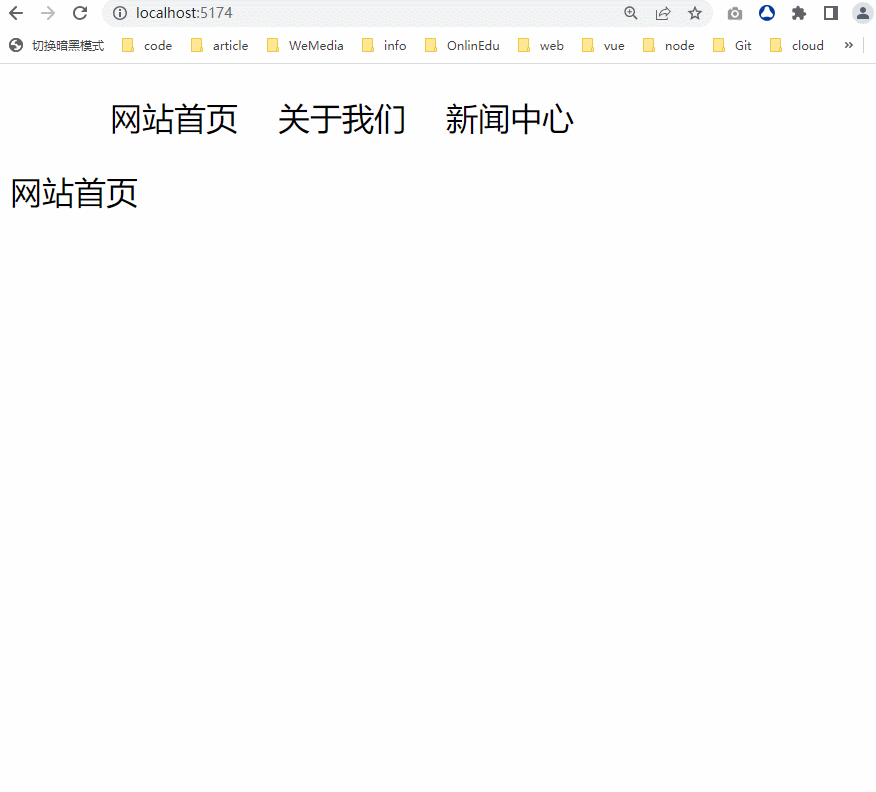

注：

不过以上效果还存在一个严重的 bug，当我们切换到新闻中心时，如果数据还没有回来，我们又切换到了网站首页，这里你会看到网站首页的内容会被替换成新闻中心内容。

因为数据请求需要一定的时间才能返回数据，所以在数据没有返回时切换到网站首页，等到请求数据回来时，就会把当`.router-view`中的内容替换为请求回来的新闻中心数据。

> 所以我们需要在切换到其它路由时，把之前的请求给取消。

**第八步：取消请求**

在`data/getData.js`中，为 getData 方法添加取消请求的功能。

```js
// 如果内容没有回来之前，切换到了其它的页面，我就要把请求取消
let controller = new AbortController()

export function getData(url) {
  // 取消请求设置
  controller = new AbortController()
  const { signal } = controller

  return new Promise((resolve, reject) => {
    // fetch请求向后台获取数据
    // {signal} 取消请求调置
    fetch(url, { signal })
      .then((res) => {
        if ((res.status <= 200 && res.status < 300) || res.status === 304) {
          return res.json() // 读取数据流
        }
      })
      .then((data) => {
        resolve(data.data)
      })
      .catch((err) => {
        reject('请求被取消了')
      })
  })
}

// 调用该方法，取消请求
getData.abort = function () {
  controller.abort() // 取消当前请求
}
```

> 在切换到其它页面时，要取消之前的请求

- `pages/home.js`

```js
import { getData } from '../data/getData.js'
export async function home() {
  // 取消之前的请求
  getData.abort()
  return '网站首页'
}
```

- `pages/about.js`

```js
import { getData } from '../data/getData.js'
export async function about() {
  // 取消之前的请求
  getData.abort()
  return '关于我们'
}
```

- `pages/news.js`

```js
import { getData } from '../data/getData.js'
export async function news() {
  // 取消之前的请求
  getData.abort()

  //........
}
```

- `pages/nofound.js`

```js
import { getData } from '../data/getData.js'
export async function nofound() {
  // 取消之前的请求
  getData.abort()

  return '404页面'
}
```

**第九步：处理错误**

> 如果请求被取消了，是会`reject('请求被取消')`，我们可以对抛出的错误捕获并处理

- 在`index.html`中对获取数据的代码进行`try...catch`错误捕获

```js
async function onHashChange() {
  // ......
  if (route) {
    try {
      $routerView.innerHTML = await route.render()
    } catch (err) {
      console.log(err)
    }
  } else {
    // 不存当前路由就显示404页面内容
    try {
      $routerView.innerHTML = await nofound()
    } catch (err) {
      console.log(err)
    }
  }
}
```

**第十步：点亮导航**

> 实现当前路由对应的导航变成红色。

- 我们可以通过 map 建立路由与`a`标签元素的映射关系

```js
// 获取所有a标签
const $links = document.querySelectorAll('.router-link li a')
// 建立route与a标签的一种映射关系
const map = new Map()

$links.forEach((item) => {
  let href = item.getAttribute('href')
  if (href === '#/home') {
    map.set(href, item)
    map.set('#/', item)
    map.set('', item)
  } else {
    map.set(href, item)
  }
})
```

- 根据路由找到 a 标签，给 a 标签添加`class='active'`

```js
if (route) {
  // 点亮导航
  $links.forEach((item) => {
    item.classList.remove('active')
  })
  // 根据路由找到对应的a标签，添加class='active'
  map.get(route.path).classList.add('active')

  // 渲染导航对应内容
  try {
    $routerView.innerHTML = await route.render()
  } catch (err) {
    console.log(err)
  }
} else {
  // 不存当前路由就显示404页面内容
  $routerView.innerHTML = await nofound()
}
```

> 最终渲染出来的效果如下：


### 3.5、优化版：完整代码

> 项目目录结构

```js
code
├─ css
│  └─ news.css  // 新闻页css
├─ data
│  └─ getData.js   // 请求数据方法
├─ index.html   // 项目入口
├─ pages    // 返回各页面html字符串的方法
│  ├─ about.js
│  ├─ home.js
│  ├─ news.js
│  └─ nofound.js
└─ routes  // 项目路由
   └─ routes.js
```

- `index.html`

```html
<style>
  .router-link {
    display: flex;
    list-style: none;
  }
  .router-link li {
    padding: 0 10px;
  }
  .router-link li a {
    text-decoration: none;
    color: #000;
  }
  .router-link li a:hover {
    color: red;
  }
  .router-link li a.active {
    color: red;
  }
</style>

<body>
  <!-- 定义路由导航 -->
  <ul class="router-link">
    <li><a href="#/home">网站首页</a></li>
    <li><a href="#/about">关于我们</a></li>
    <li><a href="#/news">新闻中心</a></li>
  </ul>
  <!-- 路由视图（内容出口） -->
  <div class="router-view"></div>

  <script type="module">
    // 导入路由
    import { routes } from './router/routes.js'
    // 导航 404d页面渲染函数
    import { nofound } from './pages/nofound.js'
    // 获取路由出口容器
    const $routerView = document.querySelector('.router-view')
    // 获取所有a标签
    const $links = document.querySelectorAll('.router-link li a')
    // 建立route与a标签的一种映射关系
    const map = new Map()
    $links.forEach((item) => {
      let href = item.getAttribute('href')
      if (href === '#/home') {
        map.set(href, item)
        map.set('#/', item)
        map.set('', item)
      } else {
        map.set(href, item)
      }
    })
    // 监听 hashchange事件， 当地址栏中的hash值发生改变时，会触发hashchange事件
    window.addEventListener('hashchange', onHashChange)
    // 一上来就调用，根据路由渲染初始内容
    onHashChange()
    async function onHashChange() {
      // 获取到hash值
      const hash = location.hash
      // 根据hash值，找到对应路由对象，然后拿到对应路由的要渲染的html字符串
      const route = routes.find((item) => item.path === hash)
      // 如果route存在，调用render方法获取路由要渲染的html字符串内容
      if (route) {
        // 点亮导航
        $links.forEach((item) => {
          item.classList.remove('active')
        })
        // 根据路由找到对应的a标签，添加class='active'
        map.get(route.path).classList.add('active')
        try {
          $routerView.innerHTML = await route.render()
        } catch (err) {
          console.log(err)
        }
      } else {
        // 不存当前路由就显示404页面内容
        $routerView.innerHTML = await nofound()
      }
    }
  </script>
</body>
```

- `router/routes.js`

```js
// 以下方法 home about news 用来返回对应页面的渲染好的html字符串内容
import { home } from '../pages/home.js'
import { about } from '../pages/about.js'
import { news } from '../pages/news.js'

export const routes = [
  {
    name: '网站首页',
    path: '',
    render: home, // 得到当前网站首页要渲染的html字符串
  },
  {
    name: '网站首页',
    path: '#/',
    render: home, // 得到当前网站首页要渲染的html字符串
  },
  {
    name: '网站首页',
    path: '#/home',
    render: home, // 得到当前网站首页要渲染的html字符串
  },
  {
    name: '关于我们',
    path: '#/about',
    render: about,
  },
  {
    name: '新闻中心',
    path: '#/news',
    render: news,
  },
  // 你有多少个路由，往后加就行
]
```

- `pages/home.js`

```js
// 考虑到后期内容是通过ajax或fetch发请求获取
// 返回的内容会被Promise包装，则将方法定义成async函数，方便接受请求回来的值
// await getData(url)
import { getData } from '../data/getData'
export async function home() {
  // 取消之前的请求
  getData.abort()
  return '网站首页'
}
```

- `page/about.js`

```js
import { getData } from '../data/getData'
export async function about() {
  // 取消之前的请求
  getData.abort()
  return '关于我们'
}
```

- `pages/news.js`

```js
import { getData } from '../data/getData.js'
// 导入css ，为渲染出来DOM添加css样式
import '../css/news.css'
// 请求数据源
let url = 'https://www.fastmock.site/mock/6ec78e345df340241e1f5043f0167833/icode/news/8'
export async function news() {
  // 取消之前请求
  getData.abort()
  let html = "<ul class='news'>"
  const data = await getData(url)
  data.forEach((item) => {
    html += `
                <li>
                    <a href='${item.path}'>${item.title}</a>
                </li>
               `
  })
  html += '</ul>'
  return html
}
```

- `pages/nofound.js`

```js
import { getData } from '../data/getData.js'
export async function nofound() {
  // 取消之前的请求
  getData.abort()

  return '404页面'
}
```

- `data/getData.js`

```js
// 如果内容没有回来之前，切换到了其它的页面，我就要把请求取消
let controller = new AbortController()

export function getData(url) {
  // 取消请求设置
  controller = new AbortController()
  const { signal } = controller

  return new Promise((resolve, reject) => {
    // fetch请求向后台获取数据
    // {signal} 取消请求调置
    fetch(url, { signal })
      .then((res) => {
        if ((res.status <= 200 && res.status < 300) || res.status === 304) {
          return res.json() // 读取数据流
        }
      })
      .then((data) => {
        resolve(data.data)
      })
      .catch((err) => {
        reject('请求被取消了')
      })
  })
}

// 调用该方法，取消请求
getData.abort = function () {
  controller.abort() // 取消当前请求
}
```

- `css/news.css` 样式

```css
.news {
  list-style: none;
  width: 400px;
  border: 1px solid skyblue;
  padding: 10px;
}
.news li {
  line-height: 35px;
}
.news li a {
  text-decoration: none;
  color: #000;
}
.news li a:hover {
  color: tomato;
}
```

### 4、History API 与 popstate

[History (opens new window)](https://developer.mozilla.org/zh-CN/docs/Web/API/History)对象提供了如下 API 方法，用来实现 URL 的切换。

| 方法         | 用法                                                                                     |
| :----------- | :--------------------------------------------------------------------------------------- |
| go           | 相当于浏览器中前进或后退按扭，`go(-1)`后退一页，`go(1)`前进一页                          |
| back         | 相当于浏览器中的后退按扭，用于后退到前一页，`back()`后退一页                             |
| forward      | 相当于浏览器中的前进按扭，用于前进到前一页，`forward()`前进一页                          |
| pushState    | 向浏览器的会话历史栈中增加一个条目，**地址栏中地址会变化，但不会向后端发请求**           |
| replaceState | 修改当前历史记录，相当于替换历史栈中当前 URL，**地址栏中地址会变化，但不会向后端发请求** |

> 当 history 模式的 URL 地址发生变化时，某些情况下就会触发 window 对象上的`popstate`事件。

### 4.1、go，back，forward 方法

```js
history.back() // 后退
history.forward() // 前进
history.go(1) // 前进 进入下一页
```

### 4.2、pushState 方法

- 向浏览器的会话历史栈中增加一个条目，相当于更改当前浏览器的地址，**会产生历史记录**
- 地址栏中 URL 虽然会变为新增的，但不会向后端发送请求，如果**刷新该页面，会出现 404 错误**

```js
pushState(state, unused, url)
```

参数

- state ：为当前所创建的历史条件所携带的数据，其值为一个可序列化的对象，该数据保存在`history`对象的`state`属性上，同时`popstate`事件的`state`属性值为该`state`对象的副本。
- unused：没有用的参数，因为历史原因，但又必须存在，通常传递一个空字符串。
- url：新的历史条目 URL

**案例演示**

```html
<button id="add">更改地址栏中URL</button>
<script>
  const $add = document.getElementById('add')
  let num = 1
  $add.onclick = function () {
    if (num === 1) {
      history.pushState({ a: 1, b: 2 }, '', '/about')
      num = 2
    } else {
      history.pushState({}, '', '/news')
    }
    // 注意观察history的state属性
    console.log(history)
  }
</script>
```

**以上代码最终效果如下：**

> 注意观察地址栏中地址的变化，并且点击前进和后退按扭可以前进和回退。

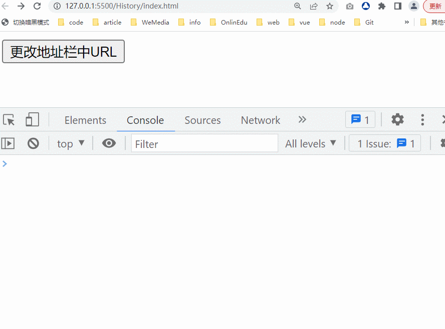

### 4.3、replaceState 方法

- 修改当前历史记录，相当于替换历史栈中当前历史记录，地址栏为替换后地址。替换前的地址**不会产生历史记录**，后退按扭没法后退到替换前的地址。
- 同样不会向后端发送请求，**如果刷新改页面，会出现 404 错误**

```js
replaceState(state, unused, url)
```

replaceState 方法的每个参数与 pushState 方法的参数是一个意思

```html
<button id="add">更改地址栏中URL</button>
<script>
  const $add = document.getElementById('add')
  let num = 1
  $add.onclick = function () {
    if (num === 1) {
      history.replaceState({ a: 1, b: 2 }, '', '/about')
      num = 2
    } else {
      history.replaceState({}, '', '/news')
    }
    // 注意观察history的state属性
    console.log(history)
  }
</script>
```

**以上代码最终效果如下：**

> 注意观察地址栏中地址的变化，并且前进和后退按扭是灰色的禁用状态。

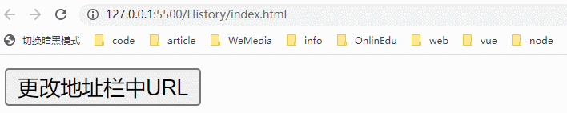

### 4.4、popstate 事件

- 当 history 模式的 URL 地址发生变化时，`popstate` 事件只会在浏览器某些行为下触发。比如：点击后退按钮或者在 JavaScript 中调用 `history.back()` 等方法

**注意事项**

> 如果当前的 URL 的地址是通过`history.pushState()` 创建或者 `history.replaceState()`方法修改的，则不会触发`popstate`事件。

- `popstate`事件的的事件对象 e 上可以获取通过`pushState`、`replaceState`方法添加的历史条目的 state 值。
- 通过`location.pathname`可以获取到当前 URL 的后面的路径值。

**代码演示**

```html
<button id="but">更改地址栏中URL</button>
<script>
  window.addEventListener('popstate', (e) => {
    console.log('pathname:', location.pathname)
    console.log('state:', e.state)
  })

  // 获取元素，添加点击事件
  $but = document.getElementById('but')
  $but.onclick = changeUrl

  let num = 0
  function changeUrl() {
    num++
    switch (num) {
      case 1:
        history.pushState({}, '', '/home') // 不会触发popstate事件
        break
      case 2:
        history.pushState({}, '', '/about') // 不会触发popstate事件
        break
      case 3:
        history.replaceState({ a: 1 }, '', '/news') // 不会触发popstate事件
        break
      case 4:
        history.back() // 会触发popstate事件
        break
      case 5:
        history.go(1) // 会触发popstate事件
        break
    }
  }
</script>
```

**以上代码最终渲染效果如下：**

> 前面三次地址发生了变化，都没有触发`popstate`事件，但后面两次都触发`popstate`事件

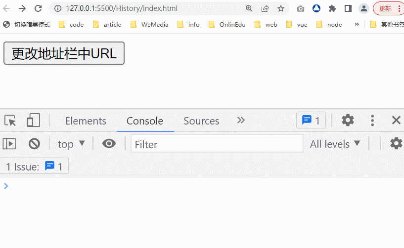

### 4.5、history 模式的 SPA 单页面应用

下图所示的应用为一个 history 路由模式的 SPA 单页面应用，该应用就是利用`History API`和`popstate`事件来实现的。

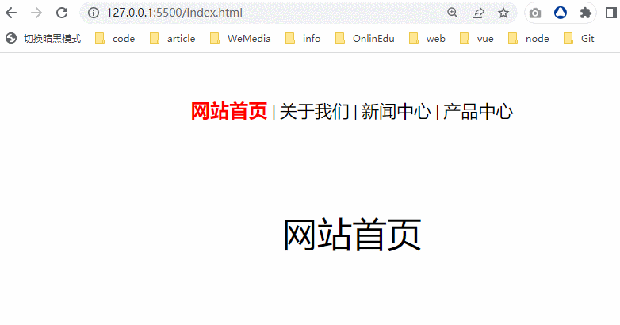

实现原理：

- 通过`pushState`和`replaceState`方法修改的 URL，并不会触发`popstate`事件，所以针对这种情况，我们可以采用如下办法：

  - 通过监听`<a>`标签的点击事件，来监听要变化的 URL
  - 针对要变化的 URL，可以调用`pushState`和`replaceState`方法来实现地址栏中 URL 的变化
  - 最后根据当前地址 URL，来发送对应的`Ajax`或`Fetch`请求，获取数据后，渲染成 DOM 插入到页面，更新内容。

- 如果是调用了`histroy`的`go`、`back()`、`forward()`或浏览器的前进后退按扭来改变 URL，则都会触发`popstate`事件，可以在该事件中来处理。在该事件中通过`location.pathname`来获取 URL 的路径值

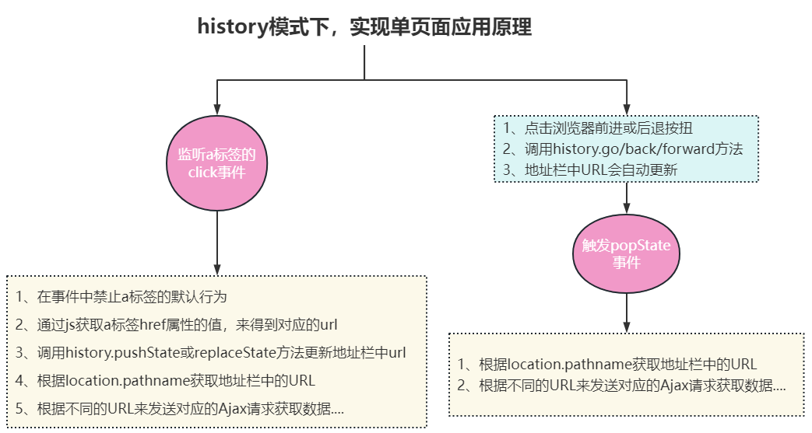

**完整版代码**

```html
<style>
  .router-view {
    display: flex;
    justify-content: center;
    align-items: center;
    font-size: 40px;
  }
  .router-link {
    display: flex;
    margin: 50px auto 100px;
    text-align: center;
    list-style: none;
  }
  .router-link li {
    margin: 0 10px;
  }
  .router-link li a {
    color: #000;
    font-size: 20px;
    text-decoration: none;
  }
</style>
<body>
  <div class="router-link">
    <li><a href="/home">网站首页</a></li>
    <li><a href="/about">关于我们</a></li>
    <li><a href="/news">新闻中心</a></li>
    <li><a href="/product">产品中心</a></li>
  </div>
  <!--路由视图：内容的出口-->
  <div class="router-view"></div>

  <script>
    // 获取用来放路由视图的容器
    const $routerLink = document.querySelector('.router-link')
    const $routerView = document.querySelector('.router-view')
    // 获取所有a标签
    const $links = document.querySelectorAll('a')

    // 页面首次加载时，触发onPopState方法，渲染首页内容
    window.addEventListener('DOMContentLoaded', onPopState)

    // 事件代理
    $routerLink.onclick = function (e) {
      e.preventDefault()
      const target = e.target
      const targetName = target.tagName.toLowerCase()
      if (targetName !== 'a') return
      // 阻止默认行为
      e.preventDefault()
      // 清除所有a标签的active class
      $links.forEach((item) => {
        item.classList.remove('active')
      })
      target.classList.add('active')
      // 更新URL
      history.pushState({}, '', target.getAttribute('href'))
      // 更新页面内容
      onPopState()
    }

    // 根据URL变化，渲染对应的内容
    function onPopState() {
      switch (location.pathname) {
        case '/':
        case '/index.html':
        case '/home':
          $routerView.innerHTML = '网站首页'
          break
        case '/about':
          $routerView.innerHTML = '关于我们'
          break
        case '/news':
          $routerView.innerHTML = '新闻中心'
          break
        default:
          // 对于没有匹配的路由，显示404页面
          $routerView.innerHTML = '404页面'
      }
    }
  </script>
</body>
```

### 5、为什么需要前端路由

接下来我们就来学习如何实现 hash 模式的前端路由和 history 模式的前端路由

通过前面的学习，你可能会有一个疑问，没有前端路由，一样可以实现单页面开发。

我们只需要监听对应`a`标签的事件，然后在事件中发送`Ajax`或`Fetch`请求，拿到数据后渲染成 DOM，插入页面，更新对应内容即可。

> 代码如下：

```html
<script>
  // 获取用来放路由视图的容器
  const $routerLink = document.querySelector('.router-link')
  const $routerView = document.querySelector('.router-view')
  // 获取所有a标签
  const $links = document.querySelectorAll('a')

  // 页面首次加载时，触发onPopState方法，渲染首页内容
  window.addEventListener('DOMContentLoaded', onPopState)

  // 事件代理
  $routerLink.onclick = function (e) {
    const target = e.target
    const targetName = target.tagName.toLowerCase()
    if (targetName !== 'a') return
    // 阻止默认行为
    e.preventDefault()
    // 清除所有a标签的active class
    $links.forEach((item) => {
      item.classList.remove('active')
    })
    target.classList.add('active')
    // 更新URL
    // history.pushState({}, "", target.getAttribute("href"));
    // 更新页面内容
    // 直接传递 url
    onPopState(target.getAttribute('href'))
  }

  // 根据URL变化，渲染对应的内容
  function onPopState(url) {
    switch (url) {
      case '/':
      case '/index.html':
      case '/home':
        $routerView.innerHTML = '网站首页'
        break
      case '/about':
        $routerView.innerHTML = '关于我们'
        break
      case '/news':
        $routerView.innerHTML = '新闻中心'
        break
      default:
        // 对于没有匹配的路由，显示404页面
        $routerView.innerHTML = '404页面'
    }
  }
</script>
```

> 注意上面的`onPopState(url)`方法的地址是动态传递进来的。

为什么要弄个前端路由呢 ？

> 原因如下：

- `AJAX`局部刷新，导致浏览器的`URL`不会发生任何变化而完成了请求，从而破坏了用户浏览体验。
- 同时本次浏览的页面内容在用户下次使用`URL`访问时将无法重新呈现（前提还需要后端配合），使用路由可以很好地解决这个问题。

> 所以，前端路由本质是为了让用户有一个更好的体验

### 6、总结

**前端路由定义**

前端路由描述的是 URL 与页面内容之间的映射关系，这种映射关系是指：当 URL 发生变化时，页面对应的内容会更新，但不会刷新整个页面，只会刷新需要更新内容的部分。

**前端路由两种模式及实现方式**

|               | hash 模式                                                                                   | history 模式                                               |
| :------------ | :------------------------------------------------------------------------------------------ | :--------------------------------------------------------- |
| 表现形式      | 地址地址的 URL 中带有#号，如：`http://www.xxx.com/#/about`，＃符号后面的 URL 部分为 hash 值 | 地址的 URL 为正常模式，如：`http://www.xx.com/a/b/c`       |
| 实现方式      | 主要是通过监听浏览器的`hashchange`事件来实现                                                | 主要是通过监听浏览器的`popstate`事件与`History API`来实现  |
| hash 或路径值 | 通过`location.hash`来获取更新后的 hash 值                                                   | 通过`location.pathname`可以获取到当前 URL 的后面的路径值。 |

**SPA 单页面应用-hash 模式**


**SPA 单页面应用-history 模式**

> 如果单页面应用的路由为 history 路由，则可以通过 History Api 与 popstate 事件来实现。实现原理如下图：


