# Vue 中 Transition 和 TransitionGroup 组件，实践应用

Vue 为我们提供了两个内置组件`<Transition>`和`<TransitionGroup>`，他们可以帮助我们制作基于状态变化的过渡和动画效果。

- `<Transition>` 会在一**个元素或组件**进入和离开 DOM 时应用动画
- `<TransitionGroup>` 会在一个 `v-for` 列表中的元素或组件被插入，移动，或移除时应用动画

除了以上两个组件，我们也可以通过其他技术手段来应用动画，比如切换 CSS class 或用状态绑定样式来驱动动画。

> 对 CSS 动画不熟悉，可查阅系统学习教程[《transition 过渡动画与 animation 自定义动画》(opens new window)](https://www.arryblog.com/guide/css3/css-transition-animation.html#一、transition-过渡动画)

## 一、`<Transition>`内置组件

本小节我们将系统学习`<Transition>`内置组件实现过渡与动画效果，具体内容如下：

- `<Transition>`组件的基本用法
- CSS 过渡 Class
- 元素出现时过渡（appear 属性)
- 元素间过渡
- 过渡模式 `mode="out-in"`
- `<component>`组件间过渡
- 为过渡效果命名
- 深层级过渡与显式过渡时长
- CSS 的 animation 动画
- 自定义过渡 Class
- `animate.css` 与`<Transition>`的结合应用
- 同时使用 transition 与 animation
- 动画的 Javascript 钩子
- 封装可复用过渡效果的组件

### 1、`<Transition>`组件的基本用法

- `<Transition>` 是一个内置组件，这意味着它在任意别的组件中都可以被使用，无需注册
- 将需要使现过渡和动画的**单个根元素**或**单个单根组件**作为`<Transition>`组件的默认插槽内容传入

> `<Transition>`中只能有一个根元素，多个根元素会报错，所以传入的组件也只能是单个单根组件

**进入或离开的动画由以下条件之一触发**

- 由 `v-if` 所触发的切换
- 由 `v-show` 所触发的切换
- 由特殊元素 `<component>` 切换的动态组件
- 改变特殊的 `key` 属性

> 我们来实现如下过渡动画效果


```html
<script setup>
  import { ref } from 'vue'
  const isShow = ref(true)
</script>

<template>
  <button @click="isShow = !isShow">淡出与淡入</button>
  <!--Transition内置组件-->
  <Transition>
    <div class="box" v-show="isShow"></div>
  </Transition>
</template>

<style>
  .box {
    width: 100px;
    height: 100px;
    background-color: skyblue;
  }
</style>
```

以上代码还不能使现元素在被插入或移除时有过渡与动画效果，还必须提供配套的 CSS 样式，如下：

```css
/* 元素插入动画样式 */
.v-enter-from {
  opacity: 0;
}

.v-enter-active {
  transition: opacity 2s ease;
}

.v-enter-to {
  opacity: 1;
}

/* 元素移除动画样式 */
.v-leave-from {
  opacity: 1;
}

.v-leave-active {
  transition: opacity 2s ease;
}

.v-leave-to {
  opacity: 0;
}
```

> 为什么在加入了对应的`CSS`样式后，动画就生效了呢？接下来我们就会讲到过渡与动画的实现原理。

### 2、CSS 过渡 Class

在利用`<Transition>`内置组件实现过渡与动画时，会自动为元素在不同的时刻添加和移除对应的 CSS class。

> 如下图：


Enter 入场动画 （插入元素时动画）

- `v-enter-from`：进入动画的起始状态。在元素插入之前添加，在元素插入完成后的下一帧移除。
- `v-enter-active`：进入动画的生效状态。应用于整个进入动画阶段。在元素被插入之前添加，在过渡或动画完成之后移除。**这个 class 可以被用来定义进入动画的持续时间、延迟与速度曲线类型。**
- `v-enter-to`：进入动画的结束状态。在元素插入完成后的下一帧被添加 (也就是 `v-enter-from` 被移除的同时)，在过渡或动画完成之后移除。

---

**Leave 出场动画**（移除元素时动画）

- `v-leave-from`：离开动画的起始状态。在离开过渡效果被触发时立即添加，在一帧后被移除。
- `v-leave-active`：离开动画的生效状态。应用于整个离开动画阶段。在离开过渡效果被触发时立即添加，在过渡或动画完成之后移除。**这个 class 可以被用来定义离开动画的持续时间、延迟与速度曲线类型。**
- `v-leave-to`：离开动画的结束状态。在一个离开动画被触发后的下一帧被添加 (也就是 `v-leave-from` 被移除的同时)，在过渡或动画完成之后移除。

> 分析前面提到的淡出与淡入的效果的整个 Class 添加与移除的过程

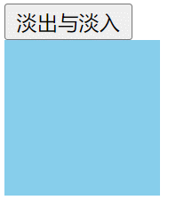

- 点击按扭，方块淡出隐藏，Class 添加和移除过程如下：

```html
<!-- 1、淡出动画生效前 添加 v-leave-from 和 v-leave-active -->
<div class="box v-leave-from v-leave-active"></div>
<!--  2、添加 v-leave-to 的同时（稍后）移除 v-leave-from 触发淡出动画- -->
<div class="box v-leave-active  v-leave-to"></div>
<!-- 3、淡出动画结束后，移出 v-leave-active 和 v-leave-to -->
<div class="box"></div>
```

- 点击按扭，方块淡出显示，Class 添加移除过程如下：

```html
<!-- 1、在淡入动画生效前 class -->
<div class="box v-enter-from v-enter-active"></div>
<!-- 2、移除v-enter-from 添加v-enter-to 触发淡入动画-->
<div class="box v-enter-active v-enter-to "></div>
<!--3、 动画结束后，移除v-enter-active 和 v-enter-to-->
<div class="box"></div>
```

优化前面 “淡入与淡出” 动画的 CSS 样式

了解了整个动画的执行过程后，我们再来看前面 **"淡入与淡出"** 动画的 CSS 样式。

> 如下：

```css
/* 元素插入动画样式 */
.v-enter-from {
  opacity: 0;
}

.v-enter-active {
  transition: opacity 2s ease;
}

.v-enter-to {
  opacity: 1;
}

/* 元素移除动画样式 */
.v-leave-from {
  opacity: 1;
}

.v-leave-active {
  transition: opacity 2s ease;
}

.v-leave-to {
  opacity: 0;
}
```

其实不难发现，上面（一般情况下）过渡动画的

- `v-enter-to`与`v-leave-from`中 CSS 样式是一样的，因为入场动画的结束状态就是出场动画的开始状态
- `v-enter-from`与`v-leave-to`中 CSS 样式是一样的，因为出场动画的结束状态就是入场动画的开始状态
- `v-enter-active`与`v-leave-active`中 CSS 样式是一样的，大多情况下，出场与入场动画执行相反效果，其动画代码是一样的。

> 优化后的 CSS 样式

```css
/* 动画起始与离开动画的结束状态 */
.v-enter-from,
.v-leave-to {
  opacity: 0;
}
/* 动画生效状态 */
.v-enter-active,
.v-leave-active {
  transition: opacity 2s ease;
}
/* 动画结束与离开动画的起始状态*/
/* 以下代码写可以省略，因为元素没有调置opacity属性时，默认值为1
.v-enter-to,.v-leave-from {
  opacity: 1;
}
*/
```

### 3、元素初次渲染时过渡 （appear 属性）

前面讲到的 **“淡入与淡出”** 动画，在页面初次渲染时并没有呈现一个淡入的动画效果，如果想在元素初次渲染时应用一个过渡效果，你可以为他添加`appear`属性。

```html
<Transition appear>...</Transition>
```

在 **"淡入与淡出"** 动画的`<Transition>`标签添加`appear`属性后，初次进入页面时，元素以淡入动画显示

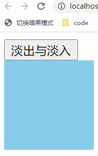

> 以下是最终完整版代码

```html
<script setup>
  import { ref } from 'vue'
  const isShow = ref(true)
</script>
<template>
  <button @click="isShow = !isShow">淡出与淡入</button>
  <Transition appear>
    <div class="box" v-show="isShow"></div>
  </Transition>
</template>

<style>
  .box {
    width: 100px;
    height: 100px;
    background-color: skyblue;
  }

  /* 动画起始与离开动画的结束状态 */
  .v-enter-from,
  .v-leave-to {
    opacity: 0;
  }
  /* 动画生效状态 */
  .v-enter-active,
  .v-leave-active {
    transition: opacity 2s ease;
  }
  /* 动画结束与离开动画的起始状态*/
  /* 以下代码写可以省略，因为元素没有调置opacity属性时，默认值为1
    .v-enter-to,.v-leave-from {
    opacity: 1;
    }
    */
</style>
```

### 4、元素间过渡

接下来，我们实现如下图所示的多个元素来回切换的过渡动画效果

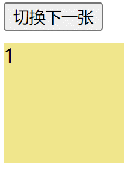

几个元素当中不同时刻只能有一个元素显示，所以我们可以利用`v-if`、`v-else`、`v-else-if`来确保每次`<Transition>`组件内只能有**一个根元素或一个单根组件**，如下：

```html
<Transition>
  <div class="item" v-if="index === 1">1</div>
  <div class="item" v-else-if="index === 2">2</div>
  <div class="item" v-else-if="index === 3">3</div>
</Transition>

<!-- 以下写法是错的 -->
<Transition>
  <div class="item" v-if="index === 1">1</div>
  <div class="item" v-if="index === 2">2</div>
  <div class="item" v-if="index === 3">3</div>
</Transition>
```

每个元素在切换时的入场与出场动画都是一样的，所以我们只需为他们指定一套入场与出场的 CSS 样式即可

```css
/* 入场动画开始前状态 */
.v-enter-from {
  opacity: 0;
  transform: translateX(100px);
}
/* 入场与出场动画生效状态*/
.v-enter-active,
.v-leave-active {
  transition: all 1s ease;
}
/* 出场动来结束后状态*/
.v-leave-to {
  transform: translateX(-100px);
  opacity: 0;
}

/* 以下代码可省略 入场动画结束入出场动画开始状态一样，只需要采用默认值即可*/
/* 
.v-enter-to,
.v-leave-from {
    transform: translateX(0);
    opacity: 1;
}
*/
```

**完整代码**

```html
<script setup>
  import { ref } from 'vue'
  const index = ref(1)
  const msg = ref('切换下一张')

  function change() {
    index.value++
    if (index.value === 3) {
      msg.value = '回到第一张'
    }
    if (index.value > 3) {
      index.value = 1
      msg.value = '切换下一张'
    }
  }
</script>

<template>
  <button @click="change">{{ msg }}</button>
  <div class="content">
    <Transition>
      <div class="item" v-if="index === 1">1</div>
      <div class="item" v-else-if="index === 2">2</div>
      <div class="item" v-else-if="index === 3">3</div>
    </Transition>
  </div>
</template>
<style>
  .content {
    width: 100px;
    height: 100px;
    margin-left: 100px;
    overflow: hidden;
    position: relative; /* 相对定位 */
  }

  button {
    margin-bottom: 10px;
    margin-left: 100px;
  }

  .item {
    width: 100px;
    height: 100px;
    background-color: khaki;
    position: absolute; /* 一定要书写定位*/
  }

  /* 入场动画开始前状态 */
  .v-enter-from {
    opacity: 0;
    transform: translateX(100px);
  }
  /* 入场与出场动画生效状态*/
  .v-enter-active,
  .v-leave-active {
    transition: all 1s ease;
  }
  /* 出场动来结束后状态*/
  .v-leave-to {
    transform: translateX(-100px);
    opacity: 0;
  }
</style>
```

### 5、过渡模式 mode="out-in"

我们观察上面代码实现的多个元素切换的过渡动画（如下图），可以看到**入场和出场的元素都是同时开始动画的**。

因此我们需要将它们设为`positions: absolute`以避免二者同时存在时出现的布局问题。

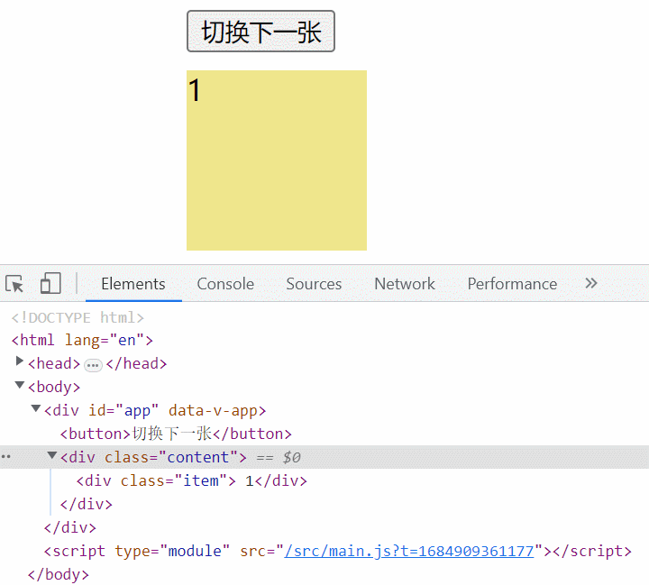

但在有些情况下，我可能希望在出场动画结束后，再开始执行入场动画。我们可以通过向`<Transition>`传入一个`mode` 属性来实现这个行为。

- `mode="out-in"`表示，先执行出场（离开）动画，出场动画结束后，再执行入场动画
- `mode="in-out"`表示，先执行入场（进入）动画，入场动画结束后，再执行出场动画 **（基本不用）**

```html
<Transition mode="out-in">...</Transition>
```

> 将前面的例子改为`mode="out-in"`后效果如下：（`.item`元素也不用添加`postion:absolute`）

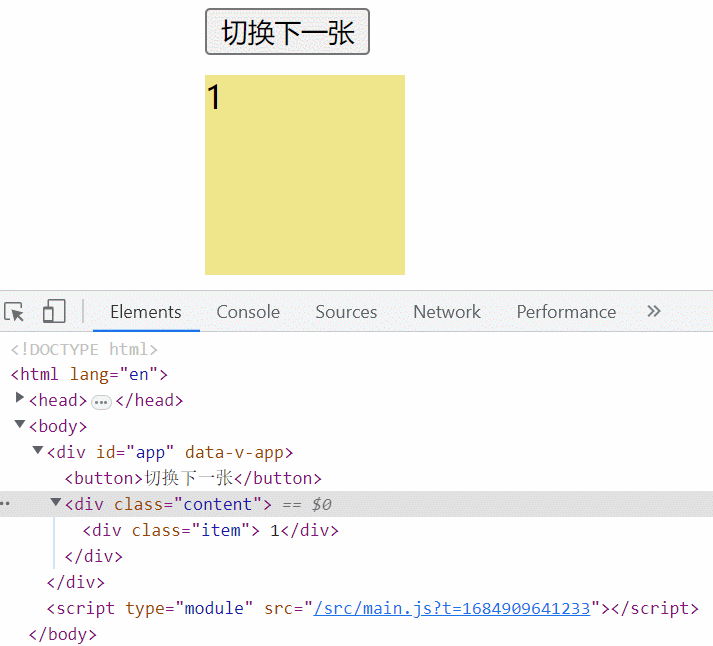

### 6、`<component>`组件间过渡

我们前面提到过`<Transition>`也可以作用于由`<component>` 切换的动态组件

```html
<Transition mode="out-in">
  <component :is="activeComponent"></component>
</Transition>
```

> 接下来，我们实现如下多组件间切换的过渡效果

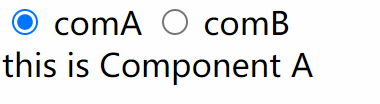

**完整代码**

```html
<!-- App根组件 -->
<script setup>
  import { shallowRef } from 'vue'
  import ComA from './components/ComA.vue'
  import ComB from './components/ComB.vue'
  const activeComponent = shallowRef(ComA) // 浅层响应性能更高
</script>

<template>
  <!--单选按扭-->
  <input type="radio" v-model="activeComponent" :value="ComA" />
  comA
  <input type="radio" v-model="activeComponent" :value="ComB" />
  comB

  <!--多组件间过渡-->
  <Transition mode="out-in">
    <component :is="activeComponent" />
  </Transition>
</template>

<style>
  .v-enter-from,
  .v-leave-to {
    opacity: 0;
  }

  .v-enter-active,
  .v-leave-active {
    transition: opacity 0.5s ease;
  }

  /* .v-enter-to,
    .v-leave-from {
    opacity: 1;
    } */
</style>

<!-- ComA 组件 -->
<template>
  <div class="com-a">this is Component A</div>
</template>
<!-- ComB 组件 -->
<template>
  <div class="com-b">this is Component A</div>
</template>
```

### 7、为过渡效果命名

当一个页面同时有多个不同的过渡动画时，则需要为不同的过渡动画取不同的过渡效果名。

> 我们可以给`<Transition>`组件传一个`name`属性来声明一个过渡效果名

```html
<Transition name="fade">...</Transition>
```

当`<Transition>`有了`name`属性后，CSS 过渡 Class 的名字不再是以`v-`作为前缀，而是要以`name`属性的值作为前缀。

如果`name=fade`则对应的过渡 Class 名为`fade-enter-from`、`fade-enter-active`、`fade-enter-to`、`fade-leave-from`、`fade-leave-active`、`fade-leave-to`

> 针对前面实现的 **"淡出与淡入"** 动画，我们给`<Transition>`组件添加`name="fade"`属性，完整版代码如下：

```html
<script setup>
  import { ref } from 'vue'
  const isShow = ref(true)
</script>
<template>
  <button @click="isShow = !isShow">淡出与淡入</button>
  <Transition appear name="fade">
    <div class="box" v-show="isShow"></div>
  </Transition>
</template>

<style>
  .box {
    width: 100px;
    height: 100px;
    background-color: skyblue;
  }

  /* 动画起始与离开动画的结束状态 */
  .fade-enter-from,
  .fade-leave-to {
    opacity: 0;
  }

  /* 动画生效状态 */
  .fade-enter-active,
  .fade-leave-active {
    transition: opacity 2s ease;
  }
</style>
```

### 8、深层级过渡与显式指定过渡时长

通过前面的学习，我们知道过渡 class 仅能应用在`<Transition>`组件的根元素上，如果我们想使根元素的后代元素有过渡和动画效果。

> 如下图所示效果：

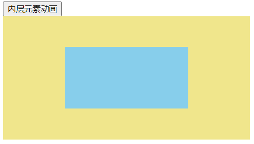

> 我们可以通过 CSS 后代选择器，在后代元素上触发过渡效果。

**代码示例**

以下代码，我们期望通过 CSS 后代选择器，使动画效果最终触发在`.box`元素上

```html
<script setup>
  import { ref } from 'vue'
  const isShow = ref(true)
</script>

<template>
  <div><button @click="isShow = !isShow">内层元素动画</button></div>
  <!-- 自定义过渡Class名 -->
  <Transition name="fade">
    <div class="container" v-if="isShow">
      <div class="box"></div>
    </div>
  </Transition>
</template>

<style scoped>
  .container {
    width: 400px;
    height: 200px;
    background-color: khaki;
    display: inline-block;
  }

  .box {
    width: 200px;
    height: 100px;
    margin: 50px auto;
    background-color: skyblue;
  }

  /* 动画起始与离开动画的结束状态 */
  .fade-enter-from .box,
  .fade-leave-to .box {
    opacity: 0;
  }

  /* 动画生效状态 */
  .fade-enter-active .box,
  .fade-leave-active .box {
    transition: opacity 2s ease;
  }
</style>
```

> 但实际上，以上代码并不没有实现我们想要的效果，不管是`.container`还是`.box`元素都没有动画效果。

没有过渡效果原因如下

- `<Transition>`组件之所以能清楚的知道`transition`动画在何时结束，是因为其内部监听了根元素上的`transitionend`事件。
- 通过`transitionend`事件 Vue 就可以知道动画何时结束。
- 在嵌套的过渡动画中，根元素很多时候本身并没有任何的过渡动画，所以会立即显示或隐藏，以致于看不到内部元素的过渡效果。

**如何才能看到过渡效果**

要实现以上效果，我们可以向`<Transition>`组件传入`duration`属性来显示指定根元素过渡的持续时间（以毫秒为单为）。然后就会按以下效果来完成动画。

- 在入场动画时，先显示根元素，然后再执行内部元素的动画
- 在出场动画时，需要先执行内部元素的动画，在动画结束后，再隐藏根元素

```html
<!-- 入场与出场动画持续是一样，均为2s-->
<Transition name="fade" duration="2000"></Transition>
<!-- 入场动画持续时间2s ，出场动画持续时间 3s -->
<Transition :duration="{ enter: 2000, leave: 3000 }">...</Transition>
```

温馨提示：

持续时间不应该小于内部元素动画从开始到结束所需要的时间

**优化上面案例代码**

给以上代码的`<Transition>`组件添加`duration="2000"`后，就能看到前面`gif`图片显示的动画效果了

```html
<Transition name="fade" duration="2250"></Transition>
```

> 为了使看到的动画更自然，可以添加以下代码，让`.box`元素的入场动画延迟`.25s`秒执行。

```css
.fade-enter-active .box {
  transition-delay: 0.25s;
}
```

**以下是最终完整版代码：**

```html
<script setup>
  import { ref } from 'vue'
  const isShow = ref(true)
</script>

<template>
  <div><button @click="isShow = !isShow">内层元素动画</button></div>
  <!-- 自定义过渡Class名 -->
  <Transition name="fade" appear duration="2250">
    <div class="container" v-if="isShow">
      <div class="box"></div>
    </div>
  </Transition>
</template>

<style scoped>
  .container {
    width: 400px;
    height: 200px;
    background-color: khaki;
    display: inline-block;
  }

  .box {
    width: 200px;
    height: 100px;
    margin: 50px auto;
    background-color: skyblue;
  }

  /* 动画起始与离开动画的结束状态 */
  .fade-enter-from .box,
  .fade-leave-to .box {
    opacity: 0;
  }

  /* 动画生效状态 */
  .fade-enter-active .box,
  .fade-leave-active .box {
    transition: opacity 2s ease;
  }

  .fade-enter-active .box {
    transition-delay: 0.25s;
  }
</style>
```

### 8.1、复杂动画应用

我们在上面代码的基础上，做相关优化，最终实现如下动画效果

- 入场动画：黄色盒子执行淡入动画，淡入动画结束后，内部的蓝色盒子再执行淡入动画
- 出场动画：蓝色盒子先执行淡出动画，淡出动画结束后，黄色盒子再执行淡出动画。

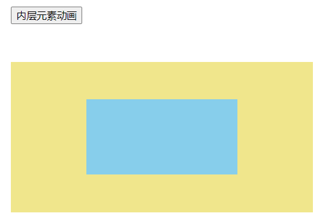

实现原理

- 假设黄色盒子与蓝色盒子的动画执行时间都 `1s`，则我们可以将`duration = 2000`
- 入场动画：给黄色盒子和蓝色盒子添加入场动画样式，同时控制黄色盒子的动画在延迟 `1s` 之后开始执行

```css
/* 黄色盒子入场动画样式 */
.fade-enter-from {
  opacity: 0;
}
.fade-enter-active {
  transition: opacity 1s ease;
}

/* 蓝色盒子入场动画样式*/
/* 动画起始与离开动画的结束状态 */
.fade-enter-from .box {
  opacity: 0;
}
.fade-enter-active .box {
  transition: opacity 1s ease;
  transition-delay: 1s; /* 延迟 1s后开始动画 */
}
```

- 出场动画：给黄色盒子和蓝色盒子添加了出场动画样式，同时控制黄色盒子的动画在延迟 1s 之后开始执行

```css
/* 黄色盒子出场动画样式 */
.fade-leave-to {
  opacity: 0;
}
.fade-leave-active {
  transition: opacity 1s ease;
  transition-delay: 1s; /* 延迟 1s后开始动画 */
}

/* 蓝色盒子出场动画样式 */
.fade-leave-to .box {
  opacity: 0;
}
.fade-leave-active .box {
  transition: opacity 1s ease;
}
```

**完整版代码**

```html
<script setup>
  import { ref } from 'vue'
  const isShow = ref(true)
</script>
<template>
  <div><button @click="isShow = !isShow">内层元素动画</button></div>
  <!-- 自定义过渡Class名 -->
  <Transition name="fade" duration="2000" appear>
    <div class="container" v-if="isShow">
      <div class="box"></div>
    </div>
  </Transition>
</template>

<style scoped>
  button {
    margin: 50px;
  }

  .container {
    width: 400px;
    height: 200px;
    background-color: khaki;
    display: inline-block;
    margin-left: 50px;
  }

  .box {
    width: 200px;
    height: 100px;
    margin: 50px auto;
    background-color: skyblue;
  }

  /* 动画起始与离开动画的结束状态 */
  .fade-enter-from,
  .fade-leave-to,
  .fade-enter-from .box,
  .fade-leave-to .box {
    opacity: 0;
  }

  /* 黄色盒子入场动画 */
  .fade-enter-active {
    transition: opacity 1s ease;
  }

  /* 黄色盒子出场动画 */
  .fade-leave-active {
    transition: opacity 1s ease;
    transition-delay: 1s;
  }

  /* 动画生效状态 */
  .fade-enter-active .box {
    transition: opacity 1s ease;
    transition-delay: 1s;
  }

  .fade-leave-active .box {
    transition: opacity 1s ease;
  }
</style>
```

### 9、CSS 的 animation 动画

在`<Transition>`组件中，实现原生 CSS 的`animation`动画与原生 CSS 的`transition`动画的应用方式基本是相同的，只有一点不同，那就是`*-enter-from`不是在元素插入后立即移除，而是在一个 `animationend` 事件触发时被移除。

对于大多数 CSS 的`animation`动画，我们只需要在`*-enter-active`和`*-leave-active`Class 下声明它们。

> 对 CSS 动画不熟悉，可查阅系统学习教程[《transition 过渡动画与 animation 自定义动画》(opens new window)](https://www.arryblog.com/guide/css3/css-transition-animation.html#一、transition-过渡动画)

**代码示例**

> 我们来看下面这样一个**元素自动缩放**的动画效果，如何来实现

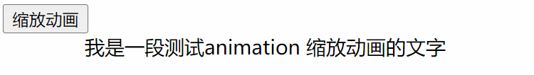

我们先来分析下上面的效果

- 出场（离场）：元素从显示到隐藏，先是原大小，再是放大，最后缩小一直到看不见
- 入场：元素从隐藏到显示，先是从看不见一直放大，然后再缩小到原大小

> 所以元素从隐藏到显示的`animation`动画定义如下，当从显示到隐藏时，只需要反着来执行该动画就好

```css
/* 定义动画  从隐藏到放大再缩放到原大小 */
@keyframes scale {
  0% {
    transform: scale(0); /* 看不见*/
  }

  50% {
    transform: scale(1.25);
  }

  100% {
    transform: scale(1);
  }
}
```

**完整版代码**

```html
<script setup>
  import { ref } from 'vue'
  const isShow = ref(true)
</script>

<template>
  <button @click="isShow = !isShow">缩放动画</button>
  <Transition name="scale" appear>
    <div class="text" v-if="isShow">我是一段测试animation 缩放动画的文字</div>
  </Transition>
</template>

<style scoped>
  .text {
    text-align: center;
  }
  /* 入场动画*/
  .scale-enter-active {
    /* 动画名  动画时间  时间函数   延迟时间  执行次数   执行方向（reverse 为反向播放） 动画不播放时模式  */
    /* animation: name duration timing-function delay iteration-count direction fill-mode; */
    animation: scale 1s ease;
  }
  /* 出场动画 */
  .scale-leave-active {
    /* 与入场动画相反的方式执行 */
    animation: scale 1s ease reverse;
  }

  /* 定义动画 */
  @keyframes scale {
    0% {
      transform: scale(0);
    }

    50% {
      transform: scale(1.25);
    }

    100% {
      transform: scale(1);
    }
  }
</style>
```

### 10、自定义过渡 class

你也可以向 `<Transition>` 传递以下的 props 来指定自定义的过渡 class：

- `enter-from-class`
- `enter-active-class`
- `enter-to-class`
- `leave-from-class`
- `leave-active-class`
- `leave-to-class`

> 你传入的这些 class 会覆盖相应阶段的默认 class 名。如下：

```html
<Transition enter-active-class="bounce-in a" leave-active-class="bounce-out">
  <div class="text" v-if="isShow">我是一段测试animation 缩放动画的文字</div>
</Transition>
```

- 在没有自定义过渡 class 时，入场动画生效状态添加的 class 是 `v-enter-active` ，自定义了 enter-active-class 后，添加的 class 是 `bounce-in` 和 `a`
- 在没有自定义过渡 class 时，出场动画生效状态添加的 class 是 `v-leave-active` ，自定义了`leave-active-class`后，添加的 class 是 `bounce-out`

> 用上面代码替换前面 **"缩放动画"** 对应的`<Transition>`标签内容，则对应的 CSS 需要写成如下：

```css
.bounce-in {
  animation: scale 1s ease;
}

.a {
}
.bounce-out {
  animation: scale 1s ease reverse;
}
```

**完整版代码**

```html
<script setup>
  import { ref } from 'vue'
  const isShow = ref(true)
</script>

<template>
  <button @click="isShow = !isShow">缩放动画</button>
  <!-- 自定义过渡Class名 -->
  <Transition enter-active-class="bounce-in" leave-active-class="bounce-out">
    <div class="text" v-if="isShow">我是一段测试animation 缩放动画的文字</div>
  </Transition>
</template>

<style scoped>
  .text {
    text-align: center;
  }
  /* 入场动画 */
  .bounce-in {
    animation: scale 1s ease;
  }
  /* 出场动画 */
  .bounce-out {
    animation: scale 1s ease reverse;
  }

  /* 定义动画 */
  @keyframes scale {
    0% {
      transform: scale(0);
    }

    50% {
      transform: scale(1.25);
    }

    100% {
      transform: scale(1);
    }
  }
</style>
```

### 11、animate.css 与 `<Transition>`组件结合应用

当我们想要在 Vue 的动画机制下集成其他的第三方 CSS 动画库时，自定义过渡 class 就显得非常有用。

> 比如：常见的第三方 CSS 动画库：[Animate.css(opens new window)](https://daneden.github.io/animate.css/)

### 11.1、如何使用 Animate 动画库

深入浅出在 Vue 中使用 Animate 动画库

- **第一步：打开 Animate 动画库官网**

> Animate 官网地址：[https://animate.style/(opens new window)](https://animate.style/)

- **第二步：安装`animate.css`包**

> 安官网首页的安装教程来安装 `animate.css`包，命令如下：

```shell
npm install animate.css --save
```

- **第三步：导入`animate.css`样式**

```js
import 'animate.css'
```

- **第四步：添加动画**

> 在需要执行相关动画的元素上，添加对应的动画的 class 名，如下：

```html
<!-- animate__animated 是必需要加的基础类，animate__bounce为所要实现动画效果的动画类 -->
<div class="animate__animated animate__bounce">An animated element</div>
```

> 不同的动画 Class 名，大家可以在动画名右侧显示的小方块上点击下，就可以复制到对应的 Class 名

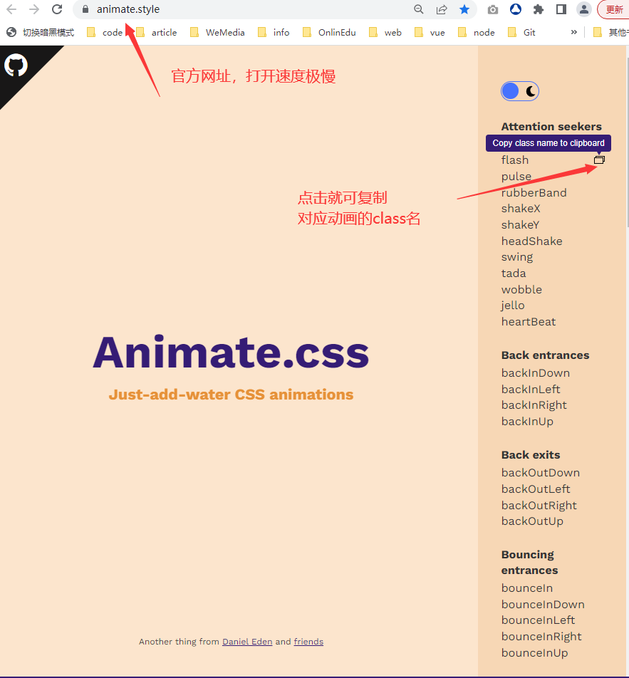

> 按以上步骤执行后的完整 Vue 代码如下：

```html
<!-- App.vue -->
<script setup>
  import 'animate.css'
</script>
<template>
  <div class="animate__animated animate__bounce">An animated element</div>
</template>
```

> 当我们打开页面时，就会呈现如下动画效果

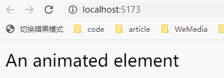

### 11.2、应用：入场出场动画

接下来，我们利用`Animate`与`<Transition>`实现以下酷炫动画效果

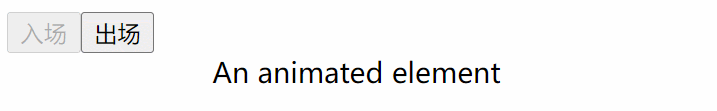

> 完整版代码如下：

```html
<script setup>
  import 'animate.css'
  import { ref } from 'vue'
  const isShow = ref(true)
</script>

<template>
  <button @click="isShow = true" :disabled="isShow">入场</button>
  <button @click="isShow = false" :disabled="!isShow">出场</button>

  <Transition
    appear
    name="custom-classes"
    enter-active-class="animate__animated animate__backInLeft"
    leave-active-class="animate__animated animate__backOutRight"
  >
    <div class="text" v-show="isShow">An animated element</div>
  </Transition>
</template>

<style>
  .text {
    text-align: center;
  }
</style>
```

注：

以上代码中的`name`属性相对于自定义过渡 class 而言，是不生效的，但对于没有定义的过渡 class 是生效的

### 12、同时使用 transition 和 animation

不管是`transition`动画还是`animation`动画，Vue 之所以能知道动画在何时结束，是因为内部监听了`transitionend`和`animationend`事件。

如果一个元素只运用了`transition`或`animation`中的一种动画，Vue 可以自动探测到正确的类型，然后监听对应的事件。

如果一个元素同时运用了这两种动画，则 Vue 就没有办法知道应该在那个动画结束时将元素移除。这时就需要我们显示的传入`type`属性来声明，告诉 Vue 需要关心哪种类型，传入的值是 `animation` 或 `transition`

**案例演示**

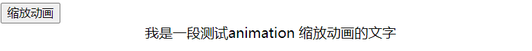

注：

以下代码展示在执行`animation`动画的同时，执行了`transition`动画使文字变色。

- 如果我们显式指定了`type="animation"`，相当于告诉 vue，帮我们监听`animationend`事件，动画会在`1s`后结束。
- 如果我们显式指定了`type="transition"`，相当于告诉 Vue，帮我们监听`transitionend`事件，动画会在`20s`后结束

```html
<script setup>
  import { ref } from 'vue'
  const isShow = ref(true)
</script>

<template>
  <button @click="isShow = !isShow">缩放动画</button>
  <!-- 自定义过渡Class名 -->
  <Transition
    name="rotate"
    type="animation"
    enter-active-class="bounce-in rotate-in"
    leave-active-class="bounce-out rotate-out"
  >
    <div class="text" v-if="isShow">我是一段测试animation 缩放动画的文字</div>
  </Transition>
</template>

<style scoped>
  .text {
    text-align: center;
  }

  .rotate-enter-from,
  .rotate-leave-to {
    color: red;
  }

  .rotate-in,
  .rotate-out {
    transition: color 20s;
  }

  /* 入场动画 */
  .bounce-in {
    animation: scale 1s ease;
  }

  /* 出场动画 */
  .bounce-out {
    animation: scale 1s ease reverse;
  }

  /* 定义动画 */
  @keyframes scale {
    0% {
      transform: scale(0);
    }

    50% {
      transform: scale(1.25);
    }

    100% {
      transform: scale(1);
    }
  }
</style>
```

### 13、动画的 JavaScript 钩子

Vue 为`<Transition>`组件添加了一些事件，这些事件会在过渡不同生命阶段自被动调用。

> 我们可以通过监听事件的方式在过渡过程中挂上钩子函数：

```html
<Transition
  @before-enter="onBeforeEnter"
  @enter="onEnter"
  @after-enter="onAfterEnter"
  @enter-cancelled="onEnterCancelled"
  @before-leave="onBeforeLeave"
  @leave="onLeave"
  @after-leave="onAfterLeave"
  @leave-cancelled="onLeaveCancelled"
>
  <!-- ... -->
</Transition>
```

> 以下为钩子函数的不同执行时机

```js
// 在元素被插入到 DOM 之前被调用
// 用这个来设置元素的 "enter-from" 状态
function onBeforeEnter(el) {}

// 在元素被插入到 DOM 之后的下一帧被调用
// 用这个来开始进入动画
function onEnter(el, done) {
  // 调用回调函数 done 表示过渡结束
  // 如果与 CSS 结合使用，则这个回调是可选参数
  done()
}

// 当进入过渡完成时调用。
function onAfterEnter(el) {}

// 在 leave 钩子之前调用
// 大多数时候，你应该只会用到 leave 钩子
function onBeforeLeave(el) {}

// 在离开过渡开始时调用
// 用这个来开始离开动画
function onLeave(el, done) {
  // 调用回调函数 done 表示过渡结束
  // 如果与 CSS 结合使用，则这个回调是可选参数
  done()
}

// 在离开过渡完成、
// 且元素已从 DOM 中移除时调用
function onAfterLeave(el) {}

// 仅在 v-show 过渡中可用
function onLeaveCancelled(el) {}
```

在使用仅由 JavaScript 执行的动画时，最好是添加一个 `:css="false"` prop。这显式地向 Vue 表明可以跳过对 CSS 过渡的自动探测。除了性能稍好一些之外，还可以防止 CSS 规则意外地干扰过渡效果。

```html
<Transition :css="false">...</Transition>
```

### 13.1、测试钩子执行时机

我们来看下面这个淡入与淡出动画，当我们点击按扭来切换动画时，不同情况下会有那些钩子函数被调用。


```html
<script setup>
  import { ref } from 'vue'
  const isShow = ref(true)
  function onBeforeEnter() {
    console.log('1、onBeforeEnter')
  }
  function onEnter() {
    console.log('2、onEnter')
  }
  function onAfterEnter() {
    console.log('3.1、onAfterEnter')
  }
  function onEnterCancelled() {
    console.log('3.0、onEnterCancelled----')
  }

  function onBeforeLeave() {
    console.log('4、onBeforeLeave')
  }
  function onLeave() {
    console.log('5、onLeave')
  }
  function onAfterLeave() {
    console.log('6.1、onAfterLeave')
  }
  function onLeaveCancelled() {
    console.log('6.0、onLeaveCancelled-----')
  }
</script>
<template>
  <button @click="isShow = !isShow">切换</button>
  <Transition
    appear
    @before-enter="onBeforeEnter"
    @enter="onEnter"
    @after-enter="onAfterEnter"
    @enter-cancelled="onEnterCancelled"
    @before-leave="onBeforeLeave"
    @leave="onLeave"
    @after-leave="onAfterLeave"
    @leave-cancelled="onLeaveCancelled"
  >
    <div class="box" v-show="isShow"></div>
  </Transition>
</template>
<style scoped>
  .box {
    width: 100px;
    height: 100px;
    background-color: khaki;
  }
  .v-enter-from,
  .v-leave-to {
    opacity: 0;
    transform: translateX(100px);
  }
  .v-enter-active,
  .v-leave-active {
    transition: all 4s ease;
  }
</style>
```

刚开始进入到页面时，会执行

- 第一轮动画：执行入场动画至动画结束。然后再点击按扭执行
- 第二轮动画：执行出场动画，动画还没有执行完，又点击了按扭，则执行
- 第三轮动画：执行入场动画，动画还没有执行完，又点击了按扭，则执行
- 第四轮动画：执行出场动画至动画结束

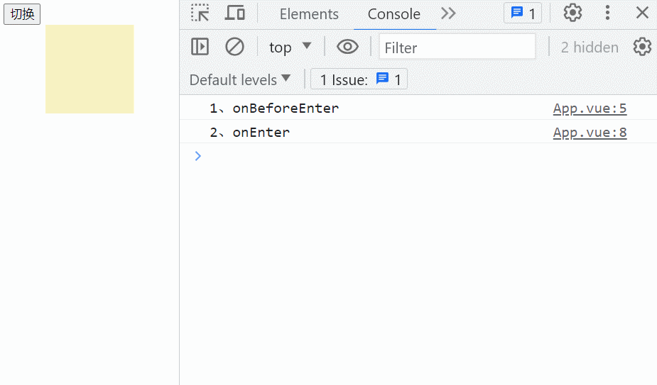

> 每一轮动画过程中触发的钩子函数，如下图：

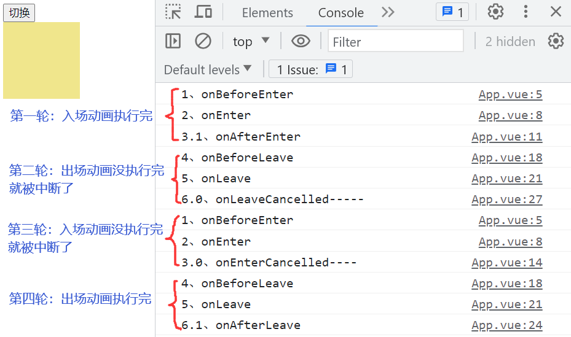

注意：

如果给上面代码中的`<Transition>`组件加上`:css = 'false'`，则不会有动画效果，因为会忽略 CSS 过渡动画效果。

### 13.2、钩子函数功能

各个钩子函数中具体实现的功能

> 如下表：

| 钩子函数         | 功能                                                                      |
| :--------------- | :------------------------------------------------------------------------ |
| @before-enter    | 用来设置入场动画的起始状态，即`enter-from` 状态，等同于`.v-enter-from`    |
| @enter           | 用来设置入场动画与动画的结束状态，即`enter-active`与`enter-to`            |
| @after-enter     | 入场动画结束后，移除添加到元素身上的动画样式 （还要移除：`v-leave-active` |
| @enter-cancelled | 入场动画中途被中断后，通常要移除`enter-to`状态                            |
| @before-leave    | 用来设置出场动画的起始状态，即`leave-from` 状态                           |
| @leave           | 用来设置出场动画与动画的结束状态，即`leave-active`与`leave-to`            |
| @after-leave     | 出场动画结束后，移除添加到元素身上的动画样式 （还要移除`v-enter-active`)  |
| @leave-cancelled | 出场动画中途被中断后，通常要移除`leave-to`状态                            |

### 13.3、钩子函数的基本使用

我们利用钩子函数实现和上面 CSS 一样的过渡动画效果

> 如下图：

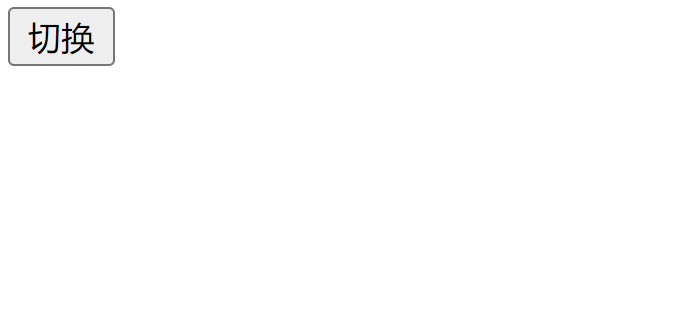

```html
<script setup>
  import { ref } from 'vue'
  const isShow = ref(true)
  const timer = ref(null)

  /* enter-from状态 */
  function onBeforeEnter(el) {
    el.classList.add('v-enter-from')
  }
  /* enter-to  enter-active 状态 */
  function onEnter(el, done) {
    setTimeout(() => {
      el.classList.add('v-enter-active', 'v-enter-to')
      el.classList.remove('v-enter-from')
    })

    clearTimeout(timer.value)
    timer.value = setTimeout(() => {
      done()
    }, 4000)
  }
  /* 动画结束后，要移除添加的class */
  function onAfterEnter(el) {
    el.classList.remove('v-enter-active', 'v-enter-to')
  }

  function onEnterCancelled(el) {
    console.log('3.0、onEnterCancelled----')
    el.classList.remove('v-enter-to')
  }
  /* leave-from 状态 */
  function onBeforeLeave(el) {
    el.classList.add('v-leave-from')
  }
  /* leave-to  leave-active 状态 */
  function onLeave(el, done) {
    setTimeout(() => {
      el.classList.add('v-leave-active', 'v-leave-to')
      el.classList.remove('v-leave-from')
    })
    clearTimeout(timer.value)
    timer.value = setTimeout(() => {
      done()
    }, 4000)
  }
  /* 动画结束后，要移除添加的class */
  function onAfterLeave(el) {
    el.classList.remove('v-leave-active', 'v-leave-to')
  }
  function onLeaveCancelled(el) {
    console.log('6.0、onLeaveCancelled-----')
    el.classList.remove('v-leave-to')
  }
</script>
<template>
  <button @click="isShow = !isShow">切换</button>
  <Transition
    appear
    :css="false"
    @before-enter="onBeforeEnter"
    @enter="onEnter"
    @after-enter="onAfterEnter"
    @enter-cancelled="onEnterCancelled"
    @before-leave="onBeforeLeave"
    @leave="onLeave"
    @after-leave="onAfterLeave"
    @leave-cancelled="onLeaveCancelled"
  >
    <div class="box" v-show="isShow"></div>
  </Transition>
</template>
<style scoped>
  .box {
    width: 100px;
    height: 100px;
    background-color: khaki;
  }

  .v-enter-from,
  .v-leave-to {
    opacity: 0;
    transform: translateX(100px);
  }

  .v-enter-active,
  .v-leave-active {
    transition: all 4s ease;
  }
</style>
```

注：

了解了各个钩子函数的功能后，我们知道入场动画的结束状态与出场动画的起始状态是一样的，而且也是元素本身的默认状态。

> 所以我们可以不用设置动画的入场结束状态和出场的起始状态。

> 最终修改后的 JS 代码如下：

```html
<script setup>
  import { ref } from 'vue'
  const isShow = ref(true)

  /* enter-from状态 */
  function onBeforeEnter(el) {
    el.classList.add('v-enter-from')
  }
  /* enter-to  enter-active 状态 */
  function onEnter(el, done) {
    clearTimeout(timer.value)
    timer.value = setTimeout(() => {
      // 修改1------
      // el.classList.add('v-enter-active', 'v-enter-to');
      el.classList.add('v-enter-active')
      el.classList.remove('v-enter-from')
    })
    setTimeout(() => {
      done()
    }, 4000)
  }
  /* 动画结束后，要移除添加的class */
  function onAfterEnter(el) {
    // 修改2------
    // el.classList.remove('v-enter-active', 'v-enter-to')
    el.classList.remove('v-enter-active')
  }
  // 修改3 -----
  /*
    function onEnterCancelled(el) {
        console.log('3.0、onEnterCancelled----')
        el.classList.remove('v-enter-to')
    }
  */

  /* 
    修改4------
    leave-from 状态 
    function onBeforeLeave(el) {
        el.classList.add('v-leave-from')
    }
  */
  /* leave-to  leave-active 状态 */
  function onLeave(el, done) {
    setTimeout(() => {
      el.classList.add('v-leave-active', 'v-leave-to')
      // 修改5 ----
      // el.classList.remove('v-leave-from');
    })

    clearTimeout(timer.value)
    timer.value = setTimeout(() => {
      done()
    }, 4000)
  }
  /* 动画结束后，要移除添加的class */
  function onAfterLeave(el) {
    el.classList.remove('v-leave-active', 'v-leave-to')
  }
  function onLeaveCancelled(el) {
    console.log('6.0、onLeaveCancelled-----')
    el.classList.remove('v-leave-to')
  }
</script>
```

### 13.4、案例：弹性动画

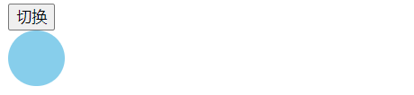

以上动画中，入场动画和出场动画分别是用`transition`和`animation`来实现的

- 不过，入场动画的开始状态并不是出场动画的结束状态
- 但是，入场动画的结束状态是出场动画的开始状态

**完整代码**

```html
<script setup>
  import { ref } from 'vue'
  const show = ref(true)
  const timer = ref(null)

  /* 入场动画状态 */
  function onBeforeEnter(el) {
    el.classList.add('v-enter-from')
  }
  /* 入场动画与动画结束状态 */
  function onEnter(el, done) {
    setTimeout(() => {
      el.classList.add('v-enter-active', 'v-enter-to')
      el.classList.remove('v-enter-from')
    })

    setTimeout(() => {
      done()
    }, 1200)
  }

  // 入场动画结束后，将添加的动画样式删除
  function onAfterEnter(el) {
    el.classList.remove('v-enter-to', 'v-enter-active')
  }

  // 出场动画
  function onLeave(el, done) {
    setTimeout(() => {
      el.classList.add('v-leave-active')
    })

    clearTimeout(timer.value)
    timer.value = setTimeout(() => {
      done()
    }, 2000)
  }
  // 出场动画结束后，将添加的动画样式移除
  function onAfterLeave(el) {
    el.classList.remove('v-leave-active')
  }
  function onLeaveCancelled(el) {
    el.classList.remove('v-leave-active')
  }
</script>

<template>
  <button @click="show = !show">切换</button>
  <Transition
    :css="false"
    @before-enter="onBeforeEnter"
    @enter="onEnter"
    @after-enter="onAfterEnter"
    @enter-cancelled="onAfterEnter"
    @leave="onLeave"
    @after-leave="onAfterLeave"
    @leave-cancelled="onLeaveCancelled"
  >
    <div class="ball" v-show="show"></div>
  </Transition>
</template>

<style>
  .ball {
    width: 50px;
    height: 50px;
    background-color: skyblue;
    border-radius: 50%;
  }

  .v-enter-from {
    transform: scale(0.25);
    opacity: 1;
  }

  .v-enter-active {
    transition: all 1s ease;
    transition-delay: 200;
  }

  .v-enter-to {
    transform: scale(1);
  }

  .v-leave-active {
    /* 
        forwards 表示动画结束后将停止在最后结束的状态，以免产生回到原始位置的抖动效果
    */
    animation: move 2s ease forwards;
  }

  @keyframes move {
    0% {
      transform: scale(1) translateX(0px);
    }

    20% {
      transform: scale(1) translateX(-50px);
    }

    100% {
      transform: translateX(300px) scale(0.25);
      opacity: 0;
    }
  }
</style>
```

### 14、封装可复用过渡效果的组件

如果你想把常用的一些动画效果封装在一个组件中，当你调用该组件时，只需要传入动画所需要执行的时间和动画名，就可以给到你想要的动画。

我们可以把`<Transition>`组件封装在我们自定义的动画组件中，通过自定义组件的插槽向`<Transition>`组件传入内容。

- `<CustomTransiton >`组件

```html
<script>
  <!-- duration为动画所需要执行的时间   name为所需要执行的动画名，如：fade  slide-->
  const props = defineProps(['duration', 'animationName'])
</script>

<template>
  <!-- 包装内置的 Transition 组件 -->
  <Transition :name="animationName">
    <slot></slot>
  </Transition>
</template>

<style>
  /*
    必要的 CSS动画样式... 
    注意：避免在这里使用 <style scoped>
    因为它不会应用到插槽内容上
    */
</style>
```

- `<App>`组件中使用`<CustomTransiton>` 组件

```html
<CustomTransition duration="5s" animationName="fade">
  <div class="box" v-show="show"></div>
</CustomTransition>
```

> 以下是在使用`<CustomTransiton>`组件时，通过 props 传递的数据

| 属性名        | 功能                                                                               |
| :------------ | :--------------------------------------------------------------------------------- |
| duration      | 动画执行时间，如：2s 或 5s                                                         |
| animationName | 动画过渡名 值只能是：`fade` 或`slide` fade 表示淡入淡出动画 slide 表示左右滑动动画 |

### 14.1、封装动画组件

接下来我们把**淡出与淡入**动画 和 **左右滑动动画**封装在`<CustomTransiton>`组件中，当我们传入以下不同 props 时，显示不同的动画。

> 如下：

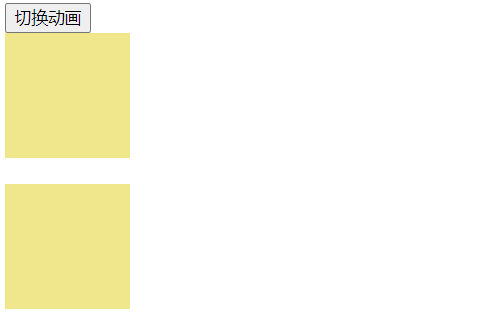

**完整版代码如下：**

```html
<script setup>
  const props = defineProps(['duration', 'animationName'])
</script>

<template>
  <Transition :name="animationName">
    <slot></slot>
  </Transition>
</template>

<style>
  /* fade 淡入与淡出动画 */
  .fade-enter-from,
  .fade-leave-to {
    opacity: 0;
  }

  .fade-enter-active,
  .fade-leave-active {
    transition: opacity v-bind(duration) ease;
  }

  /* 左右滑动动画 */
  .slide-enter-from,
  .slide-leave-to {
    transform: translateX(300px);
    opacity: 0;
  }

  .slide-enter-active,
  .slide-leave-active {
    transition: transform v-bind(duration) ease, opacity v-bind(duration) ease;
  }
</style>
```

> 在其它组件中调用`<CustomTransition>`组件

```html
<script setup>
  import CustomTransition from './components/CustomTransition.vue'
  import { ref } from 'vue'
  const show = ref(true)
</script>

<template>
  <button @click="show = !show">切换动画</button>

  <CustomTransition duration="5s" animationName="fade">
    <div class="box" v-show="show"></div>
  </CustomTransition>

  <br />

  <CustomTransition duration="2s" animationName="slide">
    <div class="box" v-show="show"></div>
  </CustomTransition>
</template>
<style>
  .box {
    width: 100px;
    height: 100px;
    background-color: khaki;
  }
</style>
```

### 15、`<Transition>`总结

总结 Transition 内置组件相关核心重点知识 及 实践应用

### 15.1、`<Transition>` 的基本用法

- `<Transition>` 组件中只能是 **单根元素** 或 **单根组件**
- 进入或离开的动画由以下条件之一触发
  - 由 `v-if` 所触发的切换
  - 由 `v-show` 所触发的切换
  - 由特殊元素 `<component>` 切换的动态组件
  - 改变特殊的 `key` 属性

### 15.2、过渡与动画默认 class

- 入场动画 class：`v-enter-from` 、`v-enter-active`、`v-enter-to`
- 出场动画 calss：`v-leave-from` 、`v-leave-active` 、`v-leave-to`

### 15.3、`<Transition>` 组件 props

| props    | 功能             | 值                       | 说明                                                                                                                                                                                |
| :------- | :--------------- | :----------------------- | :---------------------------------------------------------------------------------------------------------------------------------------------------------------------------------- |
| appear   | 是否初次渲染     | 布尔属性                 | 添加 appear 属性，表示元素初次渲染时添加动画效果                                                                                                                                    |
| name     | 过渡效果命名     | 字符串类型               | 为不同的过渡动画取不同的过渡效果名，如果 `name='fade‘`，则 css 过渡 class 名为`fade-enter-from/active/to` 、`fade-leave-from/active/to`                                             |
| mode     | 过渡模式         | out-in in-out            | out-in：先执行出场（离开）动画，出场动画结束后，再执行入场动画 in-out：先执行入场（进入）动画，入场动画结束后，再执行出场动画 **（基本不用）**                                      |
| duration | 过渡时长         | 整数                     | 表示动画执行的时长，单位为毫秒                                                                                                                                                      |
| type     | 指定监听动画类型 | "transition" "animation" | 值为"transition"表示监听`transitionend`事件，当 tranition 动画结束后即元素身上所有动画结束 值为”animation"表示监听`animationend`事件，当`animation`动画结束后即元素身上所有动画结束 |

### 15.4、自定义过渡 class

你也可以向 `<Transition>` 传递以下的 props 来指定自定义的过渡 class：

- `enter-from-class`
- `enter-active-class`
- `enter-to-class`
- `leave-from-class`
- `leave-active-class`
- `leave-to-class`

### 15.5、动画 Javascript 钩子

```html
<Transition
  @before-enter="onBeforeEnter"
  @enter="onEnter"
  @after-enter="onAfterEnter"
  @enter-cancelled="onEnterCancelled"
  @before-leave="onBeforeLeave"
  @leave="onLeave"
  @after-leave="onAfterLeave"
  @leave-cancelled="onLeaveCancelled"
>
  <!-- ... -->
</Transition>
```

### 16、案例：动态选项卡切换效果

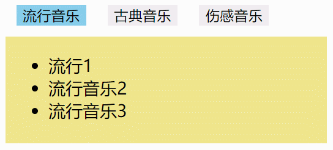

- App 根组件

```html
<script setup>
  import { reactive, ref } from 'vue'
  import Tab from './components/Tab.vue'
  const index = ref(0)
  const obj1 = reactive({
    title: '流行音乐',
    list: ['流行1', '流行音乐2', '流行音乐3'],
  })

  const obj2 = reactive({
    title: '古典音乐',
    list: ['古典音乐1', '古典音乐2', '古典音乐3'],
  })

  const obj3 = reactive({
    title: '伤感音乐',
    list: ['伤感音乐1', '伤感音乐2', '伤感音乐3'],
  })
</script>

<template>
  <div class="tab">
    <button :class="{ active: index === 0 }" @click="index = 0">流行音乐</button>
    <button :class="{ active: index === 1 }" @click="index = 1">古典音乐</button>
    <button :class="{ active: index === 2 }" @click="index = 2">伤感音乐</button>
  </div>
  <div class="tab-content">
    <Transition>
      <Tab :title="obj1.title" :list="obj1.list" v-if="index === 0" />
      <Tab :title="obj2.title" :list="obj2.list" v-else-if="index === 1" />
      <Tab :title="obj3.title" :list="obj3.list" v-else-if="index === 2" />
    </Transition>
  </div>
</template>

<style>
  button {
    border: none;
    margin: 10px;
  }

  .active {
    background-color: skyblue;
  }

  .tab-content {
    position: relative;
    height: 100px;
    overflow: hidden;
  }

  /* 
    .tab-item {
    width: 300px;
    height: 100px;
    background-color: khaki;
    position: absolute;

    } */

  .v-enter-from {
    transform: translateY(100px);
    opacity: 0;
  }

  .v-enter-active,
  .v-leave-active {
    transition: all 1s ease;
  }

  .v-leave-to {
    opacity: 0;
    transform: translateY(-100px);
  }
</style>
```

- Tab 子组件

```html
<script setup>
  <!--声明父组件传递的props  title属性没有声明，会自动透传-->
  const { list } = defineProps(['list'])
</script>

<template>
  <div class="tab-item">
    <ul>
      <li v-for="item in list">{{ item }}</li>
    </ul>
  </div>
</template>

<style scoped>
  .tab-item {
    width: 300px;
    height: 100px;
    background-color: khaki;
    position: absolute;
  }
</style>
```

## 二、实战应用：开发 Message 组件

本小节我们一起来开发《Message 组件》，通过调用 JS 方法来实现组件的挂载

```vue
<button
  @click="Message({
                type: 'message',
                message: 'this is a message'
                duration:3000
                })"
>
  message
</button>

<button
  @click="
    Message({
      type: 'success',
      message: 'this is a success',
    })
  "
>
  success
</button>

<button
  @click="
    Message.warning({
      message: 'this is a warning',
    })
  "
>
  warning
</button>

<button
  @click="
    Message.error({
      message: 'this is a error',
    })
  "
>
  error
</button>
```

> 当点击对应按扭后，就会调用 Message 方法来实现组件挂载，具体效果如下：

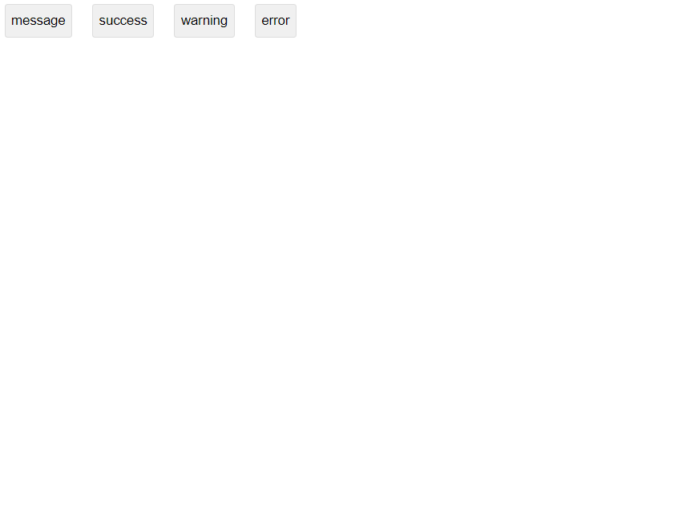

### 1、项目介绍

首先我们来了解：项目功能、项目涉及核心知识点、学习目标

### 1.1、项目功能

- Message 组件有**成功**、**警告**、**消息**、**错误** 四种样式，显示不同的操作反馈
- 提示框显示与离开都伴有动画效果
- 同时显示多个提示框，会有序的从上往下排列，前面元素离开后，后面元素会缓慢的向上移动

### 1.2、项目涉及核心知识点

| 知识分类           | 涉及内容                                                                                                         |
| :----------------- | :--------------------------------------------------------------------------------------------------------------- |
| Vue 基础（组合式） | 插值语法、`reactive`、`ref`、事件监听、样式绑定、`v-show` 指令、`<Transition>`内置组件、`createApp` 创建应用实例 |
| 组件间通信         | `defineProps`、`defineExpose`                                                                                    |
| 其它知识           | `async/await` 、`Promise`、`setTimeout`、`clearTimeout` 数组方法：`forEach`、`findIndex`                         |

### 1.3、学习目标

- 了解 createApp 方法的应用技巧
- 学习通过 JS 方法来实现组件挂载

### 1.4、项目开发思路

根据项目的功能分析该项目的开发思路，具体实现思路如下：

- 创建`<Message>`组件，组件的 UI 显示有 4 种不同的状态，并且组件显示与离开都有动画效果。
- 创建 Message 方法，该方法接受一个对象作为参数，当调用该方法或该方法的静态方法（Message.success/message/error/warning）都可以实现 Message 组件的挂载
- Message 组件挂载成功后，以动画形式显示
- Message 组件挂载成功后，过 3000ms 或 xxx 时间则以动画形式消失
- 当同时有多个 Messag 组件挂载后，后面的组件的按顺序在其它组件后面显示
- 当前面的组件消失后，后面组件会有序的缓慢向前移动。

### 2、项目开发流程

深入浅出 Message 组件的开发流程

### 2.1、分析 UI 图

在这个项目中，只有 一个 Message 组件，所以不涉及组件的拆分。

### 2.2、实现 Message 组件

根据 UI 图，利用`html+css`实现静态布局，同时要把所有的交互效果用到的 CSS 样式也要写好。并且要清楚的知道每一个交互背后的实现逻辑。

- 组件显示与离开都有动画效果，可以利用`<Transition>`组件来实现
- 当前面的组件卸载后，后面的组件缓慢向前移动，可以利用 CSS3 的 transition 来实现过渡动画

```html
<script setup>
  import { ref } from 'vue'
  // 控制元素的显示与隐藏
  const isShow = ref(false)

  // 模拟修改isShow的值来触发动画
  setTimeout(() => {
    isShow.value = true
    setTimeout(() => {
      isShow.value = false
    }, 2000)
  }, 1000)
</script>
<template>
  <Transition name="slide">
    <!-- 
            弹窗显示的内容和4种UI状态由：
            Message({type:'message',message:'this is a message'}) 函数传入的参数决定
			-->
    <div class="ibc-message message" v-show="isShow">this is a message</div>
    <!-- 
            <div class="ibc-message success"> this is a success</div>
            <div class="ibc-message warning"> this is a warning</div>
            <div class="ibc-message error"> this is a error</div> 
		--></Transition>
</template>
<style scoped lang="scss">
  .ibc-message {
    min-width: 200px;
    height: 35px;
    line-height: 35px;
    position: fixed;
    top: 20px;
    left: 50%;
    text-align: center;
    background-color: #ddd;
    transform: translateX(-50%);
    border-radius: 3px;
    /* 元素本身一直有过渡动画效果 */
    transition: top 0.5s ease;

    &.message {
      background-color: #e9e9eb;
      color: #73767a;
      border: 1px solid #dedfe0;
    }

    &.success {
      background-color: #e1f3d8;
      color: #529b2e;
      border: 1px solid #d1edc4;
    }

    &.warning {
      background-color: #faecd8;
      color: #b88230;
      border: 1px solid #f8e3c5;
    }

    &.error {
      background-color: #fde2e2;
      color: #c45656;
      border: 1px solid #fcd3d3;
    }
  }

  .slide-enter-from,
  .slide-leave-to {
    transform: translate(-50%, -20px);
    opacity: 0;
  }

  .slide-enter-active,
  .slide-leave-active {
    transition: all 0.5s ease;
  }

  /*
    .slide-enter-to {
        transform: translateY(0);
        opacity: 1;
    }
    */
</style>
```

**测试代码：**

- 在 App 组件中使用 Message 组件

```html
<script setup>
  import Message from './components/Message/Message.vue'
</script>
<template>
  <Message></Message>
</template>
```

### 2.2、实现 Message 方法基本框架

- 在`App.vue`组件中，创建 4 个按扭，点击不同按扭分别调用 Message 方法或 Message 身上的静态方法，显示 4 种不同状态的提示框

```html
<script setup>
  // 以下代码相当于导入 src/components/Message/index.js
  import Message from './components/Message'
</script>
<template>
  <button
    @click="Message({
                    type: 'message',
                    message: 'this is a message'
                    })"
  >
    message
  </button>

  <button
    @click="Message({
                    type: 'success',
                    message: 'this is a success'
                    })"
  >
    success
  </button>

  <button
    @click="Message.warning({
                    message: 'this is a warning'
                    })"
  >
    warning
  </button>

  <button
    @click="Message.error({
                    message: 'this is a error'
                    })"
  >
    error
  </button>
</template>
<style scoped>
  button {
    line-height: 30px;
    margin: 10px;
    border: 1px solid #ddd;
    border-radius: 3px;
    cursor: pointer;
  }
</style>
```

- 在`./src/Message/index.js`中，定义`Message`方法，和`Message`身上的静态方法，然后对外默认暴露 Message 方法

```js
// 创建Message方法，用来实现Message组件挂载
function Message(options) {
  console.log(options)
}

// 为Message添加以下四个静态方法
;['message', 'success', 'warning', 'error'].forEach((item) => {
  Message[item] = function (options) {
    options.type = item
    Message(options)
  }
})
export default Message
```

### 2.3、Message 方法实现组件挂载

当调用 Message 方法时，需要将 Message 组件挂载到页面中。需要分以下几步：

- 利用 createApp 来创建 Message 的应用实例 MessageApp，createApp 的第二个参数相当于传递给组件 Message 的 props。则可以在 Message 组件中接受传过来的 props。
- 利用`document.createDocumentFragment()`方法创建文档碎片
- 调用`MessageApp.mount()`方法，将 Message 组件挂载到`fragment`中，得到返回值 vm 组件实例
- 利用`document.body.appendChild(fragment)`，将文档碎片（即 Message 组件）添加到页面。

```js
import { createApp } from 'vue'
import MessageCom from './Message.vue'

// 创建Message方法，用来实现Message组件挂载
function Message(options) {
  // 创建Message应用实例，并挂载到页面中
  const MessageApp = createApp(MessageCom, options)
  showMessage(MessageApp, options)
}

// 为Message添加以下四个静态方法
;['message', 'success', 'warning', 'error'].forEach((item) => {
  Message[item] = function (options) {
    options.type = item
    Message(options)
  }
})

// options要往后传，后面需要用到从显示到离开需要的延迟时间
function showMessage(app, options) {
  // 创建文档碎片
  const fragment = document.createDocumentFragment()
  // 将组件挂载到文档碎片，返回组件实例vm
  const vm = app.mount(fragment)
  // 将文档碎片，即（Message）组件挂载到页面中
  document.body.appendChild(fragment)
}
export default Message
```

- Message 组件中接受传递的 props

```html
<script setup>
  import { ref } from 'vue'
  // 控制元素的显示与隐藏
  const isShow = ref(false)
  // 声明接受的props，即createApp(MessageCom,options) 方法的options参数的属性
  defineProps({
    type: {
      type: String,
      default: 'message',
      /* 校验 */
      validator(value) {
        return ['message', 'success', 'warning', 'error'].includes(value)
      },
    },
    message: {
      type: String,
      default: 'this is a message',
    },
  })

  // 模拟修改isShow的值来触发动画
  setTimeout(() => {
    isShow.value = true
    setTimeout(() => {
      isShow.value = false
    }, 2000)
  }, 1000)
</script>
<template>
  <Transition name="slide">
    <div class="ibc-message" :class="type" v-show="isShow">{{ message }}</div>
  </Transition>
</template>
```

> 以上代码最终实现效果，当点击对应按扭，会显示对应的提示框，如下：

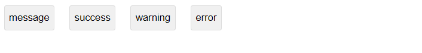

注：

但是，组件的显示与隐藏是通过定时器来模拟控制的。

实际上，我们在将组件挂载到页面后就要将 Message 组件的 isShow 设置为 true，在规定的延迟时间到了后，才将组件从页面移除。

### 2.4、实现显示组件

- 一开始 Message 组件中的`isShow = false`，所以 Message 组件挂载到页面后，并不会显示，则需要设置`isShow = true`。
- 在 Message 组件中创建`setShow`方法，用来设置`isShow`属性的值，然后将该方法通过`defineExpose`对外暴露

```js
// 控制元素显示与隐藏
function setShow(value) {
  isShow.value = value
}
// 对外暴露一些公共属性
defineExpose({
  setShow,
})
```

> 在`index.js`中,`showMessage`方法中调用 setShow 方法来显示组件

```js
function showMessage(app, options) {
  // .......
  // 显示
  vm.setShow(true)
}
```

### 2.5、实现卸载组件

- 我们可以创建`hideMessage`方法，在规定的延迟时间到达后，用来卸载对应的 Message 组件
- 卸载组件时要保证先完成离开动画，然后再卸载组件

```js
function showMessage(app, options) {
  // .....
  // 显示
  vm.setShow(true)
  // 隐藏  在规定的延迟时间到达后再隐藏，所以要传入options.duration，同时在调用
  // Message({ duration:2000 }) 方法时可以传入duration选项
  hideMessage(app, vm, options.duration)
}
// 隐藏组件
function hideMessage(app, vm, duration) {
  vm.timer = setTimeout(() => {
    // 隐藏
    vm.setShow(false)
    // 卸载
    app.unmount()
    clearTimeout(vm.timer)
    vm.timer = null
  }, duration || 2000)
}
```

注：

- 显然在`hideMessage`方法中，调用`vm.setShow(false)`方法隐藏组件时，动画还没有执行完，组件就被卸载了，上面的代码显示是不行的。
- 我们需要等待动画执行完再卸载组件，所以我们可以修改`setShow()`方法，在该方法中返回一个`Promise`对象，在组件动画执行完后，调用`Promise`的 resolve 方法。
- 然后在`Promise`的 then 方法中来卸载组件

```js
// 控制元素显示与隐藏
function setShow(value) {
  // 触发动画
  isShow.value = value
  return new Promise((resolve, reject) => {
    timer = setTimeout(() => {
      // 动画结束了，调resolve
      clearTimeout(timer)
      resolve()
    }, 500)
  })
}

// 移除应用实例（在移除前要先触发动画）
function hideMessage(app, vm, duration) {
  vm.timer = setTimeout(async () => {
    await vm.setShow(false)
    // 卸载
    app.unmount()
    clearTimeout(vm.timer)
    vm.timer = null
  }, duration || 2000)
}
```

### 2.6、计算元素的 Top 值

- 创建一个数组`messageArr = []`用来保存当前创的所有 vm 组件实例
- 每创建一个新的 vm，将 vm 添加 push 到 messageArr 数组中，每当有一个 vm 被卸载，则从数组中移除
- 然后根据 vm 在数组`messageArr`中的索引来计算当前 vm 元素的 top 值
- 在 Message 组件中动态绑`style = '{top: top + 'px'}` 样式，来设置 top 的值， 同时暴露`setTop`方法来修改 top 的值。

Message 组件

```html
<script setup>
  const top = ref(20)

  // 设置top值
  function setTop(value) {
    top.value = value
  }

  // 对外暴露一些公共属性
  defineExpose({
    setShow,
    setTop,
  })
</script>

<template>
  <div class="ibc-message" :class="type" v-show="isShow" :style="{ top: top + 'px' }">
    {{ message }}
  </div>
</template>
index.js // 存放存放的Message组件实例 const messageArr = reactive([]); function showMessage(app,
duration) { // 组件实例 const vm = app.mount(fragment); // 将vm组件实例添加到数组中
messageArr.push(vm); document.body.appendChild(fragment); // 设置top值 setTop(vm); //
创建侦听器，只要messageArr中的成员有变化，就需要重新设置top的值 watch(messageArr, () => {
setTop(vm); }); } // 设置提示框与顶部的距离 function setTop(vm) { // 设置message显示的top值 const
index = messageArr.findIndex((item) => item === vm); console.log(messageArr); const top = 20 + index
* 60; vm.setTop(top); } // 当vm卸载时，要从数组中移除 // 移除应用实例（在移除前要先触发动画）
function hideMessage(app, vm, duration) { vm.timer = setTimeout(async () => { await
vm.setShow(false); // 从数组中移除vm --------- const index = messageArr.findIndex((item) => item ===
vm); messageArr.splice(index, 1); // 卸载 app.unmount(); clearTimeout(vm.timer); vm.timer = null; },
duration || 2000); }
```

### 3、完整版代码

- `App.vue`

```html
<script setup>
  import Message from './components/Message'
</script>
<template>
  <button
    @click="Message({
        type: 'message2',
        message: 'this is a message'
    })"
  >
    message
  </button>

  <button
    @click="Message({
        type: 'success',
        message: 'this is a success'
    })"
  >
    success
  </button>

  <button
    @click="Message.warning({
        message: 'this is a warning'
    })"
  >
    warning
  </button>

  <button
    @click="Message.error({
        message: 'this is a error'
    })"
  >
    error
  </button>
</template>
<style scoped>
  button {
    line-height: 30px;
    margin: 10px;
    border: 1px solid #ddd;
    border-radius: 3px;
    cursor: pointer;
  }
</style>
```

- `index.js`

```js
import MessageCom from './Message.vue'
import { createApp, reactive, watch } from 'vue'

// 存放存放的Message组件实例
const messageArr = reactive([])

function Message(options) {
  // 创建Message应用实例，并挂载到页面中
  const MessageApp = createApp(MessageCom, options)
  showMessage(MessageApp, options.duration)
}

// 为Message添加以下四个静态方法
;['message', 'success', 'warning', 'error'].forEach((item) => {
  Message[item] = function (options) {
    options.type = item
    Message(options)
  }
})

// 显示提示框
function showMessage(app, duration) {
  const fragment = document.createDocumentFragment()
  // 组件实例
  const vm = app.mount(fragment)
  // 将vm组件实例添加到数组中
  messageArr.push(vm)
  document.body.appendChild(fragment)

  setTop(vm)
  watch(messageArr, () => {
    setTop(vm)
  })
  // 显示
  vm.setShow(true)

  // 隐藏
  hideMessage(app, vm, duration)
}

// 移除应用实例（在移除前要先触发动画）
function hideMessage(app, vm, duration) {
  vm.timer = setTimeout(async () => {
    await vm.setShow(false)
    // 从数组中移除vm
    const index = messageArr.findIndex((item) => item === vm)
    messageArr.splice(index, 1)
    // 卸载
    app.unmount()
    clearTimeout(vm.timer)
    vm.timer = null
  }, duration || 2000)
}

// 设置提示框与顶部的距离
function setTop(vm) {
  // 设置message显示的top值
  const index = messageArr.findIndex((item) => item === vm)
  console.log(messageArr)
  const top = 20 + index * 60
  vm.setTop(top)
}

export default Message
```

- `Message.vue`

```html
<script setup>
  import { computed, ref } from 'vue'
  const isShow = ref(false)
  const top = ref(20)
  const timer = ref(null)
  defineProps({
    type: {
      type: String,
      default: 'message',
      /* 校验 */
      validator(value) {
        return ['message', 'success', 'warning', 'error'].includes(value)
      },
    },
    message: {
      type: String,
      default: 'this is a message',
    },
  })

  function setShow(value) {
    // 触发动画
    isShow.value = value
    return new Promise((resolve, reject) => {
      timer.value = setTimeout(() => {
        // 动画结束了，调resolve
        clearTimeout(timer)
        resolve()
      }, 500)
    })
  }

  // 设置top值
  function setTop(value) {
    top.value = value
  }
  // 对外暴露一些公共属性
  defineExpose({
    setShow,
    setTop,
  })
</script>
<template>
  <Transition name="slide">
    <div class="ibc-message" :class="type" v-show="isShow" :style="{ top: top + 'px' }">
      {{ message }}
    </div>
  </Transition>
</template>
<style scoped lang="scss">
  .ibc-message {
    min-width: 200px;
    height: 35px;
    line-height: 35px;
    position: fixed;
    top: 20px;
    left: 50%;
    text-align: center;
    background-color: #ddd;
    transform: translateX(-50%);
    border-radius: 3px;
    transition: top 0.5s ease;

    &.message {
      background-color: #e9e9eb;
      color: #73767a;
      border: 1px solid #dedfe0;
    }

    &.success {
      background-color: #e1f3d8;
      color: #529b2e;
      border: 1px solid #d1edc4;
    }

    &.warning {
      background-color: #faecd8;
      color: #b88230;
      border: 1px solid #f8e3c5;
    }

    &.error {
      background-color: #fde2e2;
      color: #c45656;
      border: 1px solid #fcd3d3;
    }
  }

  .slide-enter-from,
  .slide-leave-to {
    transform: translate(-50%, -20px);
    opacity: 0;
  }

  .slide-enter-active,
  .slide-leave-active {
    transition: all 0.5s ease;
  }
</style>
```

## 三、`<TransitionGroup>` 内置组件

通过前面的学习，我们知道`<Transition>`组件只能应用单个元素或单个单根组件。

> 如果要实现同时多个元素的过渡动画效果，如下图所示：


注：

单个`<Transition>`是没有办法做到的，除非把上面四个元素，每个元素用一个`<Transition>`包裹，当然这样做是非常麻烦的，而`<TransitionGroup>` 内置组件可以轻松帮我们做到。

- `<TransitionGroup>`是一个内置组件，他主要用于**多个元素**的过渡效果。
- 常用于对 `v-for` 列表中的元素或组件的插入、移除和顺序改变添加动画效果。
- `<TransitionGroup>` 支持和 `<Transition>` 基本相同的 props、CSS 过渡 class 和 JavaScript 钩子监听器，不过还存在一些不同点。

### 1、`<TransitionGroup>`与`<Transition>`的不同

- 可以为`<TransitionGroup>`组件传入`tag`prop 来指定一个元素作为容器元素来渲染

```html
<div class="container">
  <TransitionGroup tag="div"></TransitionGroup>
</div>

<!-- 以上代码，最终渲染成如下-->
<div class="container">
  <div></div>
</div>

<!--如果没有加tag属性，则渲染如下-->
<div class="container"></div>
```

- **过渡模式（`mode = "out-in"`）** 在这里不可用，因为我们不再是在互斥的元素之间进行切换。

```html
<!--以下为错误写法，TransitionGroup 并不支持mode属性-->
<TransitionGroup mode="out-in"></TransitionGroup>
```

- 列表中的每个元素都**必须**有一个独一无二的 `key` attribute

```html
<!--如果div元素身上没有Key属性，或每个key不是唯一的，都是错误写法，在控制台会抛出警告-->
<TransitionGroup>
  <div :key="1">1</div>
  <div :key="2">2</div>
  <div :key="3">3</div>
</TransitionGroup>
```

- CSS 过渡 class 会被应用在列表内的元素上，**而不是**容器元素上。

```html
<script setup>
  import { ref } from 'vue'
  const show = ref(true)
</script>

<template>
  <button @click="show = !show">切换</button>
  <div class="container">
    <TransitionGroup tag="div">
      <div :key="1" v-show="show">1</div>
      <div :key="2" v-show="show">2</div>
      <div :key="3" v-show="show">3</div>
    </TransitionGroup>
  </div>
</template>
<style>
  .v-enter-from,
  .v-leave-to {
    opacity: 0;
  }

  .v-enter-active,
  .v-leave-active {
    transition: opacity 1s ease;
  }
</style>
```

> 最终过渡 class 会应用`.container div div`元素上，具体效果如下：

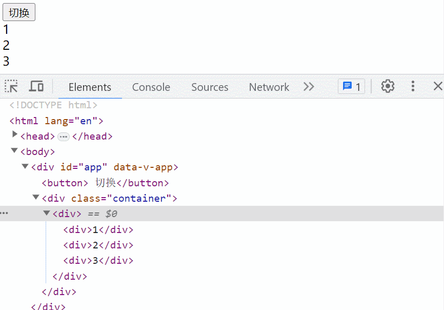

### 2、实战应用：多元素延迟淡入淡出动画

接下来我们利用`<TransitionGroup>`组件实现如下动画效果。

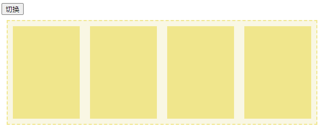

**完整版代码**

```html
<script setup>
  import { ref } from 'vue'
  const show = ref(true)
</script>

<template>
  <button @click="show = !show">切换</button>
  <div class="container">
    <TransitionGroup :duration="2600">
      <div class="item" v-show="show" :key="1" style="--delay:0s"></div>
      <div class="item" v-show="show" :key="2" style="--delay:0.2s"></div>
      <div class="item" v-show="show" :key="3" style="--delay:0.4s"></div>
      <div class="item" v-show="show" :key="4" style="--delay:0.6s"></div>
    </TransitionGroup>
  </div>
</template>

<style>
  .container {
    display: flex;
    width: 600px;
    height: 200px;
    margin: 10px;
    border: 2px dashed khaki;
    background-color: rgb(249, 247, 228);
    overflow: hidden;
  }

  .container .item {
    flex: 1;
    margin: 10px;
    background-color: khaki;
  }

  .v-enter-from,
  .v-leave-to {
    opacity: 0;
    transform: translateY(100px);
  }

  .v-enter-active,
  .v-leave-active {
    transition: all 2s ease var(--delay);
  }
</style>
```

> 最终效果如下：

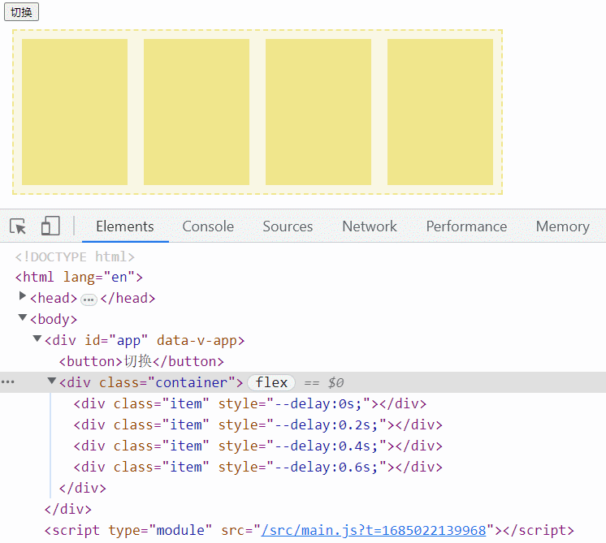

代码解析：

- `duration="2600"` 属性一定要加（值为整个动画从开始到结束的时间）
- 如果不加，每个元素自身动画结束后，就会立即隐藏，这样会造成后面元素向前移动，引发布局混乱。
- `duration="2600"`表示在 2.6s 后（所有动画都结束了）一次性隐藏所有元素
- 每个`item`元素的 key 属性一定要加，并且值还不能一样（这是 Vue 规定的）
- `item`元素身上的`--delay`属性为自义 css 属性，用来表示每个元素执行动画前的延迟时间。

**重点观察**

- 我们重点观察控制台中每个`item`元素身上 class 的变化
- 我们发现过渡 class 加在了每个元素身上，每个元素身上的过渡 class 是同一时间被加上的。
- 还有每个元素身上的 class 是在同一时间被删除，同一时间被删除主要是受`duration="2600"`属性的影响。

### 2.1、优化版：多元素延迟淡入淡出动画

在实际的开发中，我们肯定是希望所有内部元素的动画执行完成后，再把外部元素也给隐藏或移除掉。

> 如下效果：

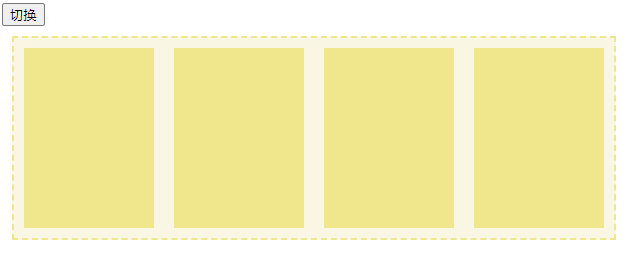

我们可以借助`<Transition>`组件来实现，把`.container`元素包裹在`<Transition>`组件中，具体实现如下：

```html
<script setup>
  import { ref } from 'vue'
  const show = ref(true)
</script>

<template>
  <button @click="show = !show">切换</button>
  <!-- 
	name值随便取，因为container本身并不会动画效果，取名是为了让其不要应用v-enter-from等
class
	:duration="2800" 也是为了保证内部元素所有动画结束后，再隐藏，或在动画开始前先显示。
-->
  <Transition :duration="2600" name="xx">
    <div class="container" v-show="show">
      <TransitionGroup :duration="2600">
        <div class="item" v-show="show" :key="1" style="--delay:0s"></div>
        <div class="item" v-show="show" :key="2" style="--delay:0.2s"></div>
        <div class="item" v-show="show" :key="3" style="--delay:0.4s"></div>
        <div class="item" v-show="show" :key="4" style="--delay:0.6s"></div>
      </TransitionGroup>
    </div>
  </Transition>
</template>

<style>
  .container {
    display: flex;
    width: 600px;
    height: 200px;
    margin: 10px;
    border: 2px dashed khaki;
    background-color: rgb(249, 247, 228);
    overflow: hidden;
  }

  .container .item {
    flex: 1;
    margin: 10px;
    background-color: khaki;
  }

  .v-enter-from,
  .v-leave-to {
    opacity: 0;
    transform: translateY(100px);
  }

  .v-enter-active,
  .v-leave-active {
    transition: all 2s ease var(--delay);
  }
</style>
```

### 2.2、最终优化版：多元素延迟淡入淡出动画

一般列表内容在实际开发中是通过`v-for`列表来渲染的，所以我们把内容改成通过`v-for`来渲染。

```html
<script setup>
  import { reactive, ref } from 'vue'
  const show = ref(true)
  const list = reactive([1, 2, 3, 4])
</script>

<template>
  <button @click="show = !show">切换</button>
  <Transition :duration="2800" name="fade">
    <div class="container" v-show="show">
      <TransitionGroup :duration="2800" appear>
        <div
          class="item"
          v-for="(item, index) in  list "
          v-show="show"
          :key="index"
          :style="{ '--delay': 0.2 * index + 's' }"
        ></div>
      </TransitionGroup>
    </div>
  </Transition>
</template>

<style>
  .container {
    width: 600px;
    height: 200px;
    overflow: hidden;
    margin: 10px;
    border: 2px dashed khaki;
    background-color: rgb(249, 247, 228);
    display: flex;
  }

  .container .item {
    flex: 1;
    margin: 10px;
    background-color: khaki;
  }

  .v-enter-from,
  .v-leave-to {
    opacity: 0;
    transform: translateY(100px);
  }

  .v-enter-active,
  .v-leave-active {
    transition: all 2s ease var(--delay);
  }
</style>
```

> 你也可以结合 JS 钩子函数与 css 过渡一起来实现此延迟动画

```html
<script setup>
  import { reactive, ref } from 'vue'
  const show = ref(true)
  const list = reactive([1, 2, 3, 4])

  function onEnter(el, done) {
    // const delay = el.dataset.index * 0.2 + "s";
    // el.style.transition = `all 2s ease ${delay}`
  }
  function onLeave(el, done) {
    /* 通过自定义属性，来计算每个元素的延迟时间*/
    const delay = el.dataset.index * 0.2 + 's'
    /* 添加过渡效果 */
    el.style.transition = `all 2s ease ${delay}`
  }
</script>

<template>
  <button @click="show = !show">切换</button>
  <Transition :duration="2800" name="fade">
    <div class="container" v-show="show">
      <!--添加 @leave="onLeave" -->
      <TransitionGroup :duration="2800" @leave="onLeave">
        <!-- data-index自定义属性-->
        <div
          class="item"
          v-for="(item, index) in  list "
          v-show="show"
          :key="index"
          :data-index="index"
        ></div>
      </TransitionGroup>
    </div>
  </Transition>
</template>

<style>
  .container {
    width: 600px;
    height: 200px;
    overflow: hidden;
    margin: 10px;
    border: 2px dashed khaki;
    background-color: rgb(249, 247, 228);
    display: flex;
  }

  .container .item {
    flex: 1;
    margin: 10px;
    background-color: khaki;
  }

  .v-enter-from,
  .v-leave-to {
    opacity: 0;
    transform: translateY(100px);
  }

  .v-enter-active,
  .v-leave-active {
    /* transition: all 2s ease var(--delay); */
  }
</style>
```

### 3、实战应用：列表添加、删除、排序元素时动画

接下来，我们利用`<TransitionGroup>`组件实现如下动画效果

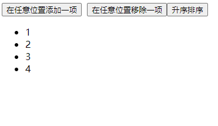

```html
<script setup>
  import { ref, reactive } from 'vue'
  const list = reactive([1, 2, 3, 4])
  let len = list.length
  // 根据数组长度，产生0-小于数组长度内的随机整数，用来作为随机删除的元素下标
  function randomIndex() {
    return Math.floor(Math.random() * list.length)
  }
  // 随机位置插入比当前数组长度>1的整数
  function add() {
    len++
    list.splice(randomIndex(), 0, len)
  }
  // 根据随机生成的下标，随机删除数组中的一位元素
  function remove() {
    list.splice(randomIndex(), 1)
  }
  // 对数组中元素升序排序
  function sort() {
    list.sort((a, b) => {
      return a - b
    })
  }
</script>

<template>
  <button @click="add">在任意位置添加一项</button>
  &nbsp;
  <button @click="remove">在任意位置移除一项</button>
  <button @click="sort">升序排序</button>
  <TransitionGroup tag="ul">
    <li v-for="item in list" :key="item">{{ item }}</li>
  </TransitionGroup>
</template>

<style>
  .v-enter-from,
  .v-leave-to {
    opacity: 0;
    transform: translateX(30px);
  }

  .v-enter-active,
  .v-leave-active {
    transition: all 1s ease;
  }
</style>
```

> 以上代码最终实现效果如下

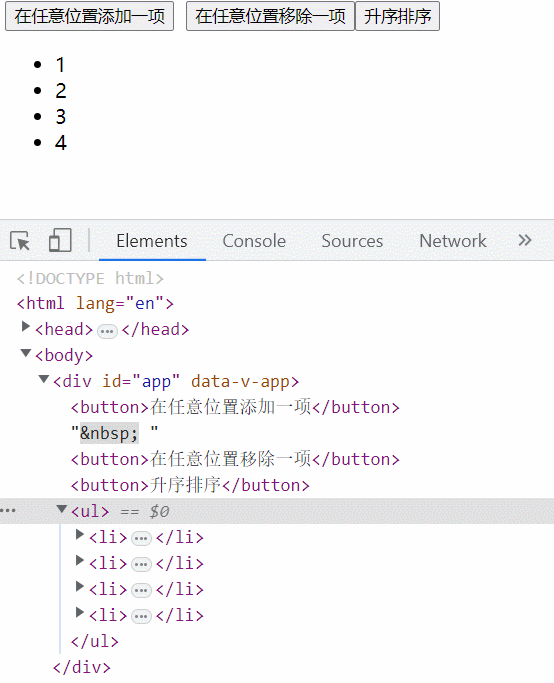

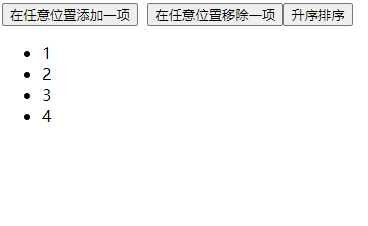

> 以上效果与我们最终想要的效果，明显有很大的差异

两处不同差异：

- 当某一项被插入或移除时，它周围的元素会立即发生“跳跃”而不是平稳地移动
- 当我们对现有元素排序时，并没有看到动画效果，直接展示排序后效果

**差异产生的原因在于：**

- vue 只给添加或移除的元素添加的过渡 class，对于排序的元素也没有加。（观察上图中控制台中元素 class 变化可以看到）

> 要解决以上问题，可以通过添加一些额外的 CSS 规则来解决这个问题

- 添加如下`.v-move` class ,`.v-move`将应用于所有（移动中）布局发生变化的元素，用来实现其过渡效果
- 针对离开的元素，在离开的一瞬间将其设置为绝对定位，脱离文档流，这样后面的元素就会发生布局上的变化，从而触发了过渡效果。

```css
.v-move,  /* 对移动中的元素应用的过渡 */
.v-enter-active,
.v-leave-active {
  transition: all 1s ease;
}

/* 确保将离开的元素从布局流中删除
  以便能够正确地计算移动的动画。 */
.v-leave-active {
  position: absolute;
}
```

### 3.1、优化版：列表添加、删除、排序元素时动画

```html
<script setup>
  import { ref, reactive } from 'vue'
  const list = reactive([1, 2, 3, 4])
  let len = list.length
  // 根据数组长度，产生0-小于数组长度内的随机整数，用来作为随机删除的元素下标
  function randomIndex() {
    return Math.floor(Math.random() * list.length)
  }
  // 随机位置插入比当前数组长度>1的整数
  function add() {
    len++
    list.splice(randomIndex(), 0, len)
  }
  // 根据随机生成的下标，随机删除数组中的一位元素
  function remove() {
    list.splice(randomIndex(), 1)
  }
  // 对数组中元素升序排序
  function sort() {
    list.sort((a, b) => {
      return a - b
    })
  }
</script>

<template>
  <button @click="add">在任意位置添加一项</button>
  &nbsp;
  <button @click="remove">在任意位置移除一项</button>
  <button @click="sort">升序排序</button>
  <TransitionGroup tag="ul">
    <li v-for="item in list" :key="item">{{ item }}</li>
  </TransitionGroup>
</template>

<style>
  .v-enter-from,
  .v-leave-to {
    opacity: 0;
    transform: translateX(30px);
  }

  .v-move,
  .v-enter-active,
  .v-leave-active {
    transition: all 1s ease;
  }

  /* 确保将离开的元素从布局流中删除
    以便能够正确地计算移动的动画。 */
  .v-leave-active {
    position: absolute;
  }
</style>
```

> 优化后，最终效果如下：

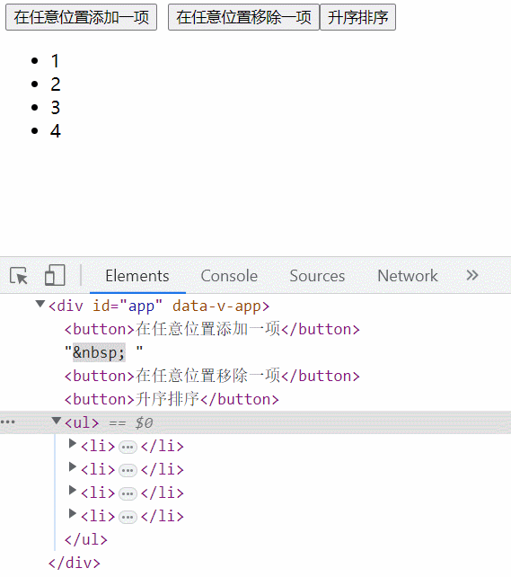

> 注意观察控制台中元素 class 的变化。

### 4、总结

`<TransitionGroup>` 支持和 `<Transition>` 基本相同的 props、CSS 过渡 class 和 JavaScript 钩子监听器，不过还存在以下不同：

- 可以为`<TransitionGroup>`组件传入`tag`prop 来指定一个元素作为容器元素来渲染
- `<TransitionGroup>`组件中列表的每个元素都**必须**有一个独一无二的 `key` attribute
- CSS 过渡 class 会被应用在列表内的元素上，**而不是**容器元素上。
- **过渡模式（`mode = "out-in"`）** 在这里不可用

**列表元素被触发动画的机制**

- 元素被移除或插入时会添加对应的 Class，触发动画
- 元素被显示与隐藏时会添加对应的 Class，触发动画
- 多个元素发生动画时，自身动画结束后就会被移除或隐藏，如果想所有元素动画都执行完再隐藏或移除，可以添加 `duration`prop 来指定动画结束时间

> 在刚开始执行动画时，列表中的其它元素的位置发生如果发生改变，则会添加`.move` Class，可以在`.move`中添加过渡动画，让整个变化有动画效果

- 在移除或隐藏元素时，要保证后面元素有过渡动画，可以`.v-leave-active`中添加`position:absolute`这样出场动画刚执行时后面的元素就会发生位移，然后被添加.move Class。

## 四、其它动画

深入浅出基于 css class 的动画 和 基于侦听器的动画实践应用。

### 1、基于 css class 的动画

对于不是正在进入或离开的 DOM 元素，我们可以通过给元素动态添加 CSS class 来触发动画

**元素颤抖效果**

> 当点击某个元素时，元素会颤抖，如下图所示：

![GIF2023-7-2521-15-35](data:image/gif;base64,R0lGODlh4QARASIAACH5BAAyAAAAIf8LTkVUU0NBUEUyLjADAQAAACwAAAAA4QARAaDw5oz///8C/4yPqcvtD6OctNqLs968+w+G4kiW5omm6sq27gvH8kzX9o3n+s73/g8MCocZgPGITCqXzKbzCY1Kp9Sq9ersYLfcrvcLDkO14rL5jE5Tyeq2+w23suP0ur09v+v3fDmnDxgoqJQ3aHgYV4i4yFim2AgZefUoWWnZRHmpqZm56RnZ+SmKGDpqGlh6qqqXuuqa+PcqC9g6a2tWe6v7lbvri9X7KzwVPGycFXus3FW87AzQ/KwcLW1MXS18je2rva3b7W0LHi47Tu5qfq6arm7K3i76Du8pP8+ZbF9dn1+5zw+K798yfwIZESxIKiDCYQcXDmroEJXCiLsgUuRj8SKrif8aZ2XsWOcjSFgbRlbkaHIdypTuVrKM5/IlvZgy75WsiY4mzn46dwK86bMl0KAwhxKdafSoTQ1KizJtivQp1KVFplLFYPXqhayXRHL1k/TrIq9iifUsuzEs2odn14Zs65ak1LiGyNJlYvcuIbh61eTte+QvYGh8B+MqbFiMYMCL+zbW+/huZLqT41Z2e3ltZrSby3YW+/lraK6js5a2enpqaqirm7ZW+vpobKKzg9b2eXtnbpy7a/aW+ftlcJbDUxY3eXxkcpDLOzbX+PxidIrTI1Z3eH1hdoTbC3YX+P1feH7j85W3d35eenjr27VX9/5cfHLzw9X3dn9bfmz79SH/TgxGf9II+AyBzhg40H8AeoHgNAouyEWDx0hozYMQAmPhhWDNpSEcFDKUYYdmqSUiGh9mE2KJY6SoIjIktqgYizAuceIvNXIj44xJ3HjSizoymOOPRvD4TZBCEnkLkuIY+aOSHjGpo5PlQDmjlK9YmZOPQm6B5SpdqqTllpNQCeOXp5gpFIdi8kJmi2iO8qZTVa0ZRpyf2BnVnHSyGeaeUuC5CaBaWeBngG2qKGhXh5aYqCWN8tRnoU88KgmlP6kp6YZ6ZjpmpJzSuKiIlkIyaiOlGhRqh6eOlaqGqybk6ac7tnrhq4fYWhetEOLKVqyyBqbrgrwKMqxEvv5K2LG/YBZLS7AAMtsHtBg5m5i0e1ibFqbITkqtYdje8a0d4b6lrKzj0nGuXJtuu2K5nxIBb7zyzktvvfbei2+++u7Lb7/+/gtwwAIPTHDBBh+McMIKL8xwww4/DHHEEk9MMQgFAAAh+QQBCgAAACwMAAcAyAD8AKIA/wD9++7////w5ozy6p0AAAAAAAAAAAAD/0i63P4wykmrvTjrLYf/YCiOZGmeaKqubOu+JiDPdG3feK7vfO//wKBwSCwaj8ikcslsOp/QqHRKrVqv2Kx2y+16v+CweEwum8/otHrNbrvf8Lh8Tq/b7/i8fs/v+/+AgYKDhIWGh4iJiouMjY6PkJGSk5SVlpeYmZqbnJ2en6ChoqOkpaanqKmqq6ytrq+wsbKztLW2t7i5uru8vb6/wMHCw8TFxsfIycrLzM3Oz9DR0tPU1dbX2Nna29zd3t/g4eLj5OXm5+jp6uvs7e7v8PHy8/T19vf4+fr7/P3+/wADChxIsKDBgwgTKlzIsKHDhxAjSpxIsaLFixgzatzIsYejx48gQ4ocSbKkyZMoU6pcybKly5cwY8qcSbOmzZs4c+rcybOnz59AgwodSrSo0aNIkypdyrSp06dQo0qdSrWq1atYs2rdyrWr169gw4odS7as2bNo06oNFqCt27dw48qdS7eu3bt48+rdy7ev37oCAgseTLiw4cOIEytezLix48eQI0tOnAAAIfkEAQoAAAAsDAAHAMgA/gCiAP8A////8OaM+vfc9e6vAAAAAAAAAAAAA/8Yutz+MMpJq7046827/2AojmRpnmiqNkPrvnAsz3Rt33iu73zv14CgcEgsGo/IpHLJbDqf0Kh0Sq1ar9isdsvter/gsHhMLpvP6LR6zW673/C4fE6v2+/4vH7P7/v/gIGCg4SFhoeIiYqLjI2Oj5CRkpOUlZaXmJmam5ydnp+goaKjpKWmp6ipqqusra6vsLGys7S1tre4ubq7vL2+v8DBwsPExcbHyMnKy8zNzs/Q0dLT1NXW19jZ2tvc3d7f4OHi4+Tl5ufo6err7O3u7/Dx8vP09fb3+Pn6+/z9/v8AAwocSLCgwYMIEypcyLChw4cQI0qcSLGixYsYM2rcyLGoo8ePIEOKHEmypMmTKFOqXMmypcuXMGPKnEmzps2bOHPq3Mmzp8+fQIMKHUq0qNGjSJMqXcq0qdOnUKNKnUq1qtWrWLNq3cq1q9evYMOKHUu2rNmzaNOqXcu2rdu3cOPKnUu3rt27ePUI2Mu3r9+/gAMLHky4sOHDiBMrXsy4sePHkCNLnky5suXLmDNr3uyXgOfPoEOLHk26tOnTqFOrXs26tevXphMAACH5BAEKAAAALAwABQDIAAABogD/AP////DmjP388/LpmAAAAAAAAAAAAAP/SLrc/jDKSau9OOsthf9gKI5kaZ5oqq5s675wLM90bd94ru987//AoHBILBqPSBNgyWw6n9CodEqtWq/YrHbL7Xq/4LB4TC6bz+i0es1uu9/wuHxOr9vv+Lx+z+/7/4CBgoOEhYaHiImKi4yNjo+QkZKTlJWWl5iZmpucnZ6foKGio6SlpqeoqaqrrK2ur7CxsrO0tba3uLm6u7y9vr/AwcLDxMXGx8jJysvMzc7P0NHS09TV1tfY2drb3N3e3+Dh4uPk5ebn6Onq6+zt7u/w8fLz9PX29/j5+vv8/f7/AAMKHEiwoMGDCBMqXMiwocOHECNKnEixosWLGDNq3MixvKPHjyBDihxJsqTJkyhTqlzJsqXLlzBjypxJs6bNmzhz6tzJs6fPn0CDCh1KtKjRo0iTKl3KtKnTp1CjSp1KtarVq1izat3KtavXr2DDih1LtqzZs2jTql3Ltq3bt3Djyp1Lt67du3jz6t3Lt6/fv4DLDhhMuLDhw4gTK17MuLHjx5AjS55MeXGAy5gza97MubPnz6BDix5NurTp06hTq17NurXr17Bjy55Nu7bt27hz697Nu7fv38CDf04AACH5BAEKAAAALAwABQDIAAIBoQD/AP////DmjAAAAAL/jI+py+0Po5y02ouz3rz7D4biSJbmiabqyrbuC8fyTNf2jef6ziPADwwKh8Si8YhMKpfMpvMJjUqn1Kr1is1qt9yu9wsOi8fksvmMTqvX7Lb7DY/L5/S6/Y7P6/f8vv8PGCg4SFhoeIiYqLjI2Oj4CBkpOUlZaXmJmam5ydnp+QkaKjpKWmp6ipqqusra6voKGys7S1tre4ubq7vL2+v7CxwsPExcbHyMnKy8zNzs/AwdLT1NXW19jZ2tvc3d7f0NHi4+Tl5ufo6err7O3u7+Dh8vP09fb3+Pn6+/z9/v/w8woMCBBAsaPIgwocKFDBs6fAgxosSJFCtavIgxo8aNphw7evwIMqTIkSRLmjyJMqXKlSxbunwJM6bMmTRr2ryJM6fOnTx7+vwJNKjQoUSLGj2KNKnSpUybOn0KNarUqVSrWr2KNavWrVy7ev0KNqzYsWTLmj2LNq3atWzbun0LN67cuQAF2L2LN6/evXz7+v0LOLDgwYQLGz6MOLHixYwbO34MObLkyZQrW76MObPmzZw7e/4MOrTo0aRLmz6NOrXq1azxFgAAIfkEAQoAAAAsDAAFAMgAAgGhAP8A////8OaMAAAAAv+Uj6nL7Q+jnLTai7PevPsPhuJIluaJpurKtu4Lx/JM1/aN5/rOI8APDAqHxKLxiEwql8ym8wmNSqfUqvWKzWq33K73Cw6Lx+Sy+YxOq9fstvsNj8vn9Lr9js/r9/y+/w8YKDhIWGh4iJiouMjY6PgIGSk5SVlpeYmZqbnJ2en5CRoqOkpaanqKmqq6ytrq+gobKztLW2t7i5uru8vb6/sLHCw8TFxsfIycrLzM3Oz8DB0tPU1dbX2Nna29zd3t/Q0eLj5OXm5+jp6uvs7e7v4OHy8/T19vf4+fr7/P3+//DzCgwIEECxo8iDChwoUMGzp8CDGixIkUK1q8iDGjxo2mHDt6/AgypMiRJEuaPIkypcqVLFu6fAkzpsyZNGvavIkzp86dPHv6/Ak0qNChRIsaPYo0qdKlTJs6fQo1qtSpVKtavYo1q9atXLt6/Qo2rNixZMuaPYs2rdq1bNu6fQs3rty5AAPYvYs3r969fPv6/Qs4sODBhAsbPow4seLFjBs7fgw5suTJlCtbvow5s+bNnDt7/gw6tOjRpEubPo06terVrPEWAAAh+QQBCgAAACwMAAUAyAABAaIA/wD////w5oz8+ubz66UAAAAAAAAAAAAD/xi63P4wykmrvTjrzbv/YCiOZGmeaKqubOu+cCzPdG3fOEjsfO//wKBwSCwaj8ikcskcAp7QqHRKrVqv2Kx2y+16v+CweEwum8/otHrNbrvf8Lh8Tq/b7/i8fs/v+/+AgYKDhIWGh4iJiouMjY6PkJGSk5SVlpeYmZqbnJ2en6ChoqOkpaanqKmqq6ytrq+wsbKztLW2t7i5uru8vb6/wMHCw8TFxsfIycrLzM3Oz9DR0tPU1dbX2Nna29zd3t/g4eLj5OXm5+jp6uvs7e7v8PHy8/T19vf4+fr7/P3+/wADChxIsKDBgwgTKlzIsKHDhxAjSpxIsaLFixgzatzIscWjx48gQ4ocSbKkyZMoU6pcybKly5cwY8qcSbOmzZs4c+rcybOnz59AgwodSrSo0aNIkypdyrSp06dQo0qdSrWq1atYs2rdyrWr169gw4odS7as2bNo06pdy7at27dw48qdS7eu3bt48+rdy7ev37+AAwseTDiUgMOIEytezLix48eQI0ueTLmy5cuYM2vezLmz58+gQ4seTbq06dOoU6tezbq169ewY8ueTbt25wG4c+vezbu379/AgwsfTry48ePIkwNPAAAh+QQBCgAAACwMAAYAyAAAAaIA/wD////w5oz699j17rMAAAAAAAAAAAAD/0i63P4wykmrvTjrLYX/YCiOZGmeaKqubOu+cCzPdG3feK7vfO//wKBwSCwaj0gTYMlsOp/QqHRKrVqv2Kx2y+16v+CweEwum8/otHrNbrvf8Lh8Tq/b7/i8fs/v+/+AgYKDhIWGh4iJiouMjY6PkJGSk5SVlpeYmZqbnJ2en6ChoqOkpaanqKmqq6ytrq+wsbKztLW2t7i5uru8vb6/wMHCw8TFxsfIycrLzM3Oz9DR0tPU1dbX2Nna29zd3t/g4eLj5OXm5+jp6uvs7e7v8PHy8/T19vf4+fr7/P3+/wADChxIsKDBgwgTKlzIsKHDhxAjSpxIsaLFixgzatzIsbyjx48gQ4ocSbKkyZMoU6pcybKly5cwY8qcSbOmzZs4c+rcybOnz59AgwodSrSo0aNIkypdyrSp06dQo0qdSrWq1atYs2rdyrWr169gw4odS7as2bNo06pdy7at27dw48qdS7eu3bt48+rdy7ev37+Ayw4YTLiw4cOIEytezLix48eQI0ueTHlxgMuYM2vezLmz58+gQ4seTbq06dOoU6tezbq169ewY8ueTbu27du4c+vezbu379/Ag39OAAAh+QQBCgAAACwMAAYAyAD9AKIA/wD////w5oz7+N307a4AAAAAAAAAAAAD/xi63P4wykmrvTjrzbv/YCiO3mCeaKqubOu+cCzPdG3fLqDvfO//wKBwSCwaj8ikcslsOp/QqHRKrVqv2Kx2y+16v+CweEwum8/otHrNbrvf8Lh8Tq/b7/i8fs/v+/+AgYKDhIWGh4iJiouMjY6PkJGSk5SVlpeYmZqbnJ2en6ChoqOkpaanqKmqq6ytrq+wsbKztLW2t7i5uru8vb6/wMHCw8TFxsfIycrLzM3Oz9DR0tPU1dbX2Nna29zd3t/g4eLj5OXm5+jp6uvs7e7v8PHy8/T19vf4+fr7/P3+/wADChxIsKDBgwgTKlzIsKHDhxAjSpxIsaLFixgzatzIsZijx48gQ4ocSbKkyZMoU6pcybKly5cwY8qcSbOmzZs4c+rcybOnz59AgwodSrSo0aNIkypdyrSp06dQo0qdSrWq1atYs2rdyrWr169gw4odS7as2bNo06pdy7at27dw4+4UQLeu3bt48+rdy7ev37+AAwseTLiw4cOIEytezLgxYgKQI0ueTLmy5cuYM2vezLmz58+gQ2NOAAAh+QQBCgAAACwMAAgAyAD7AKEA/wD9++7y6p0AAAAC/5SPqcvtD6OctNrrgN68+w+G4kiW5omm6sq27gvH8kzX9o3n+s73/g8MCofEovGITCqXzKbzCY1Kp9Sq9YrNarfcrvcLDovH5LL5jE6r1+y2+w2Py+f0uv2Oz+v3/L7/DxgoOEhYaHiImKi4yNjo+AgZKTlJWWl5iZmpucnZ6fkJGio6SlpqeoqaqrrK2ur6ChsrO0tba3uLm6u7y9vr+wscLDxMXGx8jJysvMzc7PwMHS09TV1tfY2drb3N3e39DR4uPk5ebn6Onq6+zt7u/g4fLz9PX29/j5+vv8/f7/8PMKDAgQQLGjyIMKHChQwbOnwIMaLEiRQrWryIMaPGjVgcO3r8CDKkyJEkS5o8iTKlypUsW7p8CTOmzJk0a9q8iTOnzp08e/r8CTSo0KFEixo9ijSp0qVMmzp9CjWq1Kk2Ali9ijWr1q1cu3r9Cjas2LFky5o967UAACH5BAFQAAAALAwACADIAPsAoQD/AP////DmjAAAAAL/jI+py+0Po5y02uuA3rz7D4biSJbmiabqyrbuC8fyTNf2jef6zvf+DwwKh8Si8YhMKpfMpvMJjUqn1Kr1is1qt9yu9wsOi8fksvmMTqvX7Lb7DY/L5/S6/Y7P6/f8vv8PGCg4SFhoeIiYqLjI2Oj4CBkpOUlZaXmJmam5ydnp+QkaKjpKWmp6ipqqusra6voKGys7S1tre4ubq7vL2+v7CxwsPExcbHyMnKy8zNzs/AwdLT1NXW19jZ2tvc3d7f0NHi4+Tl5ufo6err7O3u7+Dh8vP09fb3+Pn6+/z9/v/w8woMCBBAsaPIgwocKFDBs6fAgxosSJFCtavIgxo8aNWBw7evwIMqTIkSRLmjyJMqXKlSxbunwJM6bMmTRr2ryJM6fOnTx7+vwJNKjQoUSLGj2KNKnSpUybOn0KNarUqTYEWL2KNavWrVy7ev0KNqzYsWTLmj3rtQAAIfkEAQoAAAAsDAAHAMgA/AChAP8A////8OaMAAAAAv+Uj6nL7Q+jnLTai7PevPuvAeJIluaJpurKtu4Lx/JM1/aN5/rO9/4PDAqHxKLxiEwql8ym8wmNSqfUqvWKzWq33K73Cw6Lx+Sy+YxOq9fstvsNj8vn9Lr9js/r9/y+/w8YKDhIWGh4iJiouMjY6PgIGSk5SVlpeYmZqbnJ2en5CRoqOkpaanqKmqq6ytrq+gobKztLW2t7i5uru8vb6/sLHCw8TFxsfIycrLzM3Oz8DB0tPU1dbX2Nna29zd3t/Q0eLj5OXm5+jp6uvs7e7v4OHy8/T19vf4+fr7/P3+//DzCgwIEECxo8iDChwoUMGzp8CDGixIkUK1q8iDGjxo1pHDt6/AgypMiRJEuaPIkypcqVLFu6fAkzpsyZNGvavIkzp86dPHv6/Ak0qNChRIsaPYo0qdKlTJs6fQo1qtSpVKtavYo1q9ZYAbp6/Qo2rNixZMuaPYs2rdq1bNu6fQs3rty5dOvajVsAACH5BAEKAAAALAwABwDIAP4AoQD/AP///vDmjAAAAAL/jI+py+0Po5y02ouz3rz7D4biSJbmiabqigHuC8fyTNf2jef6zvf+DwwKh8Si8YhMKpfMpvMJjUqn1Kr1is1qt9yu9wsOi8fksvmMTqvX7Lb7DY/L5/S6/Y7P6/f8vv8PGCg4SFhoeIiYqLjI2Oj4CBkpOUlZaXmJmam5ydnp+QkaKjpKWmp6ipqqusra6voKGys7S1tre4ubq7vL2+v7CxwsPExcbHyMnKy8zNzs/AwdLT1NXW19jZ2tvc3d7f0NHi4+Tl5ufo6err7O3u7+Dh8vP09fb3+Pn6+/z9/v/w8woMCBBAsaPIgwocKFDBs6fAgxosSJFCtavIgxo8aNgxw7evwIMqTIkSRLmjyJMqXKlSxbunwJM6bMmTRr2ryJM6fOnTx7+vwJNKjQoUSLGj2KNKnSpUybOn0KNarUqVSrWr2KNavWrVy7ev0KNqzYsWTLnhGANq3atWzbun0LN67cuXTr2r2LN6/evXz7+v0LOLDgwYQLGz6MOLHixYwb6y0AACH5BAEKAAAALAwABQDIAAABoQD/AP///vDmjAAAAAL/lI+py+0Po5y02ouz3rz7D4biSJbmiabqyrbuC8fyTHPAjef6zvf+DwwKh8Si8YhMKpfMpvMJjUqn1Kr1is1qt9yu9wsOi8fksvmMTqvX7Lb7DY/L5/S6/Y7P6/f8vv8PGCg4SFhoeIiYqLjI2Oj4CBkpOUlZaXmJmam5ydnp+QkaKjpKWmp6ipqqusra6voKGys7S1tre4ubq7vL2+v7CxwsPExcbHyMnKy8zNzs/AwdLT1NXW19jZ2tvc3d7f0NHi4+Tl5ufo6err7O3u7+Dh8vP09fb3+Pn6+/z9/v/w8woMCBBAsaPIgwocKFDBs6fAgxosSJFCtavIgxo8aNlRw7evwIMqTIkSRLmjyJMqXKlSxbunwJM6bMmTRr2ryJM6fOnTx7+vwJNKjQoUSLGj2KNKnSpUybOn0KNarUqVSrWr2KNavWrVy7ev0KNqzYsWTLmj2LNq3atWyjBngLN67cuXTr2r2LN6/evXz7+v0LOLDgwYQLGz6MOLHixYwbO34MObLkyZQrW76MObPmzZw7Fy4AACH5BAEKAAAALAwABQDIAAEBogD/AP////DmjPz76/PqoAAAAAAAAAAAAAP/GLrc/jDKSau9OOvNu/9gKI5kaZ5oqq5s675wLM90bd84SOx87//AoHBILBqPyKRyyRwCntCodEqtWq/YrHbL7Xq/4LB4TC6bz+i0es1uu9/wuHxOr9vv+Lx+z+/7/4CBgoOEhYaHiImKi4yNjo+QkZKTlJWWl5iZmpucnZ6foKGio6SlpqeoqaqrrK2ur7CxsrO0tba3uLm6u7y9vr/AwcLDxMXGx8jJysvMzc7P0NHS09TV1tfY2drb3N3e3+Dh4uPk5ebn6Onq6+zt7u/w8fLz9PX29/j5+vv8/f7/AAMKHEiwoMGDCBMqXMiwocOHECNKnEixosWLGDNq3MixxaPHjyBDihxJsqTJkyhTqlzJsqXLlzBjypxJs6bNmzhz6tzJs6fPn0CDCh1KtKjRo0iTKl3KtKnTp1CjSp1KtarVq1izat3KtavXr2DDih1LtqzZs2jTql3Ltq3bt3Djyp1Lt67du3jz6t3Lt6/fv4ADCx5MOJSAw4gTK17MuLHjx5AjS55MubLly5gza97MubPnz6BDix5NurTp06hTq17NurXr17Bjy55Nu3bnAbhz697Nu7fv38CDCx9OvLjx48iTA08AACH5BAEKAAAALAwABgDIAAABogD/AP////DmjPz66vProQAAAAAAAAAAAAP/OLrc/jDKSau9OOsthf9gKI5kaZ5oqq5s675wLM90bd94ru987//AoHBILBqPSBNgyWw6n9CodEqtWq/YrHbL7Xq/4LB4TC6bz+i0es1uu9/wuHxOr9vv+Lx+z+/7/4CBgoOEhYaHiImKi4yNjo+QkZKTlJWWl5iZmpucnZ6foKGio6SlpqeoqaqrrK2ur7CxsrO0tba3uLm6u7y9vr/AwcLDxMXGx8jJysvMzc7P0NHS09TV1tfY2drb3N3e3+Dh4uPk5ebn6Onq6+zt7u/w8fLz9PX29/j5+vv8/f7/AAMKHEiwoMGDCBMqXMiwocOHECNKnEixosWLGDNq3MixvKPHjyBDihxJsqTJkyhTqlzJsqXLlzBjypxJs6bNmzhz6tzJs6fPn0CDCh1KtKjRo0iTKl3KtKnTp1CjSp1KtarVq1izat3KtavXr2DDih1LtqzZs2jTql3Ltq3bt3Djyp1Lt67du3jz6t3Lt6/fv4DLEhhMuLDhw4gTK17MuLHjx5AjS55MeXGAy5gza97MubPnz6BDix5NurTp06hTq17NurXr17Bjy55Nu7bt27hz697Nu7fv38CDf04AACH5BAEKAAAALAwABgDIAP0AogD/AP////DmjPn20/bvuAAAAAAAAAAAAAP/GLrc/jDKSau9OOvNu/9gKI4eYZ5oqq5s675wLM90bd8uoO987//AoHBILBqPyKRyyWw6n9CodEqtWq/YrHbL7Xq/4LB4TC6bz+i0es1uu9/wuHxOr9vv+Lx+z+/7/4CBgoOEhYaHiImKi4yNjo+QkZKTlJWWl5iZmpucnZ6foKGio6SlpqeoqaqrrK2ur7CxsrO0tba3uLm6u7y9vr/AwcLDxMXGx8jJysvMzc7P0NHS09TV1tfY2drb3N3e3+Dh4uPk5ebn6Onq6+zt7u/w8fLz9PX29/j5+vv8/f7/AAMKHEiwoMGDCBMqXMiwocOHECNKnEixosWLGDNq3MixmKPHjyBDihxJsqTJkyhTqlzJsqXLlzBjypxJs6bNmzhz6tzJs6fPn0CDCh1KtKjRo0iTKl3KtKnTp1CjSp1KtarVq1izat3KtavXr2DDih1LtqzZs2jTql3Ltq3bt3Dj7hRAt67du3jz6t3Lt6/fv4ADCx5MuLDhw4gTK17MuDHiAZAjS55MubLly5gza97MubPnz6BDY04AACH5BAEKAAAALAwACADIAPwAogD/APz66v////DmjPProQAAAAAAAAAAAAP/KLrc/jDKSau9OOstg/9gKI5kaZ5oqq5s674mIM90bd94ru987//AoHBILBqPyKRyyWw6n9CodEqtWq/YrHbL7Xq/4LB4TC6bz+i0es1uu9/wuHxOr9vv+Lx+z+/7/4CBgoOEhYaHiImKi4yNjo+QkZKTlJWWl5iZmpucnZ6foKGio6SlpqeoqaqrrK2ur7CxsrO0tba3uLm6u7y9vr/AwcLDxMXGx8jJysvMzc7P0NHS09TV1tfY2drb3N3e3+Dh4uPk5ebn6Onq6+zt7u/w8fLz9PX29/j5+vv8/f7/AAMKHEiwoMGDCBMqXMiwocOHECNKnEixosWLGDNq3Mixh6PHjyBDihxJsqTJkyhTqlzJsqXLlzBjypxJs6bNmzhz6tzJs6fPn0CDCh1KtKjRo0iTKl3KtKnTp1CjSp1KtarVq1izat3KtavXr2DDih1LtqzZs2jTqg02oK3bt3Djyp1Lt67du3jz6t3Lt6/fugQCCx5MuLDhw4gTK17MuLHjx5AjS06cAAAh+QQBCgAAACwMAAcAyAD9AKIA/wD////w5oz8+ubz66UAAAAAAAAAAAAD/zi63P4wykmrvTjrLYX/YCiOZGmeaKqubOu+cCzPdG3fMqDvfO//wKBwSCwaj8ikcslsOp/QqHRKrVqv2Kx2y+16v+CweEwum8/otHrNbrvf8Lh8Tq/b7/i8fs/v+/+AgYKDhIWGh4iJiouMjY6PkJGSk5SVlpeYmZqbnJ2en6ChoqOkpaanqKmqq6ytrq+wsbKztLW2t7i5uru8vb6/wMHCw8TFxsfIycrLzM3Oz9DR0tPU1dbX2Nna29zd3t/g4eLj5OXm5+jp6uvs7e7v8PHy8/T19vf4+fr7/P3+/wADChxIsKDBgwgTKlzIsKHDhxAjSpxIsaLFixgzatzIsZijx48gQ4ocSbKkyZMoU6pcybKly5cwY8qcSbOmzZs4c+rcybOnz59AgwodSrSo0aNIkypdyrSp06dQo0qdSrWq1atYs2rdyrWr169gw4odS7as2bNo06pdy7at27dw4+4kQLeu3bt48+rdy7ev37+AAwseTLgw3wCIEytezLix48eQI0ueTLmy5cuYM2vezLmz58+gQ3NOAAAh+QQBCgAAACwMAAcAyAD8AKIA/wD9++7////w5ozy6p0AAAAAAAAAAAAD/yi63P4wykmrvTjrLYP/YCiOZGmeaKqubOu+JiDPdG3feK7vfO//wKBwSCwaj8ikcslsOp/QqHRKrVqv2Kx2y+16v+CweEwum8/otHrNbrvf8Lh8Tq/b7/i8fs/v+/+AgYKDhIWGh4iJiouMjY6PkJGSk5SVlpeYmZqbnJ2en6ChoqOkpaanqKmqq6ytrq+wsbKztLW2t7i5uru8vb6/wMHCw8TFxsfIycrLzM3Oz9DR0tPU1dbX2Nna29zd3t/g4eLj5OXm5+jp6uvs7e7v8PHy8/T19vf4+fr7/P3+/wADChxIsKDBgwgTKlzIsKHDhxAjSpxIsaLFixgzatzIsYejx48gQ4ocSbKkyZMoU6pcybKly5cwY8qcSbOmzZs4c+rcybOnz59AgwodSrSo0aNIkypdyrSp06dQo0qdSrWq1atYs2rdyrWr169gw4odS7as2bNo06oNNqCt27dw48qdS7eu3bt48+rdy7ev37oEAgseTLiw4cOIEytezLix48eQI0tOnAAAIfkEAVAAAAAsDAAIAMgA+wChAP8A////8OaMAAAAAv+Mj6nL7Q+jnLTa64DevPsPhuJIluaJpurKtu4Lx/JM1/aN5/rO9/4PDAqHxKLxiEwql8ym8wmNSqfUqvWKzWq33K73Cw6Lx+Sy+YxOq9fstvsNj8vn9Lr9js/r9/y+/w8YKDhIWGh4iJiouMjY6PgIGSk5SVlpeYmZqbnJ2en5CRoqOkpaanqKmqq6ytrq+gobKztLW2t7i5uru8vb6/sLHCw8TFxsfIycrLzM3Oz8DB0tPU1dbX2Nna29zd3t/Q0eLj5OXm5+jp6uvs7e7v4OHy8/T19vf4+fr7/P3+//DzCgwIEECxo8iDChwoUMGzp8CDGixIkUK1q8iDGjxo1YHDt6/AgypMiRJEuaPIkypcqVLFu6fAkzpsyZNGvavIkzp86dPHv6/Ak0qNChRIsaPYo0qdKlTJs6fQo1qtSpNgRYvYo1q9atXLt6/Qo2rNixZMuaPeu1AAA7)

颤抖动画的实现原理：

> 在规定的时间内（比如 1s），让元素向按以下方式来移动

- 10%：从原位置上，向上上移动到 2px 即：`translateY(-2px)`
- 20%：向下移动到 2px，即：`translateY(2px)`
- 30%：向上移动到 4px，即：`translateY(-4px)`
- 40%：向下移动到 4px，即：`translateY(4px)`
- 50%：同 30%时执行效果一样
- 60%：同 40%时执行效果一样
- 70%：同 30%时执行效果一样
- 80%：同 20%时执行效果一样
- 90%：同 10%时执行效果一样
- 100%：回到元素动画开始前的元位置 `translateY(0px)`

**动画实现代码：**

```css
@keyframes shake {
  10%,
  90% {
    transform: translateY(-2px);
  }

  20%,
  80% {
    transform: translateY(2px);
  }

  30%,
  50%,
  70% {
    transform: translateY(-4px);
  }

  40%,
  60% {
    transform: translateY(4px);
  }
}
```

**完整代码**

```html
<script setup>
  import { ref } from 'vue'
  const disabled = ref(false)
  function shake() {
    disabled.value = true
    setTimeout(() => {
      disabled.value = false
    }, 1000)
  }
</script>
<template>
  <div class="box" :class="{ shake: disabled }" @click="shake"></div>
</template>
<style scoped>
  .box {
    margin: 30px;
    width: 200px;
    height: 250px;
    background-color: khaki;
    position: absolute;
  }
  .shake {
    animation: shake 1s;
  }
  50% @keyframes shake {
    10%,
    90% {
      transform: translateY(-2px);
    }

    20%,
    80% {
      transform: translateY(2px);
    }

    30%,
    50%,
    70% {
      transform: translateY(-4px);
    }

    40%,
    60% {
      transform: translateY(4px);
    }
  }
</style>
```

### 2、基于侦听器的动画

以下数字动画是其于侦听器与原生 JS 动画来实现的。

> 原生 JS 实现动画可查阅，[Arry 老师博客 - 定时器实现动画(opens new window)](https://www.arryblog.com/vip/js/js-timer-delayer.html#_6、定时器实现动画)

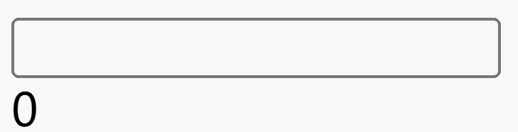

```html
<script setup>
  import { ref, watch } from 'vue'
  const num = ref(0) // 绑定表单输入的值
  const timer = ref(null) // 保存定时器
  const number = ref(0) // 绑定变化后的值

  // 侦听器
  watch(num, (newValue, oldValue) => {
    if (!oldValue) {
      oldValue = 0
    }
    if (!newValue) {
      newValue = 0
    }
    numberAnimate(Math.ceil(oldValue), Math.ceil(newValue), (value) => (number.value = value), 20)
  })

  /**
   * numberAnimate 方法用来实现数字动画
   * @param  start 起始数字
   * @param  target 结束数字
   * @param  delay  定时器每次间隔时长
   * @param  result 保存起始数字到结束数字中间变化的状态值
   *
   */
  function numberAnimate(start, target, callback, delay = 20) {
    // 动画的步长
    let step = 0
    // 如果有定时器，先清定时器
    if (timer.value) {
      clearInterval(timer.value)
    }
    timer.value = setInterval(() => {
      // 计算每次运动的步长
      step = (target - start) / 5
      // 目标值大于起始值，向上取整,否则向下取整
      step = step > 0 ? Math.ceil(step) : Math.floor(step)

      // 起始值累加
      start = step + start

      // 将数值中间的变化值作为参数传递给callback
      callback(start)
      // result.value = start;

      // 当起始值=目标值，则暂停定时器
      if (start === target) {
        clearInterval(timer.value)
      }
    }, delay)
  }
</script>
<template>
  <input v-model.number="num" type="number" />
  <div>{{ number }}</div>
</template>
```
