# Vue 基础 - 模板语法、事件处理、计算属性、侦听器

从本节内容开始，正式学习 Vue 的核心基础，模板语法、事件处理、 计算属性、侦听器从入门到实际项目开发中的最佳实践。这也是我们完成 Vue 项目开发前的必备技能 ！

## 一、模板语法

Vue 使用一种基于 HTML 的模板语法，使我们能够**声明式**地将其**组件实例的数据**绑定到呈现的 DOM 上。

> 最基本的数据绑定形式是文本插值，其次是内置的指令。

### 1、文本插值

文本插值语法，使用的是 “Mustache” 语法（即双大括号）

```html
<div>{{message}}</div>
```

**代码演示**

以上代码中`{{}}`语法，最终会被替换为对应组件实例中 `message` 属性的值。同时每次 `message` 属性值更改时，页面也会同步更新。

```html
<script>
  export default {
    data() {
      return {
        message: 'Hello Vue',
      }
    },
  }
</script>

<template>
  <div>{{ message }}</div>
</template>
```

> 渲染后，对应 HTML 代码如下

```html
<div>Hello Vue</div>
```

### 1.1、文本插值使用范围

文本插值用于解析标签体内容，所以只能出现在标签体内。

```html
<!--以下写法是错误的 ， 因为文本插值语法出现在标签属性中-->
<div title="{{message}}"></div>
```

**代码演示**

```vue
<script>
export default {
  data() {
    return {
      message: 'Hello Vue',
    }
  },
}
</script>

<template>
  <div title="{{ message }}">{{ message }}</div>
</template>
```

渲染后，对应 HTML 代码如下

```html
<div title="{{message}}">Hello Vue</div>
```

注：

我们发现`title`属性中的``并没有被解析，而是原样输出了。

> 要动态绑定一个属性值值，需要用到`v-bind`指令，后面会讲到

### 1.2、绑定数据格式

- `{{}}` 中绑定的数据只支持**单一表达式**，也就是一段能够被求值的 JavaScript 代码
- 是否为单一表达式，最简单的判断方法是，是否可以合法地写在 `return` 后面

> 以下写法，都可以看做是一个单一表达式

```html
<!-- message是一个变量 -->
<div>{{ message }}</div>
<!--a + b 数学运算 或 1 > 2 -->
<div>{{ a + b }}</div>
<!-- fn() 函数调用 -->
<div>{{ fn() }}</div>
<!--三元表达式 -->
<div>{{ ok ? 'YES' : 'NO' }}</div>
<!--对象.方法()-->
<div>{{ message.split('').reverse().join('') }}</div>
```

> 以下写法，不是表达式，是属于 JS 语句，不能出现在`{{}}`中

```js
if(){}
for(var i=0;i<5;i++){}
switch(){ }
```

### 1.3、受限的全局访问

- 在模板中，通过文本插值`{{}}`，还可以访问**一些全局对象**，如：Math、Date、RegExp ......
- 点击[有限的全局对象列表 (opens new window)](https://github.com/vuejs/core/blob/main/packages/shared/src/globalsAllowList.ts#L3)，可以查看到哪些全局对象我们可以在`{{}}`中访问

```html
<!-- 显示日期 结果：当前日期 -->
<div>{{ new Date() }}</div>
<!-- 开平方 结果： 2-->
<div>{{ Math.sqrt(4) }}</div>
<!-- 正则测试，结果：true-->
<div>{{ /^\d{5}$/.test("12345") }}</div>
```

### 1.4、访问自定义全局属性

- `app.config.globalProperties`一个用于注册能够被应用内所有**组件实例访问**到的**全局属性的对象**
- 在模板中，通过文本插值`{{}}`可以访问到全局属性

```js
// 注册自定义全局属性
app.config.globalProperties.username = '艾编程'
```

**代码演示**

- 在`main.js`中通过`app.config.globalProperties.username`添加全局`username`属性

```js
import { createApp } from 'vue'
import App from './App.vue'
const app = createApp(App)
app.config.globalProperties.username = '艾编程'
app.mount('#app')
```

- 在`App.vue`文件的模板中，可以使用文本插值访问该属性值，如下：

```html
<template>
  <div>{{ username }}</div>
</template>
```

> 渲染后，对应 HTML 代码如下：

```html
<div>艾编程</div>
```

### 1.5、总结：文本插值

在 Vue 模板中，需要访问到组件实例属性，可以采用文本插值 `{{}}`语法

**文本插值使用范围**

文本插值语法用于解析标签体内容，所以`{{}}`只能出现在标签体内，出现在其它地方不会被解析

**绑定数据格式**

- 文本插值`{{}}`大括号中只支持**单一的 JS 表达式**
- 判断是否为单一表达式，最简单的方法是，是否可以合法地写在 `return` 后面

**在文本插值`{{}}`中可以访问到以下内容**

- 组件实例属性
- 有限的全局对象
- 自定义全局属性

### 2、指令语法

- 在 Vue 中，指令是带有 `v-` 前缀的特殊 `attribute`（属性）
- Vue 提供了许多**内置指令**，如：`v-bind`、`v-model`、`v-html`、`v-text`、`v-on`、`v-if`、`v-show`、`v-for` 等。

### 3、v-bind 指令

`v-bind`指令，用于动态的绑定一个 或 多个属性

```html
<div v-bind:title="message"></div>
```

注：

- 以上`v-bind`命令指示 Vue 将`div`元素的`title`属性值与组件的`message`属性值保持一致
- 如果`message`的值是 `null` 或者 `undefined`，那么`title`属性将会从渲染的元素上移除

**代码演示**

```vue
<script>
export default {
  data() {
    return {
      message: 'Hello Vue',
      id: null,
    }
  },
}
</script>

<template>
  <div v-bind:title="message" v-bind:id="id">{{ message }}</div>
</template>
```

最终渲染后生成的 HTML 代码如下：

```html
<div title="Hello Vue">Hello Vue</div>
```

> 因为`id`属性的值为 null，所以该属性最终不会出现在渲染的元素上。

### 3.1、v-bind 简写

`v-bind`的应用非常多，所以官方为`v-bind`提供了特定的简写语法。

> 如：`v-bind:title=""` 简写为 `:title=""`

```html
<div v-bind:title="message"></div>
<!-- 以上 v-bind:title 简写成 :title -->
<div :title="message"></div>
```

### 3.2、v-bind 绑定布尔型属性

如果元素原生支持某些布尔类型的属性，`v-bind`针对布尔类型属性， 依据 `true / false` 值来决定属性是否应该存在于该元素上

如果不是元素原生支持的，则`v-bind`绑定的自定义属性的值为布尔类型，则正常显示该布尔值。

```html
<!--isButtonDisabled属性的值，如果为false表示移除这个属性，true表示按扭禁用 -->
<button :disabled="isButtonDisabled">Button</button>

<!--isChecked属性的值，如果为false表示不选中，true表示选中-->
<input type="checkbox" :checked="isChecked" />

<!--isInputDisable属性的值，如果为false表示可输入，true表示禁用，不能输入-->
<input type="text" :disabled="isInputDisabled" />
```

**代码演示**

```vue
<script>
export default {
  data() {
    return {
      isButtonDisabled: false,
      isChecked: true,
      isInputDisabled: true,
      bool: true,
    }
  },
}
</script>

<template>
  <!--原生支持的布尔类型属性-->
  <button :disabled="isButtonDisabled">Button</button>
  <input type="checkbox" :checked="isChecked" />
  <input type="text" :disabled="isInputDisabled" />
  <!--自定义布尔类型属性-->
  <div :bool="bool"></div>
  <!--
		扩展知识：
            如果元素的某个自定义属性是布尔属性，则一般会采用如下简写
            <div bool></div>   表示有bool属性
            <div></div>  表示没有bool属性
	-->
</template>
```

以上代码最终渲染后效果如下：

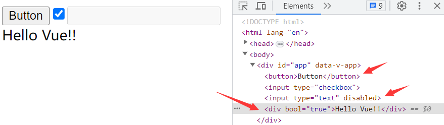

### 3.3、v-bind 动态绑定多个属性

如果你有像这样的一个包含多个属性的 JavaScript 对象

```js
data() {
  return {
    objectOfAttrs: {
      id: 'container',
      class: 'wrapper'
    }
  }
}
```

可以通过**不带参数**的`v-bind`，将他们一次性绑定到某个元素上。

```html
<div v-bind="objectOfAttrs"></div>
```

以`v-bind`绑定方式，编译后的 html 结构如下：

```html
<div id="container" class="wrapper"></div>
```

### 3.4、绑定数据格式

- `v-bind`绑定的数据格式与上面提到的文本插值`{{}}`是一样，只支持**单一表达式**
- 大部分指令属性后面的期望值是为一个表达式（除了少数几个例外，如：`v-for`、`v-on`、`v-slot`）

```html
<div :title="1 + 3" :data-date="new Date().getTime()"></div>
<button :disabled="3 > 2 ? true : false">提交</button>
```

### 3.5、动态参数

- `v-bind:`后面跟着的标识，我们管他叫指令的参数，比如上面提到`title`, `id`, `class` 属性都可以看做是参数。
- 如果需要动态指定参数，则需要把参数放在一对方括号内，方括内可以使用一个 JS 表达式，表达式最终返回一个值。

```html
<a v-bind:[attributeName]="url">...</a>
<!--简写-->
<a :[attributeName]="url">...</a>
```

**代码演示**

- `App.vue`文件内容如下

```vue
<script>
export default {
  data() {
    return {
      attributeName: 'href',
      url: 'http://www.icoding.com',
    }
  },
}
</script>

<template>
  <a :[attributeName]="url">艾编程</a>
</template>
```

编译成后，生成如下 HTML，插入到`#app`容器中

```html
<a href="http://www.icoding.com">艾编程</a>
```

### 3.6、动态参数注意事项

- 动态参数值的限制

动态参数中表达式的值应当是一个字符串，或者是 `null`。特殊值 `null` 意为显式移除该绑定。其他非字符串的值会触发警告。

> 以下代码是不合法的，会抛出一个错误，因为参数中表达式的值是一个数字类型。

```html
<script>
  export default {
    data() {
      return {
        attributeName: 123,
        url: 'http://www.icoding.com',
      }
    },
  }
</script>

<template>
  <a :[attributeName]="url">艾编程</a>
</template>
```

- 动态参数语法的限制

动态参数表达式因为某些字符的缘故有一些语法限制，比如**空格**和**引号**，在 HTML attribute 名称中都是不合法的。例如下面的示例：

```html
<!-- 以下写法都会抛出一个编译器警告 -->
<a :['foo' + bar]="value"> ... </a>
```

> 如果你需要传入一个复杂的动态参数，推荐使用**计算属性**替换复杂的表达式，也是 Vue 最基础的概念之一，我们很快就会讲到。

### 3.7、总结：v-bind 指令

v-bind 指令用于动态绑定一个或多个属性，`v-bind`指令的可以简写成`:`

- `v-bind`绑定属性的值为 null，最终该属性不会出现在元素上

- `v-bind`针对原生布尔类型属性， 依据 `true / false` 值来决定属性是否应该存在于该元素上

- `v-bind`绑定数据格式只支持**单一表达式**。

- `v-bind`

  指令可以动态指定参数，参数支持单一表达式，但有以下两个限制

  - 动态参数中表达式的值应当是一个字符串，或者是 `null`。
  - 动态参数表达式因为某些字符的缘故有一些语法限制，比如**空格**和**引号**。

## 二、事件处理 与 methods

本小节我们将重点学习以下内容：

- 如何监听事件
- 事件处理器的两种值：内联事件处理器、方法事件处理器
- methods 方法
- 区分方法事件处理器与内联事件处理器
- 方法和内联事件处理器中访问 event 事件对象
- 事件修饰符
- 按键修饰符
- 系统按键修饰符
- `.exact`修饰符
- 鼠标键盘修饰符
- 事件绑定总结

### 1、监听事件

我们可以使用`v-on`指令（简写为@）来监听 DOM 事件，并在事件触发时执行对应的 JavaScript。

**用法**：

- 监听事件： `v-on:click="handler"` 或 `@click="handler"`
- `handler`为事件处理器，事件触发后，就会触发事件处理器来执行 JS 代码

```html
<script>
  export default {
    data() {
      return {
        count: 0,
      }
    },
  }
</script>

<template>
  <div>{{ count }}</div>
  <!-- 点击按扭，属性 count 的值加1 -->
  <button v-on:click="count++">Add 1</button>
  <button @click="count++">Add 1</button>
</template>
```

> 以上代码最终渲染效果如下：

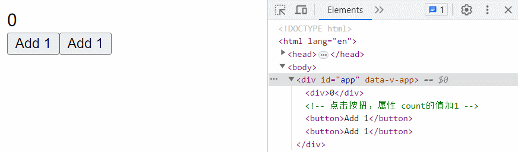

### 2、事件处理器

事件处理器 （handler） 的值可以是：

- **内联事件处理器**：事件被触发时执行的内联 JavaScript 语句
- **方法事件处理器**：一个指向组件上定义的方法的属性名或是路径（如：`obj.fn`）

### 2.1、内联事件处理器

当我们在触发事件时，只需要执行一些简单的 JS 语句时，可以采用内联事件处理器

```vue
<script>
export default {
  data() {
    return {
      count: 0,
      isShow: true,
    }
  },
}
</script>

<template>
  <!-- 点击按扭 count+1 -->
  <button @click="count++">Add 1</button>
  <p>Count is: {{ count }}</p>

  <!-- 点击按扭，对isShow属性值取反 false变true，true变false-->
  <button @click="isShow = !isShow">{{ isShow }}</button>
</template>
```

> 最终渲染效果如下：

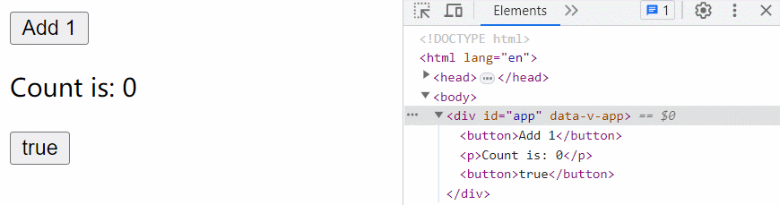

注：

- 点击第一个`button`按扭时，会执行`count++`
- 点击第二个按扭时，会对变量`isShow`的值取反

### 2.2、方法事件处理器

**方法事件处理器**：一个指向组件上定义的方法的属性名或路径

```vue
<script>
export default {
  data() {
    return {
      state: {
        show() {
          console.log('Hello Vue3!!')
        },
      },
    }
  },
  // methods选项
  methods: {
    // 这里的方法，可以直接在模板中使用
    sayHello() {
      console.log('Hello Vue')
    },
  },
}
</script>

<template>
  <!--方法事件处理器:  指向组件上定义的方法的属性名-->
  <button class="box" @click="sayHello">sayHello</button>

  <!-- 方法事件处理器: 指向路径 -->
  <button @click="state.show">show</button>
</template>
```

> 以上代码最终渲染效果如下：

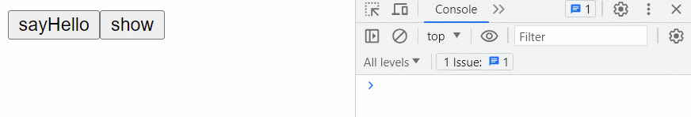

注：

- 当点击`sayHello`按扭时，会触发`click`事件，然后执行`methods`选项中的`sayHello`方法。
- 当点击`show`按扭时，会触发`click`事件，然后执行`state.show`方法。

### 3、methods 方法

`methods`方法，用于声明要混入到组件实例中的方法

- 声明的方法可以直接通过**组件实例访问**，或者在**模板语法表达式中使用**。
- 声明的方法（非箭头函数）内部的`this`指向为**组件实例**。
- 即：methods 选项中声明的方法内可以通过 `this.属性` 的方式，访问`methods`选项中的其它方法和 data 方法返回对象中的属性

**注意**

`methods`选项中声明的方法时避免使用箭头函数，因为它们不能通过 `this` 访问组件实例。

**代码演示**

```vue
<script>
export default {
  data() {
    return {
      message: 'Hello Vue',
    }
  },
  // 组件实例需要用到的方法在methods选项中声明
  methods: {
    showMessage() {
      return this.message
    },
    sayHello() {
      // this指向组件实例
      console.log(this)
      // 访问 data中属性
      console.log(this.message)
      // 访问methods中声明的方法
      console.log(this.sshoMessage())
    },
  },
}
</script>

<template>
  <div>{{ showMessage() }}</div>
  <div class="box" @click="sayHello"></div>
</template>

<style>
.box {
  width: 100px;
  height: 100px;
  background-color: skyblue;
}
</style>
```

> 以上代码最终渲染效果如下：

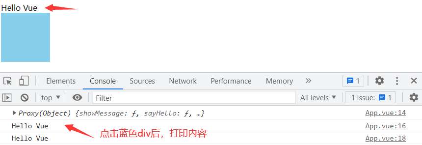

### 4、区分方法与内联事件处理器

Vue 内部模板编译器会通过检查 `v-on` 的值来断定是何种形式的事件处理器。

- 值是合法的合法的 JS 标识符或属性访问路径，会被视为方法事件处理器，如：`foo`、`foo.bar` 和 `foo['bar']`
- 值不是合法标识符，会被视为内联事件处理器，如： `foo()` 和 `count++`

```html
<!--方法事件处理器-->
<div class="box" @click="sayHello"></div>
<!--内联事件处理器-->
<div class="box" @click="sayHello()"></div>
```

### 5、内联事件处理器中访问 event 事件对象

有时我们需要在内联事件处理器中访问原生 DOM 事件，你可以向该处理器方法传入一个特殊的 `$event` 变量。

```html
<div class="box box1" @click="print(`$event为事件对象`, $event)"></div>
```

注：

- `$event`变量，相当于原生事件处理函数中的第一个参数`event`（事件对象）
- `$evnet`变量的书写位置没要求，但名字是固定的。

**代码演示**

```html
<script>
  export default {
    methods: {
      print(message, event) {
        // event 为原生的JS事件对象
        console.log(message, event)
        // event.target 触发事件的目标元素
        console.log('触发事件的目标元素', event.target)
      },
    },
  }
</script>

<template>
  <div class="box" @click="print(`鼠标事件对象`, $event)"></div>
</template>

<style>
  .box {
    width: 100px;
    height: 100px;
    background-color: skyblue;
  }
</style>
```

> `.box`元素触发点击事件后，在控制台输出如下内容：

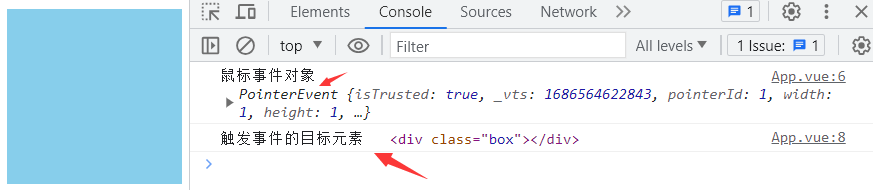

### 6、方法事件处理器中访问 event 事件对象

对于方法事件处理器，处理器方法默认会把`event`事件对象作为方法的第一个参数传入

```html
<!-- print 方法调用后，他的第一个参数就是evnet事件对象-->
<div class="box box1" @click="print"></div>
```

**代码演示**

```html
<script>
  export default {
    methods: {
      print(event) {
        // event 为原生的JS事件对象
        console.log(event)
        // event.target 触发事件的目标元素
        console.log('触发事件的目标元素', event.target)
      },
    },
  }
</script>

<template>
  <div class="box" @click="print"></div>
</template>

<style>
  .box {
    width: 100px;
    height: 100px;
    background-color: skyblue;
  }
</style>
```

> 在`.box`元素上点击后，在控制输出内容如下：

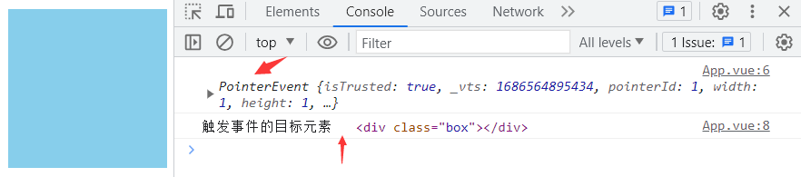

### 7、事件绑定对象写法

如果我们想在一个元素上绑定多个事件，我们可以写多个`v-on`或`@`来监听不同事件

```html
<!-- 普通写法，绑定多个事件 -->
<div @click="scale" @mouseover="bgcolor"></div>
```

也可以采用如下对象的写法

```html
<!-- 对象语法  绑定多个事件 click与 mouseover事件-->
<div v-on="{ click: scale, mouseover: bgcolor }"></div>
```

注意：

当使用对象语法时，不支持后面讲的任何事件修饰符

**代码演示**

```vue
<script>
export default {
  methods: {
    scale(e) {
      e.target.style.transform = 'scale(1.2)'
    },
    bgcolor(e) {
      e.target.style.backgroundColor = 'red'
    },
  },
}
</script>

<template>
  <!-- 普通写法，绑定多个事件 -->
  <div class="box" @click="scale" @mouseover="bgcolor"></div>
  <!-- 对象语法，绑定多个事件 -->
  <div class="box" v-on="{ click: scale, mouseover: bgcolor }"></div>
</template>
<style>
.box {
  width: 100px;
  height: 100px;
  margin: 50px;
  background-color: skyblue;
}
</style>
```

> 以上代码表示，当鼠标滑动到元素时背景变红，在元素上点击时，放大 1.2 倍，如下：

![GIF2023-4-2716-53-04](data:image/gif;base64,R0lGODlhcwHyAQAAACH5BAAeAAAAIf8LTkVUU0NBUEUyLjADAQAAACwAAAAAcwHyAaD///+HzusC/4SPqcvtD6OctNqLs968+w+G4kiW5omm6sq27gvH8kzX9o3n+s73/g8MCofEovGITCqXzKbzCY1Kp9Sq9YrNarfcrvcLDovH5LL5jE6r1+y2+w2Py+f0uv2Oz+v3/L7/DxgoOEhYaHiImKi4yNjo+AgZKTlJWWl5iZmpucnZ6fkJGio6SlpqeoqaqrrK2ur6ChsrO0tba3uLm6u7y9vr+wscLDxMLBZwjJysvMzc7PwMHS09TV09XQxirb3N3e39/Yz9AU5ebn7OLe6Bzt7ufq7e8T5PXx8dz2Gvv1+Pv8EPMKA5fxoEGjyojWAGhAwbOlOIwaHEiRAvTLzIsKIFjP8cBWqs0DHkvo8URJqkR3LCyZXtUkpgCXOgSwgxa36bSdOmzoQ4Hez8Sa2nT6BEwwllUDQps6NIlTo9xnTB06dRFUx1WjXBVaVZEWxN2vXA16JhDYwlWhbAWaBp1/5s61Yn3Lg159KFaffuyrx6TfLtG/IvYI6CB18sbFgi4sQNFzNG6PixwciSA1KuzO8yZn2aN/cr65ki6NAOO5N2Z/o0u9Sq4Y1uPfk1bMuyZ2eubZsz7tyfw/IGyPp3ut3CURMvvvo4cte+l6NU7pxc8OjSplOHZv36Q+jahzfvzrwreHTZxycrbx4q9/TX1rO/5/690e/yvYuv3w19ev3m+Y//9w8egN0JqB2B1xlIHYLRKegcg8s5iByExUkoHIW/WcgbhrlpaBuHs3kIG4itiagaiaeZSBqKoanoGYubuYgZjJXJKBmNj9nIGI6J6WgYj4P5CBiQfQmpF5F3GUkXknEp6RaTazl5FpRjSfkVlVtZeRWWU2lJVXz4LcMlVl5+ed6YZKpH35ntpakmfGy2Od99cFZn5plhclUnmXeCleeXe5LVJ35/ohVofYOyVah8h76V6HuL7vSoXI2yl1alll6Kaaaabsppp55+Cmqooo5Kaqmmnopqqqquymqrrr4Ka6yyzkprrbbeimuuuu7Ka6++/gpssMIOS2yxxh6LbLLK/y7LbLPOPgtttNJOS2211l6Lbbbabsttt95+C2644o5Lbrnmnotuuuquy2677r4Lb7zyzktvvfbei2+++oow55py9htnVgC7+e/AS026H8L9KfwfwwE6PCDEBUp8IMUJWrwgxg1q/CDHEXo8IcgVinwhyRmavCHKHar8IcshujwizCXKfCLNKdq8Is4t6vwizzH6PCPQNQp9I9E5Gr0j0j0q/SPTQTo9JNRFSn0k1UlavSTWTWr9JNdRej0l2FWKfSXZWZq9JdpdvmkwMpHa9HZdaovJdtsBxB0T3njNjWfdbevNEuB78c2n3wYLfhLifhEOqOEDKy4S5IExTqjjAP9L3hHmhFGOqOX9ao4R6Idxzqjnc4oumulwoq4Y6ZC6LqnqbbJeGuxw2y637GrS3hjuefu+t+52Ah848YMLr6fxiSu/OPJ+Mh859JM7L6j0mVu/OfWGYh8696Nrr6j3qRdst9vitw6+o+fXnj6l6/fefsLxLzx/w/U/fH/E+U+8f8X9X/y/jAVwYwPsWAE/dsCQJXBkCyxZA0/2wJRFcGUTbFkFX3bBmGVwZhusWQdv9sGchXBnI+xZCX92wqClcGgrLNq+XgjDGMpwhjSsoQ1viMMc6nCHPOyhD38IxCAKcYhELKIRj4jEJCpxiUxsohOfCMUoSnGKVKyiFa+IxSwuanGLXOyiF78IxjCKcYxkLKMZz4jGNKpxjWxsoxvfCMc4ynGOdKyjHe+Ix08UAAAh+QQAbgCrACxIADIAlgCWAKD/AAAAAAACuoSPqcvtD6OctNqLs968+w+G4kiW5omm6sq27gvH8kzX9o3n+s73/g8MCofEovGITCqXzKbzCY1Kp9Sq9YrNarfcrvcLDovH5LL5jE6r1+y2+w2Py+f0uv2Oz+v3/L7/DxgoOEhYaHiImKi4yNjo+AgZKTlJWWl5iZmpucnZ6fkJGio6SlpqeoqaqrrK2ur6ChsrO0tba3uLm6u7y9vr+wscLDxMXGx8jJysvMzc7PwMHS09TV1tfa1YAAAh+QQA0gCrACxIABMBlgCWAKD/AAAAAAACuoSPqcvtD6OctNqLs968+w+G4kiW5omm6sq27gvH8kzX9o3n+s73/g8MCofEovGITCqXzKbzCY1Kp9Sq9YrNarfcrvcLDovH5LL5jE6r1+y2+w2Py+f0uv2Oz+v3/L7/DxgoOEhYaHiImKi4yNjo+AgZKTlJWWl5iZmpucnZ6fkJGio6SlpqeoqaqrrK2ur6ChsrO0tba3uLm6u7y9vr+wscLDxMXGx8jJysvMzc7PwMHS09TV1tfa1YAAAh+QQBlgAAACw5ACMAtAC0AKAA/wD/AAAC/4yPqcvtD6OctNqLs968+w+G4kiW5omm6sq27gvH8kzX9o3n+s73/g8MCofEovGITCqXzKYEAI1Kp9Sq9YrNarfcrpcr+orH5LL5jA2j1+y2e6x+y+d0dryOz+uv973/T9cHOEhoJliImKh1qNjoCMX4KFkYOWnpV3mpWZe56enW+Sl6FjpqKlZ6qrqVuupq1foqGxU7K1tr64qbq7rLa+r7Kxos7ElcrHmMbKm8LNns7AgdrThNjWh9TZitDcjdjRkCbvs9nlduzimerrvO3uv+DhwvP0xfb3yPn6y/z9zv7xnAgNIGEqxm8CC2hAq3MWzo7SHEcCAmTkJn0QvGjP9gJHJUV/EjwpAiF5Is6fAkyogqV1L84DIlzJgsZ9J86eHmn406IXnsWYZnT6E6id40ShNpTKUuma50ihJqSakiqX60yhFrRq0WuU70ChFsQ7EKyR40SxBtQLX+2O5ziw9uPbny6L6zyw5vOr3m+I7zCw5wN8HaCF8zTA1xNMXOGC9zjAxyMcnCKP+yzAtzLs3kfgKF4/nzF86zSN8KLbqL6Ver27VM3ab1KtnwXsNeQ/tU7nm2b5NC7TsN8OCwhhOnsntUcnu9j6My7pwW9OgAln+ynq859Y7aty+aHh37JvH8unsXbv588fTqkYN3Tv5S/H/s20uZf/H9cfwCnfgm/w9ggAIOSGCBBh6IYIIKLshggw4+CGGEEk5IYYUWXohhhhr6UAAAIfkEAYIAAAAsOQAEAbQAtACgAP8A/wAAAv+Mj6nL7Q+jnLTai7PevPsPhuJIluaJpurKtu4Lx/JM1/aN5/rO9/4PDAqHxKLxiEwql8ymBACNSqfUqvWKzWq33K6XK/qKx+Sy+YwNo9fstnusfsvndHa8js/rr/e9/0/XBzhIaCZYiJiodajY6AjF+ChZGDlp6Vd5qVmXuenp1vkpehY6aipWeqq6lbrqatX6KhsVOytba+uKm6u6y2vq+ysaLOxJXKx5jGypvCzZ7OwIHa04TY1ofU2YrQ3I3Y0ZAm77PZ5Xbs4pnq67zt7r/g4cLz9MX298j5+sv8/c7+8ZwIDSBhKsZvAgtoQKtzFs6O0hxHAgJk5CZ9ELxoz/YCRyVFfxI8KQIheSLOnwJMqIKldS/OAyJcyYLGfSfOnh5p+NOiF57FmGZ0+hOoneNEoTaUylLpmudIoSakmpIql+tMoRa0atFrlO9AoRbEOxCskeNEsQbUC1/tjuc4sPbj258ui+s8sObzq95viO8wsOcDfB2ghfM0wNcTTFzhgvc4wMcjHJwij/sswLcy7N5H4CheP58xfOs0jfCi26i+lXq9u1TN2m9SrZ8F7DXkP7VO55tm+TQu07DfDgsIYTp7J7VHJ7vY+jMu6cFvToAJZ/sp6vOfWO2rcvmh4d+ybx/Lp7F27+fPH06pGDd07+Uvx/7NtLmX/x/XH8Ap34Jv8PYIACDkhggQYeiGCCCi7IYIMOPghhhBJOSGGFFl6IYYYa+lAAADs=)

### 8、事件修饰符

Vue 为`v-on`指令提供了**事件修饰符**，修饰符帮我们处理了许多 DOM 事件的细节，让我们有更多的精力专注于数据的逻辑处理。

> 修饰符是用 `.` 表示的指令后缀，事件修饰符包含以下这些：

| 事件修饰符 | 说明                                                                                    |
| :--------- | :-------------------------------------------------------------------------------------- |
| `.stop`    | 阻止事件冒泡                                                                            |
| `.prevent` | 阻止事件的默认行为                                                                      |
| `.self`    | 只有 `event.target`是元素本身时才会触发事件处理器。即事件是由元素本身触发，而非冒泡触发 |
| `.capture` | 添加事件监听器时，使用 `capture` 捕获模式                                               |
| `.once`    | 最多触发一次处理函数                                                                    |
| `.passive` | 滚动事件的默认行为 (scrolling) ，将立即发生而非等待 `onScroll` 完成                     |

**用法**

```html
<!--阻止事件冒泡-->
<div class="box" @click.stop="doThis">box</div>
<!-- 提交事件将不再重新加载页面 -->
<form @submit.prevent="onSubmit"></form>
<!-- 仅当 event.target 是元素本身时才会触发事件处理器 -->
<div @click.self="doThat">...</div>
<!-- 修饰语可以使用链式书写 -->
<a @click.stop.prevent="doThat"></a>
<!-- 也可以只有修饰符 -->
<form @submit.prevent></form>
```

注：

- 修饰符可以使用链式书写
- 可以只有修饰符
- 使用修饰符时需要注意调用顺序，因为相关代码是以相同的顺序生成的。

> 因此使用 `@click.prevent.self` 会阻止**元素及其子元素的所有点击事件的默认行为**，而 `@click.self.prevent` 则只会阻止对元素本身的点击事件的默认行为。

### 8.1、stop 修饰符

`stop` 事件修饰符，用来阻止事件冒泡

```vue
<script>
export default {
  methods: {
    boxFn1() {
      alert('box1')
    },
    boxFn2() {
      alert('box2')
    },
    boxFn3() {
      alert('box3')
    },
  },
}
</script>

<template>
  <div class="box1" @click="boxFn1">
    box1
    <div class="box2" @click="boxFn2">
      box2
      <div class="box3" @click.stop="boxFn3">box3</div>
    </div>
  </div>
</template>

<style>
.box1 {
  width: 300px;
  height: 300px;
  padding: 50px;
  background-color: tomato;
}

.box2 {
  width: 200px;
  height: 200px;
  padding: 50px;
  background-color: khaki;
}

.box3 {
  width: 100px;
  height: 100px;
  background-color: skyblue;
}
</style>
```

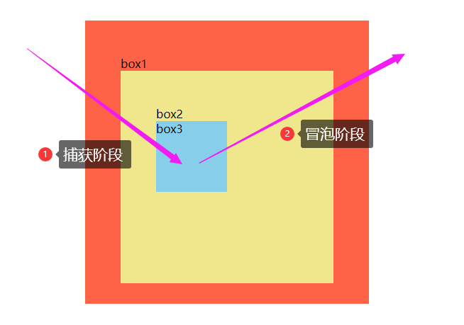

注：

以上代码运行后，当在`box3`上点击后，因为阻止了事件冒泡，所以只会弹出`box3`。

当在`box2`上点击后，因为没有阻止事件冒泡，所以会弹出`box2`和`box1`

### 8.2、prevent 修饰符

`prevent`事件修饰符，用来阻止事件的默认行为

```html
<script>
  export default {
    methods: {
      onsubmit() {
        alert('这里可以通过发送ajax请求来提交数据')
      },
    },
  }
</script>

<template>
  <!-- 点击按扭提交事件将不会发生页面的刷新与跳转 -->
  <form action="http://www.icodingedu.com" @submit.prevent="onsubmit">
    <input type="submit" value="提交" />
  </form>
  <a href="http://www.icodingedu.com" @click.prevent>艾编程</a>
</template>
```

注：

当我们点击提交按扭和艾编程时，页面并不会发生跳转，因为`.prevent`修饰符阻止了事件的默认行为。

### 8.3、self 修饰符

只有 `event.target`是元素本身时才会触发事件处理器，也就是只有点击元素本身时才会触发对应事件，不支持子元素事件通过冒泡到自身。

```vue
<script>
export default {
  methods: {
    boxFn1(event) {
      console.log(event.target.className)
    },
  },
}
</script>

<template>
  <div class="box1" @click.self="boxFn1">
    box1
    <div class="box2">box2</div>
  </div>
</template>

<style>
.box1 {
  width: 200px;
  height: 200px;
  padding: 50px;
  background-color: tomato;
}

.box2 {
  width: 100px;
  height: 100px;
  padding: 50px;
  background-color: khaki;
}
</style>
```

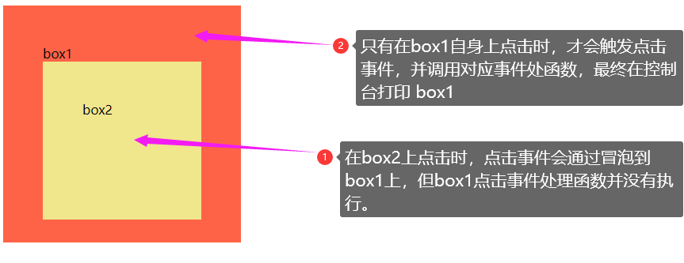

### 8.4、capture 修饰符

`capture`修饰符表示，添加事件监听器（原生`addEventListener`）时，使用 `capture` 捕获模式

```vue
<script>
export default {
  methods: {
    boxFn1() {
      alert('box1')
    },
    boxFn2() {
      alert('box2')
    },
    boxFn3() {
      alert('box3')
    },
  },
}
</script>

<template>
  <div class="box1" @click="boxFn1">
    box1
    <div class="box2" @click.capture="boxFn2">
      box2
      <div class="box3" @click="boxFn3">box3</div>
    </div>
  </div>
</template>

<style>
.box1 {
  width: 300px;
  height: 300px;
  padding: 50px;
  background-color: tomato;
}

.box2 {
  width: 200px;
  height: 200px;
  padding: 50px;
  background-color: khaki;
}

.box3 {
  width: 100px;
  height: 100px;
  background-color: skyblue;
}
</style>
```


注：

因为`box2`的点击事件是在捕获阶段执行的，所以在`box3`上点击后，会选弹出`box2`，再`box3`和`box1`

### 8.5、once 修饰符

`once`修饰符表示最多触发一次处理函数。

相当于先通过`addEventListener`添加事件监听，执行一次后，通`removeEventListener`方法取消了事件监听。

```vue
<script>
export default {
  methods: {
    doThis(e) {
      alert(e.target.className)
    },
  },
}
</script>

<template>
  <div class="box" @click.once="doThis"></div>
</template>

<style>
.box {
  width: 100px;
  height: 100px;
  background-color: skyblue;
}
</style>
```

![image-20230426181144395](data:image/png;base64,iVBORw0KGgoAAAANSUhEUgAAAbsAAAB7CAIAAABilLlJAAATiklEQVR4nO2drW8i3RfHzx36H+yIFeuLqOBJasiYn6yAIGofQyB5UrUGQUJWbUgQNauaJpCax1aQRVTWkJomD6IC/IqK2f+AufcnznC53HnhMqWv+/1kxULnnZnvnHvOuecIpRQBAABwwHvtAwAAgHcDFBMAAFyBYgIAgCtQTAAAcAWKCQAArkAxAQDAFSgmAAC4cmB9HvwXvspxvEe6f/mvfQgAgBcFNiYAALgCxQQAAFegmAAA4AoUEwAAXIFiAgCAK1BMAABwBYoJAACuQDEBAMAVKCYAALgCxQQAAFegmAAA4AoUEwAAXIFiAgCAK1BMAABwBYoJAACuQDHB3lCz2bJalZNJzjd/IFGzuaxW1WxmfS8Hg9TvwVsGivnxkcNhMdmKVxwOn+OoTKJO54naISeTZbX6BgVIzWZqPvdaLVGpWH+S06kIguT3e4cvjssNEL/hBoPk6rte2OQqLht5sVuuMHYNdgDckYOBHI/tL/t92e/nfCPK5dLV1fqvk4maTr1Go7B2yOFQjkZer0cPD9HZ2cHdXdaSUbOp5nOnjfr+wc+fxY7HRN3cEJEcjeRoZH7v9XoUhioMl9XqxveNhtftFt5d1Gx6X79aV1Ld3pLve7Xa1tXljx/k+1sPIGo2iah0dWVdT/3LyslEBEF0dla6uOCD4VXU/b15bFGzqcJw63Ve1uvC98175hWBYv4pJIWM8Votr90utk2v2zWfLjWbRWdnXq+nH87kNxZqNuOjkuNxUnxFEJTOz/OPYVmvUxjGKlmrEdGyWs3a49anjsWXiLx//slf0hE5HnutFoujeS5Rs+k1GuLkJPr2bS/STCt7NvnOUIuFFwTbD3UwUPN56eKC/09ESelkffdaLfr8mTavZ9Tp0O/f/H+vVqNaLWo2+ez0ll/AoH5uoJh/CjmyRURyMknVU0qzjyhDZ0WlYj6rvM38/UZnZ5bJGX/f6ajpVPzvf1krrpcpl0uG4njdLvm+7PfV9fWuVglvkIhyrNSdkIOBKJe9dpttMTmZ8KWQk4maz0tXV3I4pDCMms29GFB8/Zf1+rJe1yrMu0h9IRGtTWk5HLK4a1GT4zEdHenfLjo7I7croy8jo41o3sK+jPfXAooJiIi8Wi2pa/Fod5sRqsdo8f8/fYqNqYcH3nLWivwsJcVCDoc8Ts9aVw8GvUZDjsfWwJaIRBDQ79/LajVVjnMOxn35rcjJRI7HXq9HRKWrq2W9Li8v+YzU7a3XaBCR127HcjYYPGUwbnLw8+eyWtUqHF/JtI0vq1VxeEir6+k1GvqH9rpdFYay39c/gWUhLqvVvBtjJYvxIGO1pBwMpCGm7xEo5kcjy1pMjsr3qA6pqMWCDBND47Va4viYLQ4eA26sNZvJ0UiUy6kPOdsvXqOhjzxfaDgenT+6X4/En+ZDtGBZ1IrjNRri+Jj/bx6M1+2aptxe8Ho9dXtLK2PW+/qVEiY/R1fYihenp6rft+xQr9UioqjZFKen9qkZARzz9xXl8h7P4m0CxfyYbPUZmV6n5yAeeGYcBpulpEdqCdR8bj6KWsu01miZy4GFcqsIxnKZ6z0oAB8qu1njr7IPWPb7Lk5bR9iNSETy8tIKx4svX+I9jseiXOZTTh1h0MpCFI+PRKR+/dLbUb9+EZE4Pmbp5F95447ajGhtOHb8992zGooJngV1eyvKZVGp8EDMcl3FEdXEn1Jdn8t6PWsvOW61nLWSiCDYr1xqkj47PkfrXaJfIXuE5cz7++/4syF8cjKhMBSNxvoANp2PMb7PV1jN53bCQxDE21mxIffuo/JEtgClus7fjM5CMUHG07IiNfJDuYFsNZup6ZRdeHR0JMJwi9vr+ck/RzWdJp9ben7HRSo7pEAZWIfKfkxTr+NtPjxQrZZqVNpb6HTYr0KWGiZ3XTQCnurCTrrOd3r5PTdQTJD5PDhGfpKomxtttfEIkW0N4ljH/kiVuTWHh/q/Oc/8VkfnU8hS6qQ7QqwSgJ6u0ZzNo0PzMb9/08q5vNvWhkM5GqU7WB4fX8D6e1OxdSjmxyTLP2iyLz+9+YRnPe1W4tG+2Neo/Bn5/duS4xcYlctEpoGeeiRHIzWbpVqFlu+YKHMszO+/0sUFhaE5rF5bqQ5+zNgD4/A+1jMUnslzshNQzI9JgcgPS8zW9zmPGZN5ly5HlRKMTnVjZSTbb2yq3c5/0t6IYcI6tXWxPY79OQHTus7q5oZ832u31XSqbm5S742cUblJnK7Q66lfv8wpDBuij+wi8F7Iinta7H0QyhptTfIx3ZfpRp9DPnNyxR00+lWdpxwY0UlFL7TT8dgzQjrECVs89YhInJ7Kfl+cnBRwPsa2XqNRyh0u5NxaXrf73itZQDE/GnIw0BPyltWqNut4Dri2DaNORzjMIH4LZElqUqMti2aLl/MFeHykDA9J6pdPTwhNNTCjb9946hERebWaur6WP34krdr8UXl0diaCIMcNosJQHB6mlxqwgofvedrPe1d8YCPHYz3cFuXyehB0dESrvGUiEr4vx+O3Vuknh1evGsd1faJOx30Vr90+uLvT/+J0fd8notLFhfmng7u7vYRQkgZm1GxSGFq+ZjWfWwWKiEiUy+bxiM2p6KWLC9N4XNbryS0QkdftJk/Za7U2TvbdyiVBMT8Y/Dzrx0MEAYUhC41Xq5Hv67SVeP71v/++1qESEfn+Ors7l1joHx/3fgjxwNlBrdT9Pa0myRQgajZj+zetxoeazSgMnyiacjCwDMxlvW45nRmv1+OpmcV3tnm0fPwul/G9g1H5xyEum2bEGbx2W45GnIJHROLw0PTle42GHTl1TCfWfzKGYOYw0wzdmKvzPDwdYeBAhOPYWQSB127vvMfRSI5GVrRapzrFW86YkWkThpQ7TT4V7XLVMztNS3nj3H3/6S5XbWDyfq0yJevFeEZQv68Wi5ygU6yAnz9b38en8PmzmTvlehmtTaXdXTm33KsDxfxAPDxod5VGlMtaJUW5rKZTLZFeuy3HY12y0HGsZOZXW9XeCrBrjPjpe6SiqU5qsRAONdM0fKF4qJu1zH4zrvSVcUmk5QihWbMjXteIqvHbl12fluM1nmG57f2Rc6kdQ5T6dFyWfAGEUsr8PPjPaZQEiKj718cfgwDNq09bAm8B2JgAOPEcGfjg3YHIDwAAuALFBAAAV6CYAADgChQTAABcgWICAIArUEwAwEuTOueV56HqibxvEygmeAXkYGBN0VOzWeGKlnIyWVar63/btsPt0grMqecVHae3p05CjzqdrFKYUbO506T1vF3X6zttis+ryI6q1QJTLdVsJspldX1tf79qH1TgSF4M5GN+KHQ9rrdclIiLj5Hvm69r9esXhWHU6WTVCsvr5bBqR7PevlV+/MVRs5nX68l+P6ut7rJatUrkiiCQo9GyWjVrm6b30tjWGpPCUKTNXs9cZTrNms5kdnazCmjGU/JPTja6v2Vg3pOiUvG+fo3Ozqzaxur2lnw/qwxdft+RjX0950QDKCZ4aeSPH8l6X16tRo+PcjTKETvH3hKiUnEp/phVpv4ptb6TT7XZ0lbLutZTenjQOsI1krlgh/kCsJ5/y0RNra5G26oym9uMu6T980/qZETzalhWuW5+lzO/1mx+l7w4+idgLVaLhTAajSSxJTutncZzl/iDYoIXJep01HweN03bxGu3xfFx4TZbu5Jfpj5nLnOqGLGyONZpZk0XX75EZ2dWAQ5TEWKFShTC2Njv5kT7ZIX8rbDwxU2ZjCNJXgHrclllX7aSf3HYNFaJWjBvbcAExQQvhxwMlNGCxmWc9VpTuVO7YrBBt6+GM1sLgqibG9qlWhL3iN+pXEjc9XMX4Yv3NRxSIZ+jHA7VdMovhmW9ru1TvhP0ayy1G1JKzWO3llZ7BIoJXgjWRxEEXrerW2uJbS3DTNxLw5EhtVnWYmo3x6c388gaJosg0K8H6yxKFxfq/l6ORhvdk1idE1qm3Z3JA5aXl7RjBc/CBVJTz3H7WsMhF98jjv/4/rJaPbi7k8MhO6m5nTpRXAvVuhMwKgfPiOmPT9oyVqsc817UfzLvRa13hTXF+/tvuRqa8YO6fjzceMretw5U99vNMal9fORRs0mfPhGRWiw2monf34tyWfcB1t3HkgZmVku4qNPhnzvfg2n+plxQtcDZ8Qja/Jh8J6Xccps16ESlUrq6iprNZb0ufN9rNOR0qmu5Uhjuq9fpfkF20cfECl9aOTFRp2M9VDzeYceZV6uxaaMNEH60nmiCiUollstV5eO30Ez1hVEZMWWv3S5dXXmtlppO5XBYOj8/uLvbYTw+HLL22f0hjH9J37G8vCymSnI0Sq6o+3BkjfHZZLbknt/T4vTU63aF7+vroxYLfrW8NWBjfkDkeCyCQBff5miAur7mt/f66TJMGF5GN8zy2m01n6vplCPXPNzbV/tJeXnJBdX3srXnIC+TKduIc4xRmLpgb8GwH/OdvObbS04mBQruch4lZ/nstGLU6YhyWQRBziVKJY6YN5v61+dbUdva4vBQt6VK7VoMPyZ4FkS5bKpb6eqK+73wx6RcmsvoFLnS+fmyWpWXl/T4SGGYGt0uAA8ed4pOaF6sjUxWZXj3yE+mN43b42Qo5tq9W6mUzs95CG+9qHQ7Cr0Kf2Ttc+/3oBaL0vfv1q6Ti1mvB1EuqzAsff/OXY+K8OmTHI24H5EcjTZaGx0d0XgsJxN2YibfqfBjgmchmdTGdg2roQpD8v3kMy8OD1UYmr5Fr9XSfXL2MoLW5q0mmfxsdeDRTwg3dyWHCHuq98DlQSqm4xY63cdqd0xG+/Is64yD4/on4CCPlebNQ+m1KfrtG59v7FHJTi2wPNd8YXWKZTJwH7sdM14PhRWzdH7OW+bYkenM5dGMur5Wae9UxyHOcxd+hmKCbHIzAXeFB4+swvpL84HZGitf2yPZDa+zAjgFIj/LatUyalLhSZnrLJlV/3T+aCbT0MNDPKclI0KtFgudGkmrznHRt28HhoOFwtBsdvYeO9nGQ/LRyGoUTEReELCSeob9+6aAYn5Akm4yNZ/r+WfC99V8npxaww3UzC/j0d+nT9qh+aSjur5mC6iA0y1uTltIwbOCyxa79mjLQv77L6uefHggInF8LMdjnv0pp9Ok+R81m+LwkDOuks670tUVz5Q/+PmT7fE32zxjJ38i3wOxOBrOX3FyQom8payErfz97itt1gKK+QFR06k5nZmNIP2sss9e9vviy5d18lCzabkX2eYSp6fccVBeXj7x/nuKJMU1Gr58KbBu1OkI39dJoHrcGnU6ZoqPGZEoTJwGYPh8RaVS+v49OjvTkxGtVbS3gYfkyZzwg7s7rjBiTZ9PP4DX61ubP4fKZFmvs/EedTqmaMa+VN+nMNRBSEprIMpLinKZTQEvCHJibtoh436EOSC76AMigkCOx7qWD0cbtBvIa7c5bhCdnell2LO2Dr8Ohzx7JJ4812pxmQxzL1wxqEDpmgLoKcw7rzibqemUjW5RqZDvm/21KQzXSVcckXjyceoZTRp2Earra3PEvYHvE5fDSDvHdSmmMNxacmmn7KJ94bXbB3d3jr8Ov4lZDUvn5yIIeHCj5fLg50+v11PzeVb5JTkcst+DX/Cl79/VYpG1ML8ID+7uRBDIHz+KnaAJFPMDIny/dHGx/hgElreLU/82VgkCbb/ohGRLZNl0Xa/Do86Tk2c5h01UdnGdfLjqx/pEgoDzAUiHYh8e+E9xrujTXgCl8/MNY2fleI3fQKen/FEH/bW3IbZAjTE7F4tcVqvi8FCrnggCfs85Vpx7ayyrVRWG5t1YOj8vXV2xCIpymf/k1Wper6em01TnMsfTrEwPnj5UoILfrmBU/qEwfXb5I7gc717qn5Jjao65Fx7muE5e9H0vCKxyFZSo12CitZV1amOMfHJC47G6v49duuUyGziM12jI8diUvNQEwJR8TCNFxkzT0ZENK9+ADyOe6chOT1bqoyMy3HbJX5BlnXch+/3d5hTwGy7790ot2mad7K51McxyRMt6PfWArblA8Y5qNXYH6QKAfLmykgF45B4vY3gwOemKvzfNiMJAMUFB1GLhPSEdxzEgQ0TLet0OqrrFyk3HAhMPzFfJPeLw0AwpeN2uHI91jMsxxmIVME6m6USdjmnnpi5juuqSbjuLrSU8NFZGUTI2bbKvsLuV/qUPNWv7OXcCr8sTClxqsvDyy3pdv07cr5UjQillfh78t6UyKNB0/3qhhOo3iM6h+QNnOoI3QmoG+3MDxSzOn6yYAPyZIPIDAACuQDEBAMAVKCYAALgCxQQAAFegmAAA4AoUEwAAXIFiAgCAK1BMAABwBYoJAACuQDEBAMAVKCYAALgCxQQAAFegmAAA4AoUEwAAXIFiAgCAK1BMAABwBYoJAACuQDEBAMAVKCYAALgCxQQAAFegmAAA4AoUEwAAXIFiAgCAK1BMAABwBYoJAACuQDEBAMAVKCYAALgCxQQAAFegmAAA4AoUEwAAXIFiAgCAK1BMAABwBYoJAACuQDEBAMAVKCYAALgCxQQAAFegmAAA4IpQSr32MQAAwPsANiYAALgCxQQAAFegmAAA4AoUEwAAXIFiAgCAK1BMAABwBYoJAACuQDEBAMAVKCYAALgCxQQAAFegmAAA4AoUEwAAXIFiAgCAK1BMAABw5f/MiKUb6fmaUwAAAABJRU5ErkJggg==)

### 8.6、passive 修饰符

`.passive`修饰符，是用来告诉浏览器你没有阻止事件的默认行为。

你可能会想，不阻止事件的默认行为不加`.prevent` 修饰符就好了，为什么要加`.passive`修饰符呢 ？

这里，不想阻止事件的默认行为，真正的目的是告诉浏览器，你可以不用去查询程序有没有阻止默认事件，也就是提前告诉浏览器程序不会阻止。

如果不提前告知，每次事件产生，浏览器都会去查询是否由`preventDefault()`阻止该次事件的默认动作。每次使用内核线程查询`preventDefault()`会使滑动卡顿，使用`.passive`修饰符跳过内核线程查询，可以大大的提高流畅度。

> `.passive`提前告诉浏览器不想阻止事件默认行为的目的是提高性能，减少移动端滑动卡顿问题
>
> 一般用于触摸事件的监听器，可以用来[改善移动端设备的滚屏性能(opens new window)](https://developer.mozilla.org/zh-CN/docs/Web/API/EventTarget/addEventListener#使用_passive_改善滚屏性能)

注意：

请勿同时使用 `.passive` 和 `.prevent`，因为 `.passive` 已经向浏览器表明了你不想阻止事件的默认行为。

如果你这么做了，则 `.prevent` 会被忽略，并且浏览器会抛出警告。

```html
<!-- 滚动事件的默认行为 (scrolling) 将立即发生而非等待 `onScroll` 完成
	也就是并不需要在执行事件时，发现内部没有阻止默认行为，再执行默认行为，
	同时如果内部调用了event.preventDefault()方法阻止默认行为，也会被忽略掉。
-->
<div @scroll.passive="onScroll">...</div>
```

### 9、按键修饰符

在监听**键盘事件**时，我们经常需要检查我们按下了键盘上的那个键，Vue 允许在 `v-on` 或 `@` 监听按键事件时添加按键修饰符。

> 以下是常用的按键修饰符

| 按键修饰符 | 说明                                          |
| :--------- | :-------------------------------------------- |
| `.enter`   | 当按下`enter`回车键时，才调用事件处理函数     |
| `.tab`     | 当按下`tab`键时，才调用事件处理函数           |
| `.delete`  | 当按下`delete`键时，才调用事件处理函数        |
| `.esc`     | 当按下`esc`键时，才调用事件处理函数           |
| `.space`   | 当按下`backspace`退格键时，才调用事件处理函数 |
| `.up`      | 当按下`↑`向上方向键时，才调用事件处理函数     |
| `.down`    | 当按下`↓`向下方向键时，才调用事件处理函数     |
| `.left`    | 当按下`←`向上方向键时，才调用事件处理函数     |
| `.right`   | 当按下`→`向上方向键时，才调用事件处理函数     |

### 9.1、复习：键盘事件

常用的键盘事件有`keyup`与`keydown`，我们通过键盘事件的`event.key`属性来获取当前按下的键。

> 一般使用键盘事件都是`document`和`input` 元素

**代码演示**

```vue
<script>
export default {
  methods: {
    message(e) {
      // e.key获取按下的物理键的值，如:a,,2,enter,ctrl,
      // ArrowUp(↑）,ArrowDown（↓）,ArrowRight（←）,ArrowLeft（→）
      console.log(e.key)
      if (e.key.toLowerCase() === 'enter') {
        console.log('输入框内容--', e.target.value)
      }
    },
  },
}
</script>

<template>
  <input type="text" @keyup="message" />
</template>
```

注：

以上代码表示，当按下键盘按键输入内容时，控制台会打印按下的键值。

如果按下的是`enter`回车键，还会把输入框中的内容全部打印出来。

> 如下：

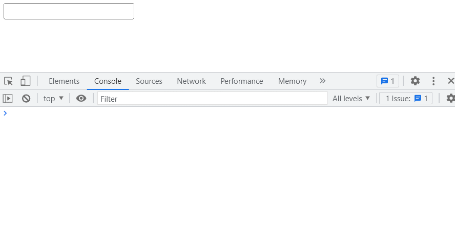

### 9.2 、enter 修修饰符

```vue
<script>
export default {
  methods: {
    message(e) {
      console.log(e.target.value)
    },
  },
}
</script>

<template>
  <input type="text" @keydown.enter="message" />
</template>
```

注：

以上代码表示，当在输入框中按下`enter`键时，会把`input`输出框中的内容全部打印在控制台。

### 9.3、tab 修饰符

tab 键相对比较特殊，当我们在`input`框中，按下`tab`键时，会使`input`失去焦点，所以`tab`修鉓一般都是与`keydown`事件结合使用。

```vue
<script>
export default {
  methods: {
    changeColor(e) {
      // 禁用input输入框
      e.target.disabled = true
    },
  },
}
</script>

<template>
  <div><input type="text" @keydown.tab="changeColor" /></div>
</template>
```

注：

以上代码表示，在`input`获取焦点时，按下`tab`可以禁用`input`输入框。

### 9.4、up、down、left、right 修饰符

| 修饰符   | 作用                                      |
| :------- | :---------------------------------------- |
| `.up`    | 当按下`↑`向上方向键时，才调用事件处理函数 |
| `.down`  | 当按下`↓`向下方向键时，才调用事件处理函数 |
| `.left`  | 当按下`←`向上方向键时，才调用事件处理函数 |
| `.right` | 当按下`→`向上方向键时，才调用事件处理函数 |

```vue
<script>
export default {
  methods: {
    doThis(e) {
      e.target.value += '→'
    },
  },
}
</script>

<template>
  <input type="text" @keydown.right="doThis" />
</template>
```

注：

以上代码表示，在输入框中按下`→`方向键时，会在输入框中输入`→`方向键。

### 9.5、其它修饰符

对于以上没有提到的一些功能，我们可以使用`KeyboardEvent.key`暴露的按键名称作为修饰符，但需要转为 `kebab-case` 形式。

> `KeyboardEvent.key`有哪些值，[详细查阅-MDN 官方文档-按键名(opens new window)](https://developer.mozilla.org/zh-CN/docs/Web/API/UI_Events/Keyboard_event_key_values)

```html
<script>
  export default {
    methods: {
      message(e) {
        console.log(e.target.value)
      },
    },
  }
</script>

<template>
  <!--当按下按盘上的home键时，才触发事件的处理函数-->
  <input type="text" @keydown.home="message" />
  <!--当按下按盘上的pagedown （简写 pg dn）键时，才触发事件的处理函数-->
  <input type="text" @keydown.page-down="message" />
</template>
```

### 10、系统按键修饰符

以下是常用的系统按键修饰符

| 系统按键修饰符 | 说明                                    |
| :------------- | :-------------------------------------- |
| `.ctrl`        | 当按下`ctrl`键时，才会触发事件处理函数  |
| `.alt`         | 当按下`alt`键时，才会触发事件处理函数   |
| `.shift`       | 当按下`shift`键时，才会触发事件处理函数 |
| `.meta`        | 当按下`meta`键时，才会触发事件处理函数  |

### 10.1、复习：ctrlKey、altKey、shiftKey

```html
<script>
  export default {
    methods: {
      changeColor(e) {
        // 事件触发时 `ctrl `键是否按下,如果按下，值为true,否则为false
        if (e.ctrlKey) {
          e.target.style.backgroundColor = 'red'
        }
        // 事件触发时 `alt`键是否按下,如果按下，值为true,否则为false
        if (e.altKey) {
          e.target.style.backgroundColor = 'yellow'
        }
        // 事件触发时 `shift`键是否按下,如果按下，值为true,否则为false
        if (e.shiftKey) {
          e.target.style.backgroundColor = 'blue'
        }
        // 事件触发时 `meta `键是否按下,如果按下，值为true,否则为false
        if (e.metaKey) {
          e.target.style.backgroundColor = 'green'
        }
      },
    },
  }
</script>

<template>
  <div class="box" @mousedown="changeColor"></div>
</template>
<style>
  .box {
    width: 100px;
    height: 100px;
    background-color: skyblue;
  }
</style>
```

以上代码表示：

- 当按下`ctrl` 键，再按下鼠标时，`.box`元素背景变红`red`
- 当按下`alt` 键，再按下鼠标时，`.box`元素背景变黄`yellow`
- 当按下`shift` 键，再按下鼠标时，`.box`元素背景变蓝`blue`
- 当按下`meta`键，再按下鼠标时，`.box`元素背景变绿`green`

![GIF2023-4-2715-29-32](data:image/gif;base64,R0lGODlhoQGzAAAAACH5BABQAAAAIf8LTkVUU0NBUEUyLjADAQAAACwAAAAAoQGzAKD///+HzusC/4SPqcvtD6OctNqLs968+w+G4kiW5omm6sq27gvH8kzX9o3n+s73/g8MCofEovGITCqXzKbzCY1Kp9Sq9YrNarfcrvcLDovHpoD5jE6r1+y2+w2Py+d0OfnurOv3/L7/74YnqARYaHiIyDe4aJTo+AiJyDgpFGl5iQlHuemT6fmJySmqA1pqejiaanPK2qqnCivjOkvbFnvrUqu7i9ursgs86ztcFmxsSpwscsz8qfzs0Sx9CV2tMY39aL1tke2Nyh0e8U3+J37uUK6+h96usA4/5z5vEG//Rj9/v7+W784P8Iy/dgEDDkRXEODBcwn5LRTXcN/DcBHvTeRW0d7Fbf8Z42201hHex2oh142EVlLdyWcpy61U1pLcy2Qxv80kVtPbzWE5s+301RPbz15Bpw3FVVTa0VtJmy2N1ZTZU1hRj01VVdXY1VRZg20d1RXYV1FheY3dVFbXWbRpaa2l1NbtW0Zxhc1dVNfVXbx5We0d1NfvXzyBTw0mXLjU4TuJFS8e0xjUY8iRPU0WU9nyZTCZM23m3JnaZy+hRY/mUtrS6S6pI61G3Vrbay2xZc/GUtvR7Sy5E+3G3Rvc7yrBhQ+fUtzQceLJAS2n0tz5cynRzU2PUt3PdezZFW1/0t379ybh2Y0nX77OefTp5a1f0p7Oe/jx7cxPUt/+/SP54+z/R9KfJv81EmAgAxZRoIEHDpGgLQsy2GA/D1YSoRoTUlghGhcGkWEaGwLRoYYfdhKiGSOSWOKJPZRoooo7sBiAiy+yKCMpNNaIA4w45njjjjXo6OOPPQYpy5BEwgDkkTEkqeQLTDbZwpNQriDllClUaeUJWGZZwpZcjuDllyGEKeYHZJbZwZlobqDmmhm06eYFcMZZwZx0TmDnneMYqWeafPbJ5p+AvinooHIWamidiCaK56KM7pnio9c4Kmk6lFbKQJ6YAqAppp1W+qmkoT46KqOlJnqqoakOuiqgrfb5qp6x3jkrnbXGeaubua6566a+/gpssMIOS2yxxh6LbLLKFi7LbLPOPgtttNJOS2211l6LbbbuFAAAIfkEANwAqwAsBwALAJYAlgCg/wAAAAAAArqEj6nL7Q+jnLTai7PevPsPhuJIluaJpurKtu4Lx/JM1/aN5/rO9/4PDAqHxKLxiEwql8ym8wmNSqfUqvWKzWq33K73Cw6Lx+Sy+YxOq9fstvsNj8vn9Lr9js/r9/y+/w8YKDhIWGh4iJiouMjY6PgIGSk5SVlpeYmZqbnJ2en5CRoqOkpaanqKmqq6ytrq+gobKztLW2t7i5uru8vb6/sLHCw8TFxsfIycrLzM3Oz8DB0tPU1dbX2tWAAAIfkEAJYAqwAsBwALAJYAlgCg//8AAAAAArqEj6nL7Q+jnLTai7PevPsPhuJIluaJpurKtu4Lx/JM1/aN5/rO9/4PDAqHxKLxiEwql8ym8wmNSqfUqvWKzWq33K73Cw6Lx+Sy+YxOq9fstvsNj8vn9Lr9js/r9/y+/w8YKDhIWGh4iJiouMjY6PgIGSk5SVlpeYmZqbnJ2en5CRoqOkpaanqKmqq6ytrq+gobKztLW2t7i5uru8vb6/sLHCw8TFxsfIycrLzM3Oz8DB0tPU1dbX2tWAAAIfkEAJYAqwAsBwALAJYAlgCgAAD/AAAAArqEj6nL7Q+jnLTai7PevPsPhuJIluaJpurKtu4Lx/JM1/aN5/rO9/4PDAqHxKLxiEwql8ym8wmNSqfUqvWKzWq33K73Cw6Lx+Sy+YxOq9fstvsNj8vn9Lr9js/r9/y+/w8YKDhIWGh4iJiouMjY6PgIGSk5SVlpeYmZqbnJ2en5CRoqOkpaanqKmqq6ytrq+gobKztLW2t7i5uru8vb6/sLHCw8TFxsfIycrLzM3Oz8DB0tPU1dbX2tWAAAIfkEANIAqwAsBwALAJYAlgCgAIAAAAAAArqEj6nL7Q+jnLTai7PevPsPhuJIluaJpurKtu4Lx/JM1/aN5/rO9/4PDAqHxKLxiEwql8ym8wmNSqfUqvWKzWq33K73Cw6Lx+Sy+YxOq9fstvsNj8vn9Lr9js/r9/y+/w8YKDhIWGh4iJiouMjY6PgIGSk5SVlpeYmZqbnJ2en5CRoqOkpaanqKmqq6ytrq+gobKztLW2t7i5uru8vb6/sLHCw8TFxsfIycrLzM3Oz8DB0tPU1dbX2tWAAAOw==)

### 10.2、系统按键修饰符使用

系统按键修饰符通常配`keyup`、`keydown`、`mousedown`、`mouseup`使用

- 配合`keyup`使用：按下系统按键的同时，再按下其他键，随后释放其它键，事件才被触发
- 配合`keydown`使用，只要按下系统按键，事件就可以触发
- 配合`mousedown`使用，需要先按下系统按键，再按下鼠标，才能触发事件
- 配合`mouseup`使用，按下系统按键的同时再按鼠标，随后松开鼠标，事件才被触发

```vue
<script>
export default {
  methods: {
    changeColor(e) {
      e.target.style.backgroundColor = 'red'
    },
  },
}
</script>

<template>
  <div class="box" @mousedown.ctrl="changeColor"></div>
  <div class="box" @mouseup.ctrl="changeColor"></div>
</template>

<style>
.box {
  width: 100px;
  height: 100px;
  margin: 20px;
  background-color: skyblue;
}
</style>
```

注：

以上代码表示，当在第一个`box`上按下`ctrl+鼠标`时，背景变成红色。

当在第二个`box`上按下`ctrl+鼠标`后，再松开鼠标，背景变成红色。

### 11、.exact 修饰符

`.exact` 修饰符允许控制触发一个事件所需的确定组合的系统按键修饰符

```html
<!-- 当按下 Ctrl 时，即使同时按下 Alt 或 Shift 也会触发 -->
<button @click.ctrl="onClick">A</button>

<!-- 仅当按下 Ctrl 且未按任何其他键时才会触发 -->
<button @click.ctrl.exact="onCtrlClick">A</button>

<!-- 仅当没有按下任何系统按键时触发 -->
<button @click.exact="onClick">A</button>
```

**代码演示**

```vue
<script>
export default {
  methods: {
    changeColor(e) {
      e.target.style.backgroundColor = 'red'
    },
  },
}
</script>

<template>
  <div class="box" @click.ctrl.exact="changeColor"></div>
  <div class="box" @click.exact="changeColor"></div>
</template>

<style>
.box {
  width: 100px;
  height: 100px;
  margin: 20px;
  background-color: skyblue;
}
</style>
```

注：

以上代码表示， 仅当按下`Ctrl` 且未按任何其他键时，再点击第一个`box`，背景色会变红。

在点击第二个`box`元素时，同时没有按下任何其它的键，背景颜色就会变红

### 12、鼠标按键修饰符

以下修饰符将处理程序限定为由特定鼠标按键触发的事件。

| 鼠标按键修饰符 | 说明                                         |
| :------------- | :------------------------------------------- |
| `.left`        | 当鼠标左键被按下时，才会触发事件处理函数     |
| `.right`       | 当鼠标右键被按下时，才会触发事件处理函数     |
| `middle`       | 当鼠标中间滚轮被按下时，才会触发事件处理函数 |

```vue
<script>
export default {
  methods: {
    changeColor(e) {
      e.target.style.backgroundColor = 'red'
    },
  },
}
</script>

<template>
  <!--@contextmenu.prevent 禁止在点击鼠标右键时，显示系统上下文菜单-->
  <div class="box" @mousedown.right="changeColor" @contextmenu.prevent></div>
</template>

<style>
.box {
  width: 100px;
  height: 100px;
  margin: 20px;
  background-color: skyblue;
}
</style>
```

注：

以上代码表示，在`.box`元素上右键时，元素背景颜色变成红色。

### 13、总结：事件绑定

总结 Vue 事件绑定相关核心重点知识

### 13.1、事件的基本使用

- 使用`v-on:xxx=handler`或`@xxx=handler`方式绑定事件，其中 xxx 是事件的名称，handler 为事件处理器。

- 事件处理器

  ```
  handler
  ```

  分为：内联事件处理器与方法事件处理器

  - **内联事件处理器**：事件被触发时执行的内联 JavaScript 语句
  - **方法事件处理器**：一个指向组件上定义的方法的属性名或是路径（如：`obj.fn` )。

- 事件处理器如果为一个方法或方法的调用，这个方法需要在组件的 methods 方法上定义。

- 事件处理器中访问`event`事件对象，要区分`@click=show`和`@click=show($event,1,2)`两种情况。前者在调用函数`show`是，会自动把 event 事件对象作为方法的第一个参数传入，后者中的`$event`指代的就是传入的事件对象。

- 如果需要给一个元素同时绑定多个事件，可以采用对象写法，不过对象写法不支持任何修饰符。

### 13.2、事件修饰符

事件修饰符可以帮我们处理了许多 DOM 事件的细节，让我们更专注于事件中数据逻辑的处理。

| 事件修饰符 | 说明                                                                                        |
| :--------- | :------------------------------------------------------------------------------------------ |
| stop       | 阻止事件冒泡                                                                                |
| prevent    | 阻止事件的默认行为                                                                          |
| self       | 只有 `event.target`是元素本身时才会触发事件处理器，即：只有事件从元素本身发出才触发处理函数 |
| capture    | 添加事件监听器时，使用 `capture` 捕获模式                                                   |
| once       | 最多触发一次处理函数                                                                        |
| passive    | 滚动事件的默认行为 (scrolling) 将立即发生而非等待 `onScroll` 完成                           |

### 13.3、按键修饰符

按键修饰符主要与键盘事件`keyup`与`keydown`进行配合，当按下键盘上对应的按键时，才调用事件处理函数。

> 主要有以下修饰符

| 按键修饰符 | 说明                                                                                                                |
| :--------- | :------------------------------------------------------------------------------------------------------------------ |
| `.enter`   | 当按下`enter`回车键时，才调用事件处理函数                                                                           |
| `.tab`     | 当按下`tab`键时，才调用事件处理函数                                                                                 |
| `.delete`  | 当按下`delete`键时，才调用事件处理函数                                                                              |
| `.esc`     | 当按下`esc`键时，才调用事件处理函数                                                                                 |
| `.space`   | 当按下`backspace`退格键时，才调用事件处理函数                                                                       |
| `.up`      | 当按下`↑`向上方向键时，才调用事件处理函数                                                                           |
| `.down`    | 当按下`↓`向下方向键时，才调用事件处理函数                                                                           |
| `.left`    | 当按下`←`向上方向键时，才调用事件处理函数                                                                           |
| `.right`   | 当按下`→`向上方向键时，才调用事件处理函数                                                                           |
| 其它修饰符 | 对于以上没有提到的一些功能，我们可以使用`KeyboardEvent.key`暴露的按键名称作为修饰符，但需要转为 `kebab-case` 形式。 |

### 13.4、系统按键修饰符

系统按键修饰符通常配`keyup`、`keydown`、`mousedown`、`mouseup`使用。

表示当某个系统按键被**按下**时才会触发鼠标与键盘事件的事件处理函数。

| 系统按键修饰符 | 说明                                    |
| :------------- | :-------------------------------------- |
| `.ctrl`        | 当按下`ctrl`键时，才会触发事件处理函数  |
| `.alt`         | 当按下`alt`键时，才会触发事件处理函数   |
| `.shift`       | 当按下`shift`键时，才会触发事件处理函数 |
| `.meta`        | 当按下`meta`键时，才会触发事件处理函数  |

### 13.5、.exact 修饰符

`.exact` 修饰符允许控制触发一个事件所需的确定组合的系统按键修饰符

```html
<!-- 当按下 Ctrl 时，即使同时按下 Alt 或 Shift 也会触发 -->
<button @click.ctrl="onClick">A</button>

<!-- 仅当按下 Ctrl 且未按任何其他键时才会触发 -->
<button @click.ctrl.exact="onCtrlClick">A</button>

<!-- 仅当没有按下任何系统按键时触发 -->
<button @click.exact="onClick">A</button>
```

### 13.6、鼠标按键修饰符

当按下鼠标对应的按键时（左键、中间滚轮、右键），才触发事件处理函数。

> 具体如下：

| 鼠标按键修饰符 | 说明                                         |
| :------------- | :------------------------------------------- |
| `.left`        | 当鼠标左键被按下时，才会触发事件处理函数     |
| `.right`       | 当鼠标右键被按下时，才会触发事件处理函数     |
| `middle`       | 当鼠标中间滚轮被按下时，才会触发事件处理函数 |

### 13.7、修饰符注意事项

- 修饰符可以使用链式书写
- 可以只有修饰符
- 链式书写时，要注意修饰符的书写顺序。

## 三、计算属性 computed

计算属性是我们必须要掌握的重点知识，我们从以下几个方面展开讲解

- 为什么需要计算属性
- 计算属性的基本使用
- 计算属性的完整完写法
- 计算属性注意事项
- 计算属性和 methods 方法的对比

> 详细查阅：[Vue 官方文档 - 计算属性(opens new window)](https://cn.vuejs.org/guide/essentials/computed.html#computed-properties)

### 1、为什么需要计算属性

虽然在模板的插值语法`{{}}`和`v-bind`指令中可以使用表达式，但如果涉及的逻辑太多，会让模板变得臃肿，难以维护。

> 比如：以下示例中，求三门课的平均分

```vue
<script>
export default {
  data() {
    return {
      username: '清心',
      css: 80,
      js: 90,
      vue: 99,
    }
  },
}
</script>

<template>
  <div>
    <h3>{{ username }}老师三门课</h3>
    <div>平均分: {{ ((css + js + vue) / 3).toFixed(2) }}</div>
  </div>
</template>
```

注：

上面模板中求平均分的代码看起来有些复杂，同时，如果需要在多个地方求平均分，我们需要在多个地方重复书写此代码，这肯定不是我们想要的。

计算属性就可以帮我们解决这个问题，能让模板中的代码更简洁，当然计算属性还有其它的优点，后面会讲到。

### 2、计算属性的基本使用

计算属性的本质是根据其它的属性值计算得到另一个值，使用方式与一般属性的使用方式一样，可以直接在模板中调用。

> 计算属性需要书写在的组件的`computed`选项中，同时支持以下两种写法

- 简写形式：用于创建只读的计算属性（常用）
- 完整写法：用于创建可读可写的计算属性（了解）

### 2.1、简写形式：创建只读计算属性

如果我们只需要读取一个计算属性的值，而不用修改他的值。

> 可以采用如下简写形式

```js
// 简写形式
computed:{
	// myComputed 为计算属性,当读取计算属性值时，会调用该函数
	myComputed(){ }
}
```

我们用计算属性来改造下上面的案例，如下：

```vue
<script>
export default {
  data() {
    return {
      username: '清心',
      css: 80,
      js: 90,
      vue: 99,
    }
  },
  // 所有计算属性都写在computed这个选项中
  computed: {
    // 一个计算属性。
    average() {
      return ((this.css + this.js + this.vue) / 3).toFixed(2)
    },
  },
}
</script>

<template>
  <div>
    <h3>{{ username }}老师三门课</h3>
    <!-- 直接在模板中使用计算属性 -->
    <div>平均分: {{ average }}</div>
  </div>
</template>
```

注：

- 以上代码中的`average`是一个**只读的计算属性**，属性的值不能直接被修改的
- 不过他的值会根据他所依赖的 **响应式数据** 而发生更改。比如`css、js、vue`中，只要有一个属性的值发生了变化，那`average`的值就会被重新计算。

> 以上代码最终渲染效果如下图：

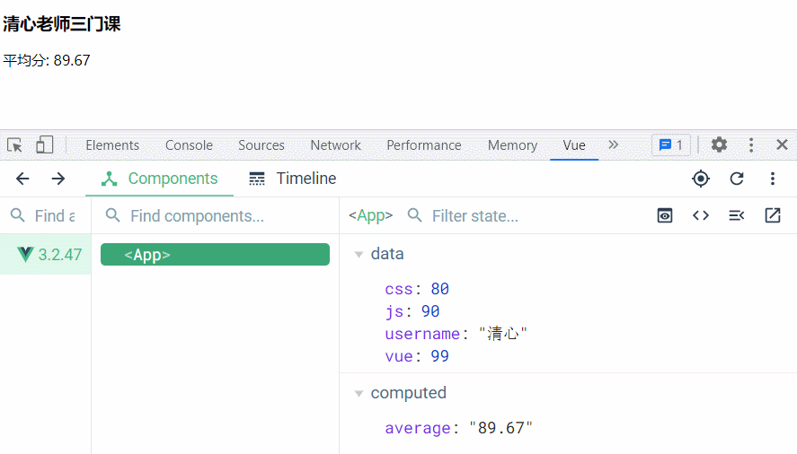

### 2.2、完整写法：创建可读可写计算属性

如果一个计算属性需要支持可读可写，则需要采用如下完整写法，同时创建`get`和`set`方法。

```js
computed:{
    // myComputed 为计算属性
	myComputed:{
        // 当获取计算属性的值时，get方法会被调用
		get(){},
         //  当修改计算属性的值时，set方法会被调用，newValue为myComputed的最新值
		set(newValue){ }
	}
}
```

> 利用计算属性实现如下效果

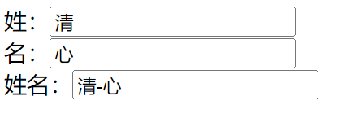

注：

- 当用户的姓名被修改时，其对应的姓和名也会发生更改
- 当用户的姓或名发生修改时，其姓名会被发生更改

**完整代码**

```html
<script>
  export default {
    data() {
      return {
        firstName: '清',
        lastName: '心',
      }
    },
    computed: {
      // 计算属性
      fullName: {
        // 当读取fullName值时，get方法会被调用
        get() {
          console.log('get被调用了')
          return this.firstName + '-' + this.lastName
        },
        // 当修改fullName的值时，set方法会被调用
        set(newValue) {
          console.log('set被调用了')
          ;[this.firstName, this.lastName] = newValue.split('-')
        },
      },
      /*
            以下fullName为只读计算属性，fullName的值不能直接被修改
                fullName() {
                  return this.firstName + "-" + this.lastName
                }
            */
    },
  }
</script>

<template>
  <div>
    姓：
    <input v-model="firstName" />
  </div>
  <div>
    名：
    <input v-model="lastName" />
  </div>
  <div>
    姓名：
    <input v-model="fullName" />
  </div>
</template>
```

注：

- 以上`fullName`计算属性，被定义为可读可写。
- 当读取`fullName`计算属性时，会调用`get`方法，返回值为`fullName`的值。
- 当在`input`文本框中修改`fullName`的值时，就会调用`set`方法，修改`firstName`和`lastName`的值，当`fristName`与`lastName`的值被更改后，又会触发`get`方法，重新计算`fullName`的值

### 3、计算属性注意事项

**计算属性的`get`方法不应有副作用**

这里的副作用是指：`get`方法应该只能用来计算返回具体的值，而不应该在内部做其它的操作，比如：异步请求或更改 DOM。

**计算属性最好是只读的**

因为计算属性的值是通过其它的属性计算后得到的，所以计算属性可以看做是一个“临时快照”，每当源数据发生变化时，就会创建一个新的快照。

> 如果想要更新计算属性值，应该去更新它所依赖的源数据，以触发`get`方法来重新计算，得到新的值。

### 4、计算属性与 methods 方法对比

到现在为止，我们对计算属性有了一定的认知，但你肯定还有如下疑问：

> 计算属性能实现的功能，在`methods`选项中定义一个方法，也可以做到，那为什么还需要弄出一个计算属性呢 ？

是因为计算属性与`methods`方法之间还存在以下细微的区别：

**计算属性值会基于其响应式依赖被缓存**

- 也就是一个计算属性仅会在其依赖的响应式数据发生更新时才会重新计算值，否则无论页面中读取多少次计算属性，他都是直接返回之前计算得到的结果，而不会去重复执行 get 函数来重新计算值。
- 后面模板重新渲染时，也是直接读取之前计算得到的结果

**methods 中定义的方法无缓存**

- `methods`中定义的方法调用多少次，就会执行多少次。
- 同时还会在模板重新渲染时再次调用。

**代码演示**

```vue
<script>
export default {
  data() {
    return {
      username: '清心',
      css: 80,
      js: 90,
      vue: 99,
    }
  },
  methods: {
    avg() {
      console.log('avg方法被调用')
      return ((this.css + this.js + this.vue) / 3).toFixed(2)
    },
  },
  // 所有计算属性都写在computed这个选项中
  computed: {
    average() {
      console.log('average计算属性get被调用')
      return ((this.css + this.js + this.vue) / 3).toFixed(2)
    },
  },
}
</script>

<template>
  <div>
    <h3>{{ username }}老师三门课</h3>
    <div>平均分: {{ average }}</div>
    <div>平均分: {{ average }}</div>
    <div>------methods-----</div>
    <div>平均分: {{ avg() }}</div>
    <div>平均分: {{ avg() }}</div>
  </div>
</template>
```

> 当初始渲染时，会在控制台输出如下结果：

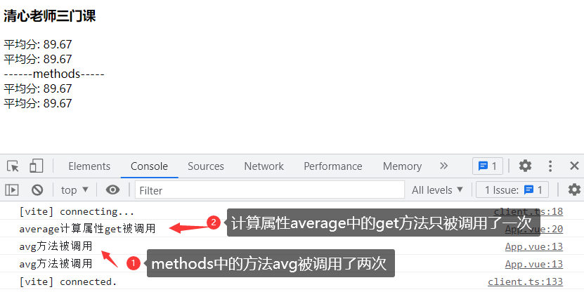

分析以上截图：

- 第一次读取`average`计算属性时，会调用`get`方法返回计算的结果，第二次读到`average`计算属性时，直接读取了上一次计算的结果，并没有再次调用`get`方法来重新计算结果。
- 第一次读取`avg()`时，方法`avg()`被调用了一次，第二次读取时，再次被调用了。

> 接下来，我们在`devtools`工具中，来修改`username`属性的值，我们观察到以下现象。

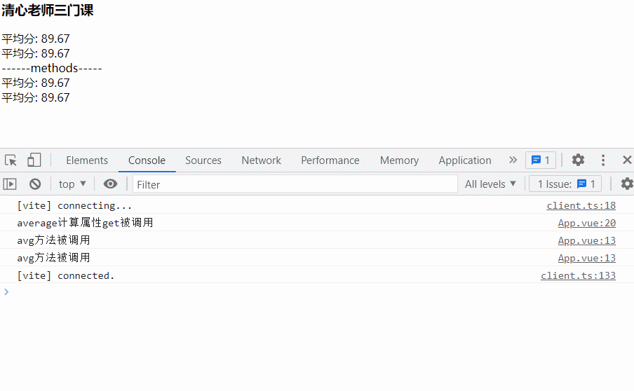

注：

当`username`的值发生改变时，vue 会重新解析渲染模板

- 但此时`average`计算属性的`get`方法并没有被执行，因为直接读取了之前`average`计算得到的结果。
- 而`avg`方法，被调用了两次。

### 5、计算属性总结

**计算属性定义**

计算属性是通过现在属性重新计算而来。计算属性与普通属性一样，可以直接在模板中使用。

**计算属性的基本使用**

如果计算属性为一个只读的，可以采用以下简写形式（相当只定义了 get 方法）

```js
computed: {
	// myComputed为计算属性，myComputed()方法相当于计算属性的get方法
    myComputed(){
      // 省略复杂计算步骤
      return xxx;
    }
  }
```

- 如果计算属性为可读可写的，则需要采用以下完整写法

```js
computed: {
    // myComputed为计算属性，同时书写get与set方法
    myComputed:{
        // 读取计算属性，get方法被调用
        get(){
            // 省略复杂计算步骤
            return xxx;
        },
        // 修改计算属性值，set方法被调用
        set(newValue){
           // 省略内部赋值细节
        }
    }
}
```

计算属性的 get 方法什么时候执行

- 当初次读取计算属性时，`get`方法会被执行
- 当计算属性依赖的响应式数据发生改变时，会再次调用`get`方法更新值。

**计算属性注意事项**

- 计算属性的`get`方法不应该有副作用，只参于计算并返回值，并应该有异步请求与 DOM 操作等
- 计算属性应该被定义为只读的，最好不要直接修改计算属性值

**计算属性于 methods 方法对比**

- 算属性值会基于其响应式依赖被缓存，并且模板重新渲染也不会重新求值
- methods 方法调用多少次，就会执行多少次。同时还会在模板重新渲染时再次调用

**计算属性的优点**

- 可以简化模板中的代码，对于相对复杂的逻辑，可以直接用计算属性来代替
- 因为计算结果会基于其响应式依赖被缓存，所以性能比较高，也更适合复用。

## 四、侦听器 watch

侦听器主要是用来监视某个**响应式属性**，当这个属性的值发生变化时我们可以作一些额外的操作，比如：发送异步请求或执行 DOM 操作等。

> 从以下几个方面来展开讲解：

**侦听器的创建与使用**

- 侦听器：完整版-对象写法
- 侦听器：简化版-函数写法

**侦听器配置选项**

- 即时回调的侦听器
- 深度侦听器
- 回调的触发时机

**副作用清理，创建、停止侦听器**

- `$watch()`方法创建侦听器
- 停止侦听器
- watch 侦听器与`computed`的对比

### 1、侦听器的创建与使用

当我们需要侦听某个响应式属性的变化时，我们可以在`watch`选项中来监听该属性。

> watch 侦听器有以下两种写法：

- 完整版：对象写法
- 简化版：函数写法

### 1.1、侦听器：完整版-对象写法

如果侦听器除了`handler`回调函数，还需要有其它额外的配置，则需要采用以下完整写法

```js
watch:{
   // key 为监听的响应式属性
    key:{
        // newValue 为属性变化后值  oldValue 为属性变化前值
        handler(newValue,oldValue){ }
        // options 相关配置可以直接写在这个后面
        // .....
    }
}
```

注：

以上代码中的`key` 为监听的响应式属性，当`key`的属性值发生变化时，`handler`方法就会被调用

代码演示

利用侦听器来实现：千米与米之间的相互转换效果

- 当修改千米数据，对应米数据也会更新；
- 当修改米数据时，千米数据也会更新。


```html
<script>
  export default {
    data() {
      return {
        kilometers: 0, // 千米
        meters: 0, // 米
      }
    },
    // watch选项
    watch: {
      // 侦听属性 kilometers
      kilometers: {
        // 侦听器函数，当kilometers属性值发生变化时，就会调用这个函数
        handler(newValue, oldValue) {
          // newValue表示最新的kilometers值
          // oldValue 表示更新前 kilometers的值
          // this.meters = this.kilometers * 1000;
          this.meters = newValue * 1000
        },
      },
      // 侦听属性 meters
      meters: {
        // 侦听器函数，当meters属性值发生变化时，就会调用这个函数
        handler(newValue, oldValue) {
          this.kilometers = newValue / 1000
        },
      },
    },
  }
</script>

<template>
  <div>
    千米：
    <input type="text" v-model="kilometers" />
  </div>
  <div>
    米：
    <input type="text" v-model="meters" />
  </div>
</template>
```

### 1.2、侦听器：简化版-函数写法

如果侦听器除了`handler`回调函数，没有其它额外的配置项，则可以采用如下简写形式

```js
watch:{
    // key方法相当于 对象写法中的handler方法
    // 当侦听的属性key的值发生了变化，就会调用key方法，来执行相关后续操作
    key(newValue,oldValue){
        //.....
    }
}
```

> 用简写形式，实现千米与米之间的相互转换

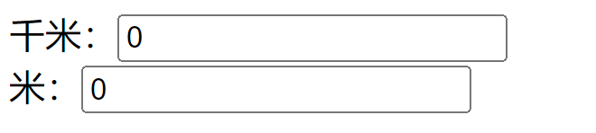

```html
<script>
  export default {
    data() {
      return {
        kilometers: 1, // 千米
        meters: 1000, // 米
      }
    },
    // watch选项
    watch: {
      // 侦听属性 kilometers
      kilometers(newValue, oldValue) {
        this.meters = newValue * 1000
      },
      // 侦听属性 meters
      meters(newValue, oldValue) {
        this.kilometers = newValue / 1000
      },
    },
  }
</script>

<template>
  <div>
    千米：
    <input type="text" v-model="kilometers" />
  </div>
  <div>
    米：
    <input type="text" v-model="meters" />
  </div>
</template>
```

### 2、侦听器配置选项

`watch`侦听器侦听某个响应式属性时，允许我们添加以下相关配置选项

```html
<script>
  export default {
    watch: {
      key: {
        // 侦听器回调
        handler(newValue, oldValue) {},
        immediate: true, // 侦听器回调函数立即执行
        deep: true, // 深层侦听器
        flush: 'post', // 在Vue组件更新后调用侦听器回调
      },
    },
  }
</script>
```

### 2.1、即时回调的侦听器（immediate:true）

- `watch` 默认是**懒执行**的，仅当数据源变化时，才会执行回调。
- 但在某些场景中，我们希望在创建侦听器时，立即执行一遍回调，我们可以添加`immediate: true`配置项实现。

**代码演示**

在前面：千米与米之间的相互转换案例代码的基础上，我们添加`immediate: true`配置，这样在初始化数据时，回调函数会强制立即执行。

```vue
<script>
export default {
  data() {
    return {
      kilometers: 1, // 千米
      meters: 0, // 米
    }
  },
  // watch选项
  watch: {
    // 侦听属性 kilometers
    kilometers: {
      // 侦听器函数，当kilometers属性值发生变化时，就会调用这个函数
      handler(newValue, oldValue) {
        // this.meters = this.kilometers * 1000;
        console.log('强制执行kilometers')
        this.meters = newValue * 1000
      },

      immediate: true,
    },
    // 侦听属性 meters
    meters: {
      // 侦听器函数，当meters属性值发生变化时，就会调用这个函数
      handler(newValue, oldValue) {
        console.log('强制执行meters')
        this.kilometers = newValue / 1000
      },
      immediate: true, // 侦听器回调函数立即执行
    },
  },
}
</script>

<template>
  <div>
    千米：
    <input type="text" v-model="kilometers" />
  </div>
  <div>
    米：
    <input type="text" v-model="meters" />
  </div>
</template>
```

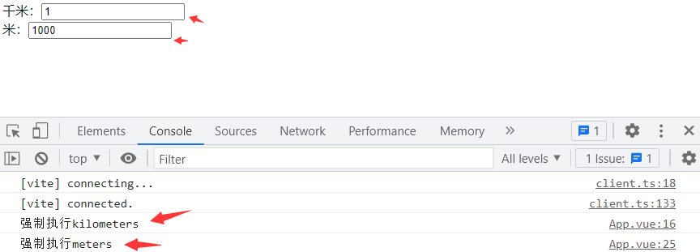

注：

我们发现，当页面初始渲染时，调用了侦听器的`handler`回调，在控制台输出了如上内容。

### 2.2、深层侦听器（deep:true）

- `watch` 默认是**浅层**的：被侦听的属性（也包括计算属性），仅在被赋新值时，才会触发回调函数——而嵌套属性的变化不会触发。
- 如果想侦听所有嵌套的变更，你需要配置`deep:true`开启深层侦听器

**代码演示**

监听体温，根据体温变化，来做出相应建议

```vue
<script>
export default {
  data() {
    return {
      person: {
        username: '清心',
        temperature: 37.6,
      },
      info: '',
    }
  },
  watch: {
    person: {
      handler(newValue, oldValue) {
        if (newValue.temperature >= 38) {
          this.info = '发烧高，建议前往医院就医'
        } else if (newValue.temperature > 37) {
          this.info = '有点发烧，建议在家采用物理降温'
        } else {
          this.info = '体温正常'
        }
      },
      deep: true, // 开启深度侦听
      immediate: true, // 初始化时，强制执行侦听器的回调函数
    },
  },
}
</script>

<template>{{ person.username }}---{{ info }}</template>
```

注：

以上代码对`person`对象开启了深度侦听，当`person.temperature`的值发生改变时，就会被侦听到，`handler`方法就会被调用，对应的`info`属性的值也会发生改变。

如果把`deep:true`配置去掉，无论`person.temperature`的值如何改变，侦听器都侦听不到，`handler`方法也不会被调用，则`info`属性的值将不会有任何变化。

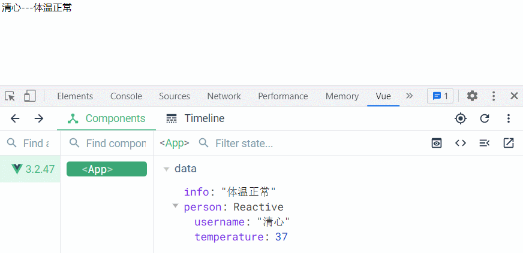

谨慎使用：

深度侦听需要遍历被侦听对象中的所有嵌套的属性，当用于大型数据结构时，开销很大。因此请只在必要时才使用它，并且要留意性能。

### 2.3、侦听对象某个属性

如果为了侦听对象身上的某个属性而开启深度侦听，显然是非常消耗性能的。针对这种情况，我们可以只侦听对象的某个属性。

```vue
<script>
export default {
  data() {
    return {
      person: {
        username: '清心',
        temperature: 37,
      },
    }
  },
  watch: {
    // 侦听 person对象身上的temperature属性
    'person.temperature': {
      handler(newValue, oldValue) {},
    },
  },
}
</script>
```

上面案例可以改写成下面写法

```vue
<script>
export default {
  data() {
    return {
      person: {
        username: '清心',
        temperature: 37,
      },
      info: '',
    }
  },
  watch: {
    'person.temperature': {
      handler(newValue, oldValue) {
        if (newValue >= 38) {
          this.info = '发烧高，建议前往医院就医'
        } else if (newValue > 37) {
          this.info = '有点发烧，建议在家采用物理降温'
        } else {
          this.info = '体温正常'
        }
      },
      deep: true, // 开启深度侦听
      immediate: true, // 初始化时，强制执行侦听器的回调函数
    },
  },
}
</script>

<template>{{ person.username }}---{{ info }}</template>
```

### 2.4、回调的触发时机（flush 选项）

当我们侦听的响应式属性的值发生更改时，默认情况下，侦听器回调都会在 Vue 组件更新**之前**被调用。这意味着你在侦听器回调中访问的 DOM 将是被 Vue 更新之前的状态。

如果想在侦听器回调中能访问被 Vue 更新**之后**的 DOM，你需要指明 `flush: 'post'` 选项

| flush 选项的值 | 侦听器回调执行时机           |
| :------------- | :--------------------------- |
| pre            | 组件**更新前**执行           |
| sync           | 组件更新和侦听器回调同步触发 |
| post           | 组件**更新后**执行           |

代码演示

- 在`.box`元素身上动态绑定了`title`属性的值为`message`变量的值
- 当`message`的值发生变化时，在侦听器中获取`.box`元素的`title`属性
- 如果添加`flush：'post'`选项，则获取的是`title`属性值为`message`更新后的值，否则为更新前的值。

```html
<script>
  export default {
    data() {
      return {
        message: 'Hello Vue!',
      }
    },
    watch: {
      message: {
        handler(newValue, oldValue) {
          const title = document.querySelector('.box').title
          console.log(title)
        },
        flush: 'post',
      },
    },
  }
</script>

<template>
  <div class="box" :title="message"></div>
  <input v-model="message" />
</template>
```

> 添加`flush: 'post'`选项，最终渲染效果如下：

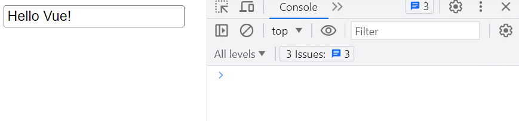

> 没有添加`flush: 'post'`选项，最终渲染效果如下：

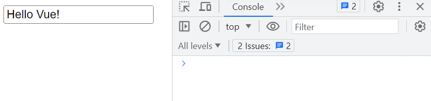

### 3、副作用清理

`watch`侦听器的回调函数实际上接受 3 个参数

```js
watch: {
    key: {
        /**
       * newValue 属性更新后值
       * oldValue 属性更新前值
       * onCleanup 注册副作用清理的回调函数，该函数接受一个回调函数，
       * 回调函数会在副作用下一次重新执行前调用，可以用来清除无效的副作用，
       * 例如等待中的异步请求
       */
        handler(newValue, oldValue, onCleanup) {
            //	取消定时器
            function cancle(){}
            // 在下次handler被调用前，会执行cancle
            onCleanup(cancle)
        }
    }
```

代码演示

- 监听某个 id 属性的变化，当 id 变化时，就会发请求获取内容
- 如果 id 变化时，上一次请求的结果还没有回来，则把上一次请求取消，重新发送一个新请求。

```html
<script>
  export default {
    data() {
      return {
        id: 0,
      }
    },
    watch: {
      id: {
        handler(newValue, oldValue, onCleanup) {
          // 模拟发请求
          let timer = setTimeout(() => {
            console.log('请求成功')
            timer = null
          }, 2000)

          // 清除定时器, 模拟请除上一次请求
          function cancle() {
            // 如果上一次请求还没成功，则取消上一次请求
            if (timer) {
              clearTimeout(timer)
              console.log('取消上一次请求')
            }
          }
          // 注册清理定时器的回调函数
          // 当id值发生改变时，上一次请求还没有成功，就取消重新发一个请求
          onCleanup(cancle)
        },
      },
    },
  }
</script>

<template>
  <div>当前id：{{ id }}</div>
  <button @click="id++">发请求</button>
</template>
```

### 4、`$watch()`方法创建侦听器

我们还可以使用组件实例的 [`$watch()` 方法 (opens new window)](https://cn.vuejs.org/api/component-instance.html#watch)来命令式地创建一个侦听器。

```js
$watch(string, handler, options)
```

- `string` : 侦听的属性名，可以是组件的属性名的字符串，也可以是一个由点分隔的路径字符串，或一个 getter 函数（返回一个字符串，针对属性名需要经过复杂计算的情况）
- `handler` ：属性值改变时需要触发的回调函数。函数有 3 个参数：`newValue`、`oldValue`、`onCleanup`，与 watch 侦听器回调函数参数一致
- `options` ：一个对象，用来指定相关的配置。如：`deep`、`immediate`**、**`flush`等

### 4.1、$watch() 基本用法

利用`$watch()`方法命令式创建一个侦听器，用来监听`person.temperature`属性的变化。

- 以下代码中的`created`函数为生命周期函数，组件实例处理完所有与状态相关的选项后调用。
- 当这个钩子被调用时，以下内容已经设置完成：响应式数据、计算属性、方法和侦听器。然而，此时挂载阶段还未开始

```vue
<script>
export default {
  data() {
    return {
      person: {
        username: '清心',
        temperature: 37,
      },
      info: '',
    }
  },
  // 生命周期函
  created() {
    this.$watch(
      'person.temperature',
      function (newValue, oldValue) {
        if (newValue >= 38) {
          this.info = '发烧高，建议前往医院就医'
        } else if (newValue > 37) {
          this.info = '有点发烧，建议在家采用物理降温'
        } else {
          this.info = '体温正常'
        }
      },
      {
        immediate: true,
        deep: true,
      },
    )
  },
}
</script>

<template>{{ person.username }}---{{ info }}</template>
```

### 4.2、 停止侦听器

用 `watch` 选项或者 `$watch()` 实例方法声明的侦听器，会在宿主组件卸载时自动停止。因此，在大多数场景下，你无需关心怎么停止它。

在少数情况下，你的确需要在组件卸载之前就停止一个侦听器，这时可以调用 `$watch()` API 返回的函数

```js
const unwatch = this.$watch(string, handler, options);
// 停止侦听器
unwatch();
<script>
  export default {
    data() {
      return {
        unwatch: null,
        person: {
          username: "清心",
          temperature: 37,
        },
        info: "",
      };
    },
    methods: {
      // 停止侦听器
      stop() {
        if (this.unwatch) this.unwatch();
      },
    },
    // 生命周期函
    created() {
      this.unwatch = this.$watch(
        "person.temperature",
        function (newValue, oldValue) {
          if (newValue >= 38) {
            this.info = "发烧高，建议前往医院就医";
          } else if (newValue > 37) {
            this.info = "有点发烧，建议在家采用物理降温";
          } else {
            this.info = "体温正常";
          }
        },
        {
          immediate: true,
          deep: true,
        }
      );
    },
  };
</script>

<template>
  <div>{{ person.username }}---{{ info }}</div>
  <button @click="stop">停止侦听器</button>
</template>
```

> 以上代码最终渲染效果如下：

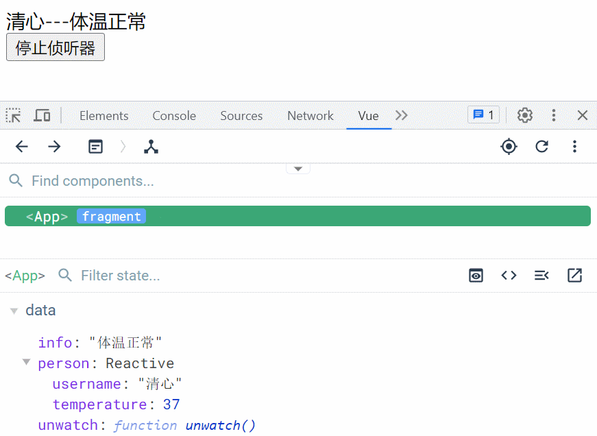

注：

在没有停止侦听器前，当体温变化时会被侦听到，当点击停止侦听器按扭后，无任体温如何变化，都不会被侦听到。

### 5、watch 与 computed 的对比

- 在学习`computed`时，我们专门强调过，`computed`计算属性最好是只读的，并且`get`中不能有副作用也就是不要有异步请求或 DOM 相关的额外操作。
- `watch`侦听器允许我们在某个属性发生变化时，可以执行相关的“副作用”，也就可以执行异步请求或 DOM 相关的额外操作。

以上是`watch`与`compted`两者最大的不同。如果我们想要在某个属性变化时，执行相关的副作用（DOM 操作或异步请求），则选用 watch 来实现。

有些情况`watch`能实现的，`computed`计算属性也能实现，且`computed`的实现方式更简洁，则选用`computed`

以下利用`computed`实现：**根据体温变化，来做出相当建议**的案例。

```vue
<script>
export default {
  data() {
    return {
      person: {
        username: '清心',
        temperature: 37,
      },
    }
  },
  computed: {
    info() {
      const temperature = this.person.temperature
      if (temperature >= 38) {
        return '发烧高，建议前往医院就医'
      } else if (temperature > 37) {
        return '有点发烧，建议在家采用物理降温'
      } else {
        return '体温正常'
      }
    },
  },
}
</script>

<template>{{ person.username }}---{{ info }}</template>
```

> 我们把用`computed`实现同样效果代码与`watch`来对比，发现`computed`的实现方式更简单。

总结：

- `watch`相比`computed`功能更强大，`watch`能实现`computed`不一定能实现，比如`watch`允许执行一些“副作用”，而`computed`是不建议的。
- 不过`computed`和`watch`都能实现的功能，建议使用`computed`，因为`computed`实现更简洁

### 6、watch 侦听器总结

- 侦听器的完整版：对象写法与相关配置

```js
watch:{
    // 侦听属性 key
    key:{
        /**
           * newValue 属性更新后值
           * oldValue 属性更新前值
           * onCleanup 注册副作用清理的回调函数，该函数接受一个回调函数，
           * 回调函数会在副作用下一次重新执行前调用，可以用来清除无效的副作用，
           * 例如等待中的异步请求
       	   */
        handler(newValue, oldValue, onCleanup) {
            //	取消定时器
            function cancle(){}
            // 在下次handler被调用前，会执行cancle
            onCleanup(cancle)
        },
            // 强制立即执行回调
            immediate: true,
            // 深度侦听
            deep: true,
            // DOM更新后再调用回调函数
            flush: 'post'
    }
}
```

- 侦听器的简写，当侦听器没有额外配置时，就可以采用如下简写形式

```js
watch:{
    // 侦听属性key，简写形式
    key(newValue,oldValue, onCleanup){
        //.....
    }
}
```

- `$watch()`方法创建侦听器

```js
$watch(string, handler, options)
```
