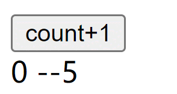
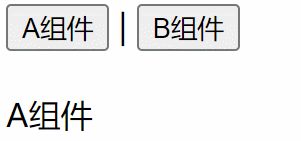
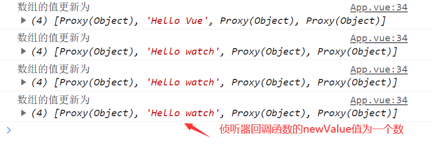
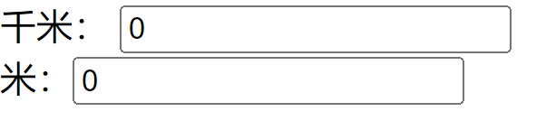
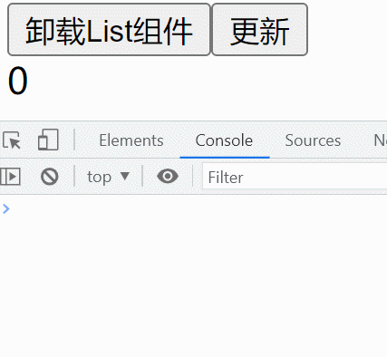
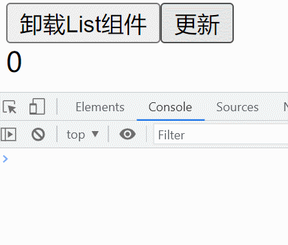
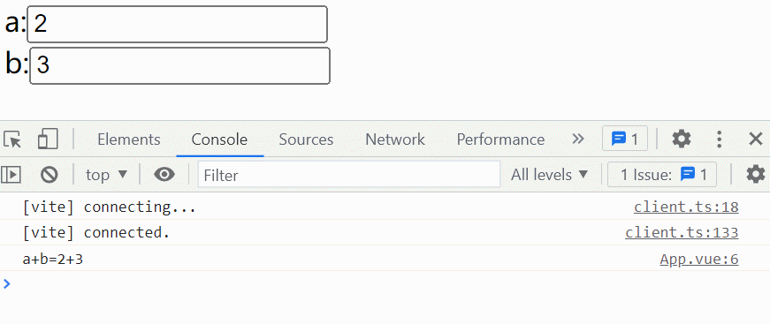
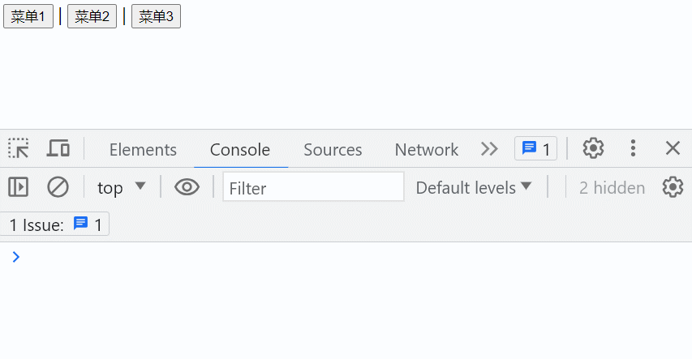

# Vue 组合式 API - watch 和 watchEffect、自定义指令

本章节我们将重点学习在单文件组件（SFC）中使用组合式 API。具体内容如下：

- `<script setup>`基本用法
- 侦听器 watch
- watchEffect 方法
- 自定义指令

## 一、`<script setup>`

在单文件组件中使用组合式 API，需要在`<script>`标签上添加`setup`属性。 此时写在`<script setup>`标签中的代码会被编译成组件`setup()`函数的内容。

> `<script setup>`是在单文件组件（SFC）中使用组合式 API 的编译时语法糖

### 1、`<script setup>`的基本用法

```html
<script setup>
  中的this指向与setup()方法中的一样，都指向undefined
  <script setup>
    const count = 0;
    console.log(this); // undefined
</script>
```

在 `<script setup>` 声明的顶层的绑定（包括变量，函数声明，以及 import 导入的内容）都能在模板中直接使用

```html
<script setup>
  // 导入求和的方法 sum(2,3) 输出5
  import sum from './sum.js'
  // 变量
  const count = 0
  // 方法
  function sayHello() {
    return 'Hello Vue~~'
  }
</script>

<template>
  <div>count:{{ count }}</div>
  <div>{{ sayHello() }}</div>
  <div>2+3={{ sum(2, 3) }}</div>
</template>
```

> 最终渲染效果如下：

![image-20230518205257172](data:image/png;base64,iVBORw0KGgoAAAANSUhEUgAAAXEAAACVCAIAAAAhR13TAAAdBklEQVR4nO2db2jb1vrHT37shQsbOJALMvRCBRnUIYU4bBCbmxdRyCAqvVCHDGrTC5m7Qefuwua0sDnri0zZILP3g/6SFbq4hQ07cIsd6LADC1Ze9CIFNuJCi1VoiAotSNCCBS3Y0IJ/LxzJSiLLki3/Sft86Ivj6ujokZTz1XPOec45PeVyGQEAAFjE/3TaAAAA3ihAUwAAsBLQFAAArOSdThsA6FMS72XSGzzHZXJPETruIl3DrgmSOGnvtGEAoE0P9NF2LeJmNPjZbGpH4xA2For+TPlO2tpuFADUATSlO5HYH6a839CiXh53+I8MNQEOC9BdQH+Kpbzkc2uxWd/AwlYzpZTY70hPVVAw4tPwSiqbpdPxxSDZr2RjFz7yx7S8GADoJGXAIoRUAJOfKsU2Xk7xT8qtvB7Mt8IV9x1+tRufwavvb3Jlt0m7AcBSwE+xjlJBt6liED5+dY7dS7sj6/HAgU6Td3DfzWRkRP65PhfbLFlwWQCwCNCULmMrMbe+l3TNR4NDmplcwe/Dsk8kLvyWkdpiGgAYATSlqyjRd5ZkZ4cMnnPXGtexjU3NKnJzi2ZAVICuwSJNeV2SpEY98JIkvbTGCut5XSq9buf1cuwtWVImvES/Tk6Xx6v03iwzD1prFgAYp/GYt9JTNrUaT67TzCZX7UfAnMQk6ZsOTE047TXLLon3MulEJrGeph+oTh0kTk/6vJ9MkboBXdJWLHZ377vsPBsidSqexMZ+kT/hfZ7AjPtgueoMJ72hMzhCCL0W2dux2C/xtHJfmJM8GwxdDRIYOshOJrrGVZKF+7zy38yv0ehdVTalcITQy9zyZ35qlUODvrnfYsEhlS+yk68O9owNq3piNXCN+BGKVtIsx6N/6GcHgHbRSMfuMyZyznm4fqmpNfBRuB8PjemfirCxUJKveXEh4a17lT2exKtZp+OCfoZ5plwuF7mVQE2RwgOJQ2MsLFXvAVcLr8DMq24fC2dVozqFO0HlSPBOQffeyuVHK4SS+3K2WCc3ALQJ022f0r3o6VOe2VXO/BhHibt1YfiUP7pZ51RxMzrlHl/YavdwRmlr4fTYhdoRH3zM55ndaNIqkb+vun2RE59XfxVETk5iDke9YLY+h1NJPxahRwXoEsxpSmlrgXDNZpRK0U8Gr6XzQqH4qlwul4uFwm4uuXSR1PTC+dUA8UlMaR7g01SczguFyve1WCjsMgnKq/gIIj13NpB43MAdNcqzNHVxjhYRPh1J5nYrdhULu8zNkKrJI0avRFm1qvS5IouRyr/weZfy3+TFiPL/kcVIZEgpAnONVqNP0IjHebz6SxRpOenB6zhzCNl7HUr6Li8Yv1MAaCkmfJoXTFg1tInPrORf1MgpZJlH+//n0QqpOlWjEVHBQEBXq9o+CCGEkT9tazQi+LhPVcNDf2i3MwwbVmAWA8QEQcxEmGf7CohPKwX4khrmHmA7Un0dFFM3OwC0BROasr1Y/Q5j5+NmwjcLyZlqnfT+qn/q7spk9TqHuxVapynYxXStPozdGypJ/Fa7/powTBu1phjRCLP5AaAdGG77PE8tX8nJlS8U/9lnYphhJxm7JacnVyLn9U/F/VcpWb3E5TW6XT0FJPUVWasPA5/0VwXjAc/XyAYAgFFNkVg6JqeJ+SDxrolr8JuJjJwOfDpVV4xsI6S/GtDFbLenr/asXy8e5LhzWGn+rPFWxOADwJuJQU0pbd9dltOEb8xUKITE5ZSuRy/hMjI33+U5o6Tp3EMzV2sYF657Vw58tC1mAMARx6CmCGJ1hNU9oBffeRieY5X0MH7C0DnY+0pTI1fo2ijbFlIo1vfOBOFRGywBAHMY1BSRX5OTE/VHOfdTKt2Tk2eNnntMFYPLPXlLmho2e5+S5tVxKzVo5MECQKsxP9/HfuxYw1d7BzV+7puPOuBEqu+nSIVqTApm722NTQBgFvOa8khoPLyqoXOdf39bvsHYCaXFR3N8PVF5LihRt67360bdAkCbMKgpNpsyEHNPKJgbiMGwCdPnCo8ZOenqNTPGdKTB8Wq0Pf2A08mJ9nd9E4NOvawA0EYMagrurAaUmx2IceDVcE+D54pcTulDIVwna+Yr6i9EUCoesVkwgx5lEmGOrTOjiruXlJNB4kNYQB/oFgxqin14tDoQE/+dNeOp2IZHqzUl8h+6/rnPGfq2nJ7xDO+vL/a+6pgvy+lFn4l/Zmidw12IfdijhMbejqd11q8u0emfZc2ZITzQ8gG6BqP9KdiEPyCnc1epuJnl2u2jZFBZ6fCHaL1zS+x1So6vw8LnD8a22nCnMsefXqNri0ouvpgyYWVXgJHnlMecWV7L1conrScW5MVdgmcJkBSgezDcR9tHBr9X2j+ZC+fnaL3BTklSH7WTgStGz5U2qNBVuS5NUoGxQ159/0B1ovD63LL24gMl9rvg7D2tI63jnaqpjK4DhcRc6lYstcUfbprZJ33KSrO5K0HtBR8eJ4Kfy6o7Mhs4A5ICdBMm5ga9YKgR1ZkYEUpsF17tz/OquEsvBcawg5Poitv7zu33Rmjh4PTeopBd9KqCWb3xGiszqWczIowIZ4QD5aS/JTCEEIZVR4yMrclUGwMT9nKRqllDobRqznGhUL3XIlvdasM9zxye41y4E6yajZEUvc/wwv14sPok3RQLizEB3YXJdd72z/pHCCGEuye8wW8jkcVQYMKtKILGxFw+HRzZfyrmJCYCocVI5HKAGDuwcJxubXmWDu7PjQ0S3ovh/Ta4I3dMr/NWGyOTgNWLDyCEcPd0MPxt0DuCqwoXkufVeTTXNCgy8251JmyQCFyORCpFqf7bV2vJCADoHObXjnyWDddb/BHVmuxf2F6aNjBXqD9wcKOsQ6i/9lq4w38UGlg7sjaGFhaoaVW18EL6ovpArXVSdtNf6N4fwr3XtJZ6AYBO09g+hIV8ivINaisLPhKgUvnai6kWBXopOKmtLNggGbrJCK9qnryvIC5JaSkUPhmKVySp7ZpSLpcLdyPeQ/Oh8MXtqtn12j7VS9IRzYeMT1PJ+/VWqwWADtHUHuwliedyfKEkcg+Kjg9w+zHHwKATMxii9lLkHuSFosT/JRwbdGK2XtzlxO2m4ywqNvCPczzCXSccjlMuZ1/HgzVK0sPctlBECCF0TMMkMUdzBdQ7QAzV9/hKj3MMX5Ae5wSb04k58A9d+FsTBAgcRZrSFAAAgAPAPoQAAFgJaAoAAFYCmgIAgJWApgAAYCWgKQAAWAloCgAAVgKaAgCAlYCmAABgJaApAABYCWgKAABWApoCAICVgKYAAGAloCkAAFgJaAoAAFYCmgIAgJWApgAAYCWgKQAAWAloCgAAVvImaYqY+LhHZoE9fHxrQTk8taq/GTEAAA3yjpnMJUlStsWz2c2sR60609yJbyCvS9LLBh+jTOMvAgBajRk/5Wkq0CvzWcrMh15MfaacGdXwIN4qXjMRp/I0PFHzG7CWNuaU83u/oQ9vkAoAHeRNavscEWzE6c+VLThy8Y2aG63XQKLXonIaC0/DBuxAdwGa0gHcZ2aVnZVzCdqcqDynU9flNBYg3NDwAboL0JROMET4lZ2V78VpM80f6W4mJqexz08TIClAlwGa0hFcxL+qnkrkd+NdTGJmVZEU1+wZ/T2VAaADgKZ0BteZICGnxZ9po6LylE7eltNDfmJILy8AdATQlA7RT/gm5bS4RG8ZOonfiKfkNPlvr0svLwB0hq7XFHUoRgcpSdJLa0vEiWlSTotLd2gDd8nTtzNymvSO4tYaVI8ueRNAt9OVmvJaZFejl/454Ojp6TnW23usp6fHMUBcmL2V4dsXjFES76ViVy6Mn3L0VMx4r6enp8dxavzClVjmoQV24BN+r5wWb9FM3Qq7QyfW5fRMYKpfdUhiYz9Go5V/v/O6pUjsLTnnjzG23n2IW4no56f3vYnKE9iBsBigBmXjPIkrdQBNxwUTZwrxaeVMitHNWrgb8fZrGVoBI0Kp3QavwlLKYW9Cz/zC/XhoDNO6vMqQsVCSN/wAalwnOVMtL0wX9XPv3lB6YFAgVdh3TP1q5vUfsPopeeNPamd8xkSmdVwhjPgyufvK6K0Cbw9d5aeUuF/8ztHZ1E7tLCId9Xr8q/qf4uZsuHVh+JQ/ulknTljcjE65xxe2mmkO2ImzQaW8hXV9TyWX+pmW00HvWGsj3UoPY/5TntnbOs9ZpP93yvNJonVvAjiidJGm8KsB4rPEXlXGiMC17O4LWfpe7DI3Q8Se6yAmfP6Fv1rStudXA8QnMaWe4NNUnM4LhYoHUSwUdpkEVXWjRHrubCDxuPHL2Se8IeXHjxk9UblHx+UwFuxrb2uDZx8nAmMXqm/i06UsL/tQr4q77IrixIm/+f0/5KCXBdiHCZ9G7WCfXckXjJNfOaucWaPtw6sKx3xxrWZFkaWq8RiTK4eaQE23fR6tKL2mCOGBRI1G1qvd+IyqUaBhiXGK2a+rjazQHzWbP9uLyiCPVivJyrbPrioD5vtV6+ZeMNSIkodceVT/PoG3h0Y1pXE0NaWQvqhULTfF1qxauzeUWu+K5A4cbFJT1L0byKtZl1SGrCgjwQgL3inoZtajSIeronIxXaOg7YgSijIU2T583DpNKdwJVt/EPFPzTaj017WoYRHw1tIdbZ+d5PJ12dW+TIVGagac45PKWEkuvml29l0dG2K35PTkSuS8/kgt7r9KyZ6DuLzW+ORg29jpS0olvp5hNAvaykTkho/LR7QyLIVPXl+W30SI+rL2bKL+035Zm+pMWRLZxI+Xpj4aH/9ofPzjS9FVVqzdWMr93/j4R+PjH40v/1XfVmknE7tyoZJ//JPZ2Donva5pROarSsmzGVg5p9WY0J+W+SmqEY3D3scBVF/s88n9zkZTforeqEpdS1AoW2fQRregarsGabk86vZRjedjlZ/yaKX6Jup5H9s/KWb7kjWG0XbvBDWmD2BO32JW0Bgz2l2ZqGHYQYrbP5EaI3P9ZCiR13h5xazcb1Vn2BFoHlNrMqmYCCe/Nt5RKNE/TC1s1DzK5ZQRDdJTJ97c4XgfocpHe4MTEKoz5GvYQpUNXsJl5M5cnjOyJYjOPUQNR8q7JvwulKt86pfXaOqMd9/lSwx9S/62Tga9rYzH3/cm3HX8IQeGI1SxmuaearyJ0taC/5/LGtMORC5xZZxeD0WvzfkGVfd6LxWr/JEMeZzH9S7NrwbIr7Qcjp1M1JdJrUVWrik9+gghJG2k4pXURZdT/66ApmlUU+wDnjHCcH0Wxes6R3lO+bvDUnMf1Zn7ItxXSkXWjTiobEDD+AlD52DvexGqxMrnCs1E2Q4R/iGUq8jTrQy96PX2VQ+WWDom1x5ymmhp8Cy/w8hJLHV1nNX/6xDyckpEGo2O3PKXc5WH6v5iJfrVlNOOCo/p1PezlSFqcTPqPxWnzs1SV7zEid7Cw/jC+dm9/P/Sbd89z0S/qoxKYeT3sciMx2ErCbl07Lu5SgQAf3t2/PYyeTkc+uT0MIaEzaVLn1cadFhw0gPLzbQcEz5Nq2LeGErLMAMcKKqZto/KhrNxg+M4QsJbu0Bz7N6sjjjtb3kVs5erR5LPapxvUduHmW/0TbCHrpOL7OnCyMFO5TphjSMU8+JQaerT7+wF9WAHu7SL+URI50OHnTf6ZoFm6I4+2q7iHXSs7dfER72KqMRWVV69RKd+lNMzJNGHjgoix1TaRcQnB+c62v8RSnJCdtGr4XONBNOrYfe7eiVz95YrCf/ZA61vm/NcJMvl419qCAt2JpL52dfmKVJvJ422fVrESSrLBoeN5ra1xI99JDTQTeP8e3MdO/2n/dMoU1nH4HaSfurzHUcIIWkztSxnCZ0j2+i3OymaCRoeYbIdUgFBKhETBELIfbxX44R3MOJycvcLkV1LJjdSuafI3u8mz/inJpz2On+SUuEFQUwghOxOh9aolN3p+ynr+4bL/B7PrLOchPAhL+Gd8o5gsHxVe+gGTcGwCYQqnXMP0TG7vRMtXpUN94RCCSEDf4DCY6X3wdWr+2k1YgB5LoBuV9ZbSiXvir5zGEIS/bu8AhMWJkdbXikwjECo0kvLNfkmXBfT2Yv1Mtkw97mg+1ywXj41dnIxS9bN1eckZyhypm4+wHq6oe3jwKtjGXReZ7JPu2zIPTRyisjllDYK4TrZrAX2UTIgp1O/pXmE0HM6I4fMYDOEx6CkvNI/XCzWjqVxnKh6JvR9mMoDNEI3aIptwKX0MNKpux35U7YNjypfy1zkPwZWM3nO0MqSazOe4eZ9iD7Cq3zY11P0DhI34rKX4pr9WHfl2T6s2lOwldd7gk/ZTM1BfWRzDlffxBoNogI0QDdoCsI+JBVvNnMtxlq8+pEh7KOkEpQu/hCN13GXSux1qtosOW9JT4edOKvMKMzQuRy9Ji/qVneZSBvunJDTGym6tvG51Uiq5kGEjrtJZc7B+nLsvzA9EDBNV2gK6p8KKvN97i14P683g/5xannd6hBrOxm4osR8Zi6cn6Of18wrbVChq3I8+iQVGLOmp8M2SiqTfxL3k3nZDyI+r7tMJD4wqnQSZ+ZuaPtZpa2F4BX9CQ341EVFWnML0/VmXb/mU9ch2B3Yj4lx55auycTHfaqRE+wMlX2iEe5efMKsXCZx7XiQpuclF7dV020R6vdGaOGgEcUDg6BezSnUDcPMHx4/MjbxV4kHQQghjPg2vT/4vShkwgSGEMIwTGW85rzk8+o3QVKHH0K5XC4KzM0Q2W/2LwF48+mGcR+EEEInfNQNhpdDucXf58Z/n8MGidOTpPNvCCEkcBnmLs3KXn1L5tHZXOHVtHDu9HJlxemd1CyRmsWcxCmPa8LpeMZl/mLym5zqs+ym2LjPWNCtQdxnZl1XZ/f5EpNeQidCTGEoQF2MnN6biinS3512/OIkRgn3h3hJ9ejcP8Uusaf9t3UKwn3zMeaR/BDEzBzhmMOcxCRJOh0IIfSMy9yl6S3ZlYSFtoEDmNCf1q8dWfgjbCjgHyMo+vBMMYvWjixsL+mtmSjTH1jhmpg4WBP11ESEjE5oLJfLB5Y10cD9dbZgcO3IZ9lwvdUz997EfLbxhR6AN5Hu6E+RsU9QWS6fnPc5a/w9Y4Nk8Fp6l8uGW7d4ot0V/E9eoJeCk9rKgg2SoZuMwK0ETrYiYES9nRhCKECOGr7Td93hjXxyXis+tZ8MJfL094anffYRFM3lU5RvsNabcJIXl9KPuOy3sGEzsI+ecrncaRu0eF0Sd3J5oSg9zvEId52wo2OOgZM4Zm9vMORLkXuQF4oS/5dwbNCJ2XpxlxNvsw0NUJL4h9s8z+d2EP4B7nAMu042bnRJ5HKcUJT2SrOjYw6ns+1vAjgydKumAABwNOmutg8AAEcd0BQAAKwENAUAACsBTQEAwEpAUwAAsBLQFAAArAQ0BQAAKwFNAQDASkBTAACwEtAUAACsBDQFAAArAU0BAMBKQFMAALAS0BQAAKwENAUAACsBTQEAwEpAUwAAsBLQFAAArAQ0BQAAK2l0f5/nHHuXYXY4biPHI4SOu0inEx/1EB847R3fMuh1iX9As3c54QmXuccjhOz9bo9zwDlKEENYh1dmfilJrw1ltL1rt3X8SQJAA5jevUPIRs7V2ioDIczpW8zu3wGvjTzb1tnHA6G9rQU7ZFx5/w5EdaDYzpkJAE1gTlN274SM7OmFjVFMJzaSYuYNVVf3fEesK4OmAG8DJtxraf2S55/Lys6e+EjA63V7PsDtSOL/YthUKibvdyluznkm0fZm2NWhlgY+EvB6XcODTsyGSiLH5ZjYbwllU1L2qseP7aY/NbDZoMUIwqO2XxMA2oxx+RESla1NMeLTJc0N0gWaIlVeDHlj1zrtMwQzj/DpiKZt5VdC+mu36r5rb+vZQhhld1XvjXxBl2Kn2o8A0BwmNQUjwhm9/ogiS1UrLqa3NXIrKAj6fSW76qaH3pbJLaKYDclXD/3Rir2WAaDzmBlLfmc4zmapSb0OFdtIiLos/xCTzD0TxTePHdPv7MG9nyqVGqU4vtX2HOS5qFyy9z3YGhR4MzGhKdh02Heibi7b8GhQTueEZ6WGrGoVNuewV/nxkBd1srYWlw0kBXhDsT4Ewv43h5Lmn0sIGRgoUpDY2C+MhBDq8wRm3HbLjVNzAmtt+Yd5yqf2Urijr83XBoA20YKwqtdFJYn3may2L/nMldkUQmg67p9x181uGlW8mcvR2zlfwQbxbMCbivWx+TzHykmX42/d5eJLOVr2FFz+MVebry4+ycvJAYcZ7w0AjhCWawpPr9FymnCdtLr4ZnjJRuZje+nJoHeo7Qa87q7eJQBoBRa74KX/xpbX5R+XSU/3uCliZs4XWKiMQ2G++M8BnYg3aSsWuys1dh3n2RDZr32o+FIu8x9FfpOuNhGPOQZO4pi9ex4WADSBlQPTLxhqRCnYHcmZL+FJfG9cZjrecPRIURU5JnBMNrUSUk9QGgkm+TolyNF9jaATU19n6kC/OzAfZzo4GwkArMA6TXnBUGPVmuueZxoJ6rJAU2rOqcEGfVSCMTK/sVWa8q2RAnDvte0OTUcCAAuwqO3znJ47M76wtfcLG6OiX7q7zJXHPZPDmM2GXtdv8NlH57J0sE6mGjhqNHwQEvmHCCGE+t0Efmzv/17w9NaB0Ds+9e9h4VE6fo1s/3wkALCA5mWpcHffNB9sjGJeNFpWK/0UGdy72Kl5ydoUhXz6WuDAhG/vr+2eLQUAltCcprwS0t/uqwv4zEregKC0qHGhSbEg5Nnk0sV9n33sfLzrqmxhO3JGrc3B9LNOmwQA5mlCU/hkaGyfnhjvCGinpqiumqXONN3j01L2dXJ3YpYjADRNg/Ep0sbcuHsquinPmBkJxu9vJ79wtTva3RQYEU6klErLXqXiOx215zDvuoNXAsqvVC4PAS3A0cO8DBXzN3xqH534Mrlr1WIfVowl61NIVSut66ft1lykCQrpaudwyx4CALQOs+M+JfaH095vaFHWk/DNuP7qB92G3UV4UawSoZ97JEhIw7dqUcybMft6q1Mw7/KCuSmYANB5zGkKvxqoCspIMLm65K2/+kGXob7j55Jm46LEZ2avpLSO1IcabU5T1Ljxrm5LAoAWZjTlcWLWl5AFhWI2wu53W2JT++jrvnh4qSAo6Xdtx3RyAkBXYlxTSvSN0N63G/PFV4+soDzlGTnpet+h6Qi0JubNENJmallOE6MuaPgARw7DmiLRqR/2fBTXV7MGFnzrTqTMr0vyYBU25dZe7sB23EUcb59NVV6yy4vyzGnkIj+ESFrg6GF0LLn0J139fg45W2RNE4ipH2NcnX7VEvdLMHBdlpRJyjeim91adlhaf63K13zic++cMr/hIhVo/2oMANA0Rv0Uobo8M5J2GNqwf+M4RTjbsk5i6c8LA1cWvPPU7Hmv+8TBfpLSUzp2de7SLWW9KDc172+rG/CcHn/fT14Ohz6ZIk4eaHKVxK145Ju5arwP5oteIaGDFjiK9JTLZSP52O96PFcbuQDFlsPG3YGSmGPzBYTQewOeD0ztbSwmPnb4b8u/+t0EPuCacDpQgf+T5bg8/UDtJLiDd+JLZ9rbstha6HHP7aUxJ3HK6Rzx4O8J3EaOuU9zauswglpLh0e6rvsYAIzQZcui2jDXmBX9kjssvcPSG1qH+gMra5HAYEedAJGjRY7e0BiuxsZCyzcjR2+EHgBkrF+PtkNgvhu76WtBndgQfCRApbYL3EpnBGXQq78/PD4SoFJ5jgZBAY42Rts+R4iSJPIP80IRSY9z/EuHcxCz9eLD/bi9Kwa/S5LIc5xQlPjcjoSQzTHoxHodA4NOrCvMA4BmeQM1BQCADvLGtH0AAOgKQFMAALAS0BQAAKwENAUAACsBTQEAwEpAUwAAsBLQFAAArAQ0BQAAK/l/dxFiis6LcJcAAAAASUVORK5CYII=)

注意事项

- 在 `<script setup>` 中创建的变量不会作为属性添加到组件实例中。
- 如果在某些情况下确实需要从选项式 API 中访问到`<script setup>`中的变量，建议切换到`setup()`函数写法

### 2、响应式数据

- 在 `<script setup>` 中声明的顶层**变量**并不是响应式的，需要借助响应式 API（如`ref()`或`reactive()`）方法来创建响应式变量
- 如果变量为`ref`对象，在模板中直接使用时会自动解包，这一特点与`setup()`函数中是一样的

```html
<script setup>
  import { ref } from 'vue'
  // 导入求和的方法 sum(2,3) 输出5
  import sum from './sum.js'
  // 变量
  const count = ref(0)
  // 函数
  function add() {
    count.value++ // ref对象需要打点vaule属性访问值
  }
</script>

<template>
  <button @click="add">count+1</button>
  <!--count会自动解包-->
  <div>{{ count }} --{{ sum(2, 3) }}</div>
</template>
```

> 以上代码最终渲染效果如下：



### 3、使用组件

在`<script setup>`中直接通过`import`导入需要的组件，然后该组件就可以直接在模板中通过标签名使用

```html
<script setup>
  import { defineAsyncComponent } from 'vue'
  // 导入组件
  import List from './components/List.vue'
  // 定义一个异步组件
  const AsyncComp = defineAsyncComponent(() => import('./components/AsyncComp.vue'))
</script>

<template>
  <!--使用组件-->
  <List />
  <AsyncComp />
</template>
```

> 对于全局组件可以通过组件名直接在模板中使用

### 4、动态组件

在`<script setup>`中组件是通过变量引用而不是基于字符串组件名注册。

所在模板中使用`<component>`动态组件时，`:is`的值可以直接是组定义。

```html
<script setup>
  import { shallowRef } from 'vue'
  import A from './components/A.vue'
  import B from './components/B.vue'
  /*
    我们在更新currentComp的值时，只会用一个新的组件替换现有组件，并不会去更新组件中的内容,
    即currentComp只需要做浅层响应性,并不需要做深层响应性，所以选择用shallowRef而不是ref，
    */
  const currentComp = shallowRef(A)
</script>

<template>
  <button @click="currentComp = A">A组件</button>
  <button @click="currentComp = B">B组件</button>

  <br />
  <br />
  <component :is="currentComp"></component>
</template>
```

> 以上代码最终渲染效果如下：



### 5、计算属性 computed

- 在组合式 API 中使用计算属性，需要借助 Vue 为我们提供的`computed()`方法
- `computed()`方法接受一个 getter 函数，返回值为一个计算属性 ref，计算属性在模板中使用时会自动解包

```html
<script setup>
  import { computed, ref } from 'vue'
  const price = ref(10.0)
  // newPrice为计算属性，是一个ref对象
  const newPrice = computed(() => {
    return price.value + '元'
  })
  console.log(newPrice.value) // 10元
</script>

<template>
  <!--newPrice 会自动解包，所以不用newPrice.value-->
  <div>{{ newPrice }}</div>
</template>
```

- 如果计算属性需要**可写**，则`computed()`方法接受一个带有 getter 和 setter 的对象作为参数。
- 当读取计算属性时会调用 getter 方法，为计算属性赋值时，会调用 setter 方法

```html
<script setup>
  import { computed, ref } from "vue";
  // 为计算属性
  const  = computed({
    get() {
      console.log("读取了内容");
    },
    set(value) {
      console.log("更新了内容");
    },
  });
</script>
<template>
  <input type="text" v-model="" />
</template>
```

## 二、侦听器 watch

本小节将学习如何在`<script setup>`中使用 watch 侦听器，主要内容涉及如下：

- `watch()`方法的基本使用
- 侦听数据源
- 副作用清理
- 配置项
- 实战应用：单位千米与米的相互转换
- 停止侦听器

### 1、watch 方法的基本使用

在组合式 API 中，我们需要使用 Vue 提供的`watch()`函数来侦听一个或多个响应式数据源的变化，并在数据源变化时调用所给的回调函数。

**语法**

```js
watch(source, callback, options)
```

参数详解

**source**： 侦听的 **“数据源”**，他可以是以下几种形式

- 一个响应式对象（`reactive()`创建的对象）
- 一个 ref 对象（`ref()`方法创建的对象）
- 一个 getter 函数，返回一个值（可以用来监听一个对象属性）
- 或以上类型值组成的一个数组

**callback**：侦听的数据源发生变化时要调用的回调函数。这个回调函数接受三个参数

- 第一个参数 newValue，表示数据源的新值
- 第二个参数 oldValue，表示数据源的旧值
- 第三个参数 onCleanup ，一个用于注册副作用清理的回函数，该回调会在**下一次数据源变化调用 callback 函数前调用**

**options**: 是一个可选的配置参数对象，支持以下选项

- **`immediate`** 当值为 true 时，在侦听器创建时立即触发回调 ，默认情况下是 false
- **`deep`** 如果数据源是对象，强制深度遍历，以便在深层级变更时触发回调
- **`flush`**：调整回调函数的刷新时机，`flush:'post'`表示在 Vue 更新之后 DOM 之后调用侦听器回调，可以侦听器回调中访问到 Vue 更新之后的 DOM

### 2、侦听数据源

侦听的 **“数据源”**，他可以是以下几种形式

- 一个响应式对象 （`reactive()`创建的对象）
- 一个 getter 函数，返回一个值 （可以用来监听一个对象属性）
- 一个 ref 对象（`ref()`方法创建的对象）
- 或以上类型值组成的一个数组

**侦听响应式对象**

> 数据源是一个响应式对象，默认是**深层侦听器**

```html
<script setup>
  import { reactive, watch } from 'vue'

  const state = reactive({
    count: {
      a: {
        c: 0,
      },
    },
  })

  setTimeout(() => {
    // 只要是该对象的属性（或嵌套属性）的值变化了，侦听器都能侦听到
    state.count.a.c = 100
  }, 3000)

  // 侦听state响应式对象 默认是深层侦听
  watch(state, (newValue, oldValue) => {
    console.log('count的值更新为', newValue)
  })
</script>
<template>
  <div>{{ state.count.a.c }}</div>
</template>
```

**侦听 ref 对象**

> 数据源是一个 ref 对象，默认是**浅层侦听**，添加`deep:true`配置可以开启深侦听

```html
<script setup>
  import { reactive, watch, ref } from 'vue'

  const state = ref({
    count: {
      a: {
        c: 0,
      },
    },
  })

  // 如果watch中不添加deep:true配置，则以下修改没有办法被侦听到
  setTimeout(() => {
    state.value.count.a.c = 100
  }, 3000)

  // 以下修改可以被正常侦听到
  setTimeout(() => {
    state.value = 100
  }, 4000)

  watch(
    state,
    (newValue, oldValue) => {
      console.log('c的值更新为', newValue)
    },
    { deep: true },
  )
</script>
```

**侦听响应式对象的属性**

> 你不能直接侦听响应式对象的属性值，需要通过 getter 函数返回该响应式对象的属性才可以。

```js
import { reactive, watch } from 'vue'
const state = reactive({ count: { a: 1 } })

// 下面为错误写法，无法侦听到state的count属性
watch(state.count, (newValue, oldValue) => {
  // .....
})

// 以下为正确写法  侦听state对象的count属性
watch(
  () => state.count,
  (newValue, oldValue) => {
    // .....
  },
)
```

> 以上方式**默认是浅侦听**，侦听的回调函数只在对象的该属性值发生变化时才会触发。添加`deep:true`配置可以开启深侦听

```html
<script setup>
  import { reactive, watch } from 'vue'
  const state = reactive({ count: { a: 1 } })

  // 添加 deep: true 配置时，以下修改可以被侦听器侦听到，否则侦听不到
  setTimeout(() => {
    state.count.a = 100
  }, 3000)

  // 侦听state对象的count属性
  watch(
    () => state.count,
    (newValue, oldValue) => {
      console.log('count的值更新为', newValue)
    },
    {
      deep: true, // 开启深层侦听
    },
  )
</script>
<template>
  <div>{{ state.count.a }}</div>
</template>
```

> 以上代码，如果不添加`deep:true`配置项，当通过`state.count.a=100`来修改 a 的值时，侦听器是没有办法侦听到的。

侦听一个数组

- 数据源是由 **getter 函数、ref 对象、reactive 对象** 类型值组成的一个数组，会侦听该数组中的每个成员的变化。
- 如果成员是`getter`函数和`ref`对象，默认是浅侦听
- 如果是响应式对象，默认是深层侦听

> 侦听器回调函数的参数 newValue 和 oldValue 值为一个数组，数组中的每个成员对应数据源中每个成员的当前值和变化前值。

```html
<script setup>
  import { reactive, watch, ref } from 'vue'
  const msg = ref('Hello Vue')
  const state = reactive({ count: { a: 1 } })
  let num = ref({ a: 1 })
  const obj = reactive({ a: { b: 2 } })

  setTimeout(() => {
    num.value.a = 100 // 侦听器侦听不到
    num.value = { a: 100 } // 侦听器能侦听到
  }, 2000)

  setTimeout(() => {
    msg.value = 'Hello watch' // 侦听器能侦听到
  }, 3000)

  setTimeout(() => {
    state.count.a = 100 // 侦听器能侦听到
  }, 4000)

  setTimeout(() => {
    obj.a = { b: 100 } // 侦听器能侦听到
    obj.a.b = 200 // 侦听器侦听不到
  }, 4000)

  /**
   *  num.value 是浅侦听  只有num.value的值变化才能侦听到
   *  msg 是浅侦听，只有msg.value的值变化才能侦听到
   *  state 深侦听，state的属性或嵌套属性都能侦听到
   *  obj.a是浅侦听，只有obj.a的值变化才能侦听到，其内部属性变化不能侦听
   */
  watch([() => num.value, msg, state, () => obj.a], (newValue, oldValue) => {
    console.log('数组的值更新为', newValue)
  })
</script>
<template></template>
```

> 以上代码最终执行结果如下，侦听器回调函数被调用了 4 次



总结：

> 侦听的数据源是

- 一个 getter 函数，用来侦听对象的某个属性，默认是 **浅侦听**
- 一个 ref 对象，默认是 **浅侦听**
- 一个响应式对象，默认是 **深层侦听**
- 或以上类型值组成的一个数组，数组中成员的类型与上面侦听的方式一样。

> 可以通过添加`deep:true`配置开启深侦听

### 3、副作用清理

在某些场景下，当监听的数据源发生变化时，就会向后台发起请求，如果数据在请求还没有回来时，数据源变化了 5 次，那就会向后台发送 5 次请求，完全是没有必要的。

> 所以我们需要在上一次请求没有回来前，如果数据又发生了变化，则把上一次的请求取消，再重新发送一次请求。

```html
<script setup>
  import { watch, ref } from 'vue'
  const count = ref(0)
  // 侦听器，侦听属性count
  watch(count, (newValue, oldValue, onCleanup) => {
    console.log(`数据变化了从${oldValue} ==> ${newValue}`)
    // 模拟发送请求
    let timer = setTimeout(() => {
      console.log('发起请求......')
    }, 3000)

    // 取消请求的方法
    function cancle() {
      console.log('取消请求')
      clearTimeout(timer)
    }
    // 清理副作用的回调函数
    onCleanup(cancle)
  })
</script>

<template>
  <button @click="count++">更新</button>
</template>
```

### 4、options 配置项

关于`options`配置项中每一项配置的含义，与前面讲的项选项式 API 中`watch`是一样的。

- **`immediate`** 当值为 true 时，在侦听器创建时立即触发回调 ，默认情况下是 false
- **`deep`** 如果数据源是对象，强制深度遍历，以便在深层级变更时触发回调
- **`flush`**：调整回调函数的刷新时机，`flush:'post'`表示在 Vue 更新之后 DOM 之后调用侦听器回调，可以侦听器回调中访问到 Vue 更新之后的 DOM

> 具体用法可以参考选项式 API：[侦听器配置选项(opens new window)](https://www.arryblog.com/vip/vue/mastache-event-computed-watch.html#_2、侦听器配置选项)

### 5、实战应用：单位千米与米的相互转换

实现单位千米与米的转换



```html
<script setup>
  import { ref, watch } from 'vue'
  const kilometers = ref(0) // 千米
  const meters = ref(0) // 米
  watch(kilometers, (newValue, oldValue) => {
    console.log('kilometers变化了')
    meters.value = newValue * 1000
  })

  watch(meters, (newValue, oldValue) => {
    console.log('meters变化了')
    kilometers.value = newValue / 1000
  })
</script>

<template>
  <div>
    千米：
    <input type="text" v-model="kilometers" />
  </div>
  <div>
    米：
    <input type="text" v-model="meters" />
  </div>
</template>
```

### 6、停止侦听器

在 `setup()` 或 `<script setup>` 中用**同步语句创建的侦听器**，会自动绑定到宿主组件实例上，并且会在宿主组件卸载时自动停止。因此，在大多数情况下，你无需关心怎么停止一个侦听器。

如果用**异步回调创建一个侦听器**，那么它不会绑定到当前组件上，你必须手动停止它，以防内存泄漏

- 同步语句中创建的侦听器，在组件实例被销毁时自动停止

```js
watch(count, (newValue, oldValue) => {
  // ...
})
```

- 异步回调创建一个侦听器，在组件实例即将销毁前，手动停止

```js
let unwatch = null
setTimeout(() => {
  unwatch = watch(count, (newValue, oldValue) => {
    // ....
  })
})
// 在组件实例即将销毁前，停止候听器
onBeforeUnmount(() => {
  console.log('组件即将销毁')
  // 停止侦听器
  unwatch()
})
```

**代码演示**

- `App.vue`

```html
<script setup>
  import List from './components/List.vue'
  import { ref } from 'vue'
  const isShow = ref(true)
</script>

<template>
  <button @click="isShow = false">卸载List组件</button>
  <List v-if="isShow"></List>
</template>
```

- `List.vue`

```html
<script setup>
  import { watch, onBeforeUnmount, onUnmounted, ref } from 'vue'
  const count = ref(0)
  let unwatch = null
  /* 同步侦听器，在组件销毁时，自动销毁
    watch(count, (newValue, oldValue) => {
        console.log(`count的值从${newValue} ===>${oldValue}`)
    })
	*/
  setTimeout(() => {
    unwatch = watch(count, (newValue, oldValue) => {
      console.log(`count的值从${newValue} ===>${oldValue}`)
    })
  })
  // 生命周期函数
  onBeforeUnmount(() => {
    console.log('即将销毁')
    // 停止侦听器
    unwatch()
    count.value++
  })
  // 生命周期函数
  onUnmounted(() => {
    console.log('实例销毁')
    count.value++
  })
</script>
<template>
  <button @click="count++">更新</button>
  <div>{{ count }}</div>
</template>
```

> 以上代码，如果不在生命周期函数`onBeforeUnmount`中调用`unwatch()`停止侦听器，组件被卸载后，侦听器依赖没有停止，最终渲染效果如下：



> 如果在生命周期函数`onBeforeUnmount`中调用`unwatch()`停止侦听器，则最终渲染效果如下：



## 三、watchEffect() 方法

深入浅出 `watchEffect()` 方法的基本使用，侦听器调试，副作用清除，停止侦听器，`watch()` 与 `watchEffect()` 对比，axios 取消请求，实战应用 等。

### 1、watchEffect() 的基本使用

`watchEffect()`方法一旦被调用，会立即运行其回调函数，同时响应式地追踪其依赖，并在依赖更改时重新执行。

```ts
function watchEffect(
  effect: (onCleanup: OnCleanup) => void, //  运行副作用函数
  options?: WatchEffectOptions, // 可选的配置选项
): StopHandle

interface WatchEffectOptions {
  flush?: 'pre' | 'post' | 'sync' // 默认：'pre'
  onTrack?: (event: DebuggerEvent) => void
  onTrigger?: (event: DebuggerEvent) => void
}
```

参数详解

- 第一个参数是要运行的副作用函数。这个副作用函数的参数也是一个函数，用来注册清理回调。清理回调会在该副作用下一次执行前被调用，可以用来清理无效的副作用，例如等待中的异步请求
- 第二个参数是一个可选的选项，可以用来调整副作用的刷新时机或调试副作用的依赖。
  - `flush:'post'` 默认情况下，侦听器将在组件渲染之前执行。设置 `flush: 'post'` 将会使侦听器延迟到组件渲染之后再执行
  - `onTrack` 将在响应属性或引用作为依赖项被跟踪时被调用。
  - `onTrigger` 将在侦听器回调被依赖项的变更触发时被调用。

**代码示例**

```html
<script setup>
  import { ref, watchEffect } from 'vue'
  const a = ref(2)
  const b = ref(3)
  watchEffect(() => {
    console.log(`a+b=${a.value}+${b.value}`)
  })
</script>

<template>
  <div>
    a:
    <input v-model.number="a" />
  </div>
  <div>
    b:
    <input v-model.number="b" />
  </div>
</template>
```

> 以上代码，最终渲染效果如下：



执行结果分析

- `watchEffect()`方法在数据第一次初始化时，就会调用回调函数执行副作用。
- 不管 a 的值发生变化，还是 b 的值发生变化，侦听器都能侦听到。他并不需要我们指定侦听的数据源，会自动感知代码的依赖。

**注意**：

`watch()`方法是惰执行的，只在数据更新时才会执行，即第一次初始化时并不会侦听，除非添加了`immediate: true`配置。

### 2、侦听器调试

如果我们想要对侦听器做调试，可以向 `watchEffect()` 传入第二个参数，是一个包含了 `onTrack` 和 `onTrigger` 两个回调函数的对象。

- `onTrack` 将在响应属性或引用作为依赖项被跟踪时被调用。
- `onTrigger` 将在侦听器回调被依赖项的变更触发时被调用。

> 侦听器的 `onTrack` 和 `onTrigger` 选项仅会在开发模式下工作。

```html
<script setup>
  import { ref, watchEffect } from 'vue'
  const a = ref(2)
  const b = ref(3)
  watchEffect(
    () => {
      console.log(`${a.value}+${b.value}=${a.value + b.value}`)
    },
    {
      onTrack(e) {
        // 当读取a和b的值时触发，即： a.value  b.value
        console.log('track')
        debugger
      },
      onTrigger(e) {
        // 当a和b的值发生变化时触发 即 a.value=20 b.value=20
        console.log('trigger')
        debugger
      },
    },
  )
</script>

<template>
  <div>
    a:
    <input type="text" v-model.number="a" />
  </div>
  <div>
    b:
    <input type="text" v-model.number="b" />
  </div>
</template>
```

> 更多响应性调试，查阅 Vue 官方文档：[响应性调试(opens new window)](https://cn.vuejs.org/guide/extras/reactivity-in-depth.html#reactivity-debugging)

### 3、副作用清除

`watchEffect`回调函数的第一个参数`onCleanup`为副作用清除函数，`onCleanup`函数接收一个函数作为参数，该参数会在下一次回调函数调用前执行。

```js
watchEffect((onCleanup) => {
  // 取消定时器或取消请求等操作
  function cancle() {}

  // cancle 函数会在下一次回调函数调用前执行
  onCleanup(cancle)
})
```

### 4、停止侦听器

停止侦听器的方式和`watch`方法一样。

> 具体如下：

```js
const stop = watchEffect(() => {})

// 停止侦听器
stop()
```

### 5、watch() 与 watchEffect() 对比

**`watch()`侦听器特点**

- 默认是懒侦听的，即仅在侦听源发生变化时才执行回调函数，设置`immediate: true`时可以变为非惰性，页面首次加载就会执行
- 需要指定侦听的数据源，并且只在该数据源发生变化时，才会执行
- 可以获取数据变化前后的值

**`watchEffect()`侦听器特点**

- `watchEffect()` 立即执行，没有惰性，页面首次加载就会执行
- `watchEffect()`不需要指定侦听的数据源，会自动收集依赖数据，依赖数据更新时重新执行自身
- 无法获取到变化前的原始值，只能得到变化后的值

### 6、axios 取消请求

副作用清理函数常用来取消上一次请求，所以接下来，我们先来学习下如何在 axios 中取消上一次请求。

> 在 axios 中取消上一次请求相关代码，具体参考：[axios 取消请求 (opens new window)](https://www.axios-http.cn/docs/cancellation)与 [AbortController - Web API 接口参考 | MDN (mozilla.org)(opens new window)](https://developer.mozilla.org/zh-CN/docs/Web/API/AbortController)

从 `v0.22.0` 开始，Axios 支持以 fetch API 方式 —— [`AbortController` (opens new window)](https://developer.mozilla.org/en-US/docs/Web/API/AbortController)取消请求，该请求一旦被取消将不能被再发起。

```js
// controller表示一个控制器对象，允许你根据需要中止一个或多个 Web 请求。
const controller = new AbortController()

axios
  .get('/foo/bar', {
    // controller的只读属性signal 返回一个 AbortSignal 实例对象，该对象可以根据需要处理 DOM 请求通信，既可以建立通信，也可以终止通信。
    signal: controller.signal,
  })
  .then(function (response) {
    //...
  })
  .catch(() => {
    console.log('请求失败')
  })

// 中止一个尚未完成的 Web（网络）请求
controller.abort()
```

**代码示例**

> 当点击发送请求按扭后，会开始发起两个请求，如果请求还没有回来时，点击了取消请求按扭，则会同时把两个请求都取消。

```html
<script setup>
  import axios from 'axios'
  import { ref } from 'vue'
  // 请求地址
  const url = 'https://www.fastmock.site/mock/6ec78e345df340241e1f5043f0167833/icode/menu/'
  // 请求ID
  const paramId = ref(1001)

  let controller = null

  // 发送请求
  function onSend() {
    controller = new AbortController()

    axios
      .get(`${url}+${paramId.value}`, {
        signal: controller.signal,
      })
      .then((res) => {
        console.log('请求成功内容：')
        // 处理请求回来的内容
        console.log(res.data)
      })
      .catch(() => {
        console.log('请求失败')
      })

    axios
      .get(`${url}+${paramId.value}`, {
        signal: controller.signal,
      })
      .then((res) => {
        console.log('请求成功内容：')
        // 处理请求回来的内容
        console.log(res.data)
      })
      .catch(() => {
        console.log('请求失败')
      })
  }

  function onAbort() {
    // 取消请求 （多个请求）
    controller.abort()
  }
</script>

<template>
  <button @click="onSend">发起请求</button>
  <button @click="onAbort">取消请求</button>
</template>
```

### 7、实战应用

以下示例展示了 `paramId` 变量的数据发生变化时，会发送 Ajax 请求。

但是在请求数据还没有回来前 `paramId` 变值的值再次发生变化时，就会把上一次请求取消，然后重新发送一次请求。

```html
<script setup>
  import axios from 'axios'
  import { reactive, ref, watch, watchEffect } from 'vue'
  // 请求地址
  const url = 'https://www.fastmock.site/mock/6ec78e345df340241e1f5043f0167833/icode/menu/'
  // 请求参数
  const paramId = ref(1001)
  // 接受请求回来的数据 (数组)
  const list = ref(null)
  let controller = null

  // 一上来，就发一个请求获取数据
  watchEffect((onCleanup) => {
    // AbortController 接口表示一个控制器对象，允许你根据需要中止一个或多个 Web 请求。
    controller = new AbortController()
    // 可以发请求
    axios
      .get(`${url}${paramId.value}`, {
        // 配置取消请求
        signal: controller.signal,
      })
      .then((res) => {
        list.value = res.data.data
        console.log(list.value)
      })
      .catch((error) => {
        console.log('请求失败')
      })

    // 取消请求
    function cancel() {
      console.log('用户取消请求')
      controller.abort()
    }

    // 在下一次执行前，会调用传入的cancle取消上一次请求
    onCleanup(cancel)
  })
</script>
<template>
  <!-- 菜单 -->
  <button @click="paramId = 1001">菜单1</button>
  |
  <button @click="paramId = 1002">菜单2</button>
  |
  <button @click="paramId = 1003">菜单3</button>
  <ul>
    <li v-for="item in list" :key="item.id">{{ item.productName }}</li>
  </ul>
</template>
```

> 以上代码最终渲染效果如下：



注：

初始渲染时，就会发请求加菜单 1 中的内容，然后渲染成列表显示在页面。

当我们点击菜单 2 时，在数据没有回来前再点击菜单 3，则菜单 2 的请求被取消，然后发请求获取菜单 3 的内容最终返回的新内容替换原来的内容，渲染成列表显示在页面。

## 四、自定义指令

- 在全局注册的自定义指令，在任意组件的模板中可以直接使用。
- 在`<script setup>`中不需要显式注册局部指令，如果一个变量的命名遵循`vNameOfDirective`这样的规范，Vue 会自动把他当作一条指令来执行。

> 指令的值和用法与选项式 API 中一模一样，具体可参考选项式 API

```html
<script setup>
  // 定义一条指令 v-my-directive  ,以下是对象的完整写法
  const vMyDirective = {
    mounted(el, binding) {},
    updated(el, binding) {},
  }

  // 定义一条指令v-focus,以下是函数简写形式
  const vFocus = (el, binding) => {}
</script>

<template>
  <!--使用指令-->
  <div v-my-directive></div>
  <input type="text" v-focus />
</template>
```

如果指令是从别处导入的，可以通过重命名来使期符合命名规范

```js
import { focus as vFocus } from './focus.js'

// focus.js内容如下
const focus = (el, binding) => {
  /* ...... */
}
export { focus }
```

**代码示例**

> 自定义`v-focus`指令，单行文本框在添加该指令后，会自获取焦点同时背景色变蓝色。

```html
<script setup>
  import { ref } from 'vue'
  const msg = ref('Hello')
  const vFocus = {
    mounted(el, binding) {
      el.focus()
      el.style.border = 'none'
      el.style.backgroundColor = 'skyblue'
    },
  }

  // 以下是函数简写形式,当 mounted 与 updated 效果一样时，可采用函数简写形式
  /*
    const vFocus = (el, binding) => {
      el.focus();
      el.style.border = "none";
      el.style.backgroundColor = "skyblue"
    }
	*/
</script>
<template>
  <input type="text" v-focus v-model="msg" />
</template>
```
